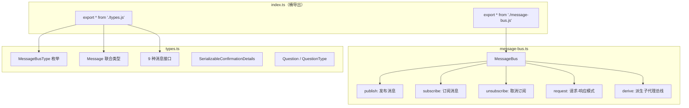
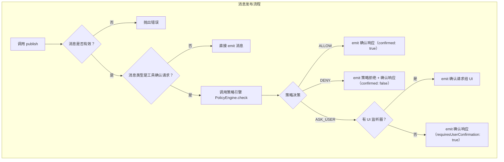
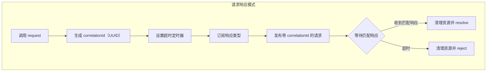
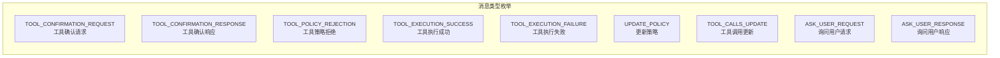
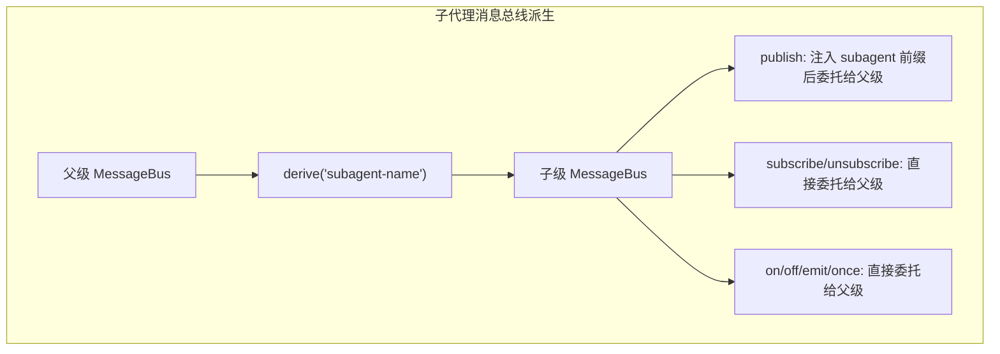

# confirmation-bus/index.ts

## 概述

`confirmation-bus/index.ts` 是 Gemini CLI 确认总线（Confirmation Bus）模块的入口文件，采用桶导出（Barrel Export）模式，统一导出该模块的所有公开 API。确认总线是整个 Gemini CLI 架构中的核心消息通信基础设施，基于发布-订阅（Pub/Sub）模式实现，负责工具确认请求/响应、策略执行、工具执行结果通知、用户交互等多种消息的传递与调度。

该入口文件重导出了两个子模块：
- `message-bus.ts`：`MessageBus` 类的实现，继承自 Node.js `EventEmitter`，是消息总线的核心引擎
- `types.ts`：所有消息类型、枚举和接口定义

确认总线在 Gemini CLI 中扮演了"神经中枢"的角色，将策略引擎（Policy Engine）、工具执行器、用户界面（UI）、子代理（Subagent）等组件解耦连接。

## 架构图（Mermaid）











## 核心组件

### 入口文件 `index.ts`

```typescript
export * from './message-bus.js';
export * from './types.js';
```

标准的桶导出模式，使外部消费者可以通过单一路径导入所有公开 API：

```typescript
import { MessageBus, MessageBusType, type Message } from '../confirmation-bus/index.js';
```

---

### `MessageBus` 类（message-bus.ts）

继承自 Node.js 的 `EventEmitter`，是确认总线的核心实现。

#### 构造函数

```typescript
constructor(
  private readonly policyEngine: PolicyEngine,
  private readonly debug = false,
)
```

| 参数 | 类型 | 说明 |
|------|------|------|
| `policyEngine` | `PolicyEngine` | 策略引擎实例，用于工具确认请求的策略检查 |
| `debug` | `boolean` | 调试模式开关，默认 `false` |

#### 核心方法

##### `publish(message: Message): Promise<void>`

消息发布的核心方法，包含了工具确认请求的完整策略决策流程。

**非工具确认请求**：直接通过 `emitMessage` 发出消息。

**工具确认请求**（`TOOL_CONFIRMATION_REQUEST`）：执行以下策略决策流程：

1. 调用 `policyEngine.check(toolCall, serverName, toolAnnotations, subagent)` 获取策略决策
2. 如果消息包含 `forcedDecision`，则使用强制决策覆盖策略引擎的结果
3. 根据决策分三路处理：
   - **`ALLOW`**：直接 emit 一个 `confirmed: true` 的确认响应
   - **`DENY`**：先 emit 一个策略拒绝通知（`TOOL_POLICY_REJECTION`），再 emit 一个 `confirmed: false` 的确认响应
   - **`ASK_USER`**：检查是否有 UI 监听器注册在 `TOOL_CONFIRMATION_REQUEST` 事件上：
     - 有监听器：将原始请求消息传递给 UI 层进行用户交互
     - 无监听器（无头/ACP 模式）：emit 一个带 `requiresUserConfirmation: true` 标记的否定响应，避免无限等待

**错误处理**：所有异常通过 `this.emit('error', error)` 发射错误事件。

##### `subscribe<T extends Message>(type, listener): void`

泛型订阅方法，是 `EventEmitter.on` 的类型安全封装。

```typescript
subscribe<T extends Message>(
  type: T['type'],
  listener: (message: T) => void,
): void
```

##### `unsubscribe<T extends Message>(type, listener): void`

泛型取消订阅方法，是 `EventEmitter.off` 的类型安全封装。

##### `request<TRequest, TResponse>(request, responseType, timeoutMs?): Promise<TResponse>`

请求-响应模式的实现，将异步的发布-订阅模式转化为同步风格的 Promise 调用。

```typescript
async request<TRequest extends Message, TResponse extends Message>(
  request: Omit<TRequest, 'correlationId'>,
  responseType: TResponse['type'],
  timeoutMs: number = 60000,
): Promise<TResponse>
```

**流程**：
1. 使用 `randomUUID()` 生成唯一的 `correlationId`
2. 设置超时定时器（默认 60 秒）
3. 订阅指定的响应类型事件
4. 将请求消息附加 `correlationId` 后发布
5. 等待收到匹配 `correlationId` 的响应消息
6. 收到匹配响应则 resolve，超时则 reject

**关联 ID 匹配**：响应处理器检查 `response.correlationId === correlationId` 以确保请求-响应的一对一匹配，避免在多个并发请求场景下的混淆。

##### `derive(subagentName: string): MessageBus`

创建一个作用域化的子代理消息总线。

**关键设计**：
- 子总线的 `publish` 方法被重写：对于工具确认请求，自动注入 `subagent` 字段（支持嵌套路径如 `parentAgent/childAgent`），然后委托给父总线的 `publish`
- 子总线的所有订阅/事件方法（`subscribe`、`unsubscribe`、`on`、`off`、`emit`、`once`、`removeListener`、`listenerCount`）全部绑定到父总线，确保事件在同一个总线上流转
- 这种设计允许子代理的工具调用在消息中携带来源标识，便于策略引擎和 UI 层区分工具调用来源

##### `isValidMessage(message: Message): boolean`（私有方法）

消息验证器，检查：
1. 消息对象和 `type` 字段是否存在
2. 如果是 `TOOL_CONFIRMATION_REQUEST`，必须包含 `correlationId` 字段

##### `emitMessage(message: Message): void`（私有方法）

内部消息发射器，以 `message.type` 为事件名调用 `this.emit()`。

---

### 类型定义（types.ts）

#### `MessageBusType` 枚举

定义了 9 种消息类型：

| 枚举值 | 字符串值 | 说明 |
|--------|----------|------|
| `TOOL_CONFIRMATION_REQUEST` | `'tool-confirmation-request'` | 工具执行确认请求 |
| `TOOL_CONFIRMATION_RESPONSE` | `'tool-confirmation-response'` | 工具执行确认响应 |
| `TOOL_POLICY_REJECTION` | `'tool-policy-rejection'` | 工具被策略拒绝通知 |
| `TOOL_EXECUTION_SUCCESS` | `'tool-execution-success'` | 工具执行成功通知 |
| `TOOL_EXECUTION_FAILURE` | `'tool-execution-failure'` | 工具执行失败通知 |
| `UPDATE_POLICY` | `'update-policy'` | 策略更新请求 |
| `TOOL_CALLS_UPDATE` | `'tool-calls-update'` | 工具调用列表更新通知 |
| `ASK_USER_REQUEST` | `'ask-user-request'` | 向用户提问请求 |
| `ASK_USER_RESPONSE` | `'ask-user-response'` | 用户回答响应 |

#### 核心消息接口

##### `ToolConfirmationRequest`

工具确认请求，是整个确认总线的核心消息类型。

| 字段 | 类型 | 必填 | 说明 |
|------|------|------|------|
| `type` | `MessageBusType.TOOL_CONFIRMATION_REQUEST` | 是 | 消息类型标识 |
| `toolCall` | `FunctionCall` | 是 | 工具调用信息（来自 `@google/genai`） |
| `correlationId` | `string` | 是 | 请求-响应关联 ID |
| `serverName` | `string` | 否 | MCP 服务器名称 |
| `toolAnnotations` | `Record<string, unknown>` | 否 | 工具注解（如 readOnlyHint、destructiveHint） |
| `subagent` | `string` | 否 | 发起工具调用的子代理名称 |
| `details` | `SerializableConfirmationDetails` | 否 | 确认 UI 的丰富展示细节 |
| `forcedDecision` | `'allow' \| 'deny' \| 'ask_user'` | 否 | 强制策略决策，绕过策略引擎 |

##### `ToolConfirmationResponse`

工具确认响应。

| 字段 | 类型 | 必填 | 说明 |
|------|------|------|------|
| `type` | `MessageBusType.TOOL_CONFIRMATION_RESPONSE` | 是 | 消息类型标识 |
| `correlationId` | `string` | 是 | 关联 ID |
| `confirmed` | `boolean` | 是 | 是否确认执行 |
| `outcome` | `ToolConfirmationOutcome` | 否 | 用户选择的具体结果 |
| `payload` | `ToolConfirmationPayload` | 否 | 附加载荷（如编辑器修改后的内容） |
| `requiresUserConfirmation` | `boolean` | 否 | 标记需要用户确认（无头模式用） |

##### `ToolPolicyRejection`

工具被策略拒绝通知。

| 字段 | 类型 | 说明 |
|------|------|------|
| `type` | `MessageBusType.TOOL_POLICY_REJECTION` | 消息类型标识 |
| `toolCall` | `FunctionCall` | 被拒绝的工具调用 |

##### `ToolExecutionSuccess<T>` 和 `ToolExecutionFailure<E>`

工具执行结果通知，使用泛型参数支持不同的结果/错误类型。

##### `UpdatePolicy`

策略更新请求。

| 字段 | 类型 | 必填 | 说明 |
|------|------|------|------|
| `type` | `MessageBusType.UPDATE_POLICY` | 是 | 消息类型标识 |
| `toolName` | `string` | 是 | 工具名称 |
| `persist` | `boolean` | 否 | 是否持久化策略 |
| `persistScope` | `'workspace' \| 'user'` | 否 | 持久化范围 |
| `argsPattern` | `string` | 否 | 参数匹配模式 |
| `commandPrefix` | `string \| string[]` | 否 | 命令前缀 |
| `mcpName` | `string` | 否 | MCP 工具名称 |
| `allowRedirection` | `boolean` | 否 | 是否允许重定向 |

##### `AskUserRequest` 和 `AskUserResponse`

用户交互的请求-响应对。

##### `ToolCallsUpdateMessage`

工具调用列表更新通知，携带调度器 ID。

#### `SerializableConfirmationDetails`

序列化的确认详情联合类型，支持 7 种确认场景：

| type 值 | 说明 | 关键字段 |
|---------|------|----------|
| `'sandbox_expansion'` | 沙箱权限扩展确认 | `command`, `additionalPermissions` |
| `'info'` | 信息确认 | `prompt`, `urls` |
| `'edit'` | 文件编辑确认 | `fileName`, `fileDiff`, `originalContent`, `newContent`, `diffStat` |
| `'exec'` | 命令执行确认 | `command`, `rootCommand`, `rootCommands` |
| `'mcp'` | MCP 工具调用确认 | `serverName`, `toolName`, `toolArgs` |
| `'ask_user'` | 用户交互确认 | `questions` |
| `'exit_plan_mode'` | 退出计划模式确认 | `planPath` |

#### `Question` 和 `QuestionType`

问题类型系统，支持三种问题形式：

| QuestionType | 说明 | 特有字段 |
|-------------|------|----------|
| `CHOICE` | 选择题 | `options`（必填），`multiSelect` |
| `TEXT` | 自由文本输入 | `placeholder` |
| `YESNO` | 是/否二选一 | 无 |

#### `Message` 联合类型

所有 9 种消息接口的联合类型，是 `MessageBus` 接受和处理的消息总类型。

## 依赖关系

### 内部依赖

| 依赖模块 | 导入内容 | 用途 |
|----------|----------|------|
| `./message-bus.js` | 全部导出（`MessageBus`） | 消息总线核心实现 |
| `./types.js` | 全部导出（枚举、接口、类型） | 类型定义 |

`message-bus.ts` 的内部依赖：

| 依赖模块 | 导入内容 | 用途 |
|----------|----------|------|
| `../policy/policy-engine.js` | `PolicyEngine` (类型) | 策略引擎，用于工具确认的策略检查 |
| `../policy/types.js` | `PolicyDecision` | 策略决策枚举（ALLOW/DENY/ASK_USER） |
| `./types.js` | `MessageBusType`, `Message` | 消息类型枚举和消息联合类型 |
| `../utils/safeJsonStringify.js` | `safeJsonStringify` | 安全的 JSON 序列化（用于调试日志） |
| `../utils/debugLogger.js` | `debugLogger` | 调试日志工具 |

`types.ts` 的内部依赖：

| 依赖模块 | 导入内容 | 用途 |
|----------|----------|------|
| `../tools/tools.js` | `ToolConfirmationOutcome`, `ToolConfirmationPayload`, `DiffStat` (类型) | 工具确认结果和载荷类型 |
| `../scheduler/types.js` | `ToolCall` (类型) | 工具调用类型定义 |
| `../services/sandboxManager.js` | `SandboxPermissions` (类型) | 沙箱权限类型 |

### 外部依赖

| 依赖包 | 导入内容 | 用途 |
|--------|----------|------|
| `node:crypto` | `randomUUID` | 生成请求-响应关联 ID |
| `node:events` | `EventEmitter` | `MessageBus` 的基类，提供发布-订阅基础设施 |
| `@google/genai` | `FunctionCall` (类型) | Google Generative AI SDK 的函数调用类型 |

## 关键实现细节

1. **基于 EventEmitter 的发布-订阅模式**：`MessageBus` 继承自 Node.js 的 `EventEmitter`，利用其成熟的事件机制实现消息传递。消息的 `type` 字段直接作为事件名，通过 `emit(message.type, message)` 发射，订阅者通过 `on(type, handler)` 监听。这种设计简单高效，充分利用了 Node.js 的原生能力。

2. **策略引擎集成**：`publish` 方法并非简单的消息转发，对于 `TOOL_CONFIRMATION_REQUEST` 类型的消息，它会先经过策略引擎（`PolicyEngine`）的检查。这种设计将安全策略的执行内嵌到消息总线中，确保所有工具确认请求都必须经过策略审查，无法绕过。

3. **强制决策覆盖**：`ToolConfirmationRequest.forcedDecision` 字段允许绕过策略引擎的决策。通过 `message.forcedDecision ?? policyDecision` 的空值合并运算，在有强制决策时优先使用，否则回退到策略引擎结果。这为测试和特殊场景提供了逃生舱口。

4. **无头模式兼容**：当 `ASK_USER` 决策下没有 UI 监听器注册时（如无头/ACP 流程），系统不会无限等待用户响应，而是立即返回一个带 `requiresUserConfirmation: true` 的否定响应。这避免了在非交互环境中的死锁问题。

5. **关联 ID（Correlation ID）模式**：`request` 方法使用 `randomUUID()` 生成唯一关联 ID，将异步的发布-订阅模式转化为同步的请求-响应模式。响应处理器通过匹配 `correlationId` 确保请求-响应的配对正确性。超时机制（默认 60 秒）防止永久阻塞。

6. **子代理总线派生**：`derive` 方法创建的子总线通过重写 `publish` 方法，在工具确认请求的 `subagent` 字段中注入代理名称路径（支持嵌套，如 `agent1/agent2`）。同时，所有订阅和事件方法绑定到父总线，确保所有消息在同一个事件循环中流转，实现消息的集中化管理。

7. **丰富的确认详情**：`SerializableConfirmationDetails` 联合类型支持 7 种确认场景，每种场景携带不同的展示数据。这使得 UI 层可以根据不同类型渲染差异化的确认对话框（如文件 diff 预览、命令展示、MCP 工具参数展示等）。

8. **类型安全的泛型设计**：`subscribe` 和 `request` 方法使用泛型约束 `T extends Message`，确保监听器的参数类型与订阅的消息类型一致。`ToolExecutionSuccess<T>` 和 `ToolExecutionFailure<E>` 使用泛型参数适配不同的结果/错误类型。

9. **可序列化设计**：`SerializableConfirmationDetails` 名称中的 "Serializable" 表明这些数据结构被设计为可安全序列化的纯数据对象（无函数引用、无循环引用），便于在进程间传输或持久化。
