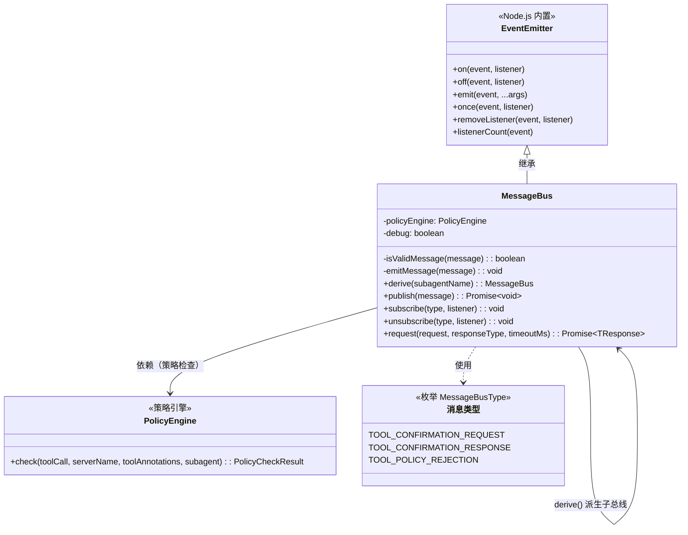
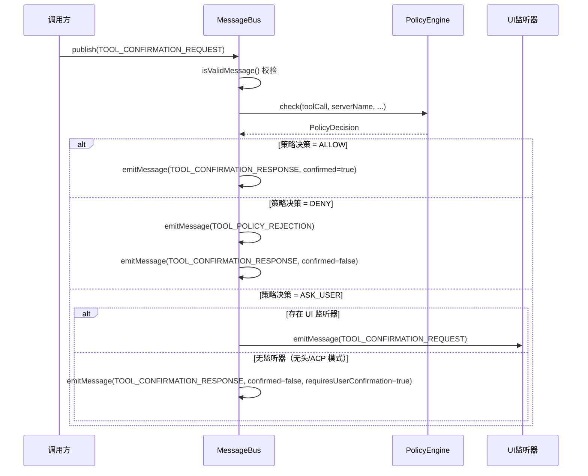
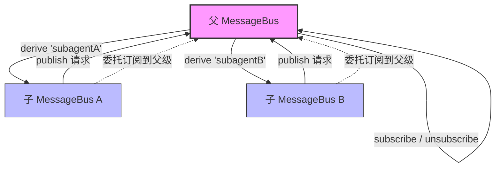

# message-bus.ts

## 概述

`MessageBus` 是 Gemini CLI 核心模块中的消息总线实现，继承自 Node.js 的 `EventEmitter`。它提供了一套基于发布-订阅模式的异步消息通信机制，专门用于处理工具调用的确认流程（Tool Confirmation）。消息总线集成了策略引擎（PolicyEngine），能够根据预设策略自动决定工具调用是否被允许、拒绝或需要用户手动确认。此外，它还支持通过 `derive()` 方法派生子代理（subagent）作用域的子消息总线，实现父子代理之间的消息隔离与传递。

## 架构图（Mermaid）

## 核心组件

### 1. `MessageBus` 类

继承自 `EventEmitter`，是整个确认流程的核心通信枢纽。

**构造函数参数：**

| 参数 | 类型 | 说明 |
|------|------|------|
| `policyEngine` | `PolicyEngine` | 策略引擎实例，用于检查工具调用是否被允许 |
| `debug` | `boolean`（默认 `false`） | 是否开启调试日志 |

### 2. `isValidMessage(message: Message): boolean`（私有方法）

消息验证方法，确保消息结构合法：
- 消息不能为空且必须包含 `type` 字段。
- 如果消息类型为 `TOOL_CONFIRMATION_REQUEST`，则必须包含 `correlationId` 字段（用于请求-响应关联）。

### 3. `emitMessage(message: Message): void`（私有方法）

内部辅助方法，根据消息的 `type` 字段作为事件名称发射事件。这是对 `EventEmitter.emit()` 的薄封装，确保事件名称与消息类型一致。

### 4. `derive(subagentName: string): MessageBus`

派生子代理作用域的消息总线。核心行为：

- 创建一个新的 `MessageBus` 实例。
- **重写 `publish` 方法**：当子总线发布 `TOOL_CONFIRMATION_REQUEST` 类型消息时，会自动为消息添加 `subagent` 字段（格式为 `parentSubagent/childSubagent` 的层级路径），然后委托给父总线的 `publish` 方法处理。其他类型的消息直接委托给父总线。
- **委托所有订阅方法**：`subscribe`、`unsubscribe`、`on`、`off`、`emit`、`once`、`removeListener`、`listenerCount` 均绑定到父总线，确保所有监听器注册在同一个根总线上。

这意味着派生的子总线实际上共享父总线的事件系统，但在发布确认请求时会自动标注子代理的来源路径。

### 5. `publish(message: Message): Promise<void>`

消息发布的核心方法，处理逻辑如下：

1. **调试日志**：如果开启 debug 模式，会通过 `debugLogger` 打印消息内容。
2. **消息验证**：调用 `isValidMessage()` 校验消息结构。
3. **策略决策处理**（仅针对 `TOOL_CONFIRMATION_REQUEST`）：
   - 调用 `policyEngine.check()` 获取策略决策。
   - 如果消息包含 `forcedDecision`，则使用强制决策覆盖策略引擎的决策。
   - 根据决策结果：
     - **ALLOW**：直接发射确认响应（`confirmed: true`）。
     - **DENY**：先发射策略拒绝通知（`TOOL_POLICY_REJECTION`），再发射确认响应（`confirmed: false`）。
     - **ASK_USER**：检查是否有 `TOOL_CONFIRMATION_REQUEST` 的监听器。如果有（如 UI 层），则将请求传递给监听器；如果没有（无头/ACP 模式），则直接发射拒绝响应并标记 `requiresUserConfirmation: true`。
4. **其他消息类型**：直接通过 `emitMessage()` 发射。
5. **错误处理**：任何异常通过 `emit('error', error)` 发射错误事件。

### 6. `subscribe<T>(type, listener): void`

类型安全的订阅方法，封装 `EventEmitter.on()`。泛型 `T` 约束监听器的参数类型。

### 7. `unsubscribe<T>(type, listener): void`

类型安全的取消订阅方法，封装 `EventEmitter.off()`。

### 8. `request<TRequest, TResponse>(request, responseType, timeoutMs): Promise<TResponse>`

实现请求-响应模式的核心方法，将异步事件驱动通信封装为类似同步的 Promise 调用：

1. 内部生成一个 `correlationId`（使用 `crypto.randomUUID()`）。
2. 订阅指定的 `responseType` 事件。
3. 发布带有 `correlationId` 的请求消息。
4. 等待匹配 `correlationId` 的响应消息。
5. 支持超时机制（默认 60 秒），超时后自动清理监听器并 reject Promise。
6. 收到匹配响应后自动清理监听器和定时器。

## 依赖关系

### 内部依赖

| 模块路径 | 导入项 | 用途 |
|----------|--------|------|
| `../policy/policy-engine.js` | `PolicyEngine`（类型） | 策略引擎，用于检查工具调用权限 |
| `../policy/types.js` | `PolicyDecision` | 策略决策枚举值（ALLOW / DENY / ASK_USER） |
| `./types.js` | `MessageBusType`, `Message` | 消息类型枚举和消息类型定义 |
| `../utils/safeJsonStringify.js` | `safeJsonStringify` | 安全的 JSON 序列化工具（避免循环引用等问题） |
| `../utils/debugLogger.js` | `debugLogger` | 调试日志工具 |

### 外部依赖

| 模块 | 导入项 | 用途 |
|------|--------|------|
| `node:crypto` | `randomUUID` | 生成全局唯一的 correlationId，用于请求-响应关联 |
| `node:events` | `EventEmitter` | Node.js 内置事件发射器，作为 MessageBus 的基类 |

## 关键实现细节

1. **策略引擎集成**：`publish()` 方法在处理 `TOOL_CONFIRMATION_REQUEST` 时会先调用策略引擎进行权限检查，实现了"策略优先"的设计。只有当策略引擎返回 `ASK_USER` 且存在 UI 监听器时，才会真正将确认请求传递给用户。

2. **强制决策机制**：消息的 `forcedDecision` 字段可以覆盖策略引擎的决策结果（`const decision = message.forcedDecision ?? policyDecision`）。这为测试和特殊场景提供了绕过策略的能力。

3. **子代理隔离**：`derive()` 方法通过重写 `publish` 并委托订阅方法实现了一种轻量级的作用域隔离。子代理发布的确认请求会自动携带层级化的子代理路径（如 `agentA/agentB`），使策略引擎能够识别请求来源。

4. **无头模式处理**：当没有 `TOOL_CONFIRMATION_REQUEST` 的监听器时（如无头运行或 ACP 流程），系统不会挂起等待用户响应，而是立即返回 `confirmed: false` 并标记 `requiresUserConfirmation: true`，避免长时间超时。

5. **请求-响应关联**：`request()` 方法通过 `correlationId` 将异步的发布-订阅模式转换为请求-响应模式。每个请求生成唯一 ID，响应处理器只响应匹配的 ID，确保在并发场景下的正确性。

6. **资源清理**：`request()` 方法中的 `cleanup` 函数同时清理定时器和事件监听器，无论是正常响应还是超时都会执行，避免内存泄漏。

7. **错误冒泡**：`publish()` 方法中的异常通过 `emit('error', error)` 发射。根据 Node.js 的 `EventEmitter` 规范，如果没有注册 `error` 事件监听器，未捕获的错误事件会导致进程崩溃（抛出异常），因此调用方应确保注册了错误处理器。
