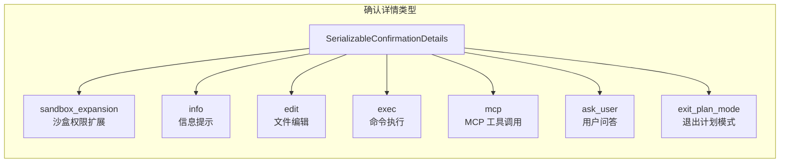
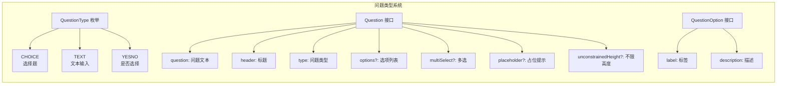

# types.ts

## 概述

`types.ts` 是消息总线（MessageBus）模块的类型定义文件，定义了整个确认总线系统中所有消息的类型枚举、接口和联合类型。它是消息总线通信协议的"契约"，确保发布者和订阅者之间传递的消息结构一致且类型安全。此文件覆盖了工具确认请求/响应、策略更新、工具执行结果、用户交互问答等所有消息场景，并为确认 UI 提供了丰富的可序列化详情类型（如编辑差异、命令执行、MCP 工具调用等）。

## 架构图（Mermaid）

```mermaid
classDiagram
    class MessageBusType {
        <<枚举>>
        TOOL_CONFIRMATION_REQUEST = "tool-confirmation-request"
        TOOL_CONFIRMATION_RESPONSE = "tool-confirmation-response"
        TOOL_POLICY_REJECTION = "tool-policy-rejection"
        TOOL_EXECUTION_SUCCESS = "tool-execution-success"
        TOOL_EXECUTION_FAILURE = "tool-execution-failure"
        UPDATE_POLICY = "update-policy"
        TOOL_CALLS_UPDATE = "tool-calls-update"
        ASK_USER_REQUEST = "ask-user-request"
        ASK_USER_RESPONSE = "ask-user-response"
    }

    class Message {
        <<联合类型>>
    }

    class ToolConfirmationRequest {
        +type: TOOL_CONFIRMATION_REQUEST
        +toolCall: FunctionCall
        +correlationId: string
        +serverName?: string
        +toolAnnotations?: Record
        +subagent?: string
        +details?: SerializableConfirmationDetails
        +forcedDecision?: string
    }

    class ToolConfirmationResponse {
        +type: TOOL_CONFIRMATION_RESPONSE
        +correlationId: string
        +confirmed: boolean
        +outcome?: ToolConfirmationOutcome
        +payload?: ToolConfirmationPayload
        +requiresUserConfirmation?: boolean
    }

    class ToolPolicyRejection {
        +type: TOOL_POLICY_REJECTION
        +toolCall: FunctionCall
    }

    class ToolExecutionSuccess {
        +type: TOOL_EXECUTION_SUCCESS
        +toolCall: FunctionCall
        +result: T
    }

    class ToolExecutionFailure {
        +type: TOOL_EXECUTION_FAILURE
        +toolCall: FunctionCall
        +error: E
    }

    class UpdatePolicy {
        +type: UPDATE_POLICY
        +toolName: string
        +persist?: boolean
        +persistScope?: string
        +argsPattern?: string
        +commandPrefix?: string | string[]
        +mcpName?: string
        +allowRedirection?: boolean
    }

    class ToolCallsUpdateMessage {
        +type: TOOL_CALLS_UPDATE
        +toolCalls: ToolCall[]
        +schedulerId: string
    }

    class AskUserRequest {
        +type: ASK_USER_REQUEST
        +questions: Question[]
        +correlationId: string
    }

    class AskUserResponse {
        +type: ASK_USER_RESPONSE
        +correlationId: string
        +answers: Record
        +cancelled?: boolean
    }

    Message <|.. ToolConfirmationRequest
    Message <|.. ToolConfirmationResponse
    Message <|.. ToolPolicyRejection
    Message <|.. ToolExecutionSuccess
    Message <|.. ToolExecutionFailure
    Message <|.. UpdatePolicy
    Message <|.. AskUserRequest
    Message <|.. AskUserResponse
    Message <|.. ToolCallsUpdateMessage
```







## 核心组件

### 1. `MessageBusType` 枚举

定义消息总线中所有合法的消息类型标识符，作为消息路由和事件分发的键。

| 枚举值 | 字符串值 | 用途 |
|--------|---------|------|
| `TOOL_CONFIRMATION_REQUEST` | `"tool-confirmation-request"` | 工具调用确认请求，发起方请求确认是否执行某个工具 |
| `TOOL_CONFIRMATION_RESPONSE` | `"tool-confirmation-response"` | 工具调用确认响应，包含用户/策略的确认结果 |
| `TOOL_POLICY_REJECTION` | `"tool-policy-rejection"` | 工具被策略引擎拒绝的通知 |
| `TOOL_EXECUTION_SUCCESS` | `"tool-execution-success"` | 工具执行成功通知 |
| `TOOL_EXECUTION_FAILURE` | `"tool-execution-failure"` | 工具执行失败通知 |
| `UPDATE_POLICY` | `"update-policy"` | 更新策略规则的请求 |
| `TOOL_CALLS_UPDATE` | `"tool-calls-update"` | 工具调用列表更新通知 |
| `ASK_USER_REQUEST` | `"ask-user-request"` | 向用户提问的请求 |
| `ASK_USER_RESPONSE` | `"ask-user-response"` | 用户回答的响应 |

### 2. `ToolCallsUpdateMessage` 接口

用于通知 UI 层当前调度器中的工具调用列表已更新。

| 字段 | 类型 | 说明 |
|------|------|------|
| `type` | `MessageBusType.TOOL_CALLS_UPDATE` | 消息类型标识 |
| `toolCalls` | `ToolCall[]` | 当前所有工具调用列表 |
| `schedulerId` | `string` | 发出更新的调度器 ID |

### 3. `ToolConfirmationRequest` 接口

工具调用的确认请求消息，是整个确认流程的起点。

| 字段 | 类型 | 必填 | 说明 |
|------|------|------|------|
| `type` | `MessageBusType.TOOL_CONFIRMATION_REQUEST` | 是 | 消息类型标识 |
| `toolCall` | `FunctionCall` | 是 | 被请求确认的工具调用详情（来自 `@google/genai`） |
| `correlationId` | `string` | 是 | 关联 ID，用于匹配请求和响应 |
| `serverName` | `string` | 否 | MCP 服务器名称 |
| `toolAnnotations` | `Record<string, unknown>` | 否 | 工具注解（如 `readOnlyHint`、`destructiveHint`），来自 MCP 协议 |
| `subagent` | `string` | 否 | 发起请求的子代理名称（由 `MessageBus.derive()` 自动设置） |
| `details` | `SerializableConfirmationDetails` | 否 | 确认 UI 的富详情（差异、命令等） |
| `forcedDecision` | `'allow' \| 'deny' \| 'ask_user'` | 否 | 强制策略决策，绕过策略引擎 |

### 4. `ToolConfirmationResponse` 接口

对确认请求的响应消息。

| 字段 | 类型 | 必填 | 说明 |
|------|------|------|------|
| `type` | `MessageBusType.TOOL_CONFIRMATION_RESPONSE` | 是 | 消息类型标识 |
| `correlationId` | `string` | 是 | 与请求匹配的关联 ID |
| `confirmed` | `boolean` | 是 | 是否确认执行 |
| `outcome` | `ToolConfirmationOutcome` | 否 | 用户选择的具体结果（TODO：迁移后将变为必填） |
| `payload` | `ToolConfirmationPayload` | 否 | 额外载荷（如编辑器修改后的内容） |
| `requiresUserConfirmation` | `boolean` | 否 | 为 `true` 时表示策略决策为 ASK_USER，工具应显示传统确认 UI |

### 5. `SerializableConfirmationDetails` 联合类型

可序列化的确认详情，是一个由 7 种子类型组成的可辨识联合类型（Discriminated Union），通过 `type` 字段区分：

| type 值 | 用途 | 核心字段 |
|---------|------|----------|
| `sandbox_expansion` | 沙盒权限扩展确认 | `command`, `rootCommand`, `additionalPermissions: SandboxPermissions` |
| `info` | 信息性确认（如 URL 访问） | `prompt`, `urls?` |
| `edit` | 文件编辑确认 | `fileName`, `filePath`, `fileDiff`, `originalContent`, `newContent`, `isModifying?`, `diffStat?` |
| `exec` | 命令执行确认 | `command`, `rootCommand`, `rootCommands`, `commands?` |
| `mcp` | MCP 工具调用确认 | `serverName`, `toolName`, `toolDisplayName`, `toolArgs?`, `toolDescription?`, `toolParameterSchema?` |
| `ask_user` | 向用户提问 | `questions: Question[]` |
| `exit_plan_mode` | 退出计划模式确认 | `planPath` |

所有子类型都包含公共字段 `title`（标题）和可选的 `systemMessage`（系统消息）。

### 6. `UpdatePolicy` 接口

策略更新消息，用于动态修改工具的权限策略。

| 字段 | 类型 | 必填 | 说明 |
|------|------|------|------|
| `type` | `MessageBusType.UPDATE_POLICY` | 是 | 消息类型标识 |
| `toolName` | `string` | 是 | 目标工具名称 |
| `persist` | `boolean` | 否 | 是否持久化策略 |
| `persistScope` | `'workspace' \| 'user'` | 否 | 持久化范围（工作区级别或用户级别） |
| `argsPattern` | `string` | 否 | 参数匹配模式 |
| `commandPrefix` | `string \| string[]` | 否 | 命令前缀匹配 |
| `mcpName` | `string` | 否 | MCP 服务器名称 |
| `allowRedirection` | `boolean` | 否 | 是否允许重定向 |

### 7. `ToolPolicyRejection` 接口

工具被策略拒绝的通知消息，仅包含被拒绝的工具调用信息。

### 8. `ToolExecutionSuccess<T>` 接口

工具执行成功的通知消息，泛型 `T` 表示结果类型（默认为 `unknown`）。

### 9. `ToolExecutionFailure<E>` 接口

工具执行失败的通知消息，泛型 `E` 表示错误类型（默认为 `Error`）。

### 10. `QuestionType` 枚举

问题类型枚举，用于 `Question` 接口。

| 枚举值 | 字符串值 | 用途 |
|--------|---------|------|
| `CHOICE` | `"choice"` | 选择题，渲染可选选项列表 |
| `TEXT` | `"text"` | 文本输入，渲染自由文本输入框 |
| `YESNO` | `"yesno"` | 是/否二选一 |

### 11. `Question` 接口

问题定义，用于 `ASK_USER` 类型的确认详情和 `AskUserRequest` 消息。

| 字段 | 类型 | 必填 | 说明 |
|------|------|------|------|
| `question` | `string` | 是 | 问题文本 |
| `header` | `string` | 是 | 问题标题 |
| `type` | `QuestionType` | 是 | 问题类型 |
| `options` | `QuestionOption[]` | 否 | 选项列表（`type='choice'` 时必填，其他类型忽略） |
| `multiSelect` | `boolean` | 否 | 是否允许多选（仅 `type='choice'` 时有效） |
| `placeholder` | `string` | 否 | 占位提示文本 |
| `unconstrainedHeight` | `boolean` | 否 | 是否允许问题占用更多垂直空间 |

### 12. `QuestionOption` 接口

选择题的选项定义。

| 字段 | 类型 | 说明 |
|------|------|------|
| `label` | `string` | 选项标签 |
| `description` | `string` | 选项描述 |

### 13. `AskUserRequest` / `AskUserResponse` 接口

用户问答的请求-响应消息对。

- **AskUserRequest**：包含问题列表和关联 ID。
- **AskUserResponse**：包含用户的答案映射（键为问题索引字符串，值为答案文本）和可选的 `cancelled` 标志（用户取消对话时为 `true`）。

### 14. `Message` 联合类型

所有消息类型的联合类型，是 `MessageBus` 系统中所有合法消息的总定义：

```typescript
type Message =
  | ToolConfirmationRequest
  | ToolConfirmationResponse
  | ToolPolicyRejection
  | ToolExecutionSuccess
  | ToolExecutionFailure
  | UpdatePolicy
  | AskUserRequest
  | AskUserResponse
  | ToolCallsUpdateMessage;
```

## 依赖关系

### 内部依赖

| 模块路径 | 导入项 | 用途 |
|----------|--------|------|
| `../tools/tools.js` | `ToolConfirmationOutcome`, `ToolConfirmationPayload`, `DiffStat` | 工具确认的结果枚举、载荷类型和差异统计 |
| `../scheduler/types.js` | `ToolCall` | 调度器中工具调用的类型定义 |
| `../services/sandboxManager.js` | `SandboxPermissions` | 沙盒权限类型，用于 `sandbox_expansion` 确认详情 |

### 外部依赖

| 模块 | 导入项 | 用途 |
|------|--------|------|
| `@google/genai` | `FunctionCall` | Google GenAI SDK 的函数调用类型，描述 LLM 发起的工具调用 |

## 关键实现细节

1. **可辨识联合类型（Discriminated Union）**：`Message` 和 `SerializableConfirmationDetails` 都使用了 TypeScript 的可辨识联合类型模式，通过 `type` 字段区分不同的子类型。这使得在 `switch`/`if` 语句中进行类型收窄（Type Narrowing）成为可能，编译器能够在每个分支中推断出正确的类型。

2. **泛型消息**：`ToolExecutionSuccess<T>` 和 `ToolExecutionFailure<E>` 使用泛型参数，允许消费者指定具体的结果/错误类型。默认分别为 `unknown` 和 `Error`，保持向后兼容。

3. **关联 ID 模式**：`ToolConfirmationRequest`/`Response` 和 `AskUserRequest`/`Response` 都使用 `correlationId` 字段实现请求-响应关联。这是消息总线中实现同步风格通信的基础机制。

4. **确认详情的可序列化设计**：`SerializableConfirmationDetails` 被明确标注为"Data-only"版本，所有字段都是原始类型或简单对象，确保可以安全地在进程间传递（如 JSON 序列化/反序列化）。

5. **策略更新的灵活性**：`UpdatePolicy` 接口支持多维度的策略配置——按工具名称、参数模式、命令前缀、MCP 名称等，并且可以选择持久化范围（工作区级别或用户级别），体现了精细的权限管理需求。

6. **向后兼容标记**：`ToolConfirmationResponse.outcome` 字段标记了 `TODO: Make required after migration`，说明系统正在从简单的 `confirmed: boolean` 迁移到更丰富的 `outcome` 枚举，当前处于过渡期。

7. **问题系统设计**：`Question` 接口和 `QuestionType` 枚举支持三种交互模式（选择、文本输入、是否），且 `choice` 类型支持多选，为 UI 层提供了灵活的问答渲染能力。`unconstrainedHeight` 字段允许问题在 UI 中突破高度限制，适应长文本内容。
