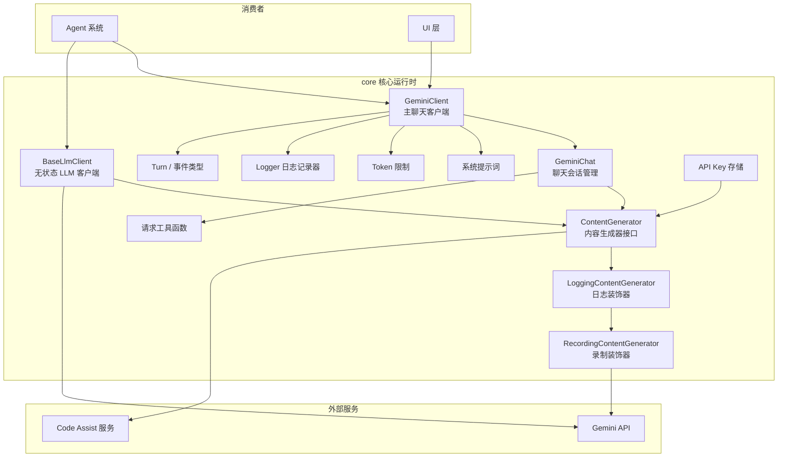
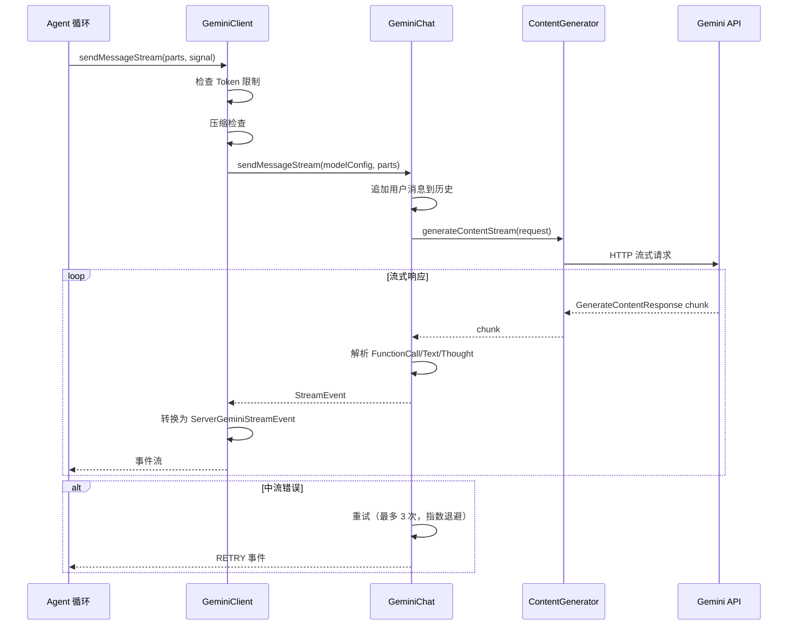
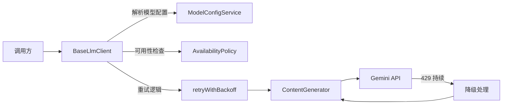

# core (核心运行时)

## 概述

`core/` 目录是 Gemini CLI 的**核心运行时引擎**，实现了与 Gemini API 交互的完整链路，包括 LLM 客户端管理、聊天会话管理、内容生成、消息流处理、系统提示词构建、Token 限制管理和日志记录等。它是整个应用最底层的 AI 交互层，被上层的 Agent 系统、工具系统和 UI 层所依赖。

## 目录结构

```
core/
├── client.ts                        # GeminiClient -- 主聊天客户端
├── geminiChat.ts                    # GeminiChat -- 聊天会话管理（消息历史、流式响应）
├── contentGenerator.ts              # ContentGenerator 接口 + 工厂方法
├── loggingContentGenerator.ts       # 带日志的 ContentGenerator 装饰器
├── recordingContentGenerator.ts     # 带录制的 ContentGenerator 装饰器
├── fakeContentGenerator.ts          # 测试用假 ContentGenerator
├── baseLlmClient.ts                 # BaseLlmClient -- 无状态 LLM 工具调用客户端
├── turn.ts                          # Turn 事件类型定义（ServerGeminiStreamEvent 等）
├── prompts.ts                       # 系统提示词获取
├── tokenLimits.ts                   # 模型 Token 限制查询
├── logger.ts                        # 日志记录器（文件日志、检查点）
├── geminiRequest.ts                 # Gemini 请求工具函数
├── apiKeyCredentialStorage.ts       # API Key 凭据存储
├── coreToolHookTriggers.ts          # 核心工具钩子触发器
└── *.test.ts                        # 单元测试
```

## 架构图



## 核心组件

### GeminiClient (client.ts)

主聊天客户端，是 Agent 循环与 Gemini API 之间的桥梁。核心职责：

- **消息发送**: `sendMessageStream(parts, signal, promptId)` 发送用户消息并返回 `ServerGeminiStreamEvent` 流
- **会话管理**: 维护 `GeminiChat` 实例的生命周期
- **聊天压缩**: 集成 `ChatCompressionService` 在上下文窗口将溢出时自动压缩历史
- **循环检测**: 集成 `LoopDetectionService` 检测重复工具调用模式
- **下一发言者检查**: 在模型无函数调用时决定是否结束会话
- **重试与降级**: 通过 `retryWithBackoff` 和 `handleFallback` 处理临时错误
- **模型路由**: 支持 `auto` 模型，通过路由策略动态选择最优模型
- **历史恢复**: 支持从 `ResumedSessionData` 恢复聊天会话
- **工具输出掩码**: 通过 `ToolOutputMaskingService` 保护敏感信息

### GeminiChat (geminiChat.ts)

聊天会话管理器，管理消息历史和流式 API 调用：

- **消息历史**: 维护 `Content[]` 历史记录，支持手动设置（`setHistory`）和获取
- **流式发送**: `sendMessageStream(modelConfig, parts, promptId, signal, role)` 返回 `StreamEvent` 异步迭代器
- **中流重试**: 当遇到可重试错误（网络断开、无效内容）时自动重试，最多 4 次（指数退避）
- **工具调用记录**: `recordCompletedToolCalls()` 将工具调用结果追加到历史
- **模型兼容**: 处理 Gemini 2/3 模型差异（函数响应格式、thinking 支持等）
- **钩子集成**: 在 Agent 执行前触发 `beforeAgent` 钩子

```typescript
enum StreamEventType {
  CHUNK = 'chunk',              // 正常内容块
  RETRY = 'retry',              // 即将重试信号
  AGENT_EXECUTION_STOPPED,      // 被钩子停止
  AGENT_EXECUTION_BLOCKED,      // 被钩子阻塞
}
```

### ContentGenerator (contentGenerator.ts)

内容生成器接口，抽象了与 Gemini API 的交互：

```typescript
interface ContentGenerator {
  generateContent(request, promptId, role): Promise<GenerateContentResponse>;
  generateContentStream(request, promptId, role): Promise<AsyncGenerator<GenerateContentResponse>>;
  countTokens(request): Promise<CountTokensResponse>;
  embedContent(request): Promise<EmbedContentResponse>;
  userTier?: UserTierId;
}
```

支持多种认证类型：
- `LOGIN_WITH_GOOGLE` (OAuth)
- `USE_GEMINI` (API Key)
- `USE_VERTEX_AI` (Vertex AI)
- `COMPUTE_ADC` (应用默认凭据)
- `GATEWAY` (网关)

工厂方法根据环境自动选择最佳认证方式创建实例。

### 装饰器链

ContentGenerator 使用装饰器模式增强功能：

```
ContentGenerator (基础实现)
  -> LoggingContentGenerator (添加遥测日志)
    -> RecordingContentGenerator (录制请求/响应用于回放)
```

### BaseLlmClient (baseLlmClient.ts)

无状态的 LLM 工具客户端，用于需要独立 LLM 调用的场景（非会话式）：

- **`generateJson()`**: 生成 JSON 格式的结构化输出，支持 JSON Schema 约束和自动重试
- **`generateContent()`**: 生成普通文本内容
- **`generateEmbedding()`**: 批量文本嵌入向量生成
- 内置重试逻辑、模型可用性检查、降级处理

### Turn 事件体系 (turn.ts)

定义了 Gemini 流式响应的底层事件类型：

```typescript
enum GeminiEventType {
  Content,                    // 文本内容
  Thought,                    // 思考过程
  ToolCallRequest,            // 工具调用请求
  ToolCallResponse,           // 工具调用响应
  ToolCallConfirmation,       // 工具调用确认
  Finished,                   // 完成（含 usage 数据）
  Error,                      // 错误
  UserCancelled,              // 用户取消
  ChatCompressed,             // 聊天已压缩
  MaxSessionTurns,            // 达到最大回合
  LoopDetected,               // 检测到循环
  Citation,                   // 引用
  Retry,                      // 重试
  ContextWindowWillOverflow,  // 上下文将溢出
  InvalidStream,              // 无效流
  ModelInfo,                  // 模型信息
  AgentExecutionStopped,      // Agent 执行被停止
  AgentExecutionBlocked,      // Agent 执行被阻塞
}
```

`ServerGeminiStreamEvent` 是上述事件类型的联合类型，是底层到上层事件翻译的输入。

### 系统提示词 (prompts.ts)

提供系统提示词的获取入口：

- **`getCoreSystemPrompt(config, userMemory)`**: 构建核心系统提示词，委托给 `PromptProvider`
- **`getCompressionPrompt(config)`**: 获取聊天压缩用的提示词

### Token 限制 (tokenLimits.ts)

根据模型名称返回 Token 上限：

- Gemini 2.5 Pro / Flash / Flash-Lite: 1,048,576 tokens
- 其他模型: 默认 1,048,576 tokens

### Logger (logger.ts)

文件日志记录器：
- 将用户消息写入 `logs.json`
- 管理聊天检查点（`Checkpoint`）用于会话恢复
- 文件名安全编码/解码

## 依赖关系

### 内部依赖

| 依赖模块 | 用途 |
|---------|------|
| `config/` | `Config`, `AgentLoopContext`, 模型配置 |
| `services/` | `ChatCompressionService`, `LoopDetectionService`, `ChatRecordingService`, `ToolOutputMaskingService` |
| `scheduler/` | `ToolCallRequestInfo`, `CompletedToolCall` 类型 |
| `tools/` | 工具结果类型 |
| `policy/` | 策略引擎 |
| `hooks/` | 钩子类型 |
| `telemetry/` | 遥测日志 |
| `utils/` | 错误处理、重试、Token 计算、提示词上下文等 |
| `fallback/` | 模型降级处理 |
| `routing/` | 模型路由策略 |
| `availability/` | 模型可用性策略 |
| `code_assist/` | Code Assist 集成 |
| `prompts/` | 提示词模板 |

### 外部依赖

| 依赖 | 用途 |
|------|------|
| `@google/genai` | Gemini API SDK（Content, Part, FunctionCall 等核心类型） |
| `google-auth-library` | 认证 |

## 数据流

### 消息处理流程



### BaseLlmClient 调用流程


