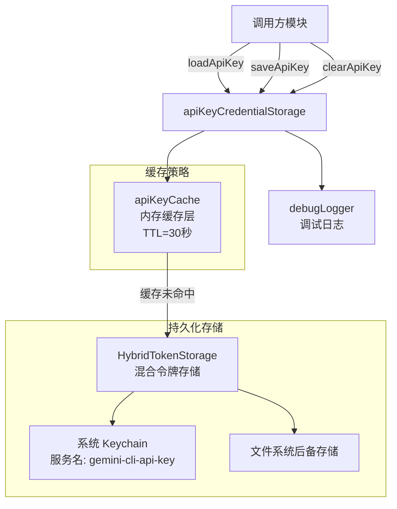

# apiKeyCredentialStorage.ts

## 概述

`apiKeyCredentialStorage.ts` 是 Gemini CLI 核心模块中负责 **API 密钥持久化存储与缓存管理** 的文件。它封装了对系统 Keychain（钥匙串）的安全访问逻辑，提供了加载、保存和清除 API 密钥的三个核心异步操作。为了避免频繁访问系统 Keychain 带来的性能开销，该模块还引入了一个 TTL 为 30 秒的内存缓存层。

该文件是一个纯函数式模块（无 class 导出），通过模块级单例 `storage` 和 `apiKeyCache` 维持状态。

## 架构图（Mermaid）

## 核心组件

### 1. 模块级常量

| 常量名 | 值 | 说明 |
|---|---|---|
| `KEYCHAIN_SERVICE_NAME` | `'gemini-cli-api-key'` | 系统 Keychain 中的服务名称，用于隔离 Gemini CLI 的密钥条目 |
| `DEFAULT_API_KEY_ENTRY` | `'default-api-key'` | 默认密钥条目的键名，作为存储和缓存的 key |

### 2. 模块级单例

| 实例 | 类型 | 说明 |
|---|---|---|
| `storage` | `HybridTokenStorage` | 混合令牌存储实例，底层优先使用系统 Keychain，失败时回退到文件系统存储 |
| `apiKeyCache` | `Cache<string, Promise<string \| null>>` | 内存缓存，存储 `loadApiKey` 的 Promise 结果，默认 TTL 30 秒 |

### 3. 导出函数

#### `resetApiKeyCacheForTesting()`
- **可见性**: `@internal`，仅供测试使用
- **功能**: 清空 `apiKeyCache` 全部缓存条目，用于测试隔离
- **返回值**: `void`

#### `loadApiKey(): Promise<string | null>`
- **功能**: 加载已缓存的 API 密钥
- **流程**:
  1. 首先查询 `apiKeyCache` 内存缓存
  2. 若缓存命中，直接返回缓存的 Promise
  3. 若缓存未命中，调用 `storage.getCredentials(DEFAULT_API_KEY_ENTRY)` 从持久化存储中读取
  4. 从返回的 `OAuthCredentials` 对象中提取 `token.accessToken` 字段
  5. 若提取成功返回密钥字符串，否则返回 `null`
- **错误处理**: 捕获所有异常并通过 `debugLogger.error` 记录，不会抛出错误，而是返回 `null`，使用户可以重新输入密钥
- **缓存策略**: 使用 `apiKeyCache.getOrCreate` 模式，保证同一 key 在 TTL 内只调用一次底层存储

#### `saveApiKey(apiKey: string | null | undefined): Promise<void>`
- **功能**: 保存 API 密钥到持久化存储
- **流程**:
  1. 立即清除 `apiKeyCache` 中对应条目的缓存（保证下次 `loadApiKey` 能读取到最新值）
  2. 若 `apiKey` 为空值（`null`、`undefined`、空字符串），则调用 `storage.deleteCredentials` 删除已有条目并返回
  3. 若 `apiKey` 有效，将其包装为 `OAuthCredentials` 格式：
     - `serverName`: `'default-api-key'`
     - `token.accessToken`: 实际的 API 密钥
     - `token.tokenType`: `'ApiKey'`
     - `updatedAt`: 当前时间戳（`Date.now()`）
  4. 调用 `storage.setCredentials(credentials)` 写入持久化存储
- **错误处理**: 删除操作的错误被静默处理（warn 级别日志），写入操作的错误会向上抛出

#### `clearApiKey(): Promise<void>`
- **功能**: 清除已缓存的 API 密钥（同时清除内存缓存和持久化存储）
- **流程**:
  1. 清除 `apiKeyCache` 中的缓存条目
  2. 调用 `storage.deleteCredentials` 删除持久化存储中的条目
- **错误处理**: 捕获异常并通过 `debugLogger.error` 记录，不会向上抛出

## 依赖关系

### 内部依赖

| 依赖模块 | 导入内容 | 用途 |
|---|---|---|
| `../mcp/token-storage/hybrid-token-storage.js` | `HybridTokenStorage` | 混合令牌持久化存储，优先使用系统 Keychain，回退到文件系统 |
| `../mcp/token-storage/types.js` | `OAuthCredentials`（类型） | 凭据数据结构的类型定义 |
| `../utils/debugLogger.js` | `debugLogger` | 统一的调试日志工具，用于记录错误和警告 |
| `../utils/cache.js` | `createCache` | 通用缓存工厂函数，创建带 TTL 的内存缓存 |

### 外部依赖

无直接的外部（第三方）依赖。所有依赖均为项目内部模块。

## 关键实现细节

1. **OAuthCredentials 格式适配**: API 密钥并非 OAuth 令牌，但 `HybridTokenStorage` 要求 `OAuthCredentials` 格式。因此在 `saveApiKey` 中，API 密钥被包装进 `token.accessToken` 字段，`tokenType` 设为 `'ApiKey'` 以区分。这是一种适配器模式的应用。

2. **缓存值是 Promise**: `apiKeyCache` 的值类型为 `Promise<string | null>` 而非 `string | null`。这意味着如果两个调用方几乎同时调用 `loadApiKey`，它们会共享同一个 Promise，避免了对底层存储的重复访问（即 "请求合并" 模式）。

3. **缓存失效策略**: `saveApiKey` 和 `clearApiKey` 都会在操作前立即调用 `apiKeyCache.delete` 清除缓存，确保后续 `loadApiKey` 能获取到最新数据，避免了脏读问题。

4. **错误容忍设计**: 所有读取和删除操作都进行了 try-catch 包裹，保证即使底层存储（如系统 Keychain）不可用，程序也不会崩溃。错误被记录到调试日志中，调用方收到 `null` 可以引导用户重新输入密钥。

5. **模块级单例模式**: `storage` 和 `apiKeyCache` 在模块加载时即创建，整个应用生命周期内只有一个实例。这简化了状态管理，但也意味着在测试中需要通过 `resetApiKeyCacheForTesting` 手动重置缓存状态。

6. **30 秒 TTL 的设计权衡**: 30 秒的缓存 TTL 在 "频繁调用的性能优化" 和 "密钥变更后的及时感知" 之间取得平衡。由于 `saveApiKey` 和 `clearApiKey` 主动失效缓存，TTL 主要影响的是外部修改密钥的场景。
