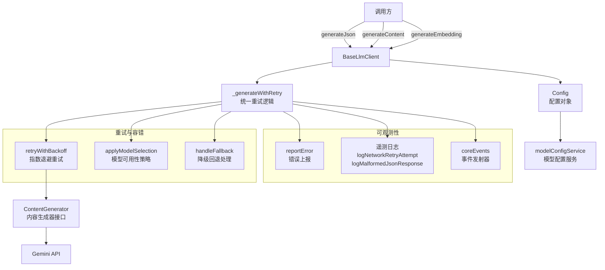

# baseLlmClient.ts

## 概述

`baseLlmClient.ts` 定义了 `BaseLlmClient` 类，这是一个面向 **无状态、工具性质的 LLM 调用** 的客户端封装。它不直接管理对话历史或流式响应，而是专注于提供三种核心能力：

1. **JSON 结构化生成** (`generateJson`) -- 向 LLM 请求符合指定 JSON Schema 的结构化输出
2. **文本内容生成** (`generateContent`) -- 向 LLM 请求普通文本内容
3. **文本嵌入** (`generateEmbedding`) -- 将文本转换为向量表示

该类内置了完善的 **重试机制**（指数退避）、**模型可用性策略**、**降级回退（fallback）** 和 **遥测日志** 支持，是系统中所有非交互式 LLM 调用的基础设施层。

## 架构图（Mermaid）



## 核心组件

### 1. 接口定义

#### `GenerateJsonOptions`

用于 `generateJson` 方法的参数配置。

| 字段 | 类型 | 必填 | 说明 |
|---|---|---|---|
| `modelConfigKey` | `ModelConfigKey` | 是 | 目标模型配置键 |
| `contents` | `Content[]` | 是 | 输入提示或对话历史 |
| `schema` | `Record<string, unknown>` | 是 | 要求的 JSON Schema，用于约束输出格式 |
| `systemInstruction` | `string \| Part \| Part[] \| Content` | 否 | 任务特定的系统指令 |
| `abortSignal` | `AbortSignal` | 是 | 取消信号 |
| `promptId` | `string` | 是 | 唯一的提示 ID，用于日志和遥测关联 |
| `role` | `LlmRole` | 是 | LLM 调用的角色（如工具调用、摘要生成等） |
| `maxAttempts` | `number` | 否 | 最大重试次数，默认 5 |

#### `GenerateContentOptions`

用于 `generateContent` 方法的参数配置。与 `GenerateJsonOptions` 相同，但没有 `schema` 字段。

#### `_CommonGenerateOptions`（内部）

两种生成选项的公共部分，额外包含 `additionalProperties` 字段，用于传递 JSON Schema 和 MIME 类型等配置。

### 2. `BaseLlmClient` 类

#### 构造函数

```typescript
constructor(
  private readonly contentGenerator: ContentGenerator,
  private readonly config: Config,
  private readonly authType?: AuthType,
)
```

| 参数 | 说明 |
|---|---|
| `contentGenerator` | 内容生成器接口实例，负责实际的 API 调用 |
| `config` | 全局配置对象，提供模型配置、认证信息等 |
| `authType` | 可选的认证类型，优先于配置中的认证类型 |

#### 公有方法

##### `generateJson(options: GenerateJsonOptions): Promise<Record<string, unknown>>`

请求 LLM 生成符合指定 JSON Schema 的结构化输出。

**核心流程**:
1. 从 `modelConfigService` 获取已解析的模型配置
2. 定义内容重试判定函数 `shouldRetryOnContent`：
   - 响应为空 → 重试
   - 响应不是合法 JSON → 重试
   - 响应是合法 JSON → 不重试
3. 调用 `_generateWithRetry` 进行带重试的生成
4. 解析并返回 JSON 对象

**JSON 清洗**: 通过 `cleanJsonResponse` 方法处理 LLM 有时返回的 ` ```json ... ``` ` 包裹格式。

##### `generateEmbedding(texts: string[]): Promise<number[][]>`

将文本数组转换为嵌入向量数组。

**核心流程**:
1. 空输入直接返回空数组
2. 从配置中获取嵌入模型名称
3. 调用 `contentGenerator.embedContent` 获取嵌入
4. 严格校验：嵌入数量必须与输入文本数量一致，每个嵌入不能为空

**注意**: 此方法没有重试逻辑，错误直接向上抛出。

##### `generateContent(options: GenerateContentOptions): Promise<GenerateContentResponse>`

请求 LLM 生成文本内容。

**核心流程**:
1. 定义内容重试判定函数：空响应时重试
2. 调用 `_generateWithRetry` 进行带重试的生成
3. 直接返回原始的 `GenerateContentResponse`

#### 私有方法

##### `_generateWithRetry(options, shouldRetryOnContent, errorContext, role): Promise<GenerateContentResponse>`

统一的带重试生成逻辑，是 `generateJson` 和 `generateContent` 的核心实现。

**详细流程**:

1. **模型选择**: 调用 `applyModelSelection` 获取当前应使用的模型及其配置（可能包含可用性策略中的最大重试次数覆盖）
2. **可用性上下文**: 创建动态的可用性上下文提供器，因为活跃模型可能在重试循环中被更新
3. **API 调用函数**: 定义 `apiCall` 闭包：
   - 检查活跃模型是否在上次尝试后发生变化（如降级回退）
   - 若变化，重新解析模型配置
   - 合并系统指令、附加属性、中断信号等为最终配置
   - 调用 `contentGenerator.generateContent`
4. **指数退避重试**: 通过 `retryWithBackoff` 执行，配置包括：
   - `shouldRetryOnContent`: 内容级别的重试判定
   - `maxAttempts`: 优先级为 可用性策略 > 方法参数 > 默认值(5)
   - `onPersistent429`: 持续遇到 429 时触发降级回退（仅交互模式）
   - `retryFetchErrors`: 是否重试网络层错误
   - `onRetry`: 每次重试时发射事件和记录遥测日志
5. **错误处理**:
   - 若 `abortSignal` 已中止，直接重新抛出（不上报）
   - 若为重试耗尽错误，上报 "invalid-content" 类型
   - 其他错误上报 "api" 类型
   - 最终统一抛出格式化的错误消息

##### `cleanJsonResponse(text: string, model: string): string`

清理 LLM 返回的 JSON 响应，移除 ` ```json ``` ` 包裹标记。若检测到这种格式，同时记录一条遥测事件 `MalformedJsonResponseEvent`。

### 3. 常量

| 常量 | 值 | 说明 |
|---|---|---|
| `DEFAULT_MAX_ATTEMPTS` | `5` | 默认最大重试次数 |

## 依赖关系

### 内部依赖

| 依赖模块 | 导入内容 | 用途 |
|---|---|---|
| `../config/config.js` | `Config`（类型） | 全局配置对象 |
| `./contentGenerator.js` | `ContentGenerator`, `AuthType`（类型） | 内容生成器接口和认证类型 |
| `../fallback/handler.js` | `handleFallback` | 模型降级回退处理 |
| `../utils/partUtils.js` | `getResponseText` | 从响应中提取文本内容 |
| `../utils/errorReporting.js` | `reportError` | 错误上报 |
| `../utils/errors.js` | `getErrorMessage` | 错误消息格式化 |
| `../telemetry/loggers.js` | `logMalformedJsonResponse`, `logNetworkRetryAttempt` | 遥测日志记录 |
| `../telemetry/types.js` | `MalformedJsonResponseEvent`, `LlmRole`, `NetworkRetryAttemptEvent` | 遥测事件类型 |
| `../utils/retry.js` | `retryWithBackoff`, `getRetryErrorType` | 指数退避重试工具 |
| `../utils/events.js` | `coreEvents` | 核心事件发射器 |
| `../config/models.js` | `getDisplayString` | 模型名称显示格式化 |
| `../services/modelConfigService.js` | `ModelConfigKey`（类型） | 模型配置键类型 |
| `../availability/policyHelpers.js` | `applyModelSelection`, `createAvailabilityContextProvider` | 模型可用性策略和上下文 |

### 外部依赖

| 依赖包 | 导入内容 | 用途 |
|---|---|---|
| `@google/genai` | `Content`, `Part`, `EmbedContentParameters`, `GenerateContentResponse`, `GenerateContentParameters`, `GenerateContentConfig`（类型） | Google GenAI SDK 类型定义 |

## 关键实现细节

1. **动态模型切换**: 在重试循环的每次迭代中，`apiCall` 闭包会检查 `config.getActiveModel()` 是否发生变化。这支持了运行时的模型降级场景 -- 当某个模型持续返回 429（请求过多）时，`handleFallback` 可能将活跃模型切换到备用模型，下一次重试自动使用新模型。

2. **三层重试次数优先级**: `maxAttempts` 的确定遵循以下优先级：
   - 可用性策略中配置的 `availabilityMaxAttempts`（最高优先级）
   - 调用方传入的 `maxAttempts` 参数
   - 默认值 `DEFAULT_MAX_ATTEMPTS`（5 次）

3. **内容级重试与网络级重试分离**: `retryWithBackoff` 同时支持两种重试触发条件：
   - **内容级**: 通过 `shouldRetryOnContent` 回调判定（如空响应、非法 JSON）
   - **网络级**: 通过 HTTP 状态码和网络错误自动判定（429、5xx、ECONNRESET 等）

4. **JSON 响应清洗与遥测**: `cleanJsonResponse` 方法处理 LLM 有时在 JSON 响应外层添加 markdown 代码块标记的问题。检测到这种情况时不仅清洗内容，还记录遥测事件，帮助团队追踪哪些模型更容易产生此类格式问题。

5. **交互/非交互模式差异**: `onPersistent429` 回调仅在交互模式 (`config.isInteractive()`) 下启用。在非交互模式（如 CI/CD）下，持续 429 不会触发降级回退，而是直接耗尽重试后抛出错误。

6. **取消信号传播**: `abortSignal` 不仅传递给底层 API 调用，还在顶层错误处理中被检查。若请求是因取消而失败，直接重新抛出原始错误，不进行错误上报，避免误报。

7. **嵌入方法的简约设计**: `generateEmbedding` 是唯一不经过 `_generateWithRetry` 的方法。它直接调用 `contentGenerator.embedContent`，没有重试逻辑，但有严格的响应校验（数量匹配、非空值检查）。
