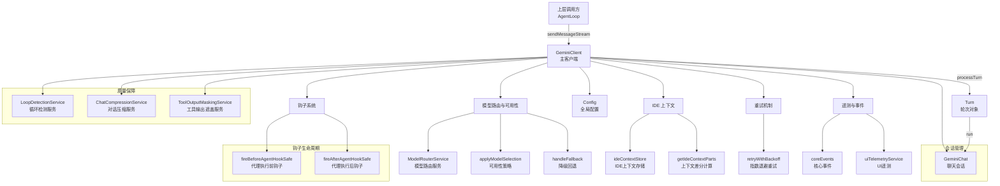

# client.ts

## 概述

`client.ts` 定义了 `GeminiClient` 类，这是 Gemini CLI 核心交互层的 **主客户端类**，负责管理完整的对话会话生命周期。与 `BaseLlmClient`（面向无状态工具调用）不同，`GeminiClient` 是一个 **有状态的会话管理器**，核心职责包括：

1. **对话会话管理** -- 初始化、重置、恢复聊天会话，维护对话历史
2. **流式消息处理** -- 通过 `AsyncGenerator` 逐步产出（yield）流式事件
3. **轮次（Turn）编排** -- 管理模型调用、工具调用、循环检测、上下文压缩等复杂的轮次处理流程
4. **钩子（Hook）系统集成** -- 在代理执行前后触发钩子，支持执行拦截、阻断和上下文注入
5. **IDE 上下文同步** -- 将编辑器的打开文件、光标位置、选中文本等信息同步给模型
6. **模型路由与降级** -- 通过路由服务选择模型，支持模型粘性（stickiness）和可用性策略
7. **循环检测与恢复** -- 检测模型的重复行为并注入反馈进行恢复

这是整个对话引擎的 **协调中心**，将多个子系统（聊天、压缩、循环检测、钩子、路由、遥测等）整合在一起。

## 架构图（Mermaid）



## 核心组件

### 1. 类型定义

#### `BeforeAgentHookReturn`

代理执行前钩子的返回类型，是一个联合类型：

| 变体 | 含义 |
|---|---|
| `{ type: AgentExecutionStopped, value: { reason, systemMessage? } }` | 钩子要求停止执行 |
| `{ type: AgentExecutionBlocked, value: { reason, systemMessage? } }` | 钩子要求阻断执行（等待用户确认） |
| `{ additionalContext: string \| undefined }` | 钩子提供额外上下文注入到请求中 |
| `undefined` | 钩子无特殊要求 |

### 2. `GeminiClient` 类

#### 私有属性

| 属性 | 类型 | 说明 |
|---|---|---|
| `chat` | `GeminiChat?` | 当前聊天会话实例 |
| `sessionTurnCount` | `number` | 当前会话的轮次计数器 |
| `loopDetector` | `LoopDetectionService` | 循环检测服务 |
| `compressionService` | `ChatCompressionService` | 对话历史压缩服务 |
| `toolOutputMaskingService` | `ToolOutputMaskingService` | 工具输出遮盖服务 |
| `lastPromptId` | `string` | 上一次提示 ID，用于检测新提示 |
| `currentSequenceModel` | `string \| null` | 当前序列中锁定的模型（模型粘性） |
| `lastSentIdeContext` | `IdeContext?` | 上次发送给模型的 IDE 上下文，用于差分计算 |
| `forceFullIdeContext` | `boolean` | 是否强制发送完整 IDE 上下文（而非差分） |
| `hasFailedCompressionAttempt` | `boolean` | 是否有过非强制压缩失败记录 |
| `hookStateMap` | `Map<string, HookState>` | 按 `prompt_id` 管理的钩子状态映射 |
| `lastUsedModelId` | `string?` | 上次使用的模型 ID，用于避免重复设置工具 |

#### 构造函数

```typescript
constructor(private readonly context: AgentLoopContext)
```

- 创建循环检测、压缩、工具输出遮盖三个服务实例
- 初始化 `lastPromptId` 为会话 ID
- 注册 `ModelChanged` 和 `MemoryChanged` 两个核心事件的监听器

#### 公有方法

##### `initialize(): Promise<void>`
初始化客户端，创建新的聊天会话并更新遥测 token 计数。

##### `addHistory(content: Content): Promise<void>`
向当前聊天历史添加一条内容记录。

##### `getChat(): GeminiChat`
获取当前聊天实例，未初始化时抛出错误。

##### `isInitialized(): boolean`
检查客户端是否已初始化。

##### `getHistory(): readonly Content[]`
获取只读的对话历史。

##### `stripThoughtsFromHistory(): void`
从对话历史中移除思考过程（thought）内容。

##### `setHistory(history: readonly Content[]): void`
设置对话历史，同时更新 token 计数并标记需要发送完整 IDE 上下文。

##### `setTools(modelId?: string): Promise<void>`
设置当前会话可用的工具。内置去重逻辑：若 `modelId` 未变化则跳过。

##### `resetChat(): Promise<void>`
重置聊天会话，创建新的聊天实例并刷新上下文管理器。

##### `dispose(): void`
清理资源，取消核心事件的监听器订阅。

##### `resumeChat(history, resumedSessionData?): Promise<void>`
恢复之前的聊天会话（从历史记录和会话数据）。

##### `getChatRecordingService(): ChatRecordingService | undefined`
获取聊天录制服务。

##### `getLoopDetectionService(): LoopDetectionService`
获取循环检测服务。

##### `getCurrentSequenceModel(): string | null`
获取当前序列锁定的模型。

##### `clearCurrentSequenceModel(): void`
清除当前序列模型锁定。

##### `addDirectoryContext(): Promise<void>`
将目录上下文信息添加到对话历史中。

##### `updateSystemInstruction(): void`
更新系统指令（当内存/记忆变更时自动调用）。

##### `sendMessageStream(...): AsyncGenerator<ServerGeminiStreamEvent, Turn>`

**核心方法** -- 发送消息并返回流式事件的异步生成器。

**参数**:

| 参数 | 类型 | 默认值 | 说明 |
|---|---|---|---|
| `request` | `PartListUnion` | - | 用户请求内容 |
| `signal` | `AbortSignal` | - | 取消信号 |
| `prompt_id` | `string` | - | 提示 ID |
| `turns` | `number` | `100` | 最大轮次数 |
| `isInvalidStreamRetry` | `boolean` | `false` | 是否为无效流重试 |
| `displayContent` | `PartListUnion?` | - | 显示内容（与实际请求不同时使用） |
| `stopHookActive` | `boolean` | `false` | 是否激活停止钩子 |

**核心流程**:

1. **重置轮次状态**（非重试时）
2. **钩子处理**: 检测新提示 → 重置循环检测器 → 触发 BeforeAgent 钩子
3. **钩子结果处理**: 停止/阻断/注入额外上下文
4. **调用 `processTurn`** 处理本轮对话
5. **AfterAgent 钩子**: 检查是否需要停止/阻断/清除上下文
6. **阻断续发**: 如果 AfterAgent 钩子阻断，使用阻断原因作为新请求递归调用
7. **清理**: 在 `finally` 中管理 hookState 的活跃调用计数

##### `generateContent(modelConfigKey, contents, abortSignal, role): Promise<GenerateContentResponse>`

非流式的内容生成方法，带有完整的重试和降级逻辑。

##### `tryCompressChat(prompt_id, force, abortSignal?): Promise<ChatCompressionInfo>`

尝试压缩对话历史。处理四种压缩结果：
- `COMPRESSED`: 重新初始化聊天会话
- `COMPRESSION_FAILED_INFLATED_TOKEN_COUNT`: 标记失败以避免重复尝试
- `CONTENT_TRUNCATED`: 轻量级地截断内容
- 其他: 不做处理

#### 私有方法

##### `processTurn(...)`: AsyncGenerator<ServerGeminiStreamEvent, Turn>`

**轮次处理核心方法**，完整流程：

1. **会话轮次限制检查**: 超过 `maxSessionTurns` 时产出 `MaxSessionTurns` 事件
2. **上下文窗口管理**:
   - 尝试压缩对话历史
   - 遮盖大型工具输出
   - 估算请求 token 数
   - 检查是否溢出上下文窗口
3. **IDE 上下文注入**: 在非工具调用等待状态时注入编辑器上下文
4. **循环检测（轮次开始）**: 检测到循环时产出事件或调用恢复逻辑
5. **模型选择**:
   - 优先使用粘性模型（`currentSequenceModel`）
   - 否则通过路由服务决策
   - 应用可用性策略
6. **工具更新**: 根据最终模型更新工具声明
7. **执行轮次**: 调用 `turn.run()` 获取流式结果
8. **流中循环检测**: 逐事件检测循环模式
9. **无效流处理**: 对 Gemini 2 模型尝试注入 "Please continue" 恢复
10. **下一发言者检查**: 通过 LLM 判断是否需要模型继续发言

##### `getIdeContextParts(forceFullContext): { contextParts, newIdeContext }`

计算 IDE 上下文信息，支持两种模式：
- **完整上下文**: 首次或强制时发送所有打开文件、活跃文件、光标、选中文本
- **差分上下文**: 后续发送增量变化（文件打开/关闭、活跃文件变更、光标移动、选区变更）

##### `fireBeforeAgentHookSafe(request, prompt_id): Promise<BeforeAgentHookReturn>`

安全地触发代理执行前钩子。使用 `hookStateMap` 保证同一 `prompt_id` 只触发一次 BeforeAgent 事件。

##### `fireAfterAgentHookSafe(request, prompt_id, turn?, stopHookActive?): Promise<DefaultHookOutput | undefined>`

安全地触发代理执行后钩子。仅在最外层调用（`activeCalls === 1`）且没有待处理工具调用时触发。

##### `_recoverFromLoop(loopResult, signal, ...): AsyncGenerator<ServerGeminiStreamEvent, Turn>`

循环恢复方法：
1. 中止当前控制器
2. 清除检测标记（但保留计数）
3. 向模型注入反馈消息，提示其避免重复行为
4. 递归调用 `sendMessageStream` 开始新的轮次

##### `tryMaskToolOutputs(history): Promise<void>`

遮盖对话历史中的大型工具输出，节省上下文窗口空间。

##### `_getActiveModelForCurrentTurn(): string`

获取当前轮次应使用的模型：优先使用粘性模型，否则根据配置解析模型名。

### 3. 常量

| 常量 | 值 | 说明 |
|---|---|---|
| `MAX_TURNS` | `100` | 单次 `sendMessageStream` 调用允许的最大轮次数 |

## 依赖关系

### 内部依赖

| 依赖模块 | 导入内容 | 用途 |
|---|---|---|
| `./geminiRequest.js` | `partListUnionToString` | 将 PartListUnion 转为字符串 |
| `../utils/environmentContext.js` | `getDirectoryContextString`, `getInitialChatHistory` | 获取目录和初始聊天上下文 |
| `./turn.js` | `CompressionStatus`, `Turn`, `GeminiEventType` 等 | 轮次对象和事件类型 |
| `../config/config.js` | `Config` | 全局配置 |
| `../config/agent-loop-context.js` | `AgentLoopContext` | 代理循环上下文 |
| `./prompts.js` | `getCoreSystemPrompt` | 核心系统提示词生成 |
| `../utils/nextSpeakerChecker.js` | `checkNextSpeaker` | 下一发言者检查 |
| `../utils/errorReporting.js` | `reportError` | 错误上报 |
| `./geminiChat.js` | `GeminiChat` | Gemini 聊天会话 |
| `../utils/retry.js` | `retryWithBackoff` | 指数退避重试 |
| `../utils/errors.js` | `getErrorMessage`, `isAbortError` | 错误处理工具 |
| `./tokenLimits.js` | `tokenLimit` | 模型 token 限制查询 |
| `../services/chatRecordingService.js` | `ChatRecordingService`, `ResumedSessionData` | 聊天录制 |
| `./contentGenerator.js` | `ContentGenerator` | 内容生成器接口 |
| `../services/loopDetectionService.js` | `LoopDetectionService` | 循环检测 |
| `../services/chatCompressionService.js` | `ChatCompressionService` | 对话压缩 |
| `../ide/ideContext.js` | `ideContextStore` | IDE 上下文存储 |
| `../telemetry/loggers.js` | `logContentRetryFailure`, `logNextSpeakerCheck` | 遥测日志 |
| `../telemetry/types.js` | `ContentRetryFailureEvent`, `NextSpeakerCheckEvent`, `LlmRole` | 遥测类型 |
| `../telemetry/uiTelemetry.js` | `uiTelemetryService` | UI 遥测服务 |
| `../ide/types.js` | `IdeContext`, `File` | IDE 类型定义 |
| `../fallback/handler.js` | `handleFallback` | 降级回退处理 |
| `../routing/routingStrategy.js` | `RoutingContext` | 路由上下文 |
| `../utils/debugLogger.js` | `debugLogger` | 调试日志 |
| `../services/modelConfigService.js` | `ModelConfigKey` | 模型配置键 |
| `../services/toolOutputMaskingService.js` | `ToolOutputMaskingService` | 工具输出遮盖 |
| `../utils/tokenCalculation.js` | `calculateRequestTokenCount` | token 计算 |
| `../availability/policyHelpers.js` | `applyModelSelection`, `createAvailabilityContextProvider` | 可用性策略 |
| `../config/models.js` | `getDisplayString`, `resolveModel`, `isGemini2Model` | 模型工具函数 |
| `../utils/partUtils.js` | `partToString` | Part 工具 |
| `../utils/events.js` | `coreEvents`, `CoreEvent` | 核心事件系统 |
| `../hooks/types.js` | `DefaultHookOutput`, `AfterAgentHookOutput` | 钩子类型 |
| `../utils/googleQuotaErrors.js` | `ValidationRequiredError` | 配额验证错误 |

### 外部依赖

| 依赖包 | 导入内容 | 用途 |
|---|---|---|
| `@google/genai` | `createUserContent`, `GenerateContentConfig`, `PartListUnion`, `Content`, `Tool`, `GenerateContentResponse` | Google GenAI SDK |

## 关键实现细节

1. **模型粘性（Model Stickiness）**: `currentSequenceModel` 实现了 "模型粘性" 机制。一旦某个轮次选定了模型，后续的工具调用回合、续发消息等都会使用同一模型，直到新的用户提示到来（通过 `prompt_id` 变化检测）。这避免了同一交互序列中模型来回切换造成的一致性问题。

2. **IDE 上下文差分传输**: `getIdeContextParts` 实现了精细的差分算法。首次交互发送完整的编辑器状态（打开文件列表、活跃文件、光标位置、选中文本），后续仅发送变化部分（新打开/关闭的文件、光标移动、选区变化）。这显著减少了每轮发送给模型的上下文量。

3. **钩子状态管理的复杂性**: `hookStateMap` 维护了一个基于 `prompt_id` 的状态映射，跟踪 BeforeAgent 是否已触发、累积响应文本、活跃调用计数等。由于 `sendMessageStream` 会递归调用自身（续发、循环恢复、阻断续发等场景），`activeCalls` 计数器用于确保只在最外层调用时触发 AfterAgent 钩子。

4. **循环检测的双层机制**: 循环检测分为两层：
   - **轮次开始时**: `loopDetector.turnStarted()` 在开始新轮次前检测
   - **流中逐事件**: 在流式结果的每个事件中调用 `loopDetector.addAndCheck()` 实时检测

   检测到循环后有三种处理：`count > 1` 直接中止（硬循环），`count === 1` 注入反馈尝试恢复（软循环），`boundedTurns <= 1` 时停止。

5. **上下文窗口管理的多重防线**:
   - **对话压缩**: `tryCompressChat` 通过摘要压缩对话历史
   - **工具输出遮盖**: `tryMaskToolOutputs` 替换大型工具输出为占位符
   - **溢出预检**: 在发送前估算 token 数并与剩余空间比较
   - **压缩失败记忆**: `hasFailedCompressionAttempt` 避免反复尝试失败的压缩

6. **AsyncGenerator 的递归使用**: `sendMessageStream` 和 `processTurn` 都返回 `AsyncGenerator`，并通过 `yield*` 进行递归调用（续发、循环恢复、钩子阻断续发等场景）。这使得流式事件能够在多层调用中正确传播，但也增加了控制流的复杂度。

7. **`processTurn` 中的工具调用约束**: 当对话历史最后一条是模型的 `functionCall` 时，会跳过 IDE 上下文注入。这是因为 Gemini API 要求 `functionResponse` 必须紧跟在 `functionCall` 之后，中间不能插入其他内容。

8. **Validation Required 处理**: 在 `generateContent` 方法中，当遇到需要用户验证的配额错误时，对于 `prompt-completion` 模型直接抛出错误（避免在后台调用时弹出验证对话框），其他模型则通过配置中的验证处理器引导用户完成验证。
