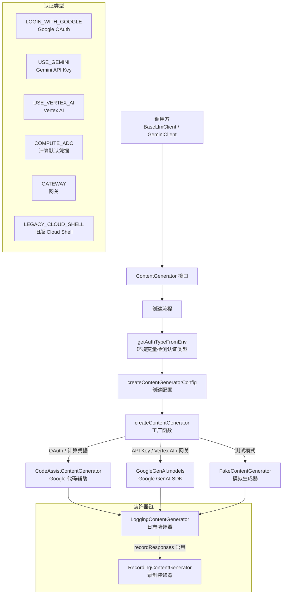

# contentGenerator.ts

## 概述

`contentGenerator.ts` 是 Gemini CLI 内容生成层的 **核心定义与工厂模块**，承担三项关键职责：

1. **定义 `ContentGenerator` 接口** -- 抽象了所有与 LLM 交互的核心能力（内容生成、流式生成、token 计数、文本嵌入），是整个系统中 LLM 调用的统一契约
2. **定义 `AuthType` 枚举** -- 枚举了所有支持的认证方式（Google OAuth、Gemini API Key、Vertex AI、Cloud Shell、计算默认凭据、网关）
3. **提供工厂函数** -- `createContentGeneratorConfig` 和 `createContentGenerator` 根据认证类型和环境变量，组装并创建合适的内容生成器实例

该模块采用了 **装饰器模式**（LoggingContentGenerator、RecordingContentGenerator）和 **策略模式**（根据 AuthType 选择不同的生成器实现），是系统中连接上层业务逻辑和底层 API SDK 的桥梁。

## 架构图（Mermaid）



## 核心组件

### 1. `ContentGenerator` 接口

所有内容生成器必须实现的统一接口。

| 方法/属性 | 签名 | 说明 |
|---|---|---|
| `generateContent` | `(request: GenerateContentParameters, userPromptId: string, role: LlmRole) => Promise<GenerateContentResponse>` | 非流式内容生成 |
| `generateContentStream` | `(request: GenerateContentParameters, userPromptId: string, role: LlmRole) => Promise<AsyncGenerator<GenerateContentResponse>>` | 流式内容生成，返回异步生成器 |
| `countTokens` | `(request: CountTokensParameters) => Promise<CountTokensResponse>` | 计算请求的 token 数量 |
| `embedContent` | `(request: EmbedContentParameters) => Promise<EmbedContentResponse>` | 文本嵌入向量生成 |
| `userTier?` | `UserTierId` | 可选：用户层级 ID |
| `userTierName?` | `string` | 可选：用户层级名称 |
| `paidTier?` | `GeminiUserTier` | 可选：付费层级信息 |

### 2. `AuthType` 枚举

| 枚举值 | 字符串值 | 说明 |
|---|---|---|
| `LOGIN_WITH_GOOGLE` | `'oauth-personal'` | 通过 Google 个人账号 OAuth 登录 |
| `USE_GEMINI` | `'gemini-api-key'` | 使用 Gemini API 密钥 |
| `USE_VERTEX_AI` | `'vertex-ai'` | 使用 Google Cloud Vertex AI |
| `LEGACY_CLOUD_SHELL` | `'cloud-shell'` | 旧版 Cloud Shell 认证（已不推荐） |
| `COMPUTE_ADC` | `'compute-default-credentials'` | 计算实例默认凭据（ADC） |
| `GATEWAY` | `'gateway'` | 通过网关代理认证 |

### 3. `ContentGeneratorConfig` 类型

内容生成器的配置类型。

| 字段 | 类型 | 说明 |
|---|---|---|
| `apiKey?` | `string` | API 密钥 |
| `vertexai?` | `boolean` | 是否使用 Vertex AI |
| `authType?` | `AuthType` | 认证类型 |
| `proxy?` | `string` | 代理服务器地址 |
| `baseUrl?` | `string` | 自定义 API 基础 URL |
| `customHeaders?` | `Record<string, string>` | 自定义 HTTP 头 |

### 4. 核心函数

#### `getAuthTypeFromEnv(): AuthType | undefined`

根据环境变量自动检测认证类型，按以下优先级顺序检查：

1. `GOOGLE_GENAI_USE_GCA=true` → `LOGIN_WITH_GOOGLE`
2. `GOOGLE_GENAI_USE_VERTEXAI=true` → `USE_VERTEX_AI`
3. `GEMINI_API_KEY` 存在 → `USE_GEMINI`
4. `CLOUD_SHELL=true` 或 `GEMINI_CLI_USE_COMPUTE_ADC=true` → `COMPUTE_ADC`
5. 均不匹配 → `undefined`

#### `createContentGeneratorConfig(config, authType, apiKey?, baseUrl?, customHeaders?): Promise<ContentGeneratorConfig>`

根据认证类型和环境变量创建内容生成器配置。

**API 密钥来源优先级**（Gemini API Key 模式）：
1. 函数参数 `apiKey`
2. 环境变量 `GEMINI_API_KEY`
3. 钥匙串存储（`loadApiKey()`）

**Vertex AI 模式** 需要以下环境变量之一：
- `GOOGLE_API_KEY`
- `GOOGLE_CLOUD_PROJECT` + `GOOGLE_CLOUD_LOCATION`

**各认证类型的配置逻辑**：

| 认证类型 | 配置行为 |
|---|---|
| `LOGIN_WITH_GOOGLE` / `COMPUTE_ADC` | 仅设置基础字段（authType、proxy、baseUrl、customHeaders），不需要 API 密钥 |
| `USE_GEMINI` | 设置 `apiKey`，`vertexai=false` |
| `USE_VERTEX_AI` | 设置 `apiKey`（Google API Key），`vertexai=true` |
| `GATEWAY` | 设置 `apiKey`（参数或占位符 `'gateway-placeholder-key'`），`vertexai=false` |

#### `createContentGenerator(config, gcConfig, sessionId?): Promise<ContentGenerator>`

**核心工厂函数** -- 根据配置创建并返回合适的内容生成器实例。

**创建流程**：

1. **Fake 模式检查**: 若 `gcConfig.fakeResponses` 存在，创建 `FakeContentGenerator`（用于测试）
2. **User-Agent 构造**: 根据客户端名称和平台构造 User-Agent 字符串
   - VS Code 客户端：使用 `CloudCodeVSCode/...` 格式，包含操作系统、架构、VS Code 版本等详细信息
   - 其他客户端：使用 `GeminiCLI[-clientName]/version/model (platform; arch; surface)` 格式
3. **自定义 HTTP 头处理**: 合并环境变量 `GEMINI_CLI_CUSTOM_HEADERS` 和配置中的自定义头
4. **API 密钥认证机制**: 支持通过 `GEMINI_API_KEY_AUTH_MECHANISM` 环境变量切换认证头格式（`x-goog-api-key` 或 `bearer`）
5. **按认证类型分支创建**:
   - **OAuth/ADC**: 调用 `createCodeAssistContentGenerator` 创建 Google 代码辅助生成器
   - **API Key/Vertex AI/Gateway**: 创建 `GoogleGenAI` SDK 实例，使用其 `models` 属性
   - 其他: 抛出不支持的 authType 错误
6. **装饰器包装**:
   - 所有生成器都被 `LoggingContentGenerator` 包装（日志记录）
   - 若 `gcConfig.recordResponses` 存在，进一步被 `RecordingContentGenerator` 包装（响应录制）

#### `validateBaseUrl(baseUrl: string): void`

验证自定义 Base URL 的安全性：
- 必须是合法的 URL 格式
- 必须使用 HTTPS 协议，除非目标是本地地址（`localhost`、`127.0.0.1`、`[::1]`）

### 5. 常量

| 常量 | 值 | 说明 |
|---|---|---|
| `LOCAL_HOSTNAMES` | `['localhost', '127.0.0.1', '[::1]']` | 允许使用 HTTP 的本地主机名列表 |

## 依赖关系

### 内部依赖

| 依赖模块 | 导入内容 | 用途 |
|---|---|---|
| `../code_assist/codeAssist.js` | `createCodeAssistContentGenerator` | 创建 Google 代码辅助内容生成器（OAuth/ADC 路径） |
| `../ide/detect-ide.js` | `isCloudShell` | 检测是否运行在 Cloud Shell 环境 |
| `../config/config.js` | `Config`（类型） | 全局配置 |
| `./apiKeyCredentialStorage.js` | `loadApiKey` | 从安全存储加载 API 密钥 |
| `../code_assist/types.js` | `UserTierId`, `GeminiUserTier`（类型） | 用户层级类型定义 |
| `./loggingContentGenerator.js` | `LoggingContentGenerator` | 日志装饰器生成器 |
| `../utils/installationManager.js` | `InstallationManager` | 安装管理器，获取安装 ID |
| `./fakeContentGenerator.js` | `FakeContentGenerator` | 测试用模拟生成器 |
| `../utils/customHeaderUtils.js` | `parseCustomHeaders` | 解析自定义 HTTP 头字符串 |
| `../utils/surface.js` | `determineSurface` | 确定运行表面（CLI、VS Code 等） |
| `./recordingContentGenerator.js` | `RecordingContentGenerator` | 录制装饰器生成器 |
| `../../index.js` | `getVersion`, `resolveModel` | 获取版本号和解析模型名 |
| `../telemetry/llmRole.js` | `LlmRole`（类型） | LLM 角色类型 |

### 外部依赖

| 依赖包 | 导入内容 | 用途 |
|---|---|---|
| `@google/genai` | `GoogleGenAI`, `CountTokensResponse`, `GenerateContentResponse`, `GenerateContentParameters`, `CountTokensParameters`, `EmbedContentResponse`, `EmbedContentParameters` | Google GenAI SDK 核心类和类型 |
| `node:os` | `os` | Node.js 操作系统模块，用于获取系统信息 |

## 关键实现细节

1. **装饰器链模式**: 内容生成器的创建采用装饰器链模式：
   ```
   实际生成器 → LoggingContentGenerator → RecordingContentGenerator（可选）
   ```
   所有生成器都会被 `LoggingContentGenerator` 包装以记录调用日志。若启用了响应录制功能，还会再加一层 `RecordingContentGenerator`。这种设计使得日志记录和响应录制完全透明于业务代码。

2. **API 密钥来源的三级降级**: Gemini API Key 的获取遵循三级降级策略：
   - 直接传入的 `apiKey` 参数（最高优先级，通常来自命令行参数）
   - 环境变量 `GEMINI_API_KEY`（适合 CI/CD 环境）
   - 系统钥匙串存储 `loadApiKey()`（最安全，适合开发者本地使用）

3. **User-Agent 差异化构造**: VS Code 客户端和 CLI 客户端使用不同的 User-Agent 格式。VS Code 客户端使用 `CloudCodeVSCode/...` 格式以匹配 VS Code 扩展的遥测规范，包含更详细的环境信息（操作系统类型/版本、架构、VS Code 版本、Cloud Shell 版本）。CLI 客户端则使用更简洁的格式。

4. **Bearer 认证机制切换**: 默认情况下 API 密钥通过 `x-goog-api-key` 头传递（Google API 标准方式）。但通过设置 `GEMINI_API_KEY_AUTH_MECHANISM=bearer` 环境变量，可以切换为 `Authorization: Bearer` 头方式。这为接入第三方网关或自定义代理提供了灵活性。

5. **Base URL 安全验证**: `validateBaseUrl` 函数强制要求自定义 Base URL 使用 HTTPS，仅对本地开发地址（localhost、127.0.0.1、[::1]）放宽限制。这防止了 API 密钥在不安全的 HTTP 连接中泄露。

6. **IIFE 工厂模式**: `createContentGenerator` 内部使用了一个立即执行的异步 IIFE（`(async () => { ... })()`）来构造基础生成器实例。这使得分支逻辑与后续的装饰器包装清晰分离。

7. **安装 ID 追踪**: 当用户启用使用统计时，会通过 `InstallationManager` 获取唯一的安装 ID，并通过 `x-gemini-api-privileged-user-id` 头发送给服务端。这用于匿名化的使用量统计和配额管理。

8. **`GOOGLE_GENAI_API_VERSION` 覆盖**: 通过环境变量可以覆盖 GenAI SDK 使用的 API 版本，这在测试新版 API 或兼容旧版 API 时非常有用。
