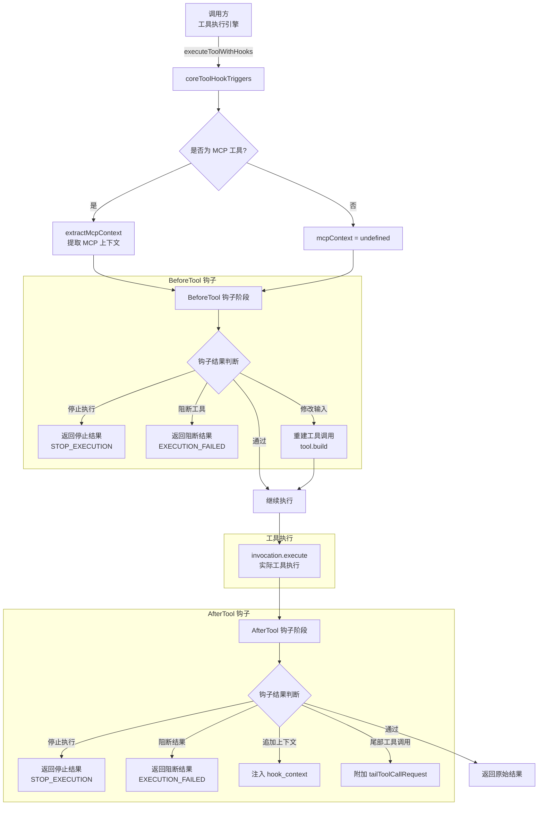

# coreToolHookTriggers.ts

## 概述

`coreToolHookTriggers.ts` 是 Gemini CLI 钩子系统与工具执行系统之间的 **集成桥梁**，负责在工具执行的生命周期中触发 BeforeTool 和 AfterTool 钩子事件。该模块实现了 **面向切面编程（AOP）** 的核心思想：在不修改工具本身代码的情况下，允许外部钩子在工具执行前后进行拦截、修改和增强。

该模块导出两个函数：
1. `extractMcpContext` -- 从工具调用中提取 MCP（Model Context Protocol）上下文信息
2. `executeToolWithHooks` -- 带钩子生命周期的工具执行函数，是整个模块的核心

## 架构图（Mermaid）



## 核心组件

### 1. `extractMcpContext(invocation, config): McpToolContext | undefined`

从工具调用中提取 MCP 上下文信息，用于传递给钩子系统。

**逻辑流程**:
1. 检查 `invocation` 是否为 `DiscoveredMCPToolInvocation` 实例（通过 `instanceof`）
2. 若不是 MCP 工具，返回 `undefined`
3. 从 `config` 获取 MCP 服务器列表（优先从 `McpClientManager`，回退到 `getMcpServers`）
4. 根据 `invocation.serverName` 查找对应的服务器配置
5. 构造并返回 `McpToolContext` 对象（仅包含非敏感的连接信息）

**返回的 `McpToolContext` 结构**:

| 字段 | 说明 |
|---|---|
| `server_name` | MCP 服务器名称 |
| `tool_name` | 服务器端的工具名称 |
| `command` | 服务器启动命令 |
| `args` | 启动参数 |
| `cwd` | 工作目录 |
| `url` | 服务器 URL（优先 `url`，回退 `httpUrl`） |
| `tcp` | TCP 连接信息 |

### 2. `executeToolWithHooks(...): Promise<ToolResult>`

**核心函数** -- 在完整的钩子生命周期中执行工具。

**参数**:

| 参数 | 类型 | 必填 | 说明 |
|---|---|---|---|
| `invocation` | `AnyToolInvocation` | 是 | 工具调用实例 |
| `toolName` | `string` | 是 | 工具名称 |
| `signal` | `AbortSignal` | 是 | 取消信号 |
| `tool` | `AnyDeclarativeTool` | 是 | 工具声明对象，用于重建调用 |
| `liveOutputCallback` | `(outputChunk: ToolLiveOutput) => void` | 否 | 实时输出回调 |
| `options` | `ExecuteOptions` | 否 | 执行选项（Shell 配置、执行 ID 回调等） |
| `config` | `Config` | 否 | 全局配置，用于查找 MCP 服务器详情 |
| `originalRequestName` | `string` | 否 | 原始请求名称 |
| `skipBeforeHook` | `boolean` | 否 | 是否跳过 BeforeTool 钩子 |

**完整执行流程**:

#### 阶段一：准备

1. 提取工具输入参数 `toolInput`
2. 初始化输入修改追踪标志 `inputWasModified` 和 `modifiedKeys`
3. 提取 MCP 上下文（若有配置）
4. 获取钩子系统实例

#### 阶段二：BeforeTool 钩子

若钩子系统存在且未跳过 BeforeTool：

1. **触发 `fireBeforeToolEvent`**: 传入工具名、输入参数、MCP 上下文、原始请求名
2. **停止执行检查**: 若钩子返回 `shouldStopExecution()`，立即返回 `STOP_EXECUTION` 类型的错误结果
3. **阻断检查**: 若钩子返回 `getBlockingError().blocked`，立即返回 `EXECUTION_FAILED` 类型的错误结果
4. **输入修改**: 若钩子是 `BeforeToolHookOutput` 实例且包含修改后的输入：
   - 通过 `Object.assign` 就地修改 `invocation.params`
   - 调用 `tool.build(invocation.params)` 重建工具调用（确保派生状态如 `resolvedPath` 得到更新）
   - 若重建失败（验证错误），返回 `INVALID_TOOL_PARAMS` 类型的错误结果

#### 阶段三：工具执行

调用 `invocation.execute(signal, liveOutputCallback, options)` 执行实际工具操作。

#### 阶段四：输入修改通知

若 BeforeTool 钩子修改了输入参数，在工具结果的 `llmContent` 末尾追加修改通知消息：
```
[System] Tool input parameters (key1, key2) were modified by a hook before execution.
```

支持 `llmContent` 的三种类型：`string`、`Part[]`（数组）、单个 `Part` 对象。

#### 阶段五：AfterTool 钩子

若钩子系统存在：

1. **触发 `fireAfterToolEvent`**: 传入工具名、输入参数、工具结果、MCP 上下文、原始请求名
2. **停止执行检查**: 同 BeforeTool
3. **阻断检查**: 若钩子返回阻断，返回 "Tool result blocked" 错误
4. **追加上下文**: 若钩子返回额外上下文，包裹在 `<hook_context>` 标签中追加到 `llmContent`
5. **尾部工具调用**: 若钩子请求尾部工具调用（`tailToolCallRequest`），附加到结果中

#### 阶段六：返回

返回最终的 `ToolResult`。

## 依赖关系

### 内部依赖

| 依赖模块 | 导入内容 | 用途 |
|---|---|---|
| `../hooks/types.js` | `McpToolContext`（类型）, `BeforeToolHookOutput` | 钩子类型定义和 BeforeTool 输出类 |
| `../config/config.js` | `Config`（类型） | 全局配置 |
| `../tools/tools.js` | `ToolResult`, `AnyDeclarativeTool`, `AnyToolInvocation`, `ToolLiveOutput`, `ExecuteOptions`（类型） | 工具系统核心类型 |
| `../tools/tool-error.js` | `ToolErrorType` | 工具错误类型枚举 |
| `../tools/mcp-tool.js` | `DiscoveredMCPToolInvocation` | MCP 工具调用类，用于 instanceof 判断 |
| `../utils/debugLogger.js` | `debugLogger` | 调试日志 |

### 外部依赖

无直接的外部（第三方）依赖。

## 关键实现细节

1. **六种钩子介入点**: `executeToolWithHooks` 提供了丰富的钩子介入能力：
   - **BeforeTool 停止执行**: 完全终止代理执行流程
   - **BeforeTool 阻断工具**: 阻止特定工具运行但不停止代理
   - **BeforeTool 修改输入**: 动态修改工具参数（如路径重写、参数注入）
   - **AfterTool 停止执行**: 根据工具结果决定是否停止代理
   - **AfterTool 阻断结果**: 拦截并替换工具的输出结果
   - **AfterTool 追加上下文/尾部调用**: 在结果中注入额外信息或触发后续工具调用

2. **输入修改的安全重建**: 当 BeforeTool 钩子修改了工具输入参数后，不是简单地使用修改后的参数，而是调用 `tool.build(invocation.params)` 重新构建整个工具调用。这确保了：
   - 参数验证逻辑被重新执行
   - 派生状态（如 `ReadFileTool` 的 `resolvedPath`）得到正确更新
   - 若修改后的参数不合法，能及早发现并返回有意义的错误

3. **就地修改参数的设计**: `Object.assign(invocation.params, modifiedInput)` 直接修改原始参数对象，而非创建新对象。注释中特别说明这是有意为之："which should be the same reference as invocation.params"。这使得旧的引用也能看到修改（虽然之后会通过 `tool.build` 重建）。

4. **MCP 上下文的安全提取**: `extractMcpContext` 仅提取非敏感的连接信息（command、args、cwd、url、tcp），不包含任何认证凭据或密钥信息。这使得钩子脚本可以安全地获取工具的来源信息，用于审计和决策。

5. **`llmContent` 多态处理**: 工具结果的 `llmContent` 字段支持三种类型（`string`、`Part[]`、单个 `Part`），在追加修改通知和钩子上下文时都需要处理这三种情况。代码通过类型检查分支（`typeof`、`Array.isArray`）进行适配。

6. **`skipBeforeHook` 参数**: 提供了跳过 BeforeTool 钩子的选项。这在某些内部调用场景下有用，例如重试执行时不需要再次触发钩子。

7. **尾部工具调用机制（Tail Tool Call）**: AfterTool 钩子可以通过 `getTailToolCallRequest()` 请求在当前工具完成后触发另一个工具调用。这个请求被附加到 `toolResult.tailToolCallRequest` 中，由上层调用方负责执行。这实现了钩子触发的工具链式调用。

8. **`<hook_context>` 标签包裹**: 钩子注入的额外上下文被包裹在 `<hook_context>` XML 标签中。这使得模型能够识别哪些上下文来自钩子系统，而非工具本身的输出，有助于模型做出更准确的决策。
