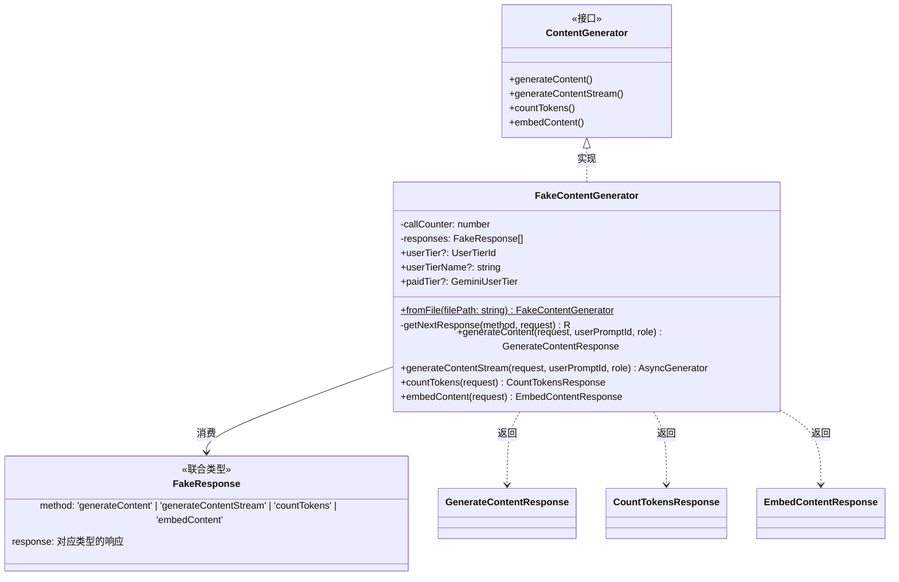
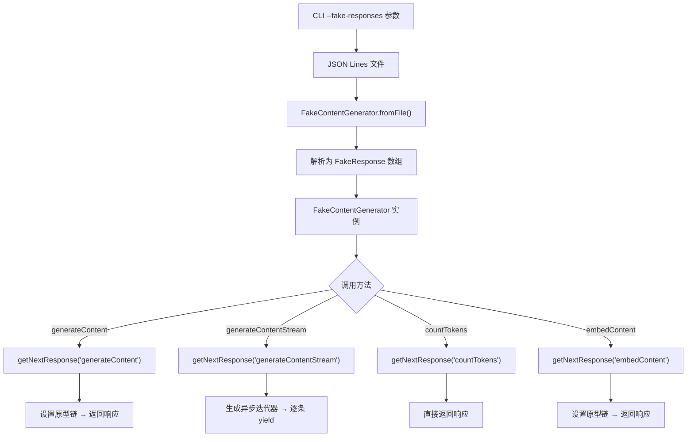

# fakeContentGenerator.ts

## 概述

`FakeContentGenerator` 是一个用于测试和调试的**模拟内容生成器**。它实现了 `ContentGenerator` 接口，但不会真正调用 Gemini API，而是从预先准备好的"罐头响应"（canned responses）中按顺序返回模拟数据。这些模拟响应通常来自一个文件，通过 CLI 的 `--fake-responses` 参数指定。

该类的主要用途是：
- **单元测试**：无需网络请求即可测试依赖 `ContentGenerator` 的逻辑
- **集成测试**：模拟完整的 API 响应流程
- **离线调试**：在没有 API 密钥或网络的环境中进行开发

## 架构图（Mermaid）

## 核心组件

### 1. `FakeResponse` 类型（第 21-37 行）

一个**判别联合类型**（Discriminated Union），通过 `method` 字段区分四种模拟响应：

| method 值 | response 类型 | 说明 |
|---|---|---|
| `'generateContent'` | `GenerateContentResponse` | 单次内容生成响应 |
| `'generateContentStream'` | `GenerateContentResponse[]` | 流式生成响应（数组形式） |
| `'countTokens'` | `CountTokensResponse` | Token 计数响应 |
| `'embedContent'` | `EmbedContentResponse` | 嵌入向量响应 |

### 2. `FakeContentGenerator` 类（第 43-127 行）

#### 属性

- **`callCounter`**（私有）：调用计数器，初始为 0，每次调用 `getNextResponse` 时自增，用于追踪当前应返回第几个预设响应。
- **`responses`**（私有，只读）：预设的 `FakeResponse` 数组，在构造时注入。
- **`userTier`**：可选的用户层级 ID。
- **`userTierName`**：可选的用户层级名称。
- **`paidTier`**：可选的 Gemini 付费层级。

#### 静态方法

##### `fromFile(filePath: string): Promise<FakeContentGenerator>`（第 51-59 行）

工厂方法，从文件创建 `FakeContentGenerator` 实例：
1. 使用 `fs.promises.readFile` 异步读取文件内容
2. 按换行符分割，过滤空行
3. 每行作为独立的 JSON 解析为 `FakeResponse`
4. 返回新的 `FakeContentGenerator` 实例

文件格式为 **JSON Lines**（JSONL），每行一个 JSON 对象。

#### 私有方法

##### `getNextResponse<M, R>(method: M, request: unknown): R`（第 61-79 行）

核心的响应分发方法，使用了**条件类型推断**的泛型：
- `M` 约束为 `FakeResponse['method']` 的子类型
- `R` 通过 `Extract` 工具类型从联合类型中提取对应 method 的 response 类型

逻辑流程：
1. 从 `responses` 数组中取出下一个响应（通过 `callCounter++`）
2. 如果没有更多响应，抛出错误（包含请求内容便于调试）
3. 如果响应的 `method` 与期望不匹配，抛出错误
4. 返回响应数据

#### 公开方法

##### `generateContent(request, userPromptId, role): Promise<GenerateContentResponse>`（第 81-92 行）

模拟内容生成：
- 调用 `getNextResponse('generateContent', request)`
- 使用 `Object.setPrototypeOf` 将返回的普通对象设置为 `GenerateContentResponse` 的原型，确保从 JSON 反序列化的对象拥有正确的类方法

##### `generateContentStream(request, userPromptId, role): Promise<AsyncGenerator<GenerateContentResponse>>`（第 94-110 行）

模拟流式内容生成：
- 调用 `getNextResponse('generateContentStream', request)` 获取响应数组
- 创建一个**异步生成器函数** `stream()`，逐个 `yield` 数组中的响应
- 每个响应同样设置原型链为 `GenerateContentResponse.prototype`

##### `countTokens(request): Promise<CountTokensResponse>`（第 112-116 行）

模拟 Token 计数，直接返回预设响应，不需要设置原型链（纯数据对象）。

##### `embedContent(request): Promise<EmbedContentResponse>`（第 118-126 行）

模拟嵌入内容生成，返回设置了 `EmbedContentResponse` 原型的响应对象。

## 依赖关系

### 内部依赖

| 模块 | 导入内容 | 用途 |
|---|---|---|
| `./contentGenerator.js` | `ContentGenerator` 接口类型 | 本类实现的接口契约 |
| `../code_assist/types.js` | `UserTierId`, `GeminiUserTier` 类型 | 用户层级相关类型定义 |
| `../utils/safeJsonStringify.js` | `safeJsonStringify` 函数 | 安全的 JSON 序列化，用于错误消息中输出请求内容 |
| `../telemetry/types.js` | `LlmRole` 类型 | LLM 角色类型，方法签名中使用但未实际消费 |

### 外部依赖

| 模块 | 导入内容 | 用途 |
|---|---|---|
| `@google/genai` | `GenerateContentResponse`, `CountTokensResponse`, `GenerateContentParameters`, `CountTokensParameters`, `EmbedContentResponse`, `EmbedContentParameters` | Google GenAI SDK 的请求/响应类型和类 |
| `node:fs` | `promises` | Node.js 文件系统异步 API，用于读取模拟响应文件 |

## 关键实现细节

### 1. Object.setPrototypeOf 的使用

从 JSON 文件反序列化的对象是普通的 JavaScript 对象（plain object），不具有 `GenerateContentResponse` 等类的原型方法。通过 `Object.setPrototypeOf` 手动设置原型链，使得这些对象可以像真正的实例一样使用类方法（如 `.text` getter 等）。这是一种常见的"水合"（hydration）模式。

需要注意的是，`countTokens` 方法**没有**使用 `Object.setPrototypeOf`，说明 `CountTokensResponse` 是一个纯数据类型（可能是接口或简单类型别名），不需要原型方法。

### 2. 顺序消费模式

响应按照 `callCounter` 严格顺序消费，这意味着测试文件中的响应顺序必须与代码中的调用顺序完全一致。这种设计简单但对测试编写者有严格的顺序要求。

### 3. 方法类型校验

`getNextResponse` 不仅检查是否还有剩余响应，还验证下一个响应的 `method` 是否匹配。这提供了双重安全保障，确保测试文件的内容与测试代码的调用序列完全对应。

### 4. JSON Lines 文件格式

使用 JSONL 格式（每行一个 JSON）而非单个 JSON 数组，有以下优势：
- 更容易追加新的响应
- 大文件场景下可以逐行流式处理（虽然当前实现是全量读取）
- 便于人工阅读和编辑

### 5. 未使用的参数

`generateContent` 和 `generateContentStream` 方法签名中的 `_userPromptId` 和 `role` 参数以下划线前缀命名，表示它们在 fake 实现中不被使用，但为了符合 `ContentGenerator` 接口契约必须保留。
