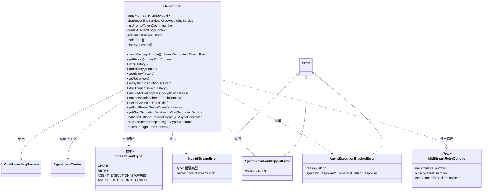
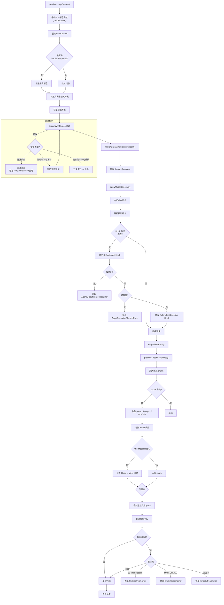

# geminiChat.ts

## 概述

`GeminiChat` 是 Gemini CLI 的**核心聊天会话管理器**，负责维护用户与 Gemini 模型之间的多轮对话。它实现了流式消息发送、自动重试、会话历史管理、Hook 系统集成、工具调用记录等关键功能。

该文件是从 Google GenAI JS SDK 的 `chats.ts` 复制并定制修改的版本，主要目的是修复原始实现中 function response 不被视为"有效"响应的 bug（Google 内部 issue b/420354090）。

核心职责：
- **流式消息发送**：通过 `sendMessageStream` 方法向模型发送消息并以流式方式接收响应
- **自动重试机制**：支持连接阶段和流式阶段的错误重试，包括指数退避
- **会话历史管理**：维护完整历史和精选历史（curated history）
- **Hook 系统集成**：支持 BeforeModel、AfterModel、BeforeToolSelection 等 Hook 事件
- **模型降级/回退**：支持在持续 429 错误时自动切换模型
- **聊天记录服务**：通过 `ChatRecordingService` 记录完整的对话流程

## 架构图（Mermaid）

## 核心组件

### 1. `StreamEventType` 枚举（第 63-73 行）

定义流式事件类型：

| 值 | 说明 |
|---|---|
| `CHUNK` | 来自 API 的常规内容块 |
| `RETRY` | 重试信号，UI 应丢弃上次失败尝试的部分内容 |
| `AGENT_EXECUTION_STOPPED` | Agent 执行被 Hook 停止 |
| `AGENT_EXECUTION_BLOCKED` | Agent 执行被 Hook 阻塞 |

### 2. `StreamEvent` 联合类型（第 75-79 行）

基于 `StreamEventType` 的判别联合类型，每种事件类型携带不同的数据载荷。

### 3. `MidStreamRetryOptions` 接口与默认配置（第 84-97 行）

流式传输中途错误的重试配置：
- `maxAttempts`: 4（1 次初始 + 3 次重试）
- `initialDelayMs`: 1000ms
- `useExponentialBackoff`: true（使用指数退避）

### 4. 验证函数

#### `isValidResponse(response)` （第 104-113 行）
检查响应是否有效：存在 candidates、有 content、content 有效。

#### `isValidNonThoughtTextPart(part)` （第 115-126 行）
检查一个 Part 是否为有效的非思考文本部分：有文本、不是 thought、不含 functionCall/functionResponse/inlineData/fileData。

#### `isValidContent(content)` （第 128-141 行）
检查 Content 是否有效：parts 非空、每个 part 非空对象且非空文本（thought 除外）。

#### `validateHistory(history)` （第 149-155 行）
校验历史中每条内容的 role 必须是 `'user'` 或 `'model'`。

#### `extractCuratedHistory(history)` （第 165-192 行）
从完整历史中提取"精选历史"——只保留有效的 model 输出轮次。如果一组连续的 model 消息中任何一条无效，则整组被丢弃。User 消息总是保留。

### 5. 自定义错误类

#### `InvalidStreamError`（第 198-217 行）
流完成但内容无效时抛出。type 字段区分四种错误：
- `NO_FINISH_REASON`：流结束时没有 finish reason
- `NO_RESPONSE_TEXT`：响应文本为空
- `MALFORMED_FUNCTION_CALL`：格式错误的函数调用
- `UNEXPECTED_TOOL_CALL`：意外的工具调用

#### `AgentExecutionStoppedError`（第 222-227 行）
Hook 系统停止了 Agent 执行时抛出，携带停止原因。

#### `AgentExecutionBlockedError`（第 232-240 行）
Hook 系统阻塞了 Agent 执行时抛出，可携带一个合成响应（synthetic response）。

### 6. `GeminiChat` 类（第 249-1073 行）

#### 构造函数（第 256-271 行）

参数：
- `context: AgentLoopContext` —— Agent 循环上下文，包含配置、工具注册表等
- `systemInstruction: string` —— 系统指令
- `tools: Tool[]` —— 可用工具列表
- `history: Content[]` —— 初始历史记录
- `resumedSessionData?: ResumedSessionData` —— 恢复的会话数据
- `onModelChanged?: (modelId: string) => Promise<Tool[]>` —— 模型切换回调
- `kind: 'main' | 'subagent'` —— 会话类型（主会话或子代理）

构造时：
1. 校验历史记录
2. 初始化 `ChatRecordingService`
3. 估算初始 prompt token 数

#### `sendMessageStream()` 方法（第 303-492 行）

**核心方法**，发送消息并返回流式事件的异步生成器。

关键流程：
1. **顺序保证**：等待 `sendPromise` 完成，确保同一时间只有一个消息在处理
2. **创建 userContent**：使用 `createUserContent` 将消息转为标准格式
3. **记录用户输入**：非 functionResponse 的消息记录到 `ChatRecordingService`
4. **加入历史**：将用户内容推入 `this.history`
5. **获取精选历史**：`getHistory(true)` 获取发送给模型的内容
6. **重试循环**（`streamWithRetries`）：
   - 最多重试 `maxAttempts` 次
   - 区分"连接阶段"和"流式阶段"错误
   - 连接阶段错误已由 `retryWithBackoff` 处理，直接抛出
   - 流式阶段错误最多重试 `MID_STREAM_RETRY_OPTIONS.maxAttempts`（4）次
   - 支持指数退避延迟
   - 发出遥测事件
   - 中止信号（`signal.aborted`）时直接抛出
7. **finally 块**：解析 `streamDonePromise` 以释放顺序锁

#### `makeApiCallAndProcessStream()` 方法（第 494-710 行）

**私有方法**，执行实际的 API 调用并处理流。

关键步骤：
1. **确保 thoughtSignature**：调用 `ensureActiveLoopHasThoughtSignatures`
2. **模型选择**：通过 `applyModelSelection` 确定最终模型和配置
3. **API 调用闭包**（`apiCall`）：
   - 解析模型版本（Gemini 3.1 / Flash Lite / Preview 等）
   - 检测活跃模型是否因回退而改变
   - 触发 **BeforeModel Hook**（可停止/阻塞/修改配置和内容）
   - 触发 **BeforeToolSelection Hook**（可修改工具配置）
   - 调用 `onModelChanged` 回调
   - 通过 `ContentGenerator.generateContentStream` 发起请求
4. **retryWithBackoff**：带退避的重试，支持持续 429 回退和验证处理
5. **processStreamResponse**：处理流响应

#### `processStreamResponse()` 方法（第 864-1004 行）

**私有异步生成器方法**，处理流式响应。

关键逻辑：
1. **遍历流 chunk**：收集所有模型响应的 parts
2. **记录 thoughts**：检测 thought 部分并记录
3. **记录 token 使用**：从 `usageMetadata` 提取
4. **AfterModel Hook**：每个 chunk 触发 AfterModel 事件
5. **合并连续文本 parts**：将相邻的非 thought 文本 part 合并
6. **记录模型响应**：文本/thoughts/toolCall 时记录到 ChatRecordingService
7. **流验证**：无 toolCall 时检查 finishReason 和响应文本
8. **更新历史**：将合并后的 parts 以 model 角色加入历史

#### `getHistory(curated?)` 方法（第 735-740 行）

获取聊天历史。`curated=true` 返回精选历史（只含有效轮次），默认返回完整历史。返回副本以防止外部修改。

#### `setHistory(history)` 方法（第 756-762 行）

设置历史，同时重新估算 token 数并更新 ChatRecordingService。

#### `stripThoughtsFromHistory()` 方法（第 764-779 行）

从历史中移除所有 `thoughtSignature` 属性。这是为了在某些场景下清理历史中的思考签名数据。

#### `ensureActiveLoopHasThoughtSignatures()` 方法（第 784-830 行）

确保活跃循环（从最后一个用户文本消息开始）中每个 model 轮次的第一个 functionCall 都有 `thoughtSignature`。如果缺失，注入合成签名 `SYNTHETIC_THOUGHT_SIGNATURE`（值为 `'skip_thought_signature_validator'`）。这是为了避免 API 返回 400 错误。

#### `maybeIncludeSchemaDepthContext()` 方法（第 836-862 行）

检查错误是否与 schema 深度或无效参数相关，如果是则检查工具注册表中是否有循环 schema 的工具，并在错误消息中附加建议。

#### `recordCompletedToolCalls()` 方法（第 1021-1047 行）

记录已完成的工具调用，包括调用 ID、名称、参数、结果、状态、时间戳等信息。

#### `recordThoughtFromContent()` 方法（第 1052-1072 行）

从 thought 内容中提取主题和描述，使用正则匹配 `**...**` 格式的主题文本。

### 7. 辅助导出函数

#### `isSchemaDepthError(errorMessage)` （第 1076-1078 行）
检查错误消息是否包含 `'maximum schema depth exceeded'`。

#### `isInvalidArgumentError(errorMessage)` （第 1080-1082 行）
检查错误消息是否包含 `'Request contains an invalid argument'`。

## 依赖关系

### 内部依赖

| 模块 | 导入内容 | 用途 |
|---|---|---|
| `../code_assist/converter.js` | `toParts` | 将消息内容转换为 Part 数组 |
| `../utils/retry.js` | `retryWithBackoff`, `isRetryableError`, `getRetryErrorType` | 重试机制和错误判断 |
| `../utils/googleQuotaErrors.js` | `ValidationRequiredError` 类型 | 验证要求错误处理 |
| `../config/models.js` | `resolveModel`, `isGemini2Model`, `supportsModernFeatures` | 模型解析和特性判断 |
| `../tools/tools.js` | `hasCycleInSchema` | 检测工具 schema 中的循环引用 |
| `./turn.js` | `StructuredError` 类型 | 结构化错误类型 |
| `../scheduler/types.js` | `CompletedToolCall` 类型 | 已完成工具调用类型 |
| `../telemetry/loggers.js` | `logContentRetry`, `logContentRetryFailure`, `logNetworkRetryAttempt` | 遥测日志 |
| `../services/chatRecordingService.js` | `ChatRecordingService`, `ResumedSessionData` | 聊天记录服务 |
| `../telemetry/types.js` | `ContentRetryEvent`, `ContentRetryFailureEvent`, `NetworkRetryAttemptEvent`, `LlmRole` | 遥测事件类型 |
| `../fallback/handler.js` | `handleFallback` | 模型降级回退处理 |
| `../utils/messageInspectors.js` | `isFunctionResponse` | 判断是否为函数响应 |
| `./geminiRequest.js` | `partListUnionToString` | 将 Part 列表转为字符串 |
| `../services/modelConfigService.js` | `ModelConfigKey` 类型 | 模型配置键类型 |
| `../utils/tokenCalculation.js` | `estimateTokenCountSync` | 同步估算 Token 数 |
| `../availability/policyHelpers.js` | `applyModelSelection`, `createAvailabilityContextProvider` | 可用性策略和模型选择 |
| `../utils/events.js` | `coreEvents` | 核心事件发射器 |
| `../config/agent-loop-context.js` | `AgentLoopContext` 类型 | Agent 循环上下文 |

### 外部依赖

| 模块 | 导入内容 | 用途 |
|---|---|---|
| `@google/genai` | `createUserContent`, `FinishReason`, `GenerateContentResponse`, `Content`, `Part`, `Tool`, `PartListUnion`, `GenerateContentConfig`, `GenerateContentParameters` | Google GenAI SDK 核心类型和工具函数 |

## 关键实现细节

### 1. 顺序消息发送保证

通过 `sendPromise` 链实现**串行消息发送**。每次 `sendMessageStream` 调用时：
1. 先 `await this.sendPromise` 等待前一消息完成
2. 创建新的 `streamDonePromise` 并赋给 `this.sendPromise`
3. 在 `finally` 块中 resolve 该 promise

这确保了即使多处并发调用 `sendMessageStream`，消息也会按调用顺序依次处理。

### 2. 双层重试策略

- **连接阶段重试**（`retryWithBackoff`）：在建立连接时（API 调用发起阶段）的重试，由 `retryWithBackoff` 工具函数统一管理，支持 429 回退和验证处理
- **流式阶段重试**（`streamWithRetries` 循环）：在流式接收过程中的重试，最多 4 次尝试，使用指数退避（1s、2s、4s、8s），仅对 Gemini2 模型的内容错误或可重试的网络错误触发

### 3. 精选历史（Curated History）

`extractCuratedHistory` 实现了一种"容错历史"机制：
- User 消息始终保留
- 连续的 Model 消息作为一组评估，任一无效则整组丢弃
- 这确保发送给模型的上下文始终是有效的，避免因历史中的坏数据导致后续请求失败

### 4. Thought Signature 注入

Gemini API 要求活跃循环中的 functionCall 必须有 `thoughtSignature`。`ensureActiveLoopHasThoughtSignatures` 方法通过注入合成签名 `'skip_thought_signature_validator'` 来满足这一要求，避免 400 错误。它只处理每个 model 轮次的第一个 functionCall。

### 5. Hook 系统集成

三个 Hook 点的集成：
- **BeforeModel**：可以停止/阻塞执行、修改配置和内容
- **BeforeToolSelection**：可以修改工具配置和工具列表
- **AfterModel**：每个流 chunk 触发，可以停止/阻塞执行或修改响应

### 6. 流验证逻辑

流结束后的验证策略：
- 有 toolCall → 视为成功（即使没有文本）
- 无 toolCall 时：
  - 无 finishReason → `InvalidStreamError (NO_FINISH_REASON)`
  - MALFORMED_FUNCTION_CALL → `InvalidStreamError (MALFORMED_FUNCTION_CALL)`
  - UNEXPECTED_TOOL_CALL → `InvalidStreamError (UNEXPECTED_TOOL_CALL)`
  - 空响应文本 → `InvalidStreamError (NO_RESPONSE_TEXT)`

### 7. 文本 Part 合并

`processStreamResponse` 在流结束后将相邻的非 thought 文本 Part 合并为单个 Part，减少历史中 Part 的数量，优化后续请求的 payload 大小。
