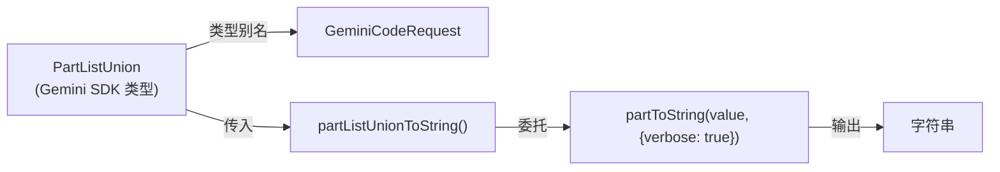
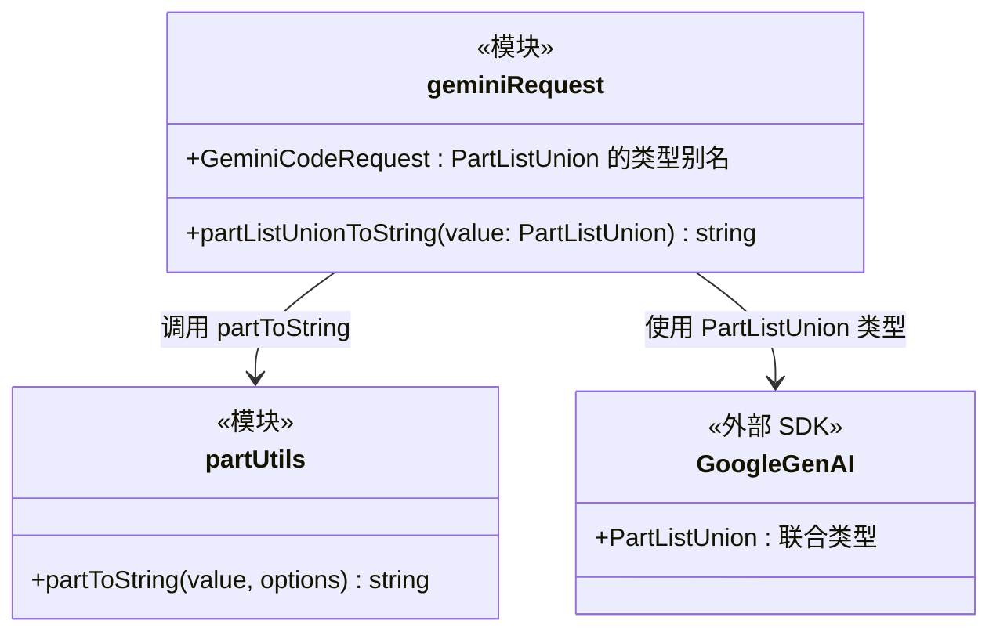

# geminiRequest.ts

## 概述

`geminiRequest.ts` 是一个轻量级的**请求类型定义和转换工具模块**。它定义了 `GeminiCodeRequest` 类型别名，并提供了将 `PartListUnion`（Gemini API 的多模态内容联合类型）转换为字符串的辅助函数。

该文件目前非常简洁，代码注释中明确表示 `GeminiCodeRequest` 类型将来可能会扩展以包含更多请求参数。当前它作为 `PartListUnion` 的语义别名存在，为将来的扩展预留了空间。

## 架构图（Mermaid）





## 核心组件

### 1. `GeminiCodeRequest` 类型（第 15 行）

```typescript
export type GeminiCodeRequest = PartListUnion;
```

`PartListUnion` 的**语义别名**。`PartListUnion` 是 `@google/genai` SDK 中定义的类型，表示可以发送给 Gemini API 的多种内容格式的联合类型，包括：
- 纯字符串
- `Part` 对象
- `Part[]` 数组
- 其他支持的内容格式

使用类型别名而非直接使用 `PartListUnion` 的好处：
- **语义清晰**：`GeminiCodeRequest` 明确表示这是 Gemini Code（CLI 工具）的请求类型
- **解耦**：如果将来需要扩展请求类型（例如添加元数据、配置等），只需修改此处的类型定义
- **可追踪性**：便于在代码库中搜索和追踪所有与 Gemini 请求相关的使用点

### 2. `partListUnionToString(value)` 函数（第 17-19 行）

```typescript
export function partListUnionToString(value: PartListUnion): string {
  return partToString(value, { verbose: true });
}
```

将 `PartListUnion` 转换为人类可读的字符串表示。

- **参数**：`value: PartListUnion` —— 任意的 Part 联合类型值
- **返回值**：`string` —— 转换后的字符串
- **实现**：委托给 `partToString` 工具函数，并传入 `{ verbose: true }` 选项以获取详细（verbose）输出

该函数在项目中被 `geminiChat.ts` 的 `sendMessageStream` 方法使用，用于将用户消息的 parts 转为字符串以进行比较和记录。

## 依赖关系

### 内部依赖

| 模块 | 导入内容 | 用途 |
|---|---|---|
| `../utils/partUtils.js` | `partToString` | 底层的 Part 到字符串转换逻辑 |

### 外部依赖

| 模块 | 导入内容 | 用途 |
|---|---|---|
| `@google/genai` | `PartListUnion` 类型 | Google GenAI SDK 中定义的多模态内容联合类型 |

## 关键实现细节

### 1. 薄封装模式

该模块是典型的"薄封装"（Thin Wrapper）模式：
- `GeminiCodeRequest` 仅是类型别名，零运行时开销
- `partListUnionToString` 仅是一层转发，固定了 `verbose: true` 选项

这种设计提供了稳定的公共 API 表面，同时将实际实现细节委托给更底层的工具模块。

### 2. verbose 模式的固定

`partListUnionToString` 始终使用 `verbose: true` 调用 `partToString`，这意味着该函数的所有调用者都会获得详细的字符串输出。这适用于日志记录和调试场景，确保信息完整性。

### 3. 未来扩展空间

代码注释中明确标注了扩展意图：

> This can be expanded later to include other request parameters.

未来 `GeminiCodeRequest` 可能从简单的类型别名演变为包含更多字段的接口或类型，例如：
- 请求元数据（请求 ID、时间戳等）
- 配置覆盖
- 上下文信息

### 4. 被依赖方

该模块的 `partListUnionToString` 函数被 `geminiChat.ts` 导入使用，用于：
- 将用户消息 parts 转为字符串进行记录
- 比较 displayContent 和实际内容是否不同
