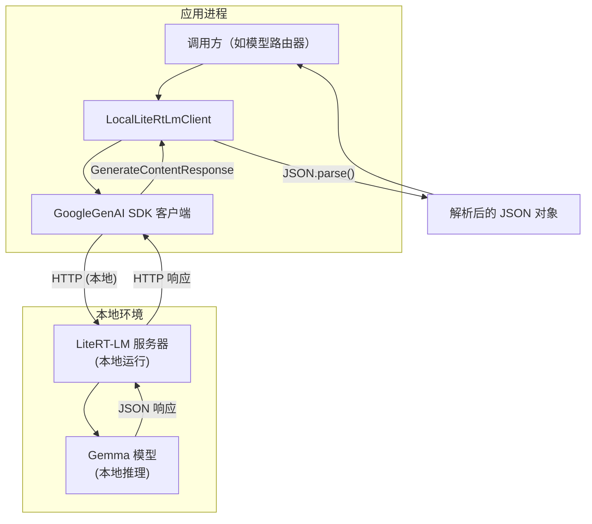
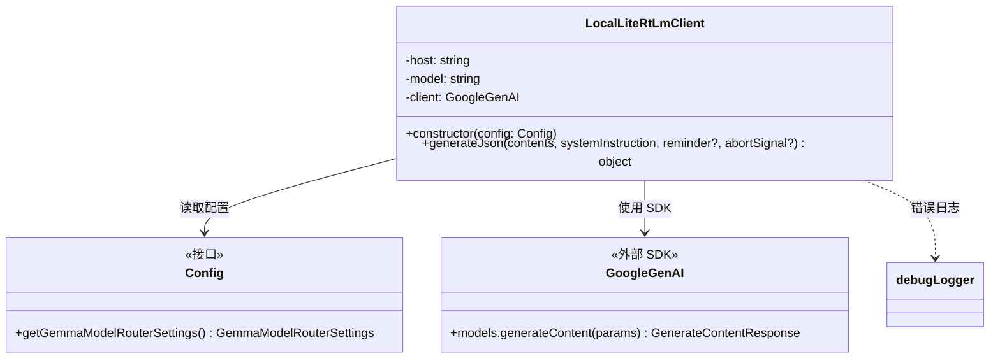
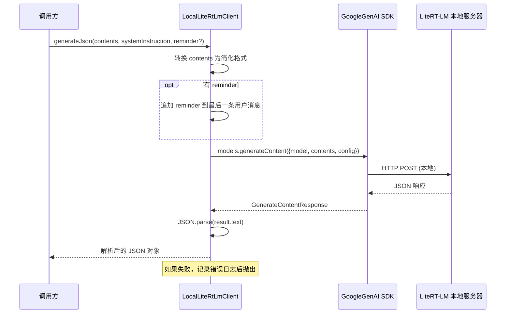

# localLiteRtLmClient.ts

## 概述

`LocalLiteRtLmClient` 是一个用于与**本地 Gemini 兼容 API 服务器**通信的客户端。它专门为 **LiteRT-LM**（轻量级运行时语言模型）服务器设计，通过本地端点向 Gemma 模型发送非流式请求，并期望获得 JSON 格式的响应。

该客户端的典型使用场景是**本地模型路由/分类**：通过在用户设备上运行的小型 Gemma 模型对用户请求进行分类或路由，从而在不依赖远程 API 的情况下做出快速的本地推理决策。

核心特性：
- **本地推理**：连接本地运行的 LiteRT-LM 服务器，无需远程 API 调用
- **JSON 输出**：配置 `responseMimeType: 'application/json'` 强制模型输出结构化 JSON
- **低延迟**：10 秒超时、温度为 0、最大输出 256 tokens，优化为快速确定性响应
- **无认证**：本地服务器不需要 API 密钥，使用占位符值

## 架构图（Mermaid）







## 核心组件

### 1. `LocalLiteRtLmClient` 类（第 15-95 行）

#### 属性

| 属性 | 类型 | 可见性 | 说明 |
|---|---|---|---|
| `host` | `string` | 私有只读 | LiteRT-LM 服务器的基础 URL（如 `http://localhost:8080`） |
| `model` | `string` | 私有只读 | 要使用的 Gemma 模型标识符 |
| `client` | `GoogleGenAI` | 私有只读 | Google GenAI SDK 客户端实例 |

#### 构造函数（第 20-37 行）

从 `Config` 对象中读取 Gemma 模型路由器配置：

```typescript
constructor(config: Config) {
    const gemmaModelRouterSettings = config.getGemmaModelRouterSettings();
    this.host = gemmaModelRouterSettings.classifier!.host!;
    this.model = gemmaModelRouterSettings.classifier!.model!;
    // ...
}
```

**注意**：使用了非空断言 `!`，假设配置中 `classifier.host` 和 `classifier.model` 一定存在。调用方需确保在创建该客户端前配置已正确设置。

SDK 初始化关键配置：
- **`apiKey: 'no-api-key-needed'`**：SDK 要求必须设置 API key，但本地服务器不需要认证，因此使用占位符
- **`baseUrl: this.host`**：将 SDK 的请求目标指向本地服务器
- **`timeout: 10000`**：10 秒超时，防止因错误端口导致的长时间 TCP 超时

#### `generateJson()` 方法（第 45-94 行）

核心方法，向本地模型发送请求并返回解析后的 JSON 对象。

**参数**：

| 参数 | 类型 | 必需 | 说明 |
|---|---|---|---|
| `contents` | `Content[]` | 是 | 对话历史和当前提示 |
| `systemInstruction` | `string` | 是 | 系统提示词 |
| `reminder` | `string` | 否 | 追加到最后一条用户消息的提醒文本 |
| `abortSignal` | `AbortSignal` | 否 | 中止信号 |

**返回值**：`Promise<object>` —— 解析后的 JSON 对象

**处理流程**：

1. **内容简化**（第 51-54 行）：
   将 `Content[]` 转换为简化格式，只保留 `role` 和文本 `parts`。这是因为本地 Gemma 模型可能不支持多模态输入（图片、文件等），只保留纯文本。

2. **追加 reminder**（第 56-61 行）：
   如果提供了 `reminder`，将其追加到最后一条用户消息的文本末尾（以 `\n\n` 分隔）。这用于在不改变对话结构的情况下添加额外的上下文或指令。

3. **API 调用**（第 63-76 行）：
   使用 GoogleGenAI SDK 发起 `generateContent` 调用，关键配置：
   - `responseMimeType: 'application/json'`：强制模型输出 JSON
   - `temperature: 0`：确定性输出，不引入随机性
   - `maxOutputTokens: 256`：限制输出长度，适合分类/路由场景
   - `systemInstruction`：条件性传入系统指令
   - `abortSignal`：支持外部中止

4. **响应解析**（第 78-86 行）：
   - 检查响应文本是否存在
   - 使用 `JSON.parse` 解析响应文本为 JSON 对象

5. **错误处理**（第 87-93 行）：
   捕获所有错误，通过 `debugLogger` 记录后重新抛出。

## 依赖关系

### 内部依赖

| 模块 | 导入内容 | 用途 |
|---|---|---|
| `../config/config.js` | `Config` 类型 | 应用配置接口，用于获取 Gemma 模型路由器设置 |
| `../utils/debugLogger.js` | `debugLogger` | 调试日志工具，用于记录错误信息 |

### 外部依赖

| 模块 | 导入内容 | 用途 |
|---|---|---|
| `@google/genai` | `GoogleGenAI` 类, `Content` 类型 | Google GenAI SDK，用于与 Gemini 兼容 API 通信 |

## 关键实现细节

### 1. 本地 SDK 复用

该客户端巧妙地复用了 `@google/genai` SDK 来与本地服务器通信，而不是自己实现 HTTP 请求。这是因为 LiteRT-LM 服务器提供了与 Gemini API 兼容的接口，SDK 的 `httpOptions.baseUrl` 配置可以将请求重定向到任意端点。

### 2. 占位符 API Key

`apiKey: 'no-api-key-needed'` 是一个有趣的 workaround。GoogleGenAI SDK 在初始化时要求提供 API key（这是为云端使用设计的），但本地 LiteRT-LM 服务器不需要认证。使用占位符字符串满足了 SDK 的要求而不影响功能。

### 3. 超时策略

10 秒超时的设计考虑了三种本地服务器场景：
- **服务器已启动但端口错误**：TCP 连接会挂起直到超时 → 10 秒后超时
- **服务器未启动**：连接立即被拒绝 → 不需要等待超时
- **模型不支持或上下文窗口溢出**：服务器立即返回错误 → 不需要等待超时

### 4. 内容简化处理

将 `Content` 简化为只包含 `role` 和文本 `parts` 的结构：
```typescript
const geminiContents = contents.map((c) => ({
    role: c.role,
    parts: c.parts ? c.parts.map((p) => ({ text: p.text })) : [],
}));
```
这种简化丢弃了以下信息：
- `functionCall` / `functionResponse` parts
- `inlineData`（图片等二进制数据）
- `fileData`（文件引用）
- `thought` / `thoughtSignature`
- 其他非文本属性

这是合理的，因为本地 Gemma 模型通常是小型纯文本模型，不支持这些高级特性。

### 5. 确定性输出配置

`temperature: 0` 和 `maxOutputTokens: 256` 的组合表明该客户端用于需要**快速、确定性、简短**响应的场景，如：
- 请求分类（路由到不同的处理管道）
- 意图识别
- 简单的结构化数据提取

### 6. reminder 追加机制

`reminder` 参数提供了一种不改变对话历史结构、仅在最后一条消息末尾追加文本的方式。这适用于需要在运行时动态添加指令（如"请以 JSON 格式回复"之类的提醒）的场景。仅当最后一条消息是 `user` 角色且有文本内容时才生效。
