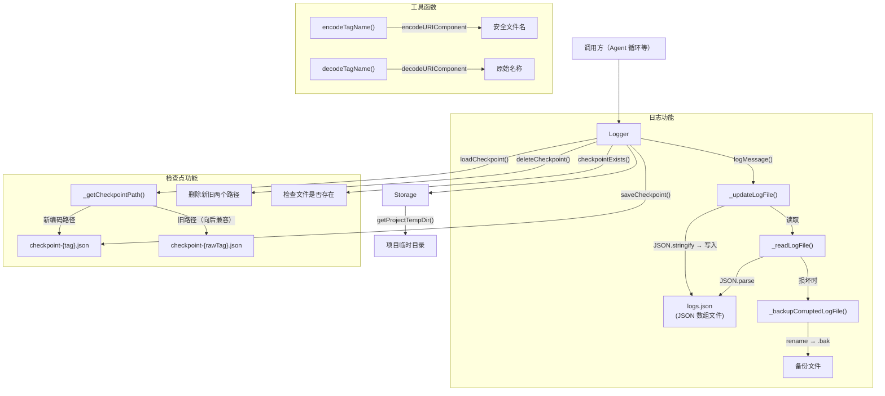
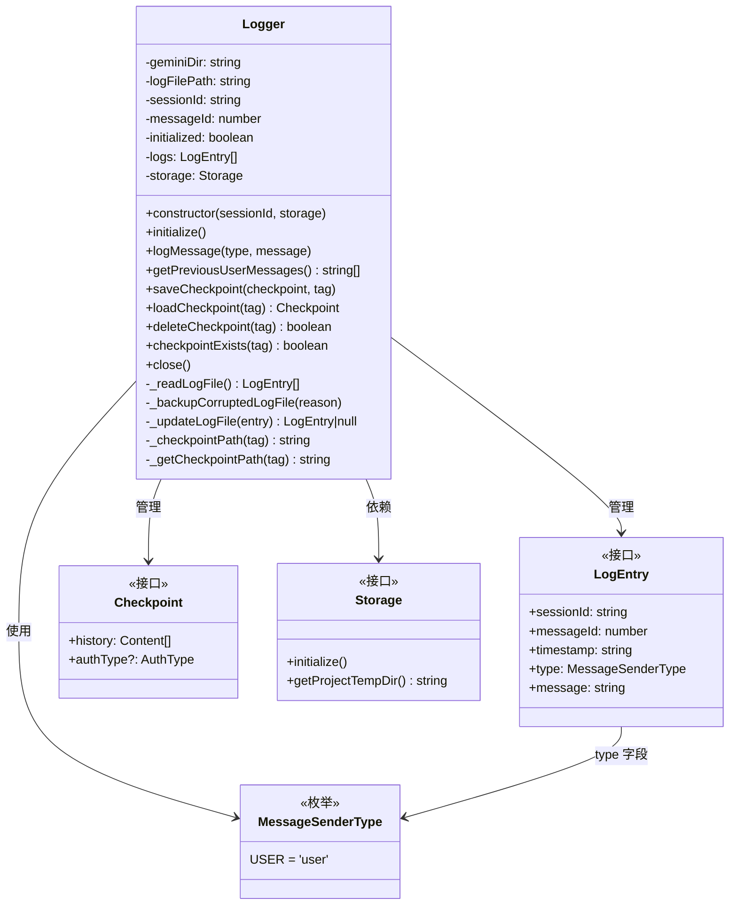
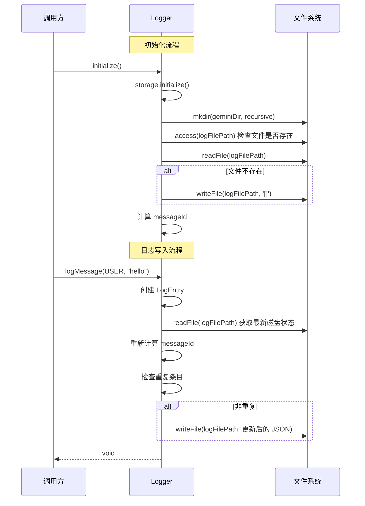

# logger.ts

## 概述

`Logger` 是 Gemini CLI 的**日志与检查点持久化管理器**。它负责两大核心功能：

1. **消息日志记录**：将用户消息记录到基于文件的 JSON 日志中，支持多会话共存、去重、损坏恢复
2. **对话检查点管理**：保存、加载、删除和检查对话历史的检查点（Checkpoint），用于会话恢复

该模块的设计考虑了以下实际场景：
- 多实例并发写入同一日志文件（通过读后写策略和去重检查）
- 日志文件损坏恢复（自动备份损坏文件并重新开始）
- 文件名安全编码（处理特殊字符的 tag 名称）
- 向后兼容旧格式的检查点文件

## 架构图（Mermaid）







## 核心组件

### 1. `MessageSenderType` 枚举（第 17-19 行）

```typescript
export enum MessageSenderType {
  USER = 'user',
}
```

目前仅定义了 `USER` 类型。设计为枚举表明未来可能会添加其他发送者类型（如 `MODEL`、`SYSTEM` 等）。

### 2. `LogEntry` 接口（第 21-27 行）

| 字段 | 类型 | 说明 |
|---|---|---|
| `sessionId` | `string` | 会话标识符，区分不同的对话会话 |
| `messageId` | `number` | 会话内的消息序号，从 0 开始递增 |
| `timestamp` | `string` | ISO 8601 格式的时间戳 |
| `type` | `MessageSenderType` | 发送者类型 |
| `message` | `string` | 消息内容 |

### 3. `Checkpoint` 接口（第 29-32 行）

| 字段 | 类型 | 说明 |
|---|---|---|
| `history` | `readonly Content[]` | 对话历史（只读数组） |
| `authType` | `AuthType` (可选) | 认证类型 |

### 4. `encodeTagName(str)` 函数（第 46-48 行）

将字符串编码为文件名安全的格式，使用 `encodeURIComponent` 实现。所有非字母数字和非 `_-.*~!'()` 的字符都会被百分号编码。

### 5. `decodeTagName(str)` 函数（第 59-68 行）

`encodeTagName` 的逆操作。先尝试 `decodeURIComponent`，如果失败（例如旧格式的编码），则回退到手动的百分号解码正则替换。

### 6. `Logger` 类（第 70-481 行）

#### 属性

| 属性 | 类型 | 可见性 | 说明 |
|---|---|---|---|
| `geminiDir` | `string \| undefined` | 私有 | 项目临时目录路径 |
| `logFilePath` | `string \| undefined` | 私有 | 日志文件完整路径 |
| `sessionId` | `string \| undefined` | 私有 | 当前会话 ID |
| `messageId` | `number` | 私有 | 下一个消息 ID 的本地计数器 |
| `initialized` | `boolean` | 私有 | 是否已初始化 |
| `logs` | `LogEntry[]` | 私有 | 内存中的日志缓存 |
| `storage` | `Storage` | 私有只读 | 存储抽象层 |

#### `initialize()` 方法（第 142-175 行）

初始化 Logger，执行以下步骤：
1. 防止重复初始化（`if (this.initialized) return`）
2. 初始化 Storage
3. 获取项目临时目录并构建日志文件路径
4. 递归创建目录
5. 检查日志文件是否存在
6. 读取现有日志
7. 如果文件不存在且无日志，创建空 JSON 数组文件
8. 从现有日志中计算当前会话的下一个 messageId
9. 设置 `initialized = true`

#### `_readLogFile()` 私有方法（第 85-129 行）

从磁盘读取日志文件，包含健壮的错误处理：

| 场景 | 处理方式 |
|---|---|
| 文件正常 | 解析 JSON 并过滤验证每个条目的字段类型 |
| JSON 不是数组 | 备份文件，返回空数组 |
| 文件不存在（ENOENT） | 返回空数组 |
| JSON 语法错误 | 备份文件，返回空数组 |
| 其他错误 | 抛出异常 |

条目验证逻辑确保每个 LogEntry 的五个字段都是正确的类型，过滤掉可能被损坏的条目。

#### `_backupCorruptedLogFile(reason)` 私有方法（第 131-140 行）

将损坏的日志文件重命名为 `{原名}.{reason}.{时间戳}.bak` 格式的备份文件。如果重命名失败则静默忽略。

#### `_updateLogFile(entryToAppend)` 私有方法（第 177-241 行）

**核心的日志持久化方法**，实现了"读-改-写"（Read-Modify-Write）模式：

1. **读取磁盘最新状态**：确保获取到其他实例可能写入的内容
2. **重新计算 messageId**：基于磁盘上该会话的最大 messageId + 1
3. **去重检查**：比较 sessionId + messageId + timestamp + message，避免重复写入
4. **追加并写入**：将新条目追加到数组末尾，格式化写入文件
5. **同步内存缓存**：更新 `this.logs`

返回值：成功追加的 LogEntry 或 `null`（重复时）。

#### `logMessage(type, message)` 方法（第 255-283 行）

公开的日志记录方法：
1. 检查初始化状态
2. 创建 LogEntry 对象（messageId 会在 `_updateLogFile` 中重新计算）
3. 调用 `_updateLogFile` 持久化
4. 成功写入后更新实例的 messageId 计数器

#### `getPreviousUserMessages()` 方法（第 243-253 行）

获取所有用户消息，按时间戳降序排列（最新的在前）。从内存缓存 `this.logs` 中读取。

#### `_checkpointPath(tag)` 私有方法（第 285-295 行）

根据 tag 生成编码后的检查点文件路径：`{geminiDir}/checkpoint-{encodedTag}.json`。

#### `_getCheckpointPath(tag)` 私有方法（第 297-327 行）

查找检查点文件路径，支持向后兼容：
1. 先检查新编码路径（`checkpoint-{encodedTag}.json`）
2. 如果不存在，检查旧原始路径（`checkpoint-{tag}.json`）
3. 如果都不存在，返回新编码路径作为规范路径

#### `saveCheckpoint(checkpoint, tag)` 方法（第 329-343 行）

保存检查点到文件，始终使用新编码路径。使用 `JSON.stringify` 格式化输出（2 空格缩进）。

#### `loadCheckpoint(tag)` 方法（第 345-391 行）

加载检查点，支持两种格式：
- **新格式**：`{ history: Content[], authType?: AuthType }` 对象
- **旧格式（Legacy）**：直接是 `Content[]` 数组
- **未知格式**：返回空检查点 `{ history: [] }`
- **文件不存在**：返回空检查点

#### `deleteCheckpoint(tag)` 方法（第 393-442 行）

删除检查点文件，同时尝试删除新编码路径和旧原始路径（如果两者不同）。返回是否成功删除了至少一个文件。ENOENT 错误被静默处理。

#### `checkpointExists(tag)` 方法（第 444-472 行）

检查检查点是否存在。通过 `_getCheckpointPath` 获取路径后再用 `fs.access` 确认文件存在性（因为 `_getCheckpointPath` 在文件不存在时也会返回规范路径）。

#### `close()` 方法（第 474-480 行）

关闭 Logger，重置所有状态：
- `initialized = false`
- `logFilePath = undefined`
- `logs = []`
- `sessionId = undefined`
- `messageId = 0`

## 依赖关系

### 内部依赖

| 模块 | 导入内容 | 用途 |
|---|---|---|
| `./contentGenerator.js` | `AuthType` 类型 | 认证类型，用于 Checkpoint 接口 |
| `../config/storage.js` | `Storage` 类型 | 存储抽象层，提供项目临时目录 |
| `../utils/debugLogger.js` | `debugLogger` | 调试日志工具，记录内部错误和调试信息 |
| `../utils/events.js` | `coreEvents` | 核心事件发射器，用于发出初始化错误反馈 |

### 外部依赖

| 模块 | 导入内容 | 用途 |
|---|---|---|
| `node:path` | `path`（默认导入） | 路径拼接和处理 |
| `node:fs` | `promises as fs` | 文件系统异步操作（readFile、writeFile、mkdir、access、rename、unlink） |
| `@google/genai` | `Content` 类型 | 对话内容类型，用于 Checkpoint 的 history |

## 关键实现细节

### 1. 并发写入安全策略

Logger 采用"读-改-写"（Read-Modify-Write）模式来应对多实例并发写入：
- 每次写入前先**读取磁盘最新状态**
- 基于磁盘状态**重新计算 messageId**，而非依赖内存计数器
- 执行**去重检查**，防止相同条目被重复写入

这种方式不是严格的原子操作（没有文件锁），但在实际使用中（CLI 工具，低并发）足够可靠。

### 2. 日志文件损坏恢复

`_readLogFile` 实现了多层防御：
- JSON 解析错误 → 备份文件并从空数组开始
- JSON 不是数组 → 备份文件并从空数组开始
- 条目字段类型不匹配 → 过滤掉无效条目（不丢弃整个文件）

备份文件命名包含原因和时间戳，便于后续调查：`logs.json.invalid_json.1711500000000.bak`

### 3. 检查点路径的向后兼容

检查点文件名从旧的原始 tag 格式迁移到新的 URL 编码格式：
- **新格式**：`checkpoint-{encodeURIComponent(tag)}.json`
- **旧格式**：`checkpoint-{tag}.json`

所有**读取操作**（load、exists、getPath）都先检查新格式再检查旧格式。
所有**写入操作**（save）只使用新格式。
**删除操作**同时删除新旧两个路径。

这确保了：
- 旧版本创建的检查点仍然可以被读取
- 新创建的检查点使用安全的编码文件名
- 随着时间推移，旧格式文件会被逐渐清理

### 4. 检查点格式的向后兼容

`loadCheckpoint` 支持两种文件格式：
- **旧格式**：直接是 `Content[]` 数组（早期版本）
- **新格式**：`Checkpoint` 对象，包含 `history` 和可选的 `authType`

通过 `Array.isArray()` 检测旧格式并自动转换。

### 5. 内存缓存与磁盘同步

`this.logs` 作为内存缓存，在以下时机与磁盘同步：
- `initialize()` 时从磁盘读取
- `_updateLogFile()` 成功写入后更新
- `_updateLogFile()` 检测到重复时同步磁盘状态到内存

`getPreviousUserMessages()` 直接从内存缓存读取，避免了不必要的磁盘 IO。

### 6. 日志文件格式

日志文件为 `logs.json`，位于项目临时目录下，格式为带 2 空格缩进的 JSON 数组。文件名固定为常量 `LOG_FILE_NAME = 'logs.json'`。

所有会话的日志存储在**同一个文件**中，通过 `sessionId` 字段区分。这简化了文件管理但可能在长期使用中导致文件增大。

### 7. decodeTagName 的防御性回退

`decodeTagName` 在 `decodeURIComponent` 失败时回退到手动正则替换，这是为了处理可能存在的旧版本非标准编码的 tag 名称。
