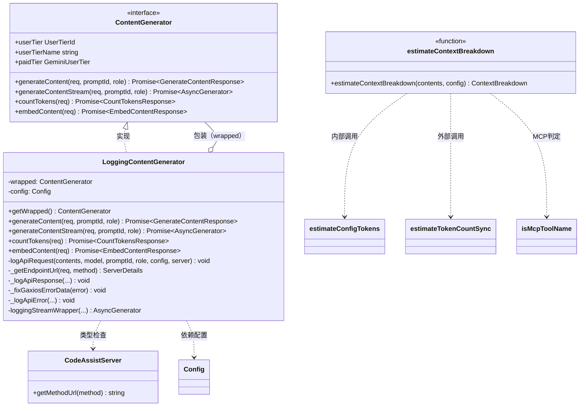
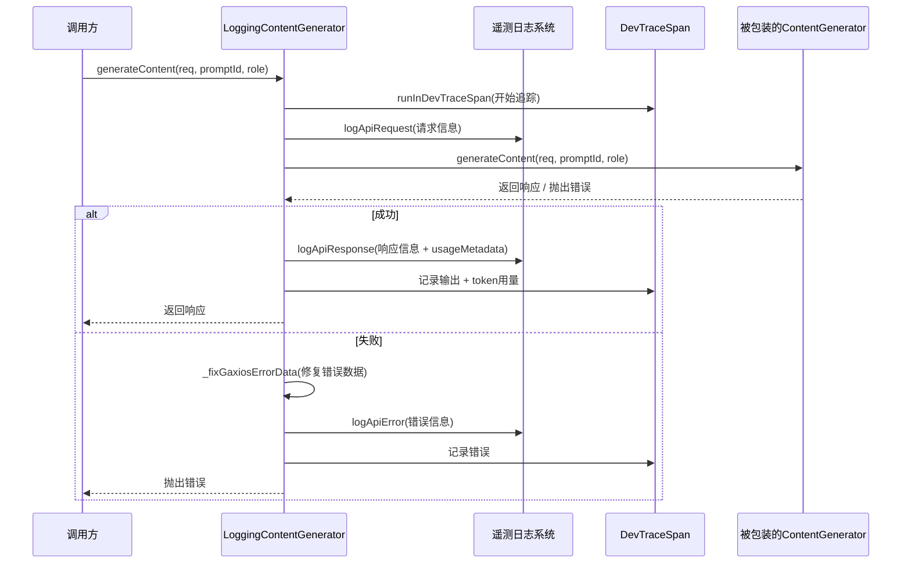
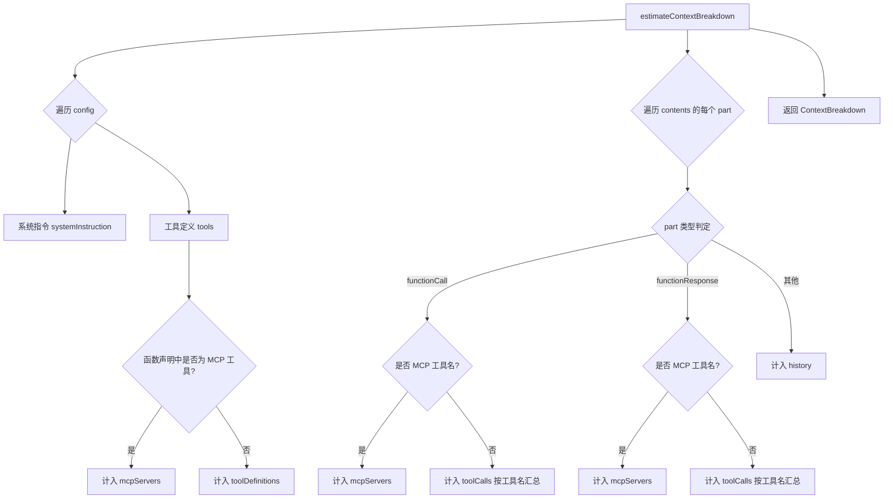
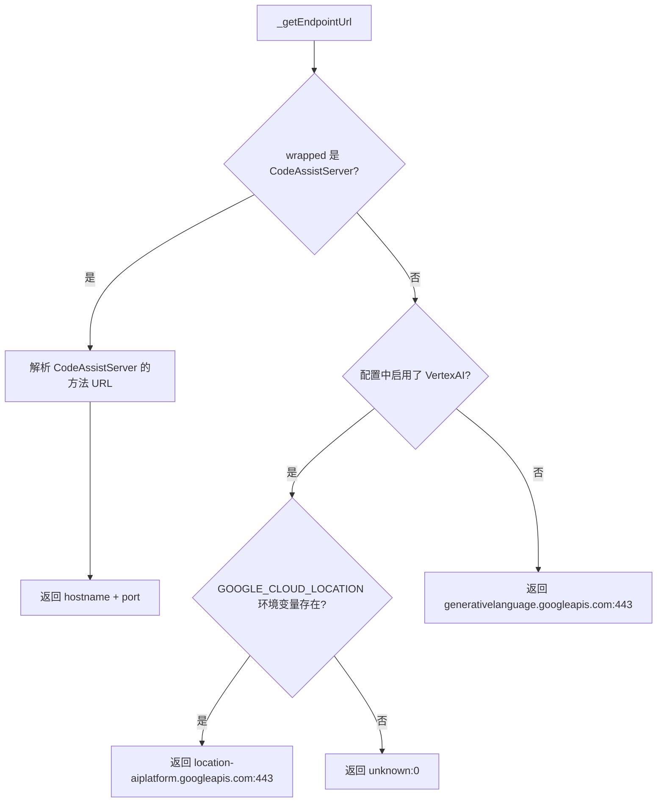

# loggingContentGenerator.ts

## 概述

`loggingContentGenerator.ts` 是 Gemini CLI 核心模块中的一个**装饰器（Decorator）模式**实现文件。它通过 `LoggingContentGenerator` 类包装了底层的 `ContentGenerator` 接口，在不改变原有内容生成逻辑的前提下，为所有 API 请求（`generateContent`、`generateContentStream`、`countTokens`、`embedContent`）添加了完整的**遥测日志记录**和**开发追踪（trace span）**能力。

此外，文件还导出了一个独立的工具函数 `estimateContextBreakdown`，用于估算请求上下文中各组成部分（系统指令、工具定义、对话历史、工具调用、MCP 服务器）的 token 分布，为遥测报告提供上下文开销的可观测性。

## 架构图（Mermaid）







## 核心组件

### 1. `estimateConfigTokens(value: unknown): number`（私有函数）

- **作用**：对非 `Part` 类型的配置对象（如工具定义、系统指令等）进行粗略的 token 数量估算。
- **算法**：将对象 JSON 序列化后，取字符串长度除以 4（`Math.floor(JSON.stringify(value).length / 4)`）。这是一个启发式估算，假设平均每 4 个字符约等于 1 个 token。

### 2. `estimateContextBreakdown(contents, config): ContextBreakdown`（导出函数）

- **作用**：对一次 API 请求的完整上下文进行分类 token 估算，用于遥测报告。
- **返回值各字段含义**：
  - `system_instructions`：系统指令占用的 token 数
  - `tool_definitions`：非 MCP 工具定义占用的 token 数
  - `history`：对话历史（不含工具调用/响应部分）的 token 数
  - `tool_calls`：按工具名聚合的非 MCP 工具调用+响应 token 数（`Record<string, number>`）
  - `mcp_servers`：所有 MCP 相关内容（工具定义 + 调用 + 响应）的 token 数
- **设计要点**：所有字段互不重叠（additive），总和近似等于完整上下文大小。MCP 工具调用不出现在 `tool_calls` 中，避免在遥测中泄露 MCP 服务器名称。

### 3. `LoggingContentGenerator` 类

这是文件的核心类，实现了 `ContentGenerator` 接口，采用**装饰器模式**。

#### 构造函数
```typescript
constructor(
  private readonly wrapped: ContentGenerator,  // 被包装的底层生成器
  private readonly config: Config,             // 全局配置
)
```

#### 公开属性（代理透传）
- `userTier` / `userTierName` / `paidTier`：直接代理到 `wrapped` 的对应属性。

#### 公开方法

| 方法 | 说明 |
|------|------|
| `getWrapped()` | 返回被包装的底层 `ContentGenerator` 实例 |
| `generateContent(req, promptId, role)` | 包装非流式内容生成，添加请求/响应/错误日志 |
| `generateContentStream(req, promptId, role)` | 包装流式内容生成，添加请求/响应/错误日志 |
| `countTokens(req)` | 直接代理，不添加日志 |
| `embedContent(req)` | 包装嵌入内容生成，添加追踪 span |

#### 私有方法

| 方法 | 说明 |
|------|------|
| `logApiRequest(...)` | 构造 `ApiRequestEvent` 并通过 `logApiRequest` 发送到遥测系统 |
| `_getEndpointUrl(req, method)` | 根据认证方式确定 API 端点 URL，支持三种场景：CodeAssist、VertexAI、公共 Gemini API |
| `_logApiResponse(...)` | 构造 `ApiResponseEvent`，仅在非工具调用循环时计算上下文分解，发送到遥测系统 |
| `_fixGaxiosErrorData(error)` | 修复 Gaxios 库更新后错误响应中 `data` 字段可能出现的原始 ASCII 缓冲区字符串问题 |
| `_logApiError(...)` | 构造 `ApiErrorEvent` 并发送到遥测系统，跳过 abort 类型错误 |
| `loggingStreamWrapper(...)` | 异步生成器，包装流式响应，逐 chunk yield 并在结束时记录完整日志 |

### 4. `_getEndpointUrl` 端点路由逻辑



### 5. `loggingStreamWrapper` 流式日志包装器

- 是一个 `async *` 异步生成器函数
- 消费底层流的每个 chunk 时：收集到 `responses` 数组，提取最新的 `usageMetadata`，然后 `yield` 转发
- 流结束后：计算总耗时，调用 `_logApiResponse` 记录完整响应日志，刷新用户配额
- 流出错时：调用 `_logApiError` 记录错误日志，重新抛出错误
- span 元数据在流结束后统一写入输出和 token 用量

### 6. `StructuredError` 接口

```typescript
interface StructuredError {
  status: number;
}
```
用于类型断言，从错误对象中提取 HTTP 状态码。

## 依赖关系

### 内部依赖

| 模块路径 | 导入项 | 用途 |
|----------|--------|------|
| `../telemetry/types.js` | `ApiRequestEvent`, `ApiResponseEvent`, `ApiErrorEvent`, `ServerDetails`, `ContextBreakdown` | 遥测事件类型定义 |
| `../telemetry/llmRole.js` | `LlmRole` | LLM 角色类型 |
| `../telemetry/loggers.js` | `logApiRequest`, `logApiResponse`, `logApiError` | 遥测日志发送函数 |
| `../telemetry/trace.js` | `runInDevTraceSpan`, `SpanMetadata` | 开发追踪 span 管理 |
| `../telemetry/constants.js` | `GeminiCliOperation`, `GEN_AI_PROMPT_NAME`, `GEN_AI_REQUEST_MODEL`, `GEN_AI_SYSTEM_INSTRUCTIONS`, `GEN_AI_TOOL_DEFINITIONS`, `GEN_AI_USAGE_INPUT_TOKENS`, `GEN_AI_USAGE_OUTPUT_TOKENS` | 遥测常量 |
| `../config/config.js` | `Config` | 全局配置类型 |
| `../code_assist/types.js` | `UserTierId`, `GeminiUserTier` | 用户层级类型 |
| `../code_assist/server.js` | `CodeAssistServer` | CodeAssist 服务器类（用于端点检测） |
| `../code_assist/converter.js` | `toContents` | 将请求内容转换为标准 `Content[]` 格式 |
| `../utils/quotaErrorDetection.js` | `isStructuredError` | 判断错误是否为结构化错误（含 status） |
| `../utils/debugLogger.js` | `debugLogger` | 调试日志工具 |
| `../utils/errors.js` | `isAbortError`, `getErrorType` | 错误类型判断 |
| `../utils/safeJsonStringify.js` | `safeJsonStringify` | 安全的 JSON 序列化 |
| `../utils/tokenCalculation.js` | `estimateTokenCountSync` | 同步 token 数量估算 |
| `../tools/mcp-tool.js` | `isMcpToolName` | 判断工具名是否为 MCP 工具 |
| `./contentGenerator.js` | `ContentGenerator` | 内容生成器接口 |

### 外部依赖

| 包名 | 导入项 | 用途 |
|------|--------|------|
| `@google/genai` | `Candidate`, `Content`, `CountTokensParameters`, `CountTokensResponse`, `EmbedContentParameters`, `EmbedContentResponse`, `GenerateContentConfig`, `GenerateContentParameters`, `GenerateContentResponseUsageMetadata`, `GenerateContentResponse` | Google Generative AI SDK 的类型定义 |

## 关键实现细节

1. **装饰器模式的透明性**：`LoggingContentGenerator` 完全透明地包装了底层 `ContentGenerator`，调用方无需感知日志逻辑的存在。`getWrapped()` 方法允许在需要时获取原始实例。

2. **流式响应的日志时机**：流式请求通过 `loggingStreamWrapper` 异步生成器实现"边转发边收集"的模式。日志只在流完全结束后才记录一次完整响应，而不是每个 chunk 都记录，避免日志泛滥。

3. **上下文分解的条件计算**：`_logApiResponse` 中仅在响应不包含 `functionCall`（即非工具调用循环的中间步骤）时才计算 `estimateContextBreakdown`。这避免了在多步工具调用循环中每一步都发送冗余的累积上下文快照。

4. **MCP 工具的隔离处理**：`estimateContextBreakdown` 将 MCP 工具相关的 token 统一归入 `mcp_servers` 字段，不会出现在 `tool_calls` 中。这是出于隐私考虑，避免在遥测数据中泄露 MCP 服务器名称。

5. **Gaxios 错误修复**：`_fixGaxiosErrorData` 方法处理了 Gaxios 库更新后可能出现的问题——错误响应的 `data` 字段可能是逗号分隔的 ASCII 码字符串（如 `"72,101,108,108,111"`）而非正常文本。该方法将其转换回可读字符串。

6. **主代理请求捕获**：在 `generateContentStream` 中，通过正则 `/########\d+$/` 识别主代理的 prompt ID（以 8 个 `#` 加轮次计数器结尾），并将对应请求保存到配置中供调试使用。

7. **Abort 错误的静默处理**：`_logApiError` 会跳过 abort 类型的错误（如用户取消、内部超时），不将其记录为 API 错误。

8. **配额刷新的异步触发**：每次成功的 API 响应后，会异步调用 `config.refreshUserQuotaIfStale()` 刷新用户配额信息，失败时仅输出调试日志，不影响主流程。

9. **countTokens 的例外**：`countTokens` 方法直接代理到底层实现，不添加任何日志或追踪，这是因为 token 计数本身是一个轻量级辅助操作。

10. **embedContent 的轻量追踪**：`embedContent` 仅添加了 trace span，但没有像 `generateContent` 那样添加完整的请求/响应遥测日志。
