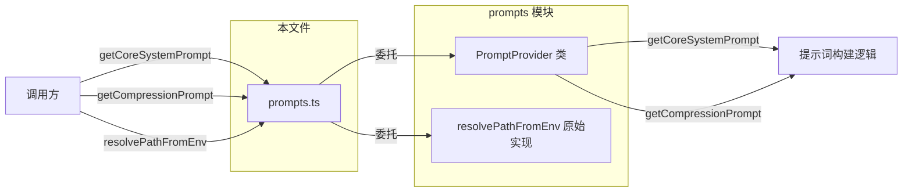
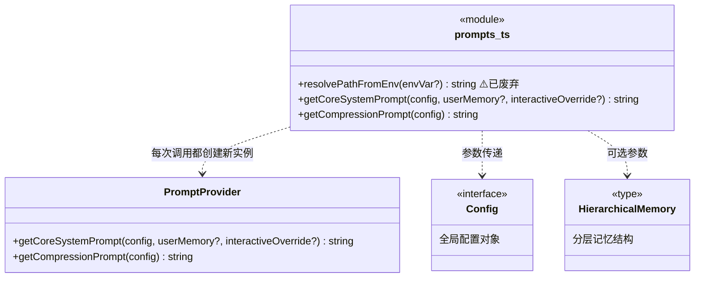

# prompts.ts

## 概述

`prompts.ts` 是 Gemini CLI 核心模块中的一个**门面（Facade）模块**，提供了获取系统提示词（system prompt）的便捷函数入口。该文件本身不包含提示词的构建逻辑，而是将所有调用委托给 `PromptProvider` 类。

该文件导出三个函数：
1. `resolvePathFromEnv` — 从环境变量解析路径或开关值（已废弃，仅作向后兼容）
2. `getCoreSystemPrompt` — 获取代理的核心系统提示词
3. `getCompressionPrompt` — 获取历史对话压缩的系统提示词

这是一个轻量级的适配层，使得外部调用方可以通过简单的函数调用获取提示词，而无需直接实例化 `PromptProvider`。

## 架构图（Mermaid）

## 核心组件

### 1. `resolvePathFromEnv(envVar?: string): string | undefined`

- **状态**：已废弃（`@deprecated`）
- **作用**：从环境变量解析文件路径或开关值。
- **实现**：直接委托给 `../prompts/utils.js` 中的同名函数 `resolvePathFromEnvImpl`。
- **废弃原因**：建议调用方直接使用 `@google/gemini-cli-core/prompts/utils` 中的 `resolvePathFromEnv`。
- **保留原因**：向后兼容，避免破坏已有的外部调用。

### 2. `getCoreSystemPrompt(config, userMemory?, interactiveOverride?): string`

- **作用**：返回代理的核心系统提示词。这是 Gemini CLI 代理的"性格定义"，指导模型如何行为、使用工具、与用户交互。
- **参数**：
  - `config: Config` — 全局配置对象，包含项目设置、工具配置等
  - `userMemory?: string | HierarchicalMemory` — 可选的用户记忆，可以是纯文本字符串或分层记忆结构
  - `interactiveOverride?: boolean` — 可选的交互模式覆盖标志
- **实现**：每次调用都创建一个新的 `PromptProvider` 实例，然后调用其 `getCoreSystemPrompt` 方法。

### 3. `getCompressionPrompt(config): string`

- **作用**：返回历史对话压缩过程的系统提示词。当对话历史过长需要压缩时，使用此提示词指导模型如何总结和压缩对话内容。
- **参数**：
  - `config: Config` — 全局配置对象
- **实现**：同样每次创建新的 `PromptProvider` 实例并委托调用。

## 依赖关系

### 内部依赖

| 模块路径 | 导入项 | 用途 |
|----------|--------|------|
| `../config/config.js` | `Config` | 全局配置类型，作为函数参数 |
| `../config/memory.js` | `HierarchicalMemory` | 分层记忆类型，作为可选参数类型 |
| `../prompts/promptProvider.js` | `PromptProvider` | 提示词提供者类，实际构建提示词的核心逻辑 |
| `../prompts/utils.js` | `resolvePathFromEnv`（as `resolvePathFromEnvImpl`） | 环境变量路径解析工具函数 |

### 外部依赖

无外部第三方依赖。

## 关键实现细节

1. **无状态设计**：所有函数都是纯函数式的导出，不维护任何模块级状态。每次调用 `getCoreSystemPrompt` 或 `getCompressionPrompt` 都会创建一个全新的 `PromptProvider` 实例（`new PromptProvider()`），这意味着不存在缓存或副作用。

2. **门面模式的简洁性**：该文件的代码量极少（约 40 行），其核心价值在于为调用方提供一个稳定的、简单的 API 表面。所有复杂的提示词组装逻辑都封装在 `PromptProvider` 内部。

3. **废弃函数的保留策略**：`resolvePathFromEnv` 虽然被标记为 `@deprecated`，但仍然保留在文件中并正常工作。它通过导入别名（`resolvePathFromEnvImpl`）的方式避免了命名冲突，同时提供了与新路径 `@google/gemini-cli-core/prompts/utils` 的迁移指引。

4. **HierarchicalMemory 的灵活性**：`getCoreSystemPrompt` 的 `userMemory` 参数支持两种类型——简单的 `string` 或结构化的 `HierarchicalMemory`。这种联合类型设计允许调用方根据场景选择合适的记忆格式。

5. **interactiveOverride 参数**：`getCoreSystemPrompt` 中的 `interactiveOverride` 参数允许调用方强制指定交互/非交互模式，覆盖配置中的默认行为。这在自动化测试或非终端环境中特别有用。
