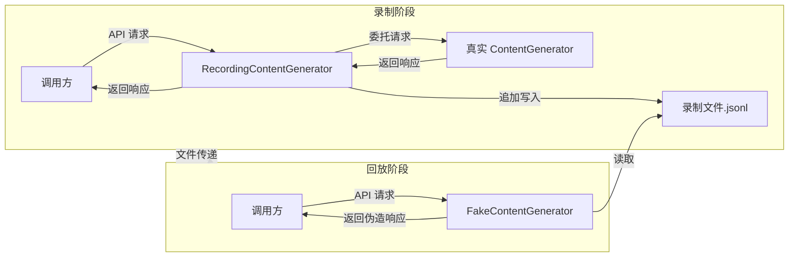
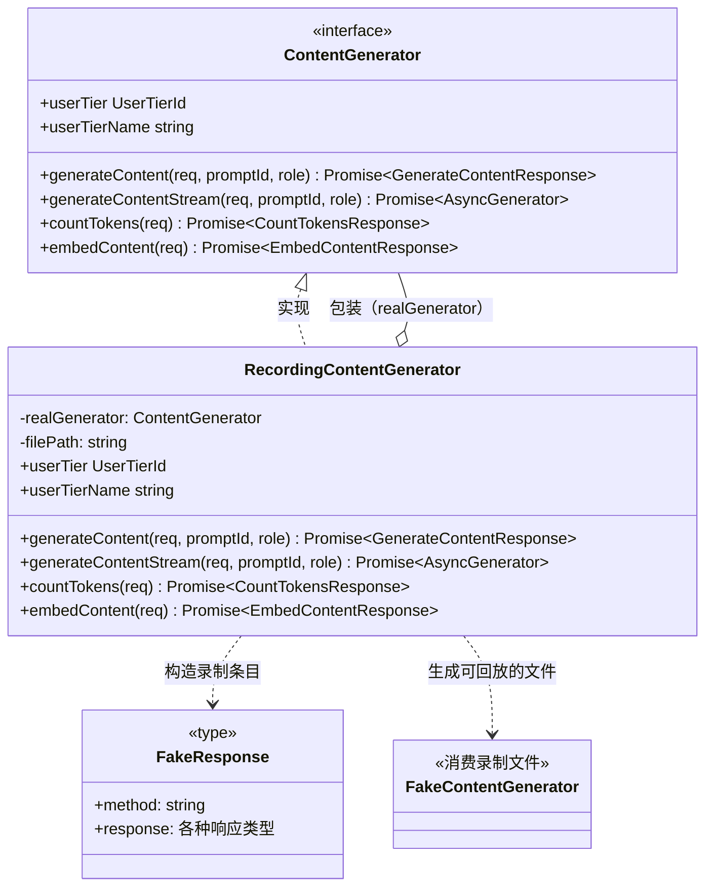
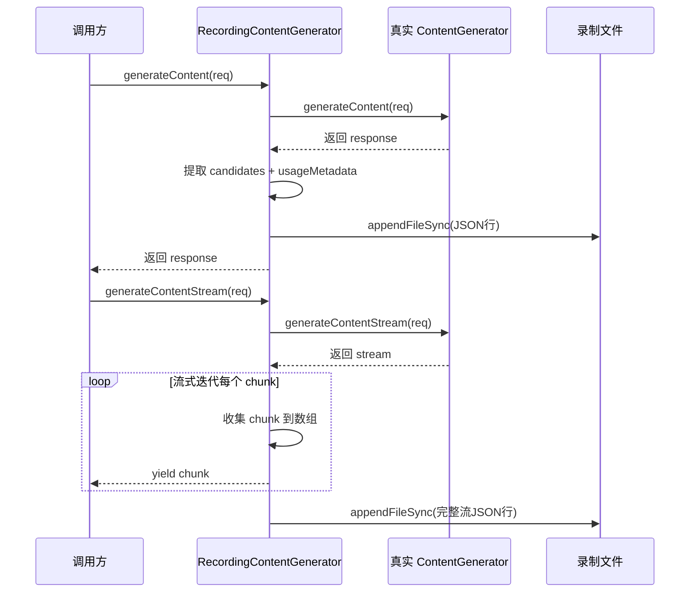

# recordingContentGenerator.ts

## 概述

`recordingContentGenerator.ts` 是 Gemini CLI 核心模块中的一个**装饰器（Decorator）模式**实现文件，用于**录制（Recording）** API 响应。`RecordingContentGenerator` 类包装了一个真实的 `ContentGenerator`，在正常执行的同时，将每次 API 调用的响应以 JSON 行格式（JSON Lines）追加写入到指定文件中。

这些录制的文件可以被 `FakeContentGenerator` 消费（通过 `--fake-responses` CLI 参数），从而在不访问真实 API 的情况下回放响应。这构成了一个"录制-回放"（Record-Replay）测试模式，对于集成测试、调试和离线开发非常有价值。

**设计要点**：录制时只保存响应中的"有趣部分"（如 `candidates`、`usageMetadata`），而非完整的响应对象，以减小文件体积。

## 架构图（Mermaid）







## 核心组件

### 1. `RecordingContentGenerator` 类

#### 构造函数

```typescript
constructor(
  private readonly realGenerator: ContentGenerator,  // 被包装的真实生成器
  private readonly filePath: string,                 // 录制文件的输出路径
)
```

#### 公开属性（代理透传）

- `userTier: UserTierId | undefined` — 代理到 `realGenerator.userTier`
- `userTierName: string | undefined` — 代理到 `realGenerator.userTierName`

#### 方法详解

##### `generateContent(request, userPromptId, role): Promise<GenerateContentResponse>`

- 调用真实生成器获取响应
- 提取 `candidates` 和 `usageMetadata` 构建 `FakeResponse` 对象
- 使用 `appendFileSync` 同步追加写入文件（一行一个 JSON 对象）
- 返回原始响应

##### `generateContentStream(request, userPromptId, role): Promise<AsyncGenerator<GenerateContentResponse>>`

- 调用真实生成器获取流式响应
- 创建一个内部异步生成器 `stream()`：
  - 逐 chunk 迭代真实流
  - 从每个 chunk 提取 `candidates` 和 `usageMetadata`，推入 `recordedResponse.response` 数组
  - `yield` 原始 chunk 给调用方
  - **流结束后**才将完整的录制数据写入文件
- 返回包装后的流生成器

##### `countTokens(request): Promise<CountTokensResponse>`

- 调用真实生成器获取 token 计数
- 提取 `totalTokens` 和 `cachedContentTokenCount`
- 写入录制文件
- 返回原始响应

##### `embedContent(request): Promise<EmbedContentResponse>`

- 调用真实生成器获取嵌入结果
- 提取 `embeddings` 和 `metadata`
- 写入录制文件
- 返回原始响应

### 2. `FakeResponse` 类型（来自外部）

该类是从 `./fakeContentGenerator.js` 导入的类型，用于定义录制条目的结构：
- `method`：API 方法名（`'generateContent'` | `'generateContentStream'` | `'countTokens'` | `'embedContent'`）
- `response`：对应方法的（精简版）响应数据

## 依赖关系

### 内部依赖

| 模块路径 | 导入项 | 用途 |
|----------|--------|------|
| `./contentGenerator.js` | `ContentGenerator` | 内容生成器接口 |
| `./fakeContentGenerator.js` | `FakeResponse` | 录制条目的类型定义 |
| `../code_assist/types.js` | `UserTierId` | 用户层级类型 |
| `../utils/safeJsonStringify.js` | `safeJsonStringify` | 安全的 JSON 序列化（防止循环引用等异常） |
| `../telemetry/types.js` | `LlmRole` | LLM 角色类型 |

### 外部依赖

| 包名 | 导入项 | 用途 |
|------|--------|------|
| `@google/genai` | `CountTokensResponse`, `GenerateContentParameters`, `GenerateContentResponse`, `CountTokensParameters`, `EmbedContentResponse`, `EmbedContentParameters` | Google Generative AI SDK 类型定义 |
| `node:fs` | `appendFileSync` | Node.js 文件系统模块，用于同步追加写入录制文件 |

## 关键实现细节

1. **同步文件写入（`appendFileSync`）**：录制使用同步文件追加操作而非异步操作。这是一个有意的设计选择——保证了写入顺序的确定性，确保录制文件中的 JSON 行与实际 API 调用顺序严格一致。虽然同步 I/O 会阻塞事件循环，但录制模式通常用于开发和测试环境，性能影响可以接受。

2. **JSON Lines 格式**：每次 API 响应作为单独一行 JSON 追加到文件中（通过 `\n` 分隔）。这种格式便于 `FakeContentGenerator` 按行读取和逐条回放，也方便人工检查和编辑。

3. **响应精简策略**：录制时不保存完整的响应对象，只保存"有趣部分"：
   - `generateContent` / `generateContentStream`：仅保存 `candidates` 和 `usageMetadata`
   - `countTokens`：仅保存 `totalTokens` 和 `cachedContentTokenCount`
   - `embedContent`：仅保存 `embeddings` 和 `metadata`
   - 这减小了录制文件的体积，同时保留了回放所需的全部信息。

4. **流式录制的延迟写入**：`generateContentStream` 中的录制数据不是逐 chunk 写入的，而是在整个流消费完毕后一次性写入。这确保了录制文件中每个流式请求对应完整的一行 JSON，而不是碎片化的多行记录。

5. **类型断言的使用**：代码中使用了 `as GenerateContentResponse` 类型断言（带有 `eslint-disable` 注释），这是因为录制的响应对象是精简版的，缺少完整 `GenerateContentResponse` 类型的某些字段，但在回放时这些缺失的字段不影响功能。

6. **录制-回放闭环**：本文件与 `FakeContentGenerator` 构成完整的录制-回放闭环。录制阶段通过 `RecordingContentGenerator` 生成 `.jsonl` 文件，回放阶段通过 `--fake-responses` CLI 参数加载该文件并由 `FakeContentGenerator` 消费，无需真实 API 访问。

7. **paidTier 未代理**：与 `LoggingContentGenerator` 不同，`RecordingContentGenerator` 没有代理 `paidTier` 属性。这可能是因为录制/回放场景中不需要该信息。
