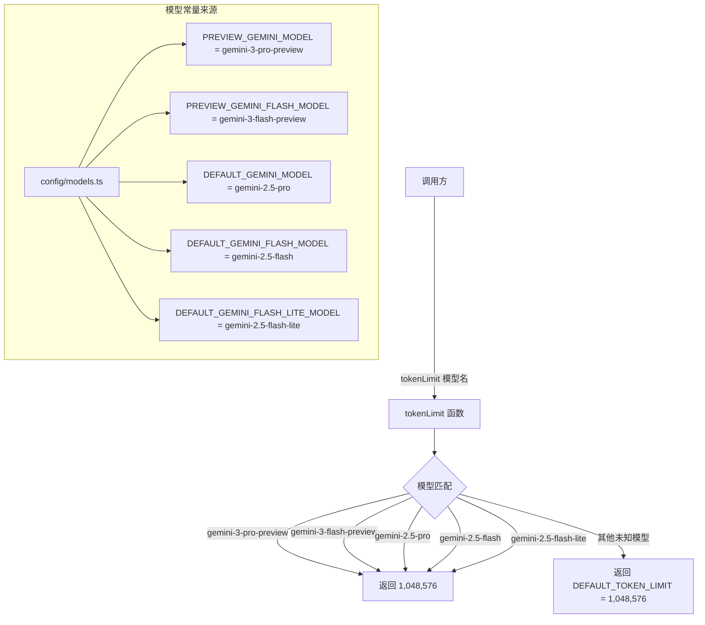
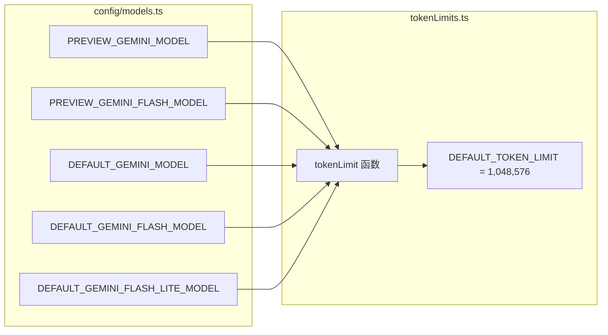

# tokenLimits.ts

## 概述

`tokenLimits.ts` 是 Gemini CLI 核心模块中一个简洁的**模型 token 限制配置**文件。它定义了不同 Gemini 模型的上下文窗口大小（以 token 数量表示），并提供了一个查询函数 `tokenLimit` 用于根据模型名称获取对应的 token 上限。

当前所有已知模型的 token 限制均为 **1,048,576**（即 1M tokens），未知模型也使用相同的默认值。该文件的数据来源为 Google AI 官方文档（https://ai.google.dev/gemini-api/docs/models）。

## 架构图（Mermaid）





## 核心组件

### 1. 类型别名

```typescript
type Model = string;      // 模型名称
type TokenCount = number;  // token 数量
```

简单的类型别名，增强代码可读性，使函数签名更具语义化。

### 2. `DEFAULT_TOKEN_LIMIT` 常量

```typescript
export const DEFAULT_TOKEN_LIMIT = 1_048_576;  // 1M tokens
```

- **值**：1,048,576（2^20），即 1M tokens
- **用途**：作为未知模型的默认 token 上限，同时也是所有已知模型当前使用的值
- **导出**：是，可被其他模块直接使用

### 3. `tokenLimit(model: Model): TokenCount` 函数

```typescript
export function tokenLimit(model: Model): TokenCount {
  switch (model) {
    case PREVIEW_GEMINI_MODEL:          // gemini-3-pro-preview
    case PREVIEW_GEMINI_FLASH_MODEL:    // gemini-3-flash-preview
    case DEFAULT_GEMINI_MODEL:          // gemini-2.5-pro
    case DEFAULT_GEMINI_FLASH_MODEL:    // gemini-2.5-flash
    case DEFAULT_GEMINI_FLASH_LITE_MODEL: // gemini-2.5-flash-lite
      return 1_048_576;
    default:
      return DEFAULT_TOKEN_LIMIT;
  }
}
```

- **作用**：根据模型名称返回该模型的最大上下文 token 数
- **当前支持的模型**：
  | 模型常量 | 实际模型名 | Token 限制 |
  |----------|-----------|-----------|
  | `PREVIEW_GEMINI_MODEL` | `gemini-3-pro-preview` | 1,048,576 |
  | `PREVIEW_GEMINI_FLASH_MODEL` | `gemini-3-flash-preview` | 1,048,576 |
  | `DEFAULT_GEMINI_MODEL` | `gemini-2.5-pro` | 1,048,576 |
  | `DEFAULT_GEMINI_FLASH_MODEL` | `gemini-2.5-flash` | 1,048,576 |
  | `DEFAULT_GEMINI_FLASH_LITE_MODEL` | `gemini-2.5-flash-lite` | 1,048,576 |
- **默认行为**：对于不在列表中的模型（如自定义模型、未来新模型），返回 `DEFAULT_TOKEN_LIMIT`（1,048,576）

## 依赖关系

### 内部依赖

| 模块路径 | 导入项 | 用途 |
|----------|--------|------|
| `../config/models.js` | `DEFAULT_GEMINI_FLASH_LITE_MODEL` | Gemini 2.5 Flash Lite 模型名常量 |
| `../config/models.js` | `DEFAULT_GEMINI_FLASH_MODEL` | Gemini 2.5 Flash 模型名常量 |
| `../config/models.js` | `DEFAULT_GEMINI_MODEL` | Gemini 2.5 Pro 模型名常量 |
| `../config/models.js` | `PREVIEW_GEMINI_FLASH_MODEL` | Gemini 3 Flash Preview 模型名常量 |
| `../config/models.js` | `PREVIEW_GEMINI_MODEL` | Gemini 3 Pro Preview 模型名常量 |

### 外部依赖

无外部第三方依赖。

## 关键实现细节

1. **统一的 1M token 限制**：当前所有已知 Gemini 模型（从 2.5 到 3.0，从 Pro 到 Flash Lite）均共享相同的 1M token 上下文窗口。这反映了 Gemini 系列模型在上下文容量上的统一设计。`switch` 语句的多个 `case` 使用 fall-through 特性共享同一个 `return` 值。

2. **可扩展的 switch 结构**：代码注释明确指出"Add other models as they become relevant or if specified by config"，表明 `switch` 语句是为将来的模型扩展预留的。当 Google 发布具有不同 token 限制的新模型时，只需在 `switch` 中添加新的 `case` 分支。

3. **安全的默认值**：`default` 分支返回 `DEFAULT_TOKEN_LIMIT`（1M），这意味着即使使用了未在列表中注册的自定义模型名称，系统也不会崩溃，而是使用合理的默认上限。

4. **数字下划线分隔符**：使用 `1_048_576` 而非 `1048576`，利用 TypeScript/JavaScript 的数字分隔符特性提升大数字的可读性。

5. **纯函数设计**：`tokenLimit` 是一个无副作用的纯函数，输入确定则输出确定，不依赖任何外部状态。

6. **缺少 auto 模型变体**：值得注意的是，`config/models.ts` 中定义的 `PREVIEW_GEMINI_MODEL_AUTO`（`auto-gemini-3`）和 `DEFAULT_GEMINI_MODEL_AUTO`（`auto-gemini-2.5`）并未包含在 `switch` 中。这可能是因为 auto 模型在使用前会被解析为具体的模型名称，因此不需要单独的 token 限制条目。
