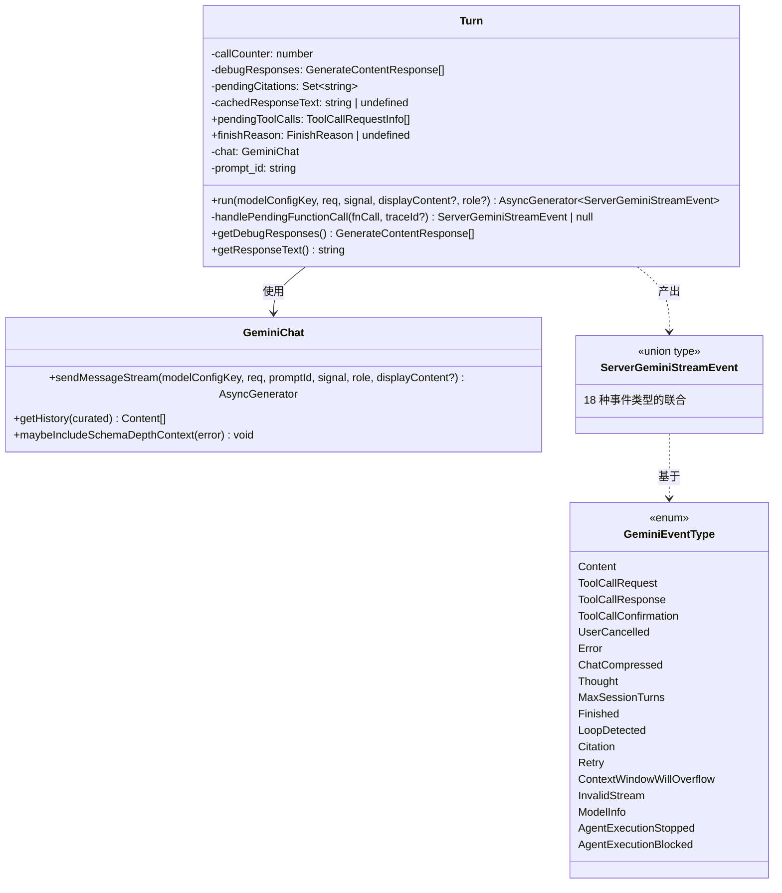
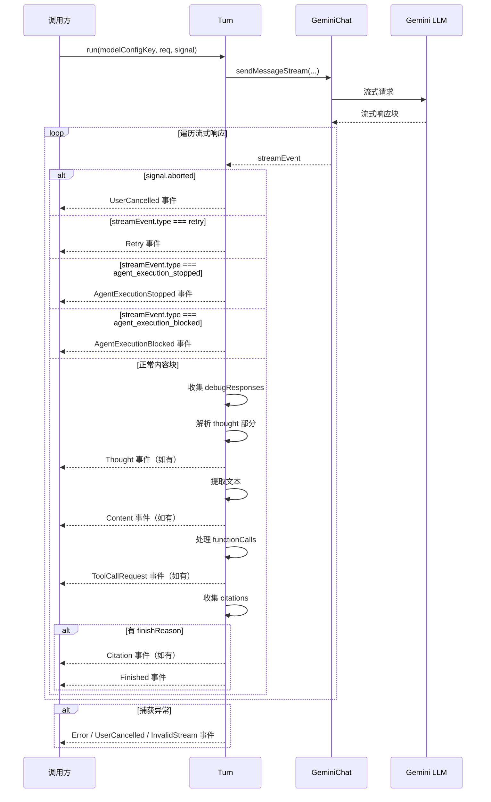
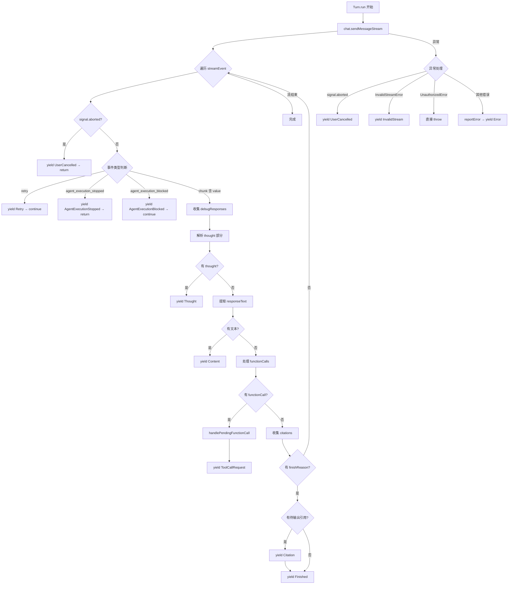

# turn.ts

## 概述

`turn.ts` 是 Gemini CLI 核心模块中负责管理**代理循环（Agentic Loop）中单次轮次（Turn）**的关键文件。它定义了 `Turn` 类以及与之配套的一整套事件类型系统，构成了 Gemini CLI 服务端流式事件处理的核心基础设施。

**Turn 类**代表代理与 LLM 之间的一次完整交互轮次。它通过 `GeminiChat` 发送消息并接收流式响应，将底层的 `GenerateContentResponse` 解析为语义化的 `ServerGeminiStreamEvent` 事件流，供上层逻辑（如服务器、调度器）消费。

**事件类型系统**定义了 18 种不同的事件类型（通过 `GeminiEventType` 枚举），涵盖了内容输出、工具调用、错误处理、对话压缩、循环检测等所有可能的流式交互场景。

## 架构图（Mermaid）







## 核心组件

### 1. `ServerTool` 接口

```typescript
export interface ServerTool {
  name: string;
  schema: FunctionDeclaration;
  execute(params, signal?): Promise<ToolResult>;
  shouldConfirmExecute(params, abortSignal): Promise<ToolCallConfirmationDetails | false>;
}
```

定义了服务端工具的标准接口：
- `name`：工具名称
- `schema`：工具的函数声明模式（供 LLM 理解工具能力）
- `execute`：执行工具的方法
- `shouldConfirmExecute`：判断工具执行前是否需要用户确认

### 2. `GeminiEventType` 枚举

定义了 18 种流式事件类型：

| 事件类型 | 值 | 含义 |
|----------|-----|------|
| `Content` | `'content'` | 模型输出了文本内容 |
| `ToolCallRequest` | `'tool_call_request'` | 模型请求执行一个工具 |
| `ToolCallResponse` | `'tool_call_response'` | 工具执行完成并返回结果 |
| `ToolCallConfirmation` | `'tool_call_confirmation'` | 工具执行需要用户确认 |
| `UserCancelled` | `'user_cancelled'` | 用户取消了操作 |
| `Error` | `'error'` | 发生错误 |
| `ChatCompressed` | `'chat_compressed'` | 对话历史被压缩 |
| `Thought` | `'thought'` | 模型的思考过程（思维链） |
| `MaxSessionTurns` | `'max_session_turns'` | 达到最大会话轮次 |
| `Finished` | `'finished'` | 本轮交互完成 |
| `LoopDetected` | `'loop_detected'` | 检测到工具调用循环 |
| `Citation` | `'citation'` | 输出引用来源 |
| `Retry` | `'retry'` | 正在重试请求 |
| `ContextWindowWillOverflow` | `'context_window_will_overflow'` | 上下文窗口即将溢出 |
| `InvalidStream` | `'invalid_stream'` | 流式响应无效 |
| `ModelInfo` | `'model_info'` | 模型信息通知 |
| `AgentExecutionStopped` | `'agent_execution_stopped'` | 代理执行被停止 |
| `AgentExecutionBlocked` | `'agent_execution_blocked'` | 代理执行被阻塞 |

### 3. `CompressionStatus` 枚举

定义了对话压缩的 5 种状态：

| 状态 | 值 | 含义 |
|------|-----|------|
| `COMPRESSED` | `1` | 压缩成功 |
| `COMPRESSION_FAILED_INFLATED_TOKEN_COUNT` | - | 压缩后 token 反而增多 |
| `COMPRESSION_FAILED_TOKEN_COUNT_ERROR` | - | token 计数出错 |
| `COMPRESSION_FAILED_EMPTY_SUMMARY` | - | 压缩摘要为空 |
| `NOOP` | - | 不需要压缩 |
| `CONTENT_TRUNCATED` | - | 因先前压缩失败而截断内容 |

### 4. 事件类型定义

文件定义了 16 种具体的事件类型接口/类型别名，每种都包含 `type` 字段（对应 `GeminiEventType`）和可选的 `value` 字段：

| 类型名 | value 类型 | 说明 |
|--------|-----------|------|
| `ServerGeminiContentEvent` | `string` + `traceId?` | 文本内容 |
| `ServerGeminiThoughtEvent` | `ThoughtSummary` + `traceId?` | 思考摘要 |
| `ServerGeminiToolCallRequestEvent` | `ToolCallRequestInfo` | 工具调用请求 |
| `ServerGeminiToolCallResponseEvent` | `ToolCallResponseInfo` | 工具调用响应 |
| `ServerGeminiToolCallConfirmationEvent` | `ServerToolCallConfirmationDetails` | 工具确认详情 |
| `ServerGeminiUserCancelledEvent` | 无 | 用户取消 |
| `ServerGeminiErrorEvent` | `GeminiErrorEventValue` | 错误信息 |
| `ServerGeminiChatCompressedEvent` | `ChatCompressionInfo \| null` | 压缩信息 |
| `ServerGeminiMaxSessionTurnsEvent` | 无 | 超出轮次限制 |
| `ServerGeminiFinishedEvent` | `GeminiFinishedEventValue` | 完成原因 + 用量元数据 |
| `ServerGeminiLoopDetectedEvent` | 无 | 循环检测 |
| `ServerGeminiCitationEvent` | `string` | 引用文本 |
| `ServerGeminiRetryEvent` | 无 | 重试 |
| `ServerGeminiContextWindowWillOverflowEvent` | 预估 token 数 + 剩余 token 数 | 上下文溢出预警 |
| `ServerGeminiInvalidStreamEvent` | 无 | 无效流 |
| `ServerGeminiModelInfoEvent` | `string` | 模型信息 |
| `ServerGeminiAgentExecutionStoppedEvent` | `reason` + `systemMessage?` + `contextCleared?` | 执行停止 |
| `ServerGeminiAgentExecutionBlockedEvent` | `reason` + `systemMessage?` + `contextCleared?` | 执行阻塞 |

### 5. `ServerGeminiStreamEvent` 联合类型

所有 18 种事件类型的联合（discriminated union），消费方可通过 `type` 字段进行类型窄化。

### 6. `Turn` 类

#### 构造函数

```typescript
constructor(
  private readonly chat: GeminiChat,     // Gemini 聊天会话实例
  private readonly prompt_id: string,    // 当前提示词的唯一标识
)
```

#### 状态字段

| 字段 | 类型 | 可见性 | 说明 |
|------|------|--------|------|
| `callCounter` | `number` | 私有 | 工具调用计数器，用于生成唯一 callId |
| `pendingToolCalls` | `ToolCallRequestInfo[]` | 公开只读 | 待处理的工具调用列表 |
| `debugResponses` | `GenerateContentResponse[]` | 私有 | 收集的所有原始响应（用于调试） |
| `pendingCitations` | `Set<string>` | 私有 | 待输出的引用集合（去重） |
| `cachedResponseText` | `string \| undefined` | 私有 | 缓存的响应文本 |
| `finishReason` | `FinishReason \| undefined` | 公开 | 本轮的完成原因 |

#### `run()` 方法（核心）

```typescript
async *run(
  modelConfigKey: ModelConfigKey,
  req: PartListUnion,
  signal: AbortSignal,
  displayContent?: PartListUnion,
  role: LlmRole = LlmRole.MAIN,
): AsyncGenerator<ServerGeminiStreamEvent>
```

这是 Turn 的核心方法，是一个异步生成器函数。它的处理流程：

1. **发送消息**：通过 `chat.sendMessageStream()` 获取流式响应
2. **遍历流**：逐事件处理响应流中的每个元素
3. **事件转换**：将底层事件转换为语义化的 `ServerGeminiStreamEvent`
4. **错误处理**：捕获所有异常，按类型分别处理

**流内事件处理优先级**：
1. 检查 `signal.aborted` → yield `UserCancelled`
2. `retry` 事件 → yield `Retry`
3. `agent_execution_stopped` → yield `AgentExecutionStopped`
4. `agent_execution_blocked` → yield `AgentExecutionBlocked`
5. 正常 chunk：
   - 解析 `thought` 部分 → yield `Thought`
   - 提取文本 → yield `Content`
   - 处理 `functionCalls` → yield `ToolCallRequest`
   - 收集 `citations`
   - 检查 `finishReason` → yield `Citation`（如有）+ `Finished`

**异常处理策略**：
- `signal.aborted` → yield `UserCancelled`，静默退出
- `InvalidStreamError` → yield `InvalidStream`，静默退出
- `UnauthorizedError` → 直接 throw，不捕获（需上层处理认证）
- 其他错误 → `reportError` 报告 + yield `Error` 事件

#### `handlePendingFunctionCall()` 方法

```typescript
private handlePendingFunctionCall(
  fnCall: FunctionCall,
  traceId?: string,
): ServerGeminiStreamEvent | null
```

- 从 `FunctionCall` 构建 `ToolCallRequestInfo`
- 生成唯一的 `callId`：优先使用 `fnCall.id`，否则用 `${name}_${Date.now()}_${callCounter++}` 格式生成
- 将工具调用请求推入 `pendingToolCalls` 数组
- 返回 `ToolCallRequest` 事件

#### `getDebugResponses()` 方法

返回本轮收集的所有原始 `GenerateContentResponse`，用于调试。

#### `getResponseText()` 方法

- 返回本轮所有响应中的文本内容，以空格连接
- 使用 `cachedResponseText` 缓存结果，避免重复计算
- 过滤掉 `null` 值后拼接

### 7. 辅助接口

#### `StructuredError`
```typescript
export interface StructuredError {
  message: string;
  status?: number;
}
```
结构化错误，包含消息和可选的 HTTP 状态码。

#### `GeminiErrorEventValue`
```typescript
export interface GeminiErrorEventValue {
  error: unknown;
}
```
错误事件的值包装器。

#### `GeminiFinishedEventValue`
```typescript
export interface GeminiFinishedEventValue {
  reason: FinishReason | undefined;
  usageMetadata: GenerateContentResponseUsageMetadata | undefined;
}
```
完成事件的值，包含完成原因和 token 用量元数据。

#### `ChatCompressionInfo`
```typescript
export interface ChatCompressionInfo {
  originalTokenCount: number;
  newTokenCount: number;
  compressionStatus: CompressionStatus;
}
```
对话压缩的信息，包含压缩前后的 token 数和压缩状态。

#### `ServerToolCallConfirmationDetails`
```typescript
export interface ServerToolCallConfirmationDetails {
  request: ToolCallRequestInfo;
  details: ToolCallConfirmationDetails;
}
```
工具调用确认的详细信息。

## 依赖关系

### 内部依赖

| 模块路径 | 导入项 | 用途 |
|----------|--------|------|
| `../tools/tools.js` | `ToolCallConfirmationDetails`, `ToolResult` | 工具调用确认和结果类型 |
| `../utils/partUtils.js` | `getResponseText` | 从响应中提取文本 |
| `../utils/errorReporting.js` | `reportError` | 错误上报工具 |
| `../utils/errors.js` | `getErrorMessage`, `UnauthorizedError`, `toFriendlyError` | 错误处理工具函数和类型 |
| `./geminiChat.js` | `InvalidStreamError`, `GeminiChat` | Gemini 聊天会话类和无效流错误 |
| `../utils/thoughtUtils.js` | `parseThought`, `ThoughtSummary` | 思考内容解析 |
| `../services/modelConfigService.js` | `ModelConfigKey` | 模型配置键类型 |
| `../utils/generateContentResponseUtilities.js` | `getCitations` | 从响应中提取引用 |
| `../telemetry/types.js` | `LlmRole` | LLM 角色枚举 |
| `../scheduler/types.js` | `ToolCallRequestInfo`, `ToolCallResponseInfo` | 工具调用请求和响应信息类型 |

### 外部依赖

| 包名 | 导入项 | 用途 |
|------|--------|------|
| `@google/genai` | `createUserContent`, `PartListUnion`, `GenerateContentResponse`, `FunctionCall`, `FunctionDeclaration`, `FinishReason`, `GenerateContentResponseUsageMetadata` | Google Generative AI SDK 的核心类型和工具函数 |

## 关键实现细节

1. **异步生成器驱动的事件流**：`Turn.run()` 是一个 `async *` 异步生成器函数，它将底层的流式 API 响应转换为语义化的事件流。调用方通过 `for await...of` 消费这些事件，实现了**生产者-消费者**的解耦。这使得 Turn 的事件处理逻辑与上层的 UI 渲染、调度逻辑完全分离。

2. **判别联合类型（Discriminated Union）**：`ServerGeminiStreamEvent` 是一个判别联合类型，以 `type` 字段作为判别属性。TypeScript 编译器可以根据 `type` 的值自动窄化类型，消费方可以安全地访问各事件的 `value` 字段。

3. **工具调用 ID 的生成策略**：`handlePendingFunctionCall` 中，`callId` 优先使用 LLM 返回的 `fnCall.id`。如果 LLM 未提供 ID（即 `undefined`），则使用 `${name}_${Date.now()}_${callCounter++}` 格式自动生成，确保唯一性。`callCounter` 是实例级别的，保证同一 Turn 内不会重复。

4. **引用的延迟输出**：引用（citations）不是在收到时立即输出，而是先收集到 `pendingCitations` 集合中（自动去重），等到 `finishReason` 出现时才一次性排序输出。这确保了引用出现在内容之后、完成事件之前。

5. **响应文本的缓存**：`getResponseText()` 使用 `cachedResponseText` 进行惰性缓存。由于该方法在单轮中可能被多次调用（如日志、压缩判断等），缓存避免了重复的字符串拼接操作。

6. **错误分层处理**：
   - `UserCancelled`（abort）：最高优先级，在流遍历的开始和异常捕获中都检查
   - `InvalidStreamError`：特殊的流错误，yield 事件后静默退出
   - `UnauthorizedError`：认证错误，直接 throw 不捕获，要求上层处理
   - 其他错误：通过 `reportError` 上报后 yield `Error` 事件

7. **Schema 深度上下文注入**：当发生结构化错误时，调用 `chat.maybeIncludeSchemaDepthContext(structuredError)` 可能会在错误中注入额外的 schema 深度上下文信息，帮助后续的错误诊断。

8. **Thought（思维链）解析**：对响应中标记为 `part.thought` 的部分，使用 `parseThought` 进行解析并作为 `Thought` 事件输出。这支持了 Gemini 模型的思维链（Chain-of-Thought）功能的可视化展示。

9. **displayContent 参数**：`run()` 方法接受一个可选的 `displayContent` 参数，该参数会传递给 `chat.sendMessageStream()`，允许向 LLM 发送的实际内容（`req`）与显示给用户的内容（`displayContent`）不同。这在需要注入隐藏系统信息时很有用。

10. **AgentExecutionStopped vs AgentExecutionBlocked**：两者的关键区别在于控制流——`Stopped` 会导致 `return`（终止生成器），而 `Blocked` 只是 `continue`（跳过当前事件继续处理流）。这意味着 `Blocked` 是一个可恢复的状态，而 `Stopped` 是终止性的。
