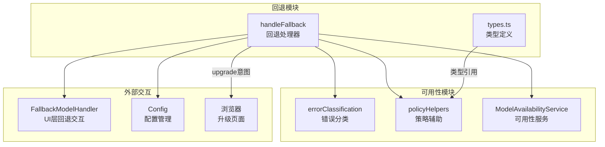
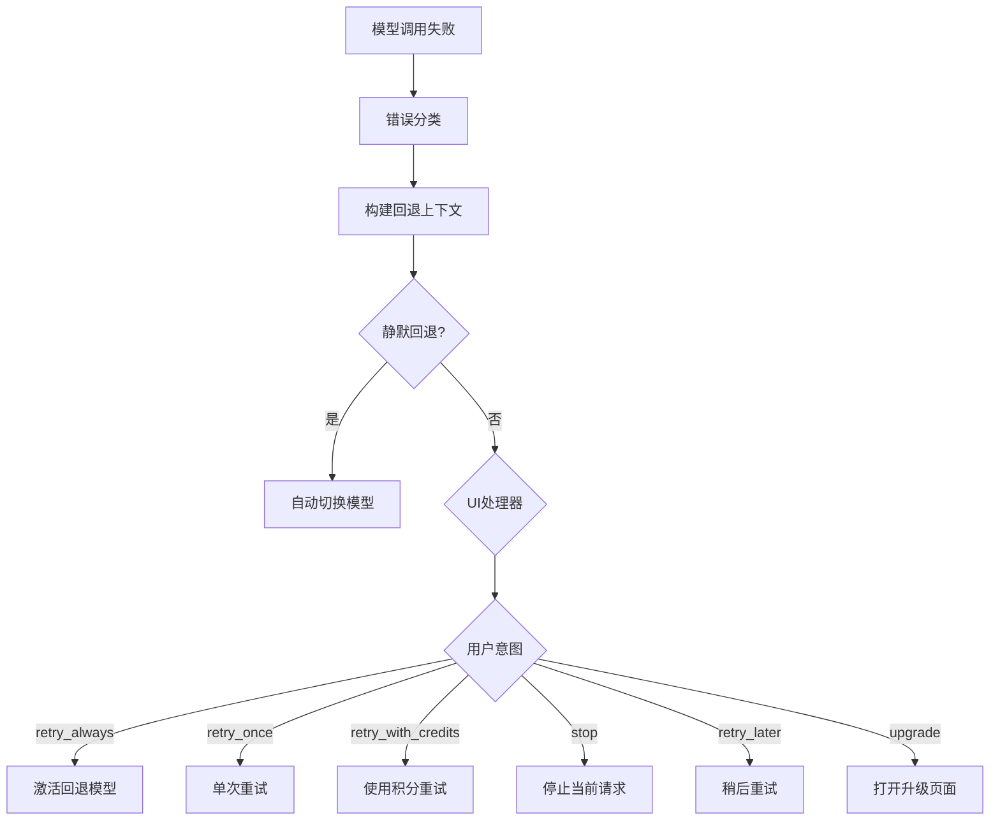

# fallback

## 概述

`fallback` 目录实现了 Gemini CLI 的模型回退处理机制。当主模型因配额耗尽、容量不足或其他错误而不可用时，该模块负责协调回退策略：选择备选模型、与 UI 层交互获取用户意图，并根据用户选择执行相应的回退动作（如切换模型、使用积分重试、升级等）。

## 目录结构

```
fallback/
├── handler.ts        # 回退处理器（核心回退逻辑和意图处理）
├── handler.test.ts   # handler 的单元测试
└── types.ts          # 类型定义（回退意图、处理器接口、验证意图等）
```

## 架构图





## 核心组件

### `handleFallback` (handler.ts)
- **职责**: 回退场景的核心协调函数
- **参数**: `config`, `failedModel`, `authType`, `error`
- **流程**:
  1. 解析当前策略链并构建回退上下文
  2. 对错误进行分类 (`classifyFailureKind`)
  3. 在候选模型中选择可用的回退模型
  4. 根据策略判断是否静默回退或提示用户
  5. 调用 UI 层的 `FallbackModelHandler` 获取用户意图
  6. 根据意图执行相应操作
- **返回值**: `string | boolean | null` (切换的模型名 / 是否继续 / 无回退方案)

### `processIntent` (handler.ts 内部)
处理用户回退意图的内部函数：

| 意图 | 动作 |
|------|------|
| `retry_always` | 激活回退模型为默认 |
| `retry_once` | 单次使用回退模型（不持久化） |
| `retry_with_credits` | 使用积分重试 |
| `stop` | 停止当前请求，保持原模型 |
| `retry_later` | 停止当前请求，不切换模型 |
| `upgrade` | 打开浏览器到升级页面 |

### 类型定义 (types.ts)

#### `FallbackIntent`
回退意图联合类型: `'retry_always'` | `'retry_once'` | `'retry_with_credits'` | `'stop'` | `'retry_later'` | `'upgrade'`

#### `FallbackRecommendation`
扩展 `ModelSelectionResult`，包含：
- `action` - 回退动作 (`'silent'` 或 `'prompt'`)
- `failureKind` - 错误类型
- `failedPolicy` / `selectedPolicy` - 策略信息

#### `FallbackModelHandler`
UI 层提供的回退交互处理器函数签名:
```typescript
(failedModel: string, fallbackModel: string, error?: unknown) => Promise<FallbackIntent | null>
```

#### `ValidationHandler`
验证场景的交互处理器:
```typescript
(validationLink?: string, validationDescription?: string, learnMoreUrl?: string) => Promise<ValidationIntent>
```

## 依赖关系

### 内部依赖
- `../availability/errorClassification.js` - 错误分类
- `../availability/policyHelpers.js` - 策略链解析、回退上下文构建
- `../availability/modelAvailabilityService.js` - 模型可用性服务类型
- `../availability/modelPolicy.js` - 策略类型定义
- `../config/config.js` - 配置管理
- `../utils/secure-browser-launcher.js` - 安全的浏览器启动
- `../utils/debugLogger.js` - 调试日志
- `../utils/errors.js` - 错误消息提取

### 外部依赖
无直接外部 npm 包依赖。

## 数据流

### 完整回退流程
1. API 调用失败，错误传播到调用方
2. 调用方调用 `handleFallback(config, failedModel, authType, error)`
3. `resolvePolicyChain()` 获取当前策略链
4. `buildFallbackPolicyContext()` 定位失败模型并生成候选列表
5. `selectFirstAvailable()` 在候选中选择可用模型
6. 检查策略动作：
   - `'silent'` -> 自动应用状态转换并切换模型
   - `'prompt'` -> 调用 `FallbackModelHandler` 获取用户选择
7. 根据用户意图更新模型可用性状态并执行动作
8. 返回结果给调用方决定是否重试
