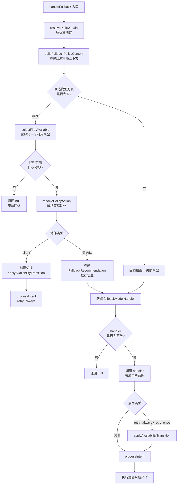
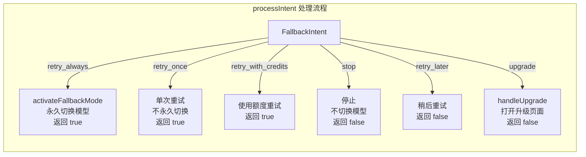
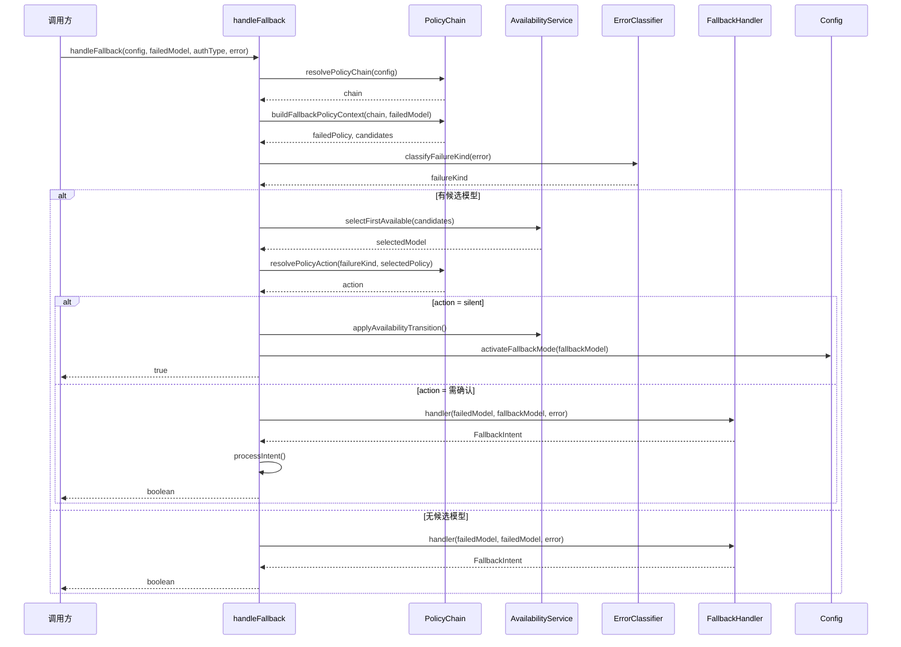

# handler.ts

## 概述

`handler.ts` 是 Gemini CLI 核心模块中的模型回退（Fallback）处理器。当主模型请求失败时（如配额耗尽、服务不可用等），该模块负责：

1. 根据配置的策略链（Policy Chain）确定候选回退模型。
2. 利用模型可用性服务（Availability Service）选择第一个可用的回退模型。
3. 根据策略动作（silent / 需用户确认）决定是静默切换还是征询用户意见。
4. 处理用户的回退意图（FallbackIntent），如永久切换、单次重试、升级、停止等。
5. 在适当时机更新失败模型的可用性状态（如标记为终端状态）。

整体设计遵循"策略驱动 + 用户意图"的双层决策模型，实现了灵活且用户友好的模型降级机制。

## 架构图（Mermaid）







## 核心组件

### 1. `UPGRADE_URL_PAGE` 常量

```typescript
export const UPGRADE_URL_PAGE = 'https://goo.gle/set-up-gemini-code-assist';
```

用户选择"升级"意图时打开的目标网页 URL。

### 2. `handleFallback()` 函数（导出）

模型回退的主入口函数，处理完整的回退决策流程。

**签名：**
```typescript
async function handleFallback(
  config: Config,
  failedModel: string,
  authType?: string,
  error?: unknown,
): Promise<string | boolean | null>
```

**参数：**

| 参数 | 类型 | 说明 |
|------|------|------|
| `config` | `Config` | 全局配置对象 |
| `failedModel` | `string` | 失败的模型名称 |
| `authType` | `string`（可选） | 认证类型 |
| `error` | `unknown`（可选） | 导致失败的原始错误 |

**返回值：**

| 返回值 | 含义 |
|--------|------|
| `true` | 回退成功，应继续重试 |
| `false` | 用户选择停止或升级 |
| `null` | 无法回退（无候选模型或无 handler） |

**核心逻辑：**

1. **策略链解析**：通过 `resolvePolicyChain(config)` 获取策略链，再用 `buildFallbackPolicyContext(chain, failedModel)` 构建回退上下文，得到失败模型的策略和候选回退模型列表。

2. **错误分类**：通过 `classifyFailureKind(error)` 将原始错误分类为特定的失败类型（如配额错误、网络错误等）。

3. **候选模型选择**：
   - 如果没有候选模型，回退模型设为失败模型本身。
   - 如果有候选模型，通过可用性服务的 `selectFirstAvailable()` 选择第一个可用的模型。如果没有可用模型，尝试使用标记为 `isLastResort` 的"最后手段"模型。

4. **策略动作决策**：
   - `silent`：静默切换，不需要用户确认。直接应用可用性状态转换，然后以 `retry_always` 意图处理。
   - 其他动作：构建 `FallbackRecommendation`（当前主要用于未来的 UI 传递），然后进入用户确认流程。

5. **用户确认**：通过 `config.getFallbackModelHandler()` 获取回退处理器（由上层 UI 注册），调用它获取用户的回退意图。

6. **可用性状态更新**：只有当用户选择 `retry_always` 或 `retry_once` 时才更新失败模型的可用性状态，避免用户选择"停止"后模型被错误标记。

### 3. `handleUpgrade()` 函数（私有）

处理用户选择"升级"意图的函数。

- 首先检查当前环境是否支持打开浏览器（通过 `shouldLaunchBrowser()`）。
- 如果支持，调用 `openBrowserSecurely()` 打开升级页面。
- 如果不支持（如无头环境），在日志中输出升级 URL。
- 浏览器打开失败时记录警告日志，不抛出异常。

### 4. `processIntent()` 函数（私有）

将用户的回退意图转换为具体的系统动作。

**签名：**
```typescript
async function processIntent(
  config: Config,
  intent: FallbackIntent | null,
  fallbackModel: string,
): Promise<boolean>
```

**意图处理详情：**

| 意图 | 动作 | 返回值 |
|------|------|--------|
| `retry_always` | 调用 `config.activateFallbackMode(fallbackModel)` 永久切换到回退模型 | `true` |
| `retry_once` | 不永久切换模型，由 FallbackStrategy 根据可用性服务状态路由本次请求 | `true` |
| `retry_with_credits` | 使用额度重试（具体逻辑待实现） | `true` |
| `stop` | 不切换模型，用户选择停止 | `false` |
| `retry_later` | 不切换模型，用户选择稍后重试 | `false` |
| `upgrade` | 调用 `handleUpgrade()` 打开升级页面 | `false` |
| 其他 | 抛出错误 | 抛出异常 |

## 依赖关系

### 内部依赖

| 模块路径 | 导入项 | 用途 |
|----------|--------|------|
| `../config/config.js` | `Config`（类型） | 全局配置，提供回退处理器、模型可用性服务等 |
| `../utils/secure-browser-launcher.js` | `openBrowserSecurely`, `shouldLaunchBrowser` | 安全地在浏览器中打开 URL |
| `../utils/debugLogger.js` | `debugLogger` | 调试日志工具 |
| `../utils/errors.js` | `getErrorMessage` | 从错误对象中提取消息文本 |
| `./types.js` | `FallbackIntent`, `FallbackRecommendation`（类型） | 回退意图枚举和推荐信息类型 |
| `../availability/errorClassification.js` | `classifyFailureKind` | 将原始错误分类为特定的失败种类 |
| `../availability/policyHelpers.js` | `buildFallbackPolicyContext`, `resolvePolicyChain`, `resolvePolicyAction`, `applyAvailabilityTransition` | 策略链解析、回退上下文构建、策略动作解析、可用性状态转换 |

### 外部依赖

无直接外部（npm）依赖。所有功能都通过内部模块和 Node.js 内置 API 实现。

## 关键实现细节

1. **策略驱动的回退决策**：整个回退流程由策略链（Policy Chain）驱动。策略链定义了模型之间的回退关系和优先级，`buildFallbackPolicyContext` 负责确定当前失败模型的候选回退列表。

2. **"最后手段"模型**：当 `selectFirstAvailable()` 找不到可用模型时，系统会查找标记为 `isLastResort` 的策略，将其模型作为最后的回退选项。这确保了在极端情况下仍有兜底方案。

3. **静默切换 vs 用户确认**：`resolvePolicyAction()` 根据失败类型和所选策略决定是否需要用户确认。对于可预期的、非致命的错误（如临时过载），系统可以静默切换到备用模型，提供无感的用户体验。

4. **可用性状态延迟更新**：可用性状态的转换（`applyAvailabilityTransition`）只在用户明确选择重试时才执行。如果用户选择"停止"或"稍后重试"，失败模型的状态不会被更新，允许用户下次使用时仍然尝试原模型。这是一个重要的用户体验设计决策。

5. **FallbackRecommendation 预留**：代码中构建了 `FallbackRecommendation` 对象但通过 `void recommendation` 忽略了它。注释说明这将在未来用于 UI 层传递推荐信息，体现了渐进式开发的策略。

6. **错误容错**：`handleFallback` 在调用用户 handler 时使用 try-catch 包裹，handler 失败不会导致整个系统崩溃，而是静默返回 `null`。`handleUpgrade` 同样对浏览器打开失败进行了容错处理。

7. **retry_always vs retry_once 的语义区别**：`retry_always` 会通过 `config.activateFallbackMode()` 永久切换活跃模型；而 `retry_once` 不修改活跃模型配置，仅依赖可用性服务的状态路由当次请求，实现"一次性"的降级。
