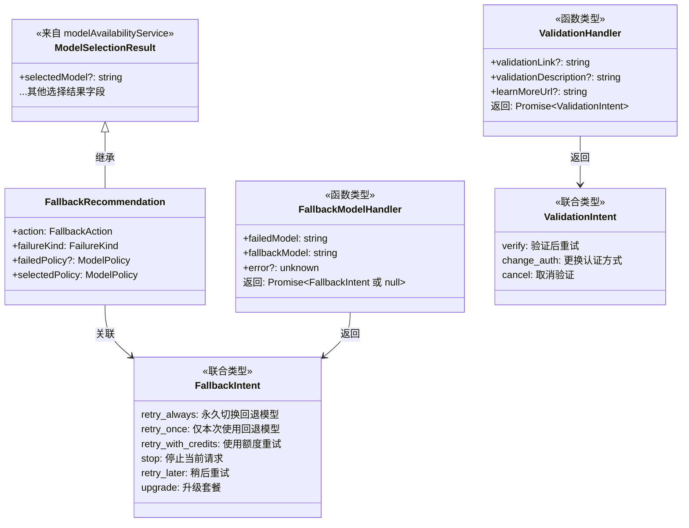
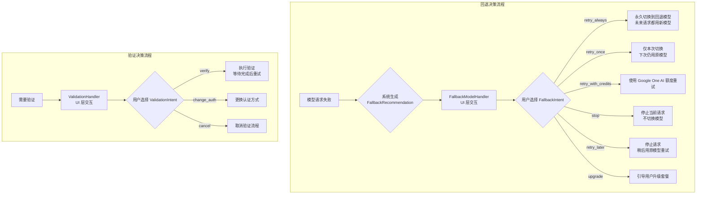

# types.ts

## 概述

`types.ts` 是模型回退（Fallback）模块的类型定义文件，定义了模型回退和验证流程中 UI 层与核心层之间的通信契约。文件涵盖三大核心概念：

1. **回退意图（FallbackIntent）**：用户在模型回退场景中可选择的动作。
2. **回退推荐（FallbackRecommendation）**：系统根据策略计算出的回退推荐信息。
3. **验证意图（ValidationIntent）**：用户在需要验证场景（如身份验证）中可选择的动作。

这些类型作为 UI 层（如 CLI）和核心引擎之间的接口协议，确保回退决策流程的类型安全和语义清晰。

## 架构图（Mermaid）





## 核心组件

### 1. `FallbackIntent` 类型

定义 UI 层在模型回退场景中返回的用户意图。这是一个字符串字面量联合类型。

| 值 | 含义 | 行为描述 |
|----|------|----------|
| `'retry_always'` | 永久切换并重试 | 使用回退模型重试当前请求，并将其设为未来请求的默认模型 |
| `'retry_once'` | 单次切换并重试 | 仅对当前请求使用回退模型，不改变默认模型配置 |
| `'retry_with_credits'` | 使用额度重试 | 使用 Google One AI 额度重试当前请求（如果策略为 'always'，可能也用于未来请求） |
| `'stop'` | 停止 | 停止当前请求，不切换到回退模型 |
| `'retry_later'` | 稍后重试 | 停止当前请求，不执行回退，用户意图稍后用原模型重试 |
| `'upgrade'` | 升级 | 引导用户升级服务套餐（打开升级页面） |

### 2. `FallbackRecommendation` 接口

系统根据策略链和可用性分析生成的回退推荐信息，继承自 `ModelSelectionResult`。

| 字段 | 类型 | 必填 | 说明 |
|------|------|------|------|
| `action` | `FallbackAction` | 是 | 推荐的回退动作（来自策略解析） |
| `failureKind` | `FailureKind` | 是 | 失败种类（如配额错误、网络错误等） |
| `failedPolicy` | `ModelPolicy` | 否 | 失败模型的策略配置 |
| `selectedPolicy` | `ModelPolicy` | 是 | 被选中的回退模型的策略配置 |

此外，通过继承 `ModelSelectionResult`，还包含模型选择相关的字段（如 `selectedModel` 等）。

### 3. `FallbackModelHandler` 类型

UI 层提供的回退交互处理器的函数签名。核心引擎通过此接口与用户进行回退决策交互。

```typescript
type FallbackModelHandler = (
  failedModel: string,
  fallbackModel: string,
  error?: unknown,
) => Promise<FallbackIntent | null>;
```

**参数：**

| 参数 | 类型 | 说明 |
|------|------|------|
| `failedModel` | `string` | 请求失败的原模型名称 |
| `fallbackModel` | `string` | 系统推荐的回退模型名称 |
| `error` | `unknown`（可选） | 导致失败的原始错误对象 |

**返回值：** `Promise<FallbackIntent | null>`，返回用户的回退意图，或 `null` 表示无决策。

### 4. `ValidationIntent` 类型

定义 UI 层在验证场景中返回的用户意图。与 `FallbackIntent` 类似，也是字符串字面量联合类型。

| 值 | 含义 | 行为描述 |
|----|------|----------|
| `'verify'` | 执行验证 | 用户选择进行验证，系统等待验证完成后重试 |
| `'change_auth'` | 更换认证 | 用户选择更换认证方式 |
| `'cancel'` | 取消 | 用户取消验证流程 |

### 5. `ValidationHandler` 类型

UI 层提供的验证交互处理器的函数签名。当系统需要用户进行额外验证时（如 API 密钥验证、OAuth 授权等），通过此接口与用户交互。

```typescript
type ValidationHandler = (
  validationLink?: string,
  validationDescription?: string,
  learnMoreUrl?: string,
) => Promise<ValidationIntent>;
```

**参数：**

| 参数 | 类型 | 说明 |
|------|------|------|
| `validationLink` | `string`（可选） | 验证链接 URL |
| `validationDescription` | `string`（可选） | 验证描述文本 |
| `learnMoreUrl` | `string`（可选） | "了解更多"链接 URL |

**返回值：** `Promise<ValidationIntent>`，返回用户的验证意图。

## 依赖关系

### 内部依赖

| 模块路径 | 导入项 | 用途 |
|----------|--------|------|
| `../availability/modelAvailabilityService.js` | `ModelSelectionResult`（类型） | 模型选择结果接口，作为 `FallbackRecommendation` 的基类型 |
| `../availability/modelPolicy.js` | `FailureKind`, `FallbackAction`, `ModelPolicy`（类型） | 失败种类枚举、回退动作类型、模型策略接口 |

### 外部依赖

无外部依赖。本文件是纯类型定义文件，不引入任何外部 npm 包。

## 关键实现细节

1. **UI-Core 解耦设计**：`FallbackModelHandler` 和 `ValidationHandler` 都是函数类型定义，而非具体实现。核心层只定义接口契约，具体的用户交互逻辑由 UI 层（如 CLI 的 Ink 组件）实现并注入。这实现了核心逻辑与 UI 层的完全解耦。

2. **意图驱动架构**：`FallbackIntent` 和 `ValidationIntent` 使用字符串字面量联合类型，而非枚举。这种设计使得类型在 JavaScript 运行时是普通字符串，便于序列化和调试，同时在 TypeScript 编译期保持完整的类型检查能力。

3. **回退推荐的继承设计**：`FallbackRecommendation` 继承 `ModelSelectionResult` 并扩展策略相关字段，形成了"模型选择结果 + 策略上下文"的复合数据结构。这使得 UI 层在展示回退推荐时可以同时获取模型选择的详细信息和策略决策依据。

4. **空值语义**：`FallbackModelHandler` 的返回值允许 `null`，表示 handler 无法做出决策（如用户关闭了对话框）。`failedPolicy` 在 `FallbackRecommendation` 中也是可选的，因为失败的模型可能不在策略链中。

5. **验证与回退的并行机制**：验证流程（`ValidationIntent`/`ValidationHandler`）与回退流程（`FallbackIntent`/`FallbackModelHandler`）是相互独立的两套机制。验证主要处理认证/授权问题，而回退主要处理模型可用性问题。两者可以在不同的错误场景下被触发。

6. **Google One AI 额度集成**：`retry_with_credits` 意图表明系统集成了 Google One AI 的付费额度机制，允许用户在免费额度用尽后使用付费额度继续使用服务。注释中的 `(and potentially future ones if strategy is 'always')` 暗示了与回退策略的交互。
