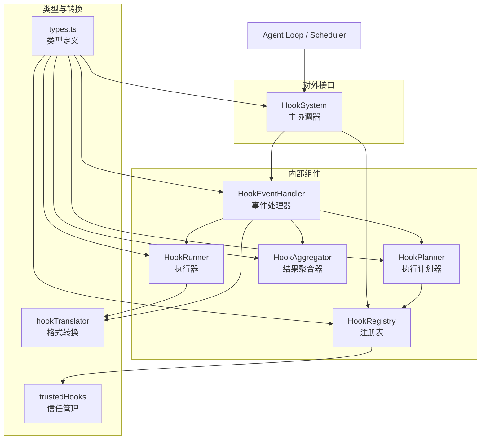
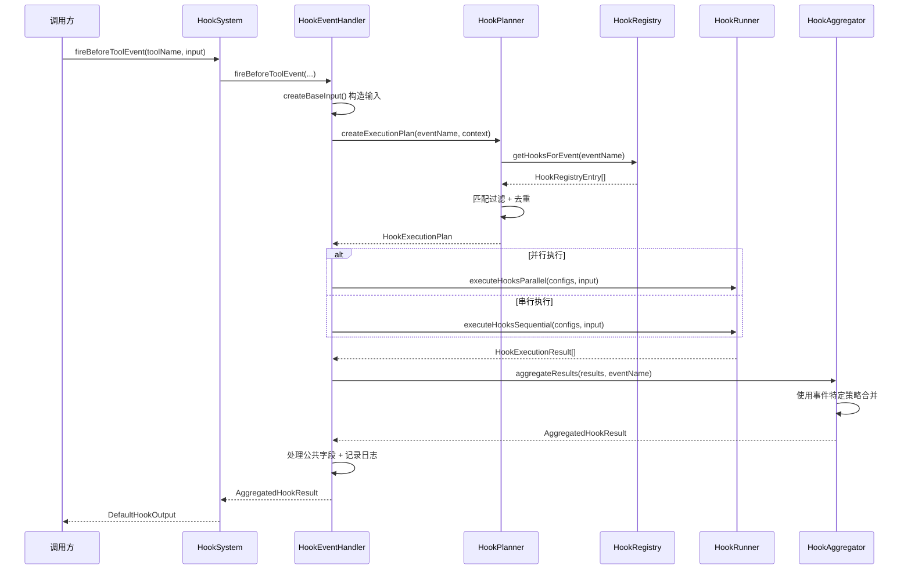
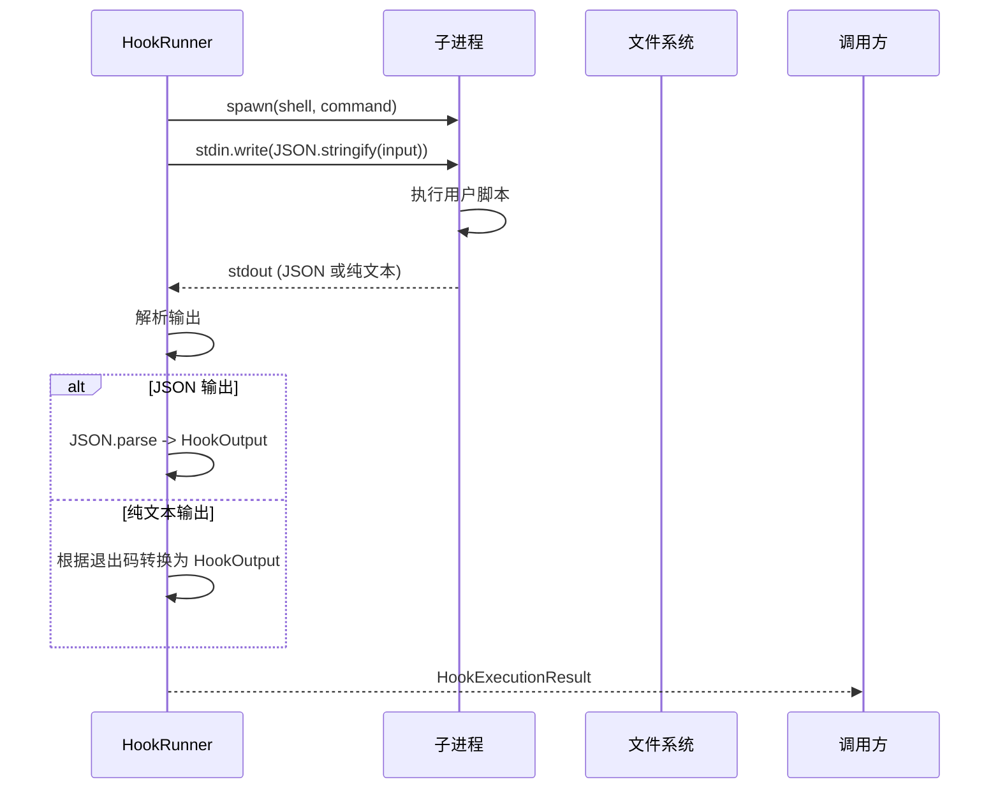

# hooks

## 概述

`hooks` 目录实现了 Gemini CLI 的**钩子（Hook）系统**，提供了一套事件驱动的扩展机制。它允许用户和扩展在 Agent 生命周期的关键节点（如工具执行前后、模型调用前后、会话开始/结束等）注入自定义逻辑。钩子可以是外部命令（Command Hook）或运行时函数（Runtime Hook），支持并行/串行执行，输出通过聚合策略合并。

## 目录结构

```
hooks/
├── index.ts              # 模块入口，导出所有公共类型和组件
├── types.ts              # 完整的类型定义（事件名、输入/输出、Hook 配置等）
├── hookSystem.ts         # HookSystem 主协调器（对外统一 API）
├── hookRegistry.ts       # HookRegistry 注册表（加载、验证、管理钩子）
├── hookPlanner.ts        # HookPlanner 执行计划器（匹配、去重、创建执行计划）
├── hookRunner.ts         # HookRunner 执行器（运行命令钩子和运行时钩子）
├── hookAggregator.ts     # HookAggregator 结果聚合器（合并多个钩子输出）
├── hookEventHandler.ts   # HookEventHandler 事件处理器（构造输入、触发执行、日志记录）
├── hookTranslator.ts     # Hook 格式转换器（SDK 格式 <-> Hook 格式）
├── trustedHooks.ts       # 项目钩子信任管理
└── *.test.ts             # 对应的测试文件
```

## 架构图



## 核心组件

### `types.ts` - 类型定义

#### 事件名称枚举 `HookEventName`
| 事件 | 触发时机 |
|------|---------|
| `BeforeTool` | 工具执行前 |
| `AfterTool` | 工具执行后 |
| `BeforeAgent` | Agent 处理用户输入前 |
| `AfterAgent` | Agent 完成响应后 |
| `Notification` | 通知事件（如工具权限请求） |
| `SessionStart` | 会话开始 |
| `SessionEnd` | 会话结束 |
| `PreCompress` | 上下文压缩前 |
| `BeforeModel` | LLM 调用前 |
| `AfterModel` | LLM 响应后 |
| `BeforeToolSelection` | 工具选择前 |

#### 配置类型
- **`CommandHookConfig`**: 命令钩子配置（`type: 'command'`），包含 `command`、`timeout`、`env` 等
- **`RuntimeHookConfig`**: 运行时钩子配置（`type: 'runtime'`），包含 `action` 函数
- **`HookDefinition`**: 钩子定义，包含 `matcher`（工具名匹配）、`sequential`（串行标记）、`hooks` 数组

#### 输入/输出类型
- **`HookInput`**: 基础输入（session_id、cwd、timestamp 等）
- **`HookOutput`**: 基础输出（continue、decision、systemMessage 等）
- **`HookDecision`**: 决策类型（`'ask'`、`'block'`、`'deny'`、`'approve'`、`'allow'`）

#### 专用输出类
- **`DefaultHookOutput`**: 默认输出实现，提供 `isBlockingDecision()`、`shouldStopExecution()` 等工具方法
- **`BeforeToolHookOutput`**: 支持 `getModifiedToolInput()` 修改工具输入
- **`BeforeModelHookOutput`**: 支持 `getSyntheticResponse()` 返回合成响应、`applyLLMRequestModifications()` 修改请求
- **`AfterModelHookOutput`**: 支持 `getModifiedResponse()` 修改模型响应
- **`BeforeToolSelectionHookOutput`**: 支持 `applyToolConfigModifications()` 修改工具选择配置
- **`AfterAgentHookOutput`**: 支持 `shouldClearContext()` 清除上下文

### `hookSystem.ts` - 主协调器

`HookSystem` 是对外的统一入口，封装了所有内部组件：

```typescript
class HookSystem {
  initialize(): Promise<void>           // 初始化钩子系统
  registerHook(config, eventName, options)  // 注册钩子
  setHookEnabled(hookName, enabled)     // 启用/禁用钩子
  getAllHooks(): HookRegistryEntry[]    // 获取所有钩子

  // 事件触发方法
  fireSessionStartEvent(source)
  fireSessionEndEvent(reason)
  fireBeforeAgentEvent(prompt)
  fireAfterAgentEvent(prompt, response)
  fireBeforeModelEvent(llmRequest)
  fireAfterModelEvent(request, chunk)
  fireBeforeToolSelectionEvent(request)
  fireBeforeToolEvent(toolName, toolInput)
  fireAfterToolEvent(toolName, toolInput, toolResponse)
  fireToolNotificationEvent(confirmationDetails)
}
```

### `hookRegistry.ts` - 注册表

`HookRegistry` 负责钩子的加载和管理：
- **多源加载**: 从运行时注册（`ConfigSource.Runtime`）、项目设置（`ConfigSource.Project`）、扩展（`ConfigSource.Extensions`）加载钩子
- **验证**: 检查钩子配置有效性（type、command/name 必填等）
- **信任检查**: 项目钩子需要受信任文件夹才能执行
- **禁用列表**: 支持通过设置禁用特定钩子
- **优先级排序**: Runtime > Project > User > System > Extensions

### `hookPlanner.ts` - 执行计划器

`HookPlanner` 为每次事件创建执行计划：
- **匹配过滤**: 根据 `matcher` 模式匹配工具名或触发源（支持正则）
- **去重**: 基于 `getHookKey()` 去除重复钩子
- **策略决定**: 如果任一钩子定义为 `sequential: true`，则所有钩子串行执行

### `hookRunner.ts` - 执行器

`HookRunner` 实际执行钩子逻辑：

**命令钩子执行**:
- 通过 `spawn` 创建子进程执行命令
- 通过 `stdin` 传入 JSON 格式的 HookInput
- 解析 `stdout` 为 HookOutput（支持 JSON 和纯文本）
- 环境变量注入（`GEMINI_PROJECT_DIR`）
- 超时控制（默认 60 秒）
- 纯文本退出码约定：0=allow，1=warning，>=2=deny

**运行时钩子执行**:
- 直接调用 `action` 函数
- AbortController 支持取消
- 超时机制

**串行执行链**: 前一个钩子的输出可修改后续钩子的输入

### `hookAggregator.ts` - 结果聚合器

`HookAggregator` 使用事件特定的合并策略：

| 事件类型 | 合并策略 |
|---------|---------|
| BeforeTool / AfterTool / BeforeAgent / AfterAgent / SessionStart | **OR 决策**: 任一 block/deny 即阻止，消息拼接 |
| BeforeModel / AfterModel | **字段替换**: 后者覆盖前者 |
| BeforeToolSelection | **Union 工具集**: NONE 最严格 > ANY > AUTO |
| 其他事件 | 简单合并 |

### `hookEventHandler.ts` - 事件处理器

`HookEventHandler` 协调完整的事件处理流程：
1. 构造带上下文的 `HookInput`
2. 调用 `HookPlanner` 创建执行计划
3. 根据策略调用 `HookRunner` 并行或串行执行
4. 通过 `HookAggregator` 聚合结果
5. 处理公共输出字段（systemMessage、continue 等）
6. 记录遥测日志
7. 去重失败报告（避免流式场景重复警告）

## 依赖关系

### 内部依赖
- `config/config.ts` - 配置读取（钩子定义、受信文件夹等）
- `config/agent-loop-context.ts` - Agent 上下文
- `tools/tools.ts` - ToolCallConfirmationDetails
- `telemetry/` - 钩子执行遥测
- `utils/events.ts` - 核心事件发射
- `services/environmentSanitization.ts` - 环境变量清洗

### 外部依赖
- `@google/genai` - GenerateContentParameters/Response 类型
- `node:child_process` - 子进程执行

## 数据流

### 钩子事件执行流程



### 命令钩子执行细节


