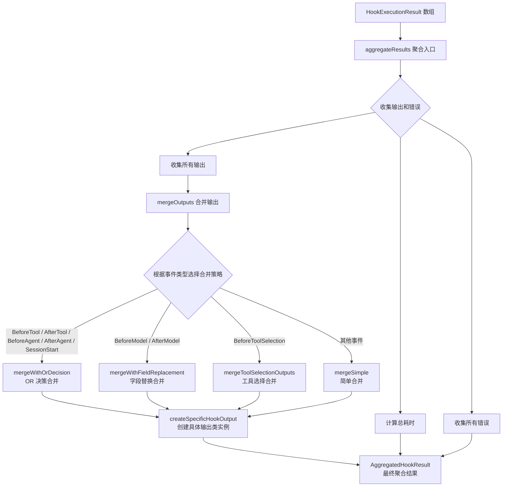
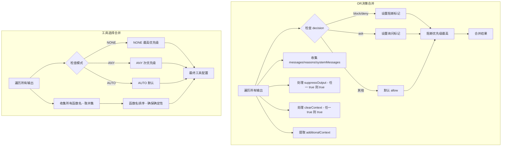

# hookAggregator.ts

## 概述

`HookAggregator` 是钩子系统的结果聚合器，负责将多个钩子执行结果合并为单一的聚合结果。它根据不同的事件类型采用不同的合并策略，确保多个钩子的输出能够以合理的方式组合在一起。这是钩子流水线中的关键组件，位于钩子执行之后、结果返回给调用者之前。

核心职责：
- 收集所有钩子执行的输出和错误
- 累计总执行耗时
- 根据事件类型选择合适的合并策略（OR 决策、字段替换、工具选择合并、简单合并）
- 将合并后的原始输出包装为对应事件类型的具体 `HookOutput` 类实例

## 架构图（Mermaid）

### 合并策略详细流程

## 核心组件

### 接口 `AggregatedHookResult`

聚合后的钩子执行结果数据结构。

| 字段 | 类型 | 描述 |
|------|------|------|
| `success` | `boolean` | 是否所有钩子都成功执行（无错误） |
| `finalOutput` | `DefaultHookOutput \| undefined` | 合并后的最终输出对象，包装为具体事件类型的类实例 |
| `allOutputs` | `HookOutput[]` | 所有钩子的原始输出列表 |
| `errors` | `Error[]` | 所有钩子执行产生的错误列表 |
| `totalDuration` | `number` | 所有钩子执行的总耗时（毫秒） |

### 类 `HookAggregator`

主聚合器类，提供以下方法：

#### 公共方法

- **`aggregateResults(results, eventName)`**: 聚合入口方法，接收钩子执行结果数组和事件名，返回 `AggregatedHookResult`。

#### 私有方法

- **`mergeOutputs(outputs, eventName)`**: 策略分发器，根据事件类型选择合适的合并策略。即使只有单个钩子也会执行合并逻辑，以确保一致的默认行为（如 OR 逻辑的默认 `decision='allow'`）。

- **`mergeWithOrDecision(outputs)`**: OR 决策合并策略，用于 BeforeTool、AfterTool、BeforeAgent、AfterAgent、SessionStart 事件。规则：
  - `decision`: 阻断（block/deny）优先级最高，其次是询问（ask），默认为允许（allow）
  - `continue`: 任一为 false 则最终为 false
  - `suppressOutput`: 任一为 true 则最终为 true
  - `clearContext`: 任一为 true 则最终为 true（仅用于 AfterAgent 钩子）
  - `stopReason`、`reason`、`systemMessage`: 所有值用换行符拼接
  - `additionalContext`: 从所有钩子特定输出中提取并拼接
  - `hookSpecificOutput`: 后续钩子的输出覆盖前面的（排除 clearContext）

- **`mergeWithFieldReplacement(outputs)`**: 字段替换合并策略，用于 BeforeModel、AfterModel 事件。后面的钩子输出直接覆盖前面的字段（包括 hookSpecificOutput 的深层合并）。

- **`mergeToolSelectionOutputs(outputs)`**: 工具选择合并策略，用于 BeforeToolSelection 事件。规则：
  - 工具函数名取所有钩子的并集（Union）
  - 模式优先级：NONE > ANY > AUTO
  - 函数名列表排序以确保确定性缓存

- **`mergeSimple(outputs)`**: 简单合并策略，用于未明确指定策略的其他事件。后面的输出直接覆盖前面的。

- **`createSpecificHookOutput(output, eventName)`**: 将合并后的原始 `HookOutput` 包装为对应事件类型的具体类实例（如 `BeforeToolHookOutput`、`BeforeModelHookOutput` 等）。

- **`extractAdditionalContext(output, contexts)`**: 从钩子特定输出中提取 `additionalContext` 字符串并收集到 contexts 数组中。

## 依赖关系

### 内部依赖

| 依赖模块 | 导入内容 | 用途 |
|----------|----------|------|
| `./types.js` | `DefaultHookOutput`, `BeforeToolHookOutput`, `BeforeModelHookOutput`, `BeforeToolSelectionHookOutput`, `AfterModelHookOutput`, `AfterAgentHookOutput` | 各事件类型的具体 HookOutput 类，用于包装合并结果 |
| `./types.js` | `HookEventName` | 钩子事件名枚举，用于策略分发 |
| `./types.js` | `HookOutput`, `HookExecutionResult`, `BeforeToolSelectionOutput` | 类型定义，用于输入输出的类型约束 |

### 外部依赖

| 依赖包 | 导入内容 | 用途 |
|--------|----------|------|
| `@google/genai` | `FunctionCallingConfigMode` | Google GenAI SDK 的函数调用配置模式枚举（NONE、ANY、AUTO），用于工具选择合并策略中确定最终的工具调用模式 |

## 关键实现细节

1. **策略模式的应用**: `mergeOutputs` 方法根据 `HookEventName` 使用 switch-case 进行策略分发，不同事件类型有完全不同的合并语义。这种设计使得每种事件的合并逻辑独立且清晰。

2. **OR 决策逻辑的优先级链**: 在 `mergeWithOrDecision` 中，决策优先级为 `block/deny > ask > allow`。这意味着只要有一个钩子阻断，最终结果就是阻断。只有在没有阻断时，ask 才生效。只有所有钩子都没有设置 block/deny/ask，且 continue 不为 false 时，才默认为 allow。

3. **一致性保证**: 即使只有一个钩子输出，也会执行完整的合并逻辑。代码注释明确说明了这一点——为了确保一致的默认行为，例如 OR 逻辑中的默认 `decision='allow'`。

4. **工具选择合并的确定性**: `mergeToolSelectionOutputs` 中，函数名列表在收集后会进行排序（`Array.from(allFunctionNames).sort()`），确保无论钩子执行顺序如何，最终输出都是确定性的，这对缓存机制非常重要。

5. **工具选择的并集语义**: 工具选择采用并集（Union）而非交集，这意味着钩子只能增加/启用工具，不能单独过滤掉某个工具。如果一个钩子限制了某工具而另一个钩子重新启用了它，最终结果会包含该工具。

6. **类型安全的输出包装**: `createSpecificHookOutput` 将合并后的原始数据包装为具体事件类型的类实例，使调用者可以使用特定于事件的方法（如 `BeforeModelHookOutput.getSyntheticResponse()`）。

7. **clearContext 的特殊处理**: 在 OR 决策合并中，`clearContext` 被单独从 `hookSpecificOutput` 中提取并处理（任一 true 则 true），然后其余的 `hookSpecificOutput` 字段再进行常规合并，避免被后续钩子覆盖。

8. **消息拼接策略**: `stopReason`、`reason`、`systemMessage`、`additionalContext` 等文本字段采用换行符拼接，确保所有钩子的信息都被保留而不是被覆盖。
