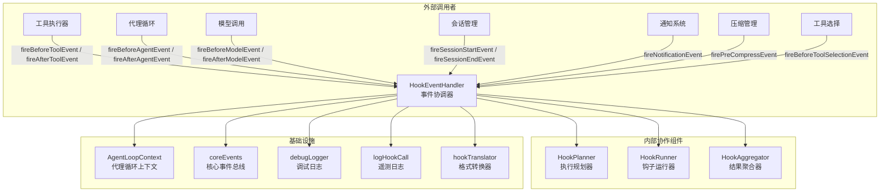
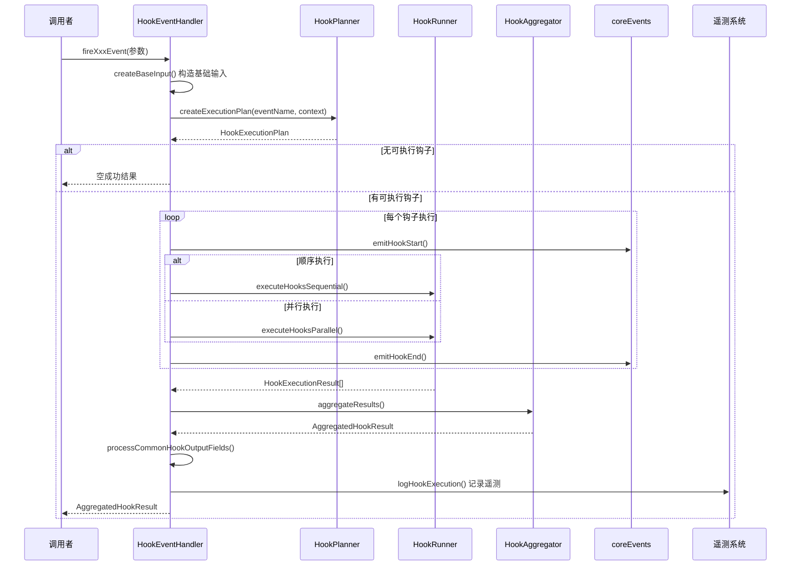

# hookEventHandler.ts

## 概述

`HookEventHandler` 是钩子系统的事件总线/协调器，作为整个钩子系统的对外入口，负责协调钩子的规划、执行和结果聚合。它为系统中的各个模块提供了类型安全的事件触发接口（如 `fireBeforeToolEvent`、`fireAfterModelEvent` 等），内部则将工作委派给三个专门的协作组件：`HookPlanner`（规划）、`HookRunner`（执行）、`HookAggregator`（聚合）。

核心职责：
- 为每种钩子事件提供专门的触发方法（共 11 种事件）
- 构造标准化的钩子输入数据（包含 session_id、transcript_path、cwd、时间戳等公共字段）
- 协调规划 -> 执行 -> 聚合的完整流水线
- 处理公共输出字段（systemMessage、suppressOutput、停止执行请求等）
- 记录钩子执行的遥测日志（telemetry）
- 去重失败报告，避免流式处理期间重复警告
- 发射钩子开始/结束事件供 UI 层消费

## 架构图（Mermaid）

### 事件处理流程

## 核心组件

### 类 `HookEventHandler`

#### 构造函数

接收四个依赖：
| 参数 | 类型 | 描述 |
|------|------|------|
| `context` | `AgentLoopContext` | 代理循环上下文，提供配置、会话信息等 |
| `hookPlanner` | `HookPlanner` | 钩子执行规划器 |
| `hookRunner` | `HookRunner` | 钩子运行器 |
| `hookAggregator` | `HookAggregator` | 结果聚合器 |

#### 私有属性

- **`reportedFailures`**: `WeakMap<object, Set<string>>` -- 用于跟踪已报告的失败，以避免在流式处理期间重复发出警告。以原始请求对象为 key（WeakMap 确保在请求对象被 GC 回收时自动清理），值为已报告的失败键集合。

#### 公共事件触发方法（共 11 个）

| 方法 | 事件类型 | 参数 | 描述 |
|------|----------|------|------|
| `fireBeforeToolEvent` | `BeforeTool` | toolName, toolInput, mcpContext?, originalRequestName? | 工具执行前触发，支持 MCP 工具上下文 |
| `fireAfterToolEvent` | `AfterTool` | toolName, toolInput, toolResponse, mcpContext?, originalRequestName? | 工具执行后触发 |
| `fireBeforeAgentEvent` | `BeforeAgent` | prompt | 代理处理用户提示前触发 |
| `fireNotificationEvent` | `Notification` | type, message, details | 通知事件触发 |
| `fireAfterAgentEvent` | `AfterAgent` | prompt, promptResponse, stopHookActive? | 代理处理完成后触发 |
| `fireSessionStartEvent` | `SessionStart` | source | 会话开始时触发（startup/resume/clear） |
| `fireSessionEndEvent` | `SessionEnd` | reason | 会话结束时触发（exit/clear/logout 等） |
| `firePreCompressEvent` | `PreCompress` | trigger | 上下文压缩前触发（manual/auto） |
| `fireBeforeModelEvent` | `BeforeModel` | llmRequest (GenerateContentParameters) | LLM 模型调用前触发，使用 hookTranslator 转换请求格式 |
| `fireAfterModelEvent` | `AfterModel` | llmRequest, llmResponse (GenerateContentResponse) | LLM 模型调用后触发，同时转换请求和响应格式 |
| `fireBeforeToolSelectionEvent` | `BeforeToolSelection` | llmRequest (GenerateContentParameters) | 工具选择前触发，用于影响工具配置 |

#### 私有方法

- **`executeHooks(eventName, input, context?, requestContext?)`**: 核心执行流程编排方法。流程为：
  1. 调用 `hookPlanner.createExecutionPlan()` 获取执行计划
  2. 如果计划为空，返回空成功结果
  3. 定义 `onHookStart` 和 `onHookEnd` 回调（发射核心事件）
  4. 根据 `plan.sequential` 决定调用 `executeHooksSequential` 还是 `executeHooksParallel`
  5. 调用 `hookAggregator.aggregateResults()` 聚合结果
  6. 调用 `processCommonHookOutputFields()` 处理公共输出
  7. 调用 `logHookExecution()` 记录遥测
  8. 异常时返回包含错误的失败结果

- **`createBaseInput(eventName)`**: 创建所有事件通用的基础输入，包含 session_id、transcript_path（从 ChatRecordingService 获取）、cwd、hook_event_name、timestamp。

- **`logHookExecution(eventName, input, results, aggregated, requestContext?)`**: 详细的日志记录方法：
  - 统计成功/失败数量
  - 使用 `reportedFailures` WeakMap 去重失败告警
  - 失败时通过 `coreEvents.emitFeedback('warning', ...)` 向用户展示警告
  - 为每个钩子结果创建 `HookCallEvent` 遥测事件
  - 记录聚合结果中的每个错误

- **`processCommonHookOutputFields(aggregated)`**: 集中处理公共输出字段：
  - `systemMessage`: 在未抑制输出时记录到调试日志
  - `shouldStopExecution()`: 记录停止执行请求（实际停止由集成点处理）
  - 其他字段（如 decision/reason）由具体的 HookOutput 子类处理

- **`getHookName(config)`**: 从钩子配置中提取显示名称。Command 类型优先返回 name，其次是 command。

- **`getHookNameFromResult(result)`** / **`getHookTypeFromResult(result)`**: 从执行结果中提取钩子名称和类型，供遥测使用。

## 依赖关系

### 内部依赖

| 依赖模块 | 导入内容 | 用途 |
|----------|----------|------|
| `./hookPlanner.js` | `HookPlanner`, `HookEventContext` | 创建钩子执行计划 |
| `./hookRunner.js` | `HookRunner` | 执行钩子（顺序/并行） |
| `./hookAggregator.js` | `HookAggregator`, `AggregatedHookResult` | 聚合多个钩子执行结果 |
| `./types.js` | `HookEventName`, `HookType`, 以及各种 Input/Output 类型 | 事件名枚举、钩子类型、所有事件的输入输出类型定义 |
| `./hookTranslator.js` | `defaultHookTranslator` | 在 Google GenAI SDK 格式和钩子系统格式之间转换 LLM 请求/响应 |
| `../telemetry/loggers.js` | `logHookCall` | 记录钩子调用遥测日志 |
| `../telemetry/types.js` | `HookCallEvent` | 钩子调用遥测事件类型 |
| `../utils/debugLogger.js` | `debugLogger` | 调试日志记录 |
| `../utils/events.js` | `coreEvents` | 核心事件总线，发射钩子开始/结束/反馈事件 |
| `../config/agent-loop-context.js` | `AgentLoopContext` | 代理循环上下文，提供配置和客户端信息 |

### 外部依赖

| 依赖包 | 导入内容 | 用途 |
|--------|----------|------|
| `@google/genai` | `GenerateContentParameters`, `GenerateContentResponse` | Google GenAI SDK 的 LLM 请求/响应类型，用于 BeforeModel 和 AfterModel 事件 |

## 关键实现细节

1. **门面模式（Facade Pattern）**: `HookEventHandler` 是钩子系统的门面类，将规划、执行、聚合三个步骤封装为单一的事件触发调用。外部调用者无需了解内部的三个协作组件。

2. **失败去重机制**: 使用 `WeakMap<object, Set<string>>` 跟踪已报告的失败，key 为原始请求对象。这在流式处理场景中特别重要——同一个模型请求可能触发多次 BeforeModel/AfterModel 事件，避免重复向用户展示相同的钩子失败警告。使用 WeakMap 确保在请求对象被垃圾回收时自动清理记录。

3. **格式转换层**: 对于 BeforeModel、AfterModel、BeforeToolSelection 事件，`HookEventHandler` 使用 `defaultHookTranslator` 将 Google GenAI SDK 的原生类型（`GenerateContentParameters`/`GenerateContentResponse`）转换为钩子系统的解耦类型（`LLMRequest`/`LLMResponse`），实现钩子与具体 SDK 的解耦。

4. **执行策略选择**: 根据 `HookPlanner` 返回的执行计划中的 `sequential` 标志，自动选择顺序执行还是并行执行。顺序执行适用于钩子之间有依赖关系的场景，并行执行适用于独立钩子以提高性能。

5. **钩子生命周期事件**: 通过 `coreEvents.emitHookStart()` 和 `coreEvents.emitHookEnd()` 发射钩子生命周期事件，供 UI 层展示钩子执行状态（如显示进度指示器）。回调通过闭包捕获了 plan 的信息（hookIndex 和 totalHooks）。

6. **优雅降级**: 当 `executeHooks` 内部发生异常时，不会抛出异常，而是返回一个包含错误信息的失败 `AggregatedHookResult`，确保钩子系统的故障不会中断主流程。

7. **集中式遥测记录**: `logHookExecution` 方法为每个钩子执行结果创建独立的 `HookCallEvent`，包含事件名、钩子类型、钩子名称、输入输出、耗时、成功状态、退出码、stdout/stderr 以及错误信息，提供全面的可观测性。

8. **公共输出处理与关注点分离**: `processCommonHookOutputFields` 只处理通用的公共字段（systemMessage、执行停止请求），而特定于事件类型的字段处理被委派给各个 `HookOutput` 子类。代码注释明确指出，实际的执行停止必须由集成点在其特定工作流上下文中处理。
