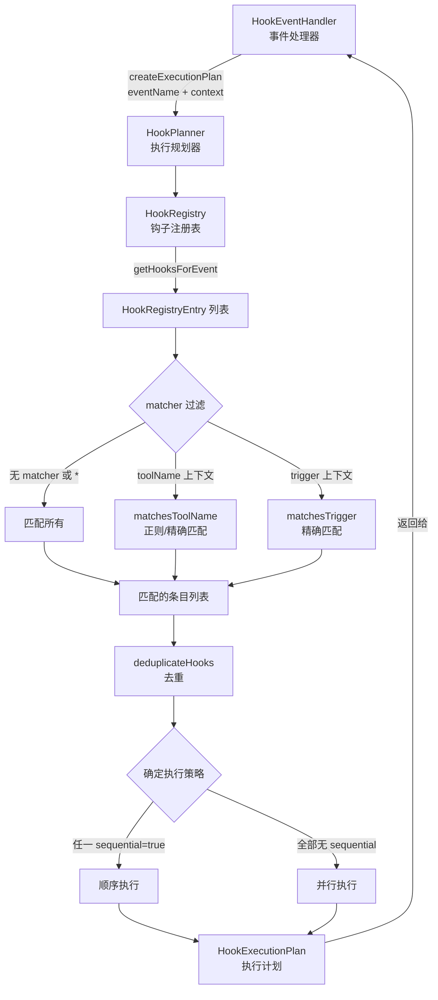

# hookPlanner.ts

## 概述

`HookPlanner` 是钩子系统的执行规划器，负责根据事件名称和上下文信息从钩子注册表中筛选匹配的钩子，并生成执行计划。它是钩子执行流水线中"选谁来跑"这一环节的核心组件，位于 `HookRegistry`（钩子存储）和 `HookRunner`（钩子执行）之间。

核心职责：
- 从 `HookRegistry` 获取指定事件的所有钩子条目
- 根据上下文信息（工具名、触发器等）通过 matcher 模式过滤钩子
- 对重复的钩子配置进行去重
- 确定执行策略（顺序或并行）
- 输出最终的 `HookExecutionPlan`

## 架构图（Mermaid）



### Matcher 匹配流程

```mermaid
flowchart TD
    START[matchesContext 入口] --> CHK1{entry 有 matcher<br/>且 context 存在?}
    CHK1 -->|否| RET_TRUE1[返回 true<br/>无 matcher 匹配全部]

    CHK1 -->|是| CHK2{matcher 为空<br/>或等于 '*'?}
    CHK2 -->|是| RET_TRUE2[返回 true<br/>通配符匹配全部]

    CHK2 -->|否| CHK3{context 包含<br/>toolName?}
    CHK3 -->|是| TOOL[matchesToolName]

    CHK3 -->|否| CHK4{context 包含<br/>trigger?}
    CHK4 -->|是| TRIG[matchesTrigger<br/>精确字符串匹配]
    CHK4 -->|否| RET_TRUE3[返回 true<br/>无匹配条件则通过]

    TOOL --> REGEX{尝试作为正则表达式}
    REGEX -->|合法正则| REGEX_TEST[regex.test\(toolName\)]
    REGEX -->|非法正则| EXACT[精确字符串匹配<br/>matcher === toolName]

    REGEX_TEST --> RESULT[返回匹配结果]
    EXACT --> RESULT
    TRIG --> RESULT
```

## 核心组件

### 接口 `HookEventContext`

钩子事件匹配的上下文信息。

| 字段 | 类型 | 描述 |
|------|------|------|
| `toolName` | `string \| undefined` | 工具名称，用于 BeforeTool/AfterTool 事件的匹配 |
| `trigger` | `string \| undefined` | 触发器/来源标识，用于 SessionStart/SessionEnd/PreCompress 事件的匹配 |

### 类 `HookPlanner`

#### 构造函数

| 参数 | 类型 | 描述 |
|------|------|------|
| `hookRegistry` | `HookRegistry` | 钩子注册表，提供按事件查询钩子的能力 |

#### 公共方法

- **`createExecutionPlan(eventName, context?)`**: 核心方法，创建钩子执行计划。流程：
  1. 从注册表获取指定事件的所有钩子条目
  2. 如果无钩子，返回 `null`
  3. 通过 `matchesContext` 过滤匹配的钩子
  4. 如果过滤后无钩子，返回 `null`
  5. 通过 `deduplicateHooks` 去重
  6. 提取钩子配置
  7. 确定执行策略：只要有任一钩子定义 `sequential=true`，则所有钩子顺序执行
  8. 返回 `HookExecutionPlan` 对象

  返回值 `HookExecutionPlan` 结构：
  | 字段 | 类型 | 描述 |
  |------|------|------|
  | `eventName` | `HookEventName` | 事件名称 |
  | `hookConfigs` | `HookConfig[]` | 去重后的钩子配置列表 |
  | `sequential` | `boolean` | 是否顺序执行 |

#### 私有方法

- **`matchesContext(entry, context?)`**: 上下文匹配方法。匹配规则：
  - 无 matcher 或无 context：匹配所有（返回 true）
  - matcher 为空字符串或 `*`：匹配所有
  - context 有 `toolName`：调用 `matchesToolName` 进行工具名匹配
  - context 有 `trigger`：调用 `matchesTrigger` 进行触发器匹配
  - 都不匹配：默认返回 true

- **`matchesToolName(matcher, toolName)`**: 工具名匹配。首先尝试将 matcher 作为正则表达式匹配，如果 matcher 不是合法正则表达式，则降级为精确字符串匹配。这允许用户使用如 `.*_file` 这样的正则模式匹配多个工具。

- **`matchesTrigger(matcher, trigger)`**: 触发器匹配。使用严格的精确字符串匹配（`===`）。

- **`deduplicateHooks(entries)`**: 钩子去重。使用 `getHookKey()` 函数（基于 name 和 command 生成键）来识别重复的钩子配置，保留首次出现的条目。

## 依赖关系

### 内部依赖

| 依赖模块 | 导入内容 | 用途 |
|----------|----------|------|
| `./hookRegistry.js` | `HookRegistry`, `HookRegistryEntry` | 钩子注册表及其条目类型，用于查询事件对应的钩子 |
| `./types.js` | `getHookKey` | 钩子键生成函数，用于去重时生成唯一标识 |
| `./types.js` | `HookExecutionPlan`, `HookEventName` | 执行计划和事件名称类型 |
| `../utils/debugLogger.js` | `debugLogger` | 调试日志记录，用于记录执行计划创建和去重信息 |

### 外部依赖

无外部依赖。`HookPlanner` 是一个纯内部组件，仅依赖钩子系统内部的模块和工具库。

## 关键实现细节

1. **保守的顺序执行策略**: 执行策略的确定采用"任一要求顺序则全部顺序"的保守策略（`deduplicatedEntries.some(entry => entry.sequential === true)`）。这确保了当任何钩子声明需要顺序执行时，所有钩子都以顺序方式运行，避免并发引起的竞态条件。默认情况下钩子并行执行以提升性能。

2. **正则表达式降级匹配**: `matchesToolName` 方法首先尝试将 matcher 作为正则表达式使用，如果解析失败则降级为精确匹配。这通过 try-catch 实现，使得简单的字符串和复杂的正则模式都能工作。例如：
   - `"read_file"` -- 精确匹配单个工具
   - `".*_file"` -- 正则匹配所有以 `_file` 结尾的工具
   - `"(read|write)_file"` -- 正则匹配 read_file 和 write_file

3. **基于键的去重**: 使用 `getHookKey()` 函数（由 `types.ts` 提供）生成钩子的唯一键，格式为 `${name}:${command}`。对于同一个钩子被多次注册的情况（如来自不同配置源），只保留第一个出现的版本。

4. **Null 返回语义**: `createExecutionPlan` 返回 `null` 而非空计划，明确表示"无需执行任何钩子"，调用者可以据此完全跳过后续的执行和聚合步骤，这是一种性能优化。

5. **trigger 与 toolName 的分离**: 上下文匹配将工具名匹配和触发器匹配分开处理。toolName 使用灵活的正则匹配（适用于工具名的模式匹配需求），而 trigger 使用严格的精确匹配（因为触发器值是枚举值，如 'startup'、'exit' 等，不需要模式匹配）。

6. **匹配的宽容性**: 多个边界条件都默认返回 true（匹配所有）——无 matcher、无 context、空 matcher、通配符、无 toolName 也无 trigger。这种设计确保钩子默认被执行，只有明确指定了 matcher 且不匹配时才被过滤掉。
