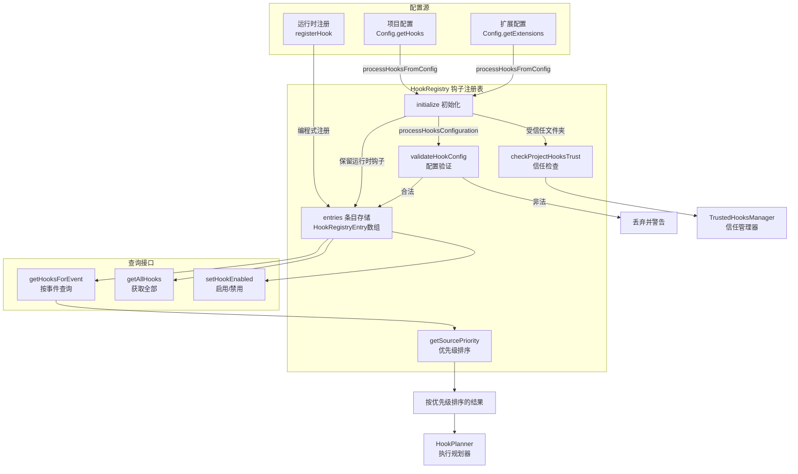
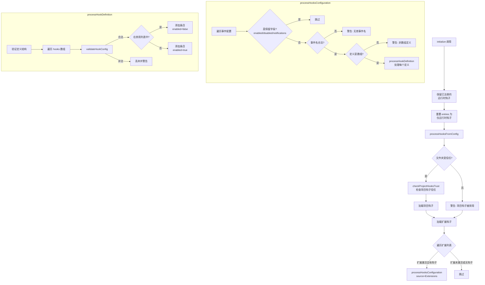

# hookRegistry.ts

## 概述

`HookRegistry` 是钩子系统的注册表/仓库，负责从多个配置源（运行时、项目配置、扩展等）加载、验证、存储和管理所有钩子定义。它是钩子系统的数据层，为 `HookPlanner` 提供按事件查询钩子的能力。

核心职责：
- 从 `Config` 对象加载项目和扩展的钩子配置
- 支持通过 `registerHook` 方法编程式注册运行时钩子
- 验证钩子配置的合法性（类型、必填字段等）
- 对不受信任的项目级钩子进行安全警告
- 按配置源优先级排序钩子（Runtime > Project > User > System > Extensions）
- 支持启用/禁用特定钩子
- 检查项目钩子的信任状态

## 架构图（Mermaid）

### 初始化和配置加载流程

## 核心组件

### 接口 `HookRegistryEntry`

钩子注册表中的单个条目。

| 字段 | 类型 | 描述 |
|------|------|------|
| `config` | `HookConfig` | 钩子配置（Command 或 Runtime 类型） |
| `source` | `ConfigSource` | 配置来源（Runtime/Project/User/System/Extensions） |
| `eventName` | `HookEventName` | 该钩子关联的事件名 |
| `matcher` | `string \| undefined` | 可选的匹配模式，用于过滤特定工具或触发器 |
| `sequential` | `boolean \| undefined` | 是否要求顺序执行 |
| `enabled` | `boolean` | 当前是否启用 |

### 类 `HookRegistry`

#### 构造函数

| 参数 | 类型 | 描述 |
|------|------|------|
| `config` | `Config` | 应用配置对象，提供钩子配置、项目信息、信任状态等 |

#### 私有属性

- **`entries`**: `HookRegistryEntry[]` -- 所有注册的钩子条目列表。

#### 公共方法

- **`registerHook(config, eventName, options?)`**: 编程式注册新钩子。先验证配置合法性，不合法则抛出异常。默认来源为 `ConfigSource.Runtime`，默认启用。

- **`initialize()`**: 异步初始化方法。流程：
  1. 保留已通过 `registerHook` 注册的运行时钩子
  2. 重置 entries 为仅运行时钩子
  3. 调用 `processHooksFromConfig` 从配置中加载钩子
  4. 记录初始化完成的调试日志

- **`getHooksForEvent(eventName)`**: 按事件名查询所有启用的钩子条目，并按配置源优先级排序（Runtime 最高，Extensions 最低）。

- **`getAllHooks()`**: 获取所有注册的钩子条目的副本（浅拷贝数组）。

- **`setHookEnabled(hookName, enabled)`**: 按钩子名称启用或禁用钩子。使用 `filter` 遍历匹配的条目并修改其 `enabled` 状态，同时记录操作结果。

#### 私有方法

- **`getHookName(entry)`**: 从条目中提取钩子名称。Command 类型优先返回 name，其次是 command。Runtime 类型返回 name。

- **`checkProjectHooksTrust()`**: 检查项目级钩子的信任状态：
  1. 获取项目钩子配置
  2. 通过 `TrustedHooksManager` 检查是否有未信任的钩子
  3. 如有未信任钩子，通过 `coreEvents.emitFeedback` 发出警告
  4. 警告后自动信任这些钩子（后续不再重复警告）

- **`processHooksFromConfig()`**: 从配置加载钩子的入口。处理流程：
  1. 如果文件夹受信任，先执行信任检查，再加载项目钩子
  2. 如果文件夹不受信任，跳过项目钩子并发出警告
  3. 遍历所有扩展，加载激活扩展的钩子

- **`processHooksConfiguration(hooksConfig, source)`**: 处理钩子配置映射。遍历每个事件名的定义列表，跳过保留字段（enabled/disabled/notifications），验证事件名合法性和定义格式。

- **`processHookDefinition(definition, eventName, source)`**: 处理单个钩子定义。验证定义结构，检查钩子是否在禁用列表中，验证配置合法性，最终添加到 entries。

- **`validateHookConfig(config, eventName, source)`**: 验证钩子配置：
  - type 必须是 'command'、'plugin' 或 'runtime'
  - command 类型必须有 command 字段
  - runtime 类型必须有 name 字段

- **`isValidEventName(eventName)`**: 检查事件名是否是 `HookEventName` 枚举中的合法值。使用类型谓词 `eventName is HookEventName`。

- **`getSourcePriority(source)`**: 返回配置源的优先级数值（数值越小优先级越高）：
  | 配置源 | 优先级 | 描述 |
  |--------|--------|------|
  | Runtime | 0 | 最高优先级（编程式注册） |
  | Project | 1 | 项目级配置 |
  | User | 2 | 用户级配置 |
  | System | 3 | 系统级配置 |
  | Extensions | 4 | 扩展级配置 |
  | 其他 | 999 | 未知来源 |

## 依赖关系

### 内部依赖

| 依赖模块 | 导入内容 | 用途 |
|----------|----------|------|
| `../config/config.js` | `Config` | 应用配置对象，提供钩子配置、项目信息、会话信息、信任状态等 |
| `./types.js` | `HookEventName`, `ConfigSource`, `HOOKS_CONFIG_FIELDS`, `HookDefinition`, `HookConfig` | 事件名枚举、配置源枚举、保留字段列表、钩子定义和配置类型 |
| `../utils/debugLogger.js` | `debugLogger` | 调试日志记录 |
| `./trustedHooks.js` | `TrustedHooksManager` | 项目钩子信任管理器，检查和标记已信任的钩子 |
| `../utils/events.js` | `coreEvents` | 核心事件总线，发射反馈警告（如不受信任的钩子、无效配置等） |

### 外部依赖

无外部依赖。`HookRegistry` 是一个纯内部组件。

## 关键实现细节

1. **多源钩子加载与优先级**: 钩子可以来自五个不同的配置源（Runtime、Project、User、System、Extensions），每个源有不同的优先级。`getHooksForEvent` 返回按优先级排序的结果，确保高优先级的钩子先被执行。Runtime 优先级最高，因为它是编程式注册的，通常代表最紧迫的需求。

2. **初始化时的运行时钩子保留**: `initialize` 方法在重新加载配置钩子时会先保留已注册的运行时钩子。这允许在不丢失编程式注册钩子的情况下重新加载配置。重置操作使用 `this.entries = [...runtimeHooks]` 创建新数组，确保不影响原有引用。

3. **项目钩子的安全机制**: 项目钩子受到两层安全保护：
   - **文件夹信任检查**: 不受信任的文件夹中的项目钩子完全不会被加载
   - **钩子信任检查**: 即使文件夹受信任，首次发现的未信任钩子也会向用户发出警告，告知将要执行的钩子命令，然后自动标记为已信任

4. **保留字段过滤**: `processHooksConfiguration` 在遍历配置键时，通过 `HOOKS_CONFIG_FIELDS`（包含 'enabled'、'disabled'、'notifications'）过滤掉非事件名的配置字段，避免误将这些元数据字段当作事件名处理。

5. **禁用钩子机制**: 在 `processHookDefinition` 中，从配置获取禁用钩子列表（`config.getDisabledHooks()`），如果钩子名在禁用列表中，条目仍然被创建但 `enabled` 设为 false。这样钩子仍然在注册表中可见（通过 `getAllHooks`），但不会被 `getHooksForEvent` 返回（因为后者过滤了 `enabled` 状态）。

6. **配置验证的多层防御**: 钩子配置经过多层验证：
   - 事件名合法性检查（`isValidEventName`）
   - 定义格式检查（是否为对象、hooks 字段是否为数组）
   - 配置合法性检查（`validateHookConfig`：type 合法性、必填字段）
   - 非法配置被丢弃并记录警告，不会导致系统崩溃

7. **扩展钩子的条件加载**: 扩展的钩子只有在扩展处于激活状态（`extension.isActive`）且包含钩子配置（`extension.hooks`）时才会被加载，避免加载未激活扩展的钩子。

8. **config.source 的注入**: 在 `processHookDefinition` 中，源信息被注入到 `hookConfig.source` 属性中（`hookConfig.source = source`），使得钩子配置本身携带其来源信息，方便后续处理（如遥测记录）时识别钩子来源。

9. **验证包含 'plugin' 类型**: `validateHookConfig` 中的类型验证包含 `'plugin'` 类型（`['command', 'plugin', 'runtime']`），虽然当前类型系统只定义了 Command 和 Runtime，但验证层为未来的 Plugin 类型预留了支持。
