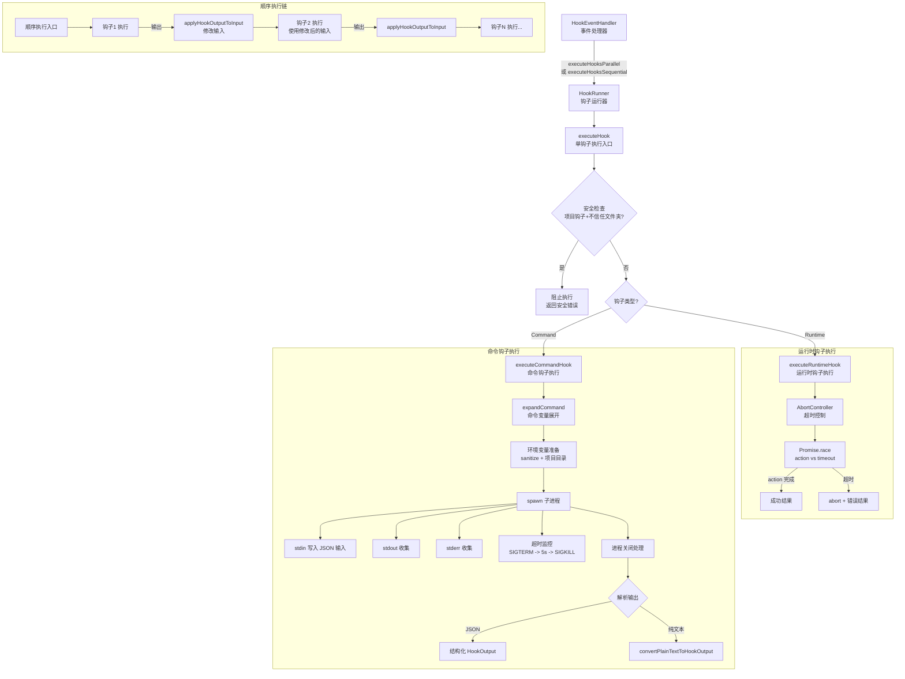
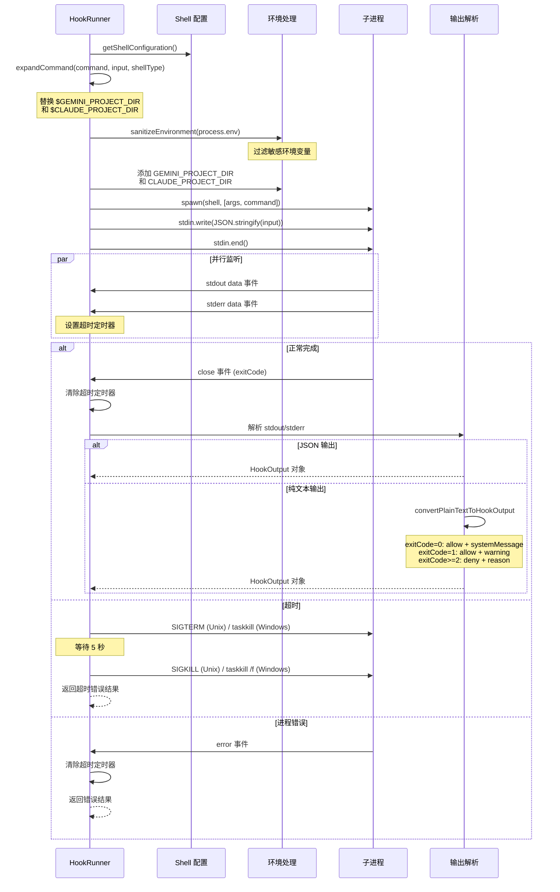
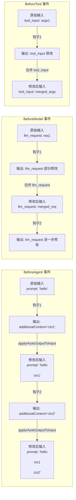

# hookRunner.ts

## 概述

`HookRunner` 是钩子系统的实际执行器，负责运行钩子（Command 类型和 Runtime 类型）并收集执行结果。它是钩子流水线中"怎么跑"这一环节的核心组件，支持并行和顺序两种执行模式，处理命令进程的生命周期管理、超时控制、输入输出传递、环境变量配置以及输出解析。

核心职责：
- 执行单个钩子（`executeHook`），区分 Runtime 和 Command 两种类型
- 提供并行执行（`executeHooksParallel`）和顺序执行（`executeHooksSequential`）两种批量执行模式
- 顺序执行时实现钩子链式输入传递（前一个钩子的输出修改下一个钩子的输入）
- 管理命令进程的生命周期（spawn、stdin 写入、stdout/stderr 收集、超时终止）
- 执行前的安全检查（不信任文件夹中阻止项目钩子执行）
- 解析钩子输出（JSON 解析或纯文本转换）
- 跨平台进程终止（Unix SIGTERM/SIGKILL vs Windows taskkill）

## 架构图（Mermaid）

### 命令钩子执行详细流程

### 顺序执行的输入链传递

## 核心组件

### 常量

| 常量 | 值 | 描述 |
|------|-----|------|
| `DEFAULT_HOOK_TIMEOUT` | `60000` (60 秒) | 钩子执行的默认超时时间 |
| `EXIT_CODE_SUCCESS` | `0` | 成功退出码 |
| `EXIT_CODE_NON_BLOCKING_ERROR` | `1` | 非阻断性错误退出码 |

### 类 `HookRunner`

#### 构造函数

| 参数 | 类型 | 描述 |
|------|------|------|
| `config` | `Config` | 应用配置对象，提供信任状态和环境清理配置 |

#### 公共方法

- **`executeHook(hookConfig, eventName, input)`**: 单钩子执行入口。流程：
  1. 记录开始时间
  2. 安全检查：如果是项目钩子且文件夹不受信任，直接阻止执行
  3. 根据钩子类型分派到 `executeRuntimeHook` 或 `executeCommandHook`
  4. 异常时返回包含错误的失败结果（非致命错误）

- **`executeHooksParallel(hookConfigs, eventName, input, onHookStart?, onHookEnd?)`**: 并行执行多个钩子。使用 `Promise.all` 并发执行所有钩子，每个钩子执行前后调用可选的回调。所有钩子接收相同的原始输入。

- **`executeHooksSequential(hookConfigs, eventName, input, onHookStart?, onHookEnd?)`**: 顺序执行多个钩子。使用 for 循环依次执行钩子，每个钩子执行前后调用可选的回调。**关键特性：钩子链式输入传递** -- 如果前一个钩子成功且有输出，通过 `applyHookOutputToInput` 将输出的修改应用到下一个钩子的输入中。

#### 私有方法

- **`applyHookOutputToInput(originalInput, hookOutput, eventName)`**: 根据事件类型将钩子输出的修改应用到下一个钩子的输入。支持三种事件的链式传递：

  | 事件类型 | 传递逻辑 |
  |----------|----------|
  | `BeforeAgent` | `hookSpecificOutput.additionalContext` 追加到 `input.prompt` 末尾（用 `\n\n` 分隔） |
  | `BeforeModel` | `hookSpecificOutput.llm_request` 的部分字段合并到 `input.llm_request` 中（展开合并） |
  | `BeforeTool` | `hookSpecificOutput.tool_input` 合并到 `input.tool_input` 中（展开合并） |
  | 其他事件 | 不修改输入 |

- **`executeRuntimeHook(hookConfig, eventName, input, startTime)`**: 执行运行时钩子（函数调用）。流程：
  1. 获取超时时间（配置值或默认 60 秒）
  2. 创建 `AbortController` 用于超时取消
  3. 创建超时 Promise
  4. 使用 `Promise.race` 在 action 执行和超时之间竞争
  5. 成功时返回结果，超时或错误时 abort 并返回错误结果
  6. `finally` 块中清理超时定时器

- **`executeCommandHook(hookConfig, eventName, input, startTime)`**: 执行命令钩子（子进程）。详细流程：
  1. 验证 command 字段存在
  2. 获取 Shell 配置（`getShellConfiguration`）
  3. 展开命令中的变量（`expandCommand`）
  4. PowerShell 特殊处理：附加退出码传播命令
  5. 准备环境变量：清理环境 + 注入 `GEMINI_PROJECT_DIR` 和 `CLAUDE_PROJECT_DIR` + 钩子自定义环境变量
  6. 使用 `spawn` 创建子进程（不使用 shell 选项，直接通过 shell 可执行文件执行）
  7. 设置超时监控：超时后先发 SIGTERM，5 秒后仍未退出则发 SIGKILL（Windows 使用 taskkill）
  8. 通过 stdin 写入 JSON 格式的输入数据，处理 EPIPE 错误
  9. 收集 stdout 和 stderr
  10. 进程关闭后解析输出：优先解析 JSON，失败则转换纯文本
  11. JSON 解析支持双重转义（如果 parsed 结果是字符串，再解析一次）

- **`expandCommand(command, input, shellType)`**: 命令变量展开。将命令字符串中的 `$GEMINI_PROJECT_DIR` 和 `$CLAUDE_PROJECT_DIR` 替换为转义后的工作目录路径。使用 `escapeShellArg` 确保路径中的特殊字符被正确处理。

- **`convertPlainTextToHookOutput(text, exitCode)`**: 将非 JSON 的纯文本输出转换为结构化的 `HookOutput`。转换规则：

  | 退出码 | decision | 输出处理 |
  |--------|----------|----------|
  | `0`（成功） | `allow` | 文本作为 `systemMessage` |
  | `1`（非阻断错误） | `allow` | 文本前缀 "Warning: " 作为 `systemMessage` |
  | `>=2`（阻断错误） | `deny` | 文本作为 `reason` |

## 依赖关系

### 内部依赖

| 依赖模块 | 导入内容 | 用途 |
|----------|----------|------|
| `./types.js` | `HookEventName`, `ConfigSource`, `HookType` 及各种 Input/Output/Config 类型 | 事件名、配置源、钩子类型枚举以及各种类型定义 |
| `../config/config.js` | `Config` | 应用配置，提供信任状态和环境清理配置 |
| `./hookTranslator.js` | `LLMRequest` | LLM 请求类型，用于 BeforeModel 事件的输入链传递 |
| `../utils/debugLogger.js` | `debugLogger` | 调试日志记录 |
| `../services/environmentSanitization.js` | `sanitizeEnvironment` | 环境变量清理，过滤敏感信息后传递给子进程 |
| `../utils/shell-utils.js` | `escapeShellArg`, `getShellConfiguration`, `ShellType` | Shell 相关工具函数，获取平台 Shell 配置和参数转义 |

### 外部依赖

| 依赖包 | 导入内容 | 用途 |
|--------|----------|------|
| `node:child_process` | `spawn`, `execSync` | Node.js 子进程模块。`spawn` 用于创建钩子命令子进程，`execSync` 用于 Windows 平台的 `taskkill` 进程终止 |

## 关键实现细节

1. **双重安全检查**: 虽然 `HookRegistry` 在加载时已经会过滤不信任文件夹的项目钩子，`HookRunner` 在 `executeHook` 中仍然执行了二次安全检查（"Secondary security check"），确保即使注册表层出现遗漏，项目钩子也不会在不信任的文件夹中执行。

2. **顺序执行的链式输入传递**: 这是 `executeHooksSequential` 区别于 `executeHooksParallel` 的关键特性。在顺序模式下，前一个钩子的输出会通过 `applyHookOutputToInput` 修改下一个钩子的输入，实现类似中间件的管道效果。例如，多个 BeforeAgent 钩子可以逐步向 prompt 追加上下文信息。

3. **运行时钩子的 AbortController 模式**: 运行时钩子使用 `AbortController` + `Promise.race` 实现超时控制。当超时触发时，AbortController 的 signal 被 abort，钩子的 action 函数可以通过检查 `options.signal` 来响应取消请求并进行清理。

4. **命令钩子的进程生命周期管理**: 命令钩子的超时处理采用两阶段终止策略：
   - 第一阶段：发送 SIGTERM（Unix）或 taskkill（Windows），给进程优雅退出的机会
   - 第二阶段：5 秒后如果进程仍在运行，发送 SIGKILL（Unix）或 taskkill /f（Windows）强制终止
   - Windows 平台使用 `taskkill /pid /f /t` 确保子进程树也被终止

5. **stdin 的 EPIPE 错误处理**: 当子进程在 HookRunner 完成写入 stdin 之前就退出时，会产生 EPIPE 错误。代码在两个层面处理了这种情况：
   - `stdin.on('error')` 事件监听器忽略 EPIPE 错误
   - `stdin.write/end` 外层包裹 try-catch 捕获同步 EPIPE 错误

6. **JSON 双重解析**: `executeCommandHook` 中的输出解析支持双重 JSON 解析。如果第一次 `JSON.parse` 的结果是字符串，会再次解析。这处理了某些命令输出会将 JSON 字符串再包裹一层引号的情况。

7. **纯文本到结构化输出的退出码语义**: `convertPlainTextToHookOutput` 定义了清晰的退出码语义：
   - 退出码 0：允许，文本作为系统消息
   - 退出码 1：允许但有警告
   - 退出码 >= 2：拒绝/阻断，文本作为拒绝原因
   这使得简单的 shell 脚本无需输出 JSON 就能控制钩子行为。

8. **PowerShell 退出码传播**: 对于 PowerShell，命令末尾追加 `; if ($LASTEXITCODE -ne 0) { exit $LASTEXITCODE }`，确保外部命令的退出码能正确传播到 spawn 的子进程退出码。这是因为 PowerShell 默认不会将外部命令的非零退出码传播为进程退出码。

9. **环境变量的层次覆盖**: 环境变量准备遵循严格的覆盖层次：
   - 基础层：经过 `sanitizeEnvironment` 清理的 `process.env`
   - 中间层：注入 `GEMINI_PROJECT_DIR` 和 `CLAUDE_PROJECT_DIR`（两者相同，后者用于兼容性）
   - 最高层：钩子配置中的自定义 `env`（`hookConfig.env`）

10. **非致命错误设计**: 整个 `executeHook` 方法的异常处理策略是"记录但不抛出"。所有异常都被捕获并封装为失败的 `HookExecutionResult`，并标注为"non-fatal"。这确保单个钩子的失败不会影响其他钩子的执行或整个系统的运行。

11. **spawn 的 shell: false 选项**: 虽然执行的是 shell 命令，但 `spawn` 的 `shell` 选项设为 `false`。这是因为 shell 可执行文件和参数已经通过 `getShellConfiguration()` 显式传递，不需要 Node.js 额外包装一层 shell。这种方式提供了更精确的进程控制。
