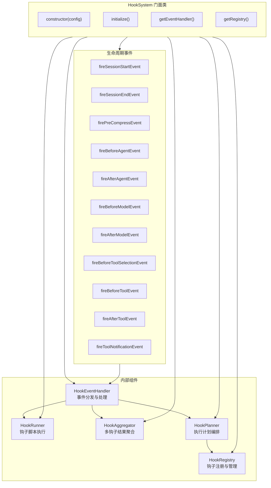

# hookSystem.ts

## 概述

`hookSystem.ts` 是 Gemini CLI 钩子（Hook）体系的**主入口和门面（Facade）类**。它将钩子注册（HookRegistry）、钩子运行（HookRunner）、结果聚合（HookAggregator）、执行计划（HookPlanner）和事件处理（HookEventHandler）五大子系统统一组织在 `HookSystem` 类中，对外提供简洁的生命周期事件触发 API，对内协调各组件协同工作。

该文件同时定义了三个关键的 Hook 结果接口（`BeforeModelHookResult`、`BeforeToolSelectionHookResult`、`AfterModelHookResult`），以及两个辅助函数（`toSerializableDetails`、`getNotificationMessage`），用于工具确认通知场景的数据序列化和消息生成。

## 架构图（Mermaid）

## 核心组件

### 1. `HookSystem` 类

门面类，在构造函数中创建全部五个子组件实例，并通过 `initialize()` 方法完成异步初始化（主要是注册表的初始化）。

**构造函数参数：**
- `config: Config` — 全局配置对象，传递给 HookRegistry、HookRunner 和 HookEventHandler。

**关键方法：**

| 方法 | 返回值 | 说明 |
|------|--------|------|
| `initialize()` | `Promise<void>` | 初始化钩子注册表 |
| `getEventHandler()` | `HookEventHandler` | 获取事件处理器实例 |
| `getRegistry()` | `HookRegistry` | 获取注册表实例 |
| `setHookEnabled(hookName, enabled)` | `void` | 启用/禁用指定钩子 |
| `getAllHooks()` | `HookRegistryEntry[]` | 获取所有已注册钩子 |
| `registerHook(config, eventName, options?)` | `void` | 以编程方式注册新钩子 |
| `fireSessionStartEvent(source)` | `Promise<DefaultHookOutput \| undefined>` | 触发会话开始事件 |
| `fireSessionEndEvent(reason)` | `Promise<AggregatedHookResult \| undefined>` | 触发会话结束事件 |
| `firePreCompressEvent(trigger)` | `Promise<AggregatedHookResult \| undefined>` | 触发预压缩事件 |
| `fireBeforeAgentEvent(prompt)` | `Promise<DefaultHookOutput \| undefined>` | 触发 Agent 执行前事件 |
| `fireAfterAgentEvent(prompt, response, stopHookActive?)` | `Promise<DefaultHookOutput \| undefined>` | 触发 Agent 执行后事件 |
| `fireBeforeModelEvent(llmRequest)` | `Promise<BeforeModelHookResult>` | 触发模型调用前事件，可拦截/修改请求 |
| `fireAfterModelEvent(originalRequest, chunk)` | `Promise<AfterModelHookResult>` | 触发模型响应后事件，可修改响应 |
| `fireBeforeToolSelectionEvent(llmRequest)` | `Promise<BeforeToolSelectionHookResult>` | 触发工具选择前事件，可修改工具配置 |
| `fireBeforeToolEvent(toolName, toolInput, mcpContext?, originalRequestName?)` | `Promise<DefaultHookOutput \| undefined>` | 触发工具执行前事件 |
| `fireAfterToolEvent(toolName, toolInput, toolResponse, mcpContext?, originalRequestName?)` | `Promise<DefaultHookOutput \| undefined>` | 触发工具执行后事件 |
| `fireToolNotificationEvent(confirmationDetails)` | `Promise<void>` | 触发工具确认通知事件 |

### 2. `BeforeModelHookResult` 接口

模型调用前钩子的处理结果，包含：
- `blocked: boolean` — 是否阻止模型调用
- `stopped?: boolean` — 是否完全停止执行
- `reason?: string` — 阻止/停止原因
- `syntheticResponse?: GenerateContentResponse` — 被阻止时返回的合成响应
- `modifiedConfig?: GenerateContentConfig` — 修改后的模型配置
- `modifiedContents?: ContentListUnion` — 修改后的内容

### 3. `BeforeToolSelectionHookResult` 接口

工具选择前钩子的处理结果，包含：
- `toolConfig?: ToolConfig` — 修改后的工具配置
- `tools?: ToolListUnion` — 修改后的工具列表

### 4. `AfterModelHookResult` 接口

模型响应后钩子的处理结果，包含：
- `response: GenerateContentResponse` — 最终响应（可能已修改）
- `stopped?: boolean` — 是否完全停止执行
- `blocked?: boolean` — 是否阻止模型调用
- `reason?: string` — 阻止/停止原因

### 5. `toSerializableDetails()` 辅助函数

将 `ToolCallConfirmationDetails` 转换为可序列化的 `Record<string, unknown>`。根据 `details.type`（`edit` / `exec` / `mcp` / `info`）提取不同字段，排除函数类型的属性（如 `onConfirm`、`ideConfirmation`）。

### 6. `getNotificationMessage()` 辅助函数

根据工具确认详情的类型生成人类可读的通知消息字符串。

## 依赖关系

### 内部依赖

| 模块 | 导入内容 | 用途 |
|------|----------|------|
| `../config/config.js` | `Config` 类型 | 全局配置 |
| `./hookRegistry.js` | `HookRegistry`, `HookRegistryEntry` | 钩子注册与管理 |
| `./hookRunner.js` | `HookRunner` | 钩子脚本执行 |
| `./hookAggregator.js` | `HookAggregator`, `AggregatedHookResult` | 多钩子结果聚合 |
| `./hookPlanner.js` | `HookPlanner` | 执行计划编排 |
| `./hookEventHandler.js` | `HookEventHandler` | 事件分发与处理 |
| `../utils/debugLogger.js` | `debugLogger` | 调试日志 |
| `./types.js` | 多个类型（`NotificationType`, `SessionStartSource`, `SessionEndReason`, `PreCompressTrigger`, 各种 HookOutput 类型等） | 类型定义 |
| `../tools/tools.js` | `ToolCallConfirmationDetails` | 工具调用确认详情 |

### 外部依赖

| 模块 | 导入内容 | 用途 |
|------|----------|------|
| `@google/genai` | `GenerateContentParameters`, `GenerateContentResponse`, `GenerateContentConfig`, `ContentListUnion`, `ToolConfig`, `ToolListUnion` | Google Generative AI SDK 类型 |

## 关键实现细节

1. **门面模式（Facade Pattern）**：`HookSystem` 类是经典的门面模式实现。它将五个子组件（Registry、Runner、Aggregator、Planner、EventHandler）的复杂交互封装在一个统一的接口后面，外部调用者只需与 `HookSystem` 交互。

2. **事件驱动的钩子生命周期**：系统定义了完整的生命周期事件链：会话开始/结束、Agent 前/后、模型调用前/后、工具选择前、工具执行前/后、预压缩、通知。每个事件都有对应的 `fire*Event` 方法。

3. **模型调用拦截机制（`fireBeforeModelEvent`）**：这是最复杂的事件处理逻辑，支持三种结果路径：
   - **停止执行**：`shouldStopExecution()` 为 true 时，返回 `{ blocked: true, stopped: true }`。
   - **阻止并返回合成响应**：存在 `blockingError` 时，通过 `getSyntheticResponse()` 生成合成响应。
   - **允许但修改**：通过 `applyLLMRequestModifications()` 修改请求的 config 和 contents。

4. **模型响应修改（`fireAfterModelEvent`）**：类似地支持停止、阻止、修改三种路径，通过 `getModifiedResponse()` 获取修改后的响应。

5. **工具选择修改（`fireBeforeToolSelectionEvent`）**：允许钩子修改工具配置（`toolConfig`）和工具列表（`tools`），实现动态工具过滤/增强。

6. **容错设计**：所有 `fire*Event` 方法都包含 `try-catch` 块，确保钩子执行失败不会中断主流程。失败时通过 `debugLogger` 记录错误并返回安全的默认值。

7. **序列化安全**：`toSerializableDetails()` 函数通过手动选择可序列化字段，确保传递给外部钩子脚本的数据不包含函数引用，避免 JSON 序列化错误。

8. **组件间的依赖注入**：`HookPlanner` 依赖 `HookRegistry`，`HookEventHandler` 依赖 `HookPlanner`、`HookRunner` 和 `HookAggregator`，这些依赖关系在 `HookSystem` 构造函数中通过直接传参建立。
