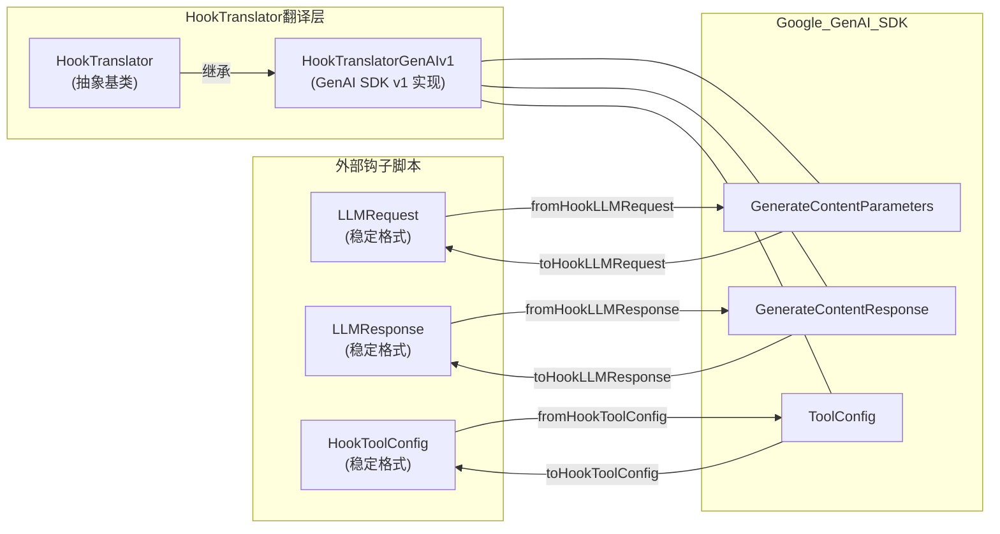

# hookTranslator.ts

## 概述

`hookTranslator.ts` 实现了 **Hook API 与 Google GenAI SDK 之间的双向类型转换层（Translation Layer）**。其核心目标是为外部钩子脚本提供一套**稳定的、与 SDK 版本解耦的数据格式**（`LLMRequest`、`LLMResponse`、`HookToolConfig`），使钩子开发者不必关心底层 SDK 的版本变更。

该文件采用了**抽象基类 + 具体实现**的策略模式：`HookTranslator` 定义抽象接口，`HookTranslatorGenAIv1` 提供针对 GenAI SDK v1.x 的具体翻译逻辑。文件末尾导出了默认的翻译器单例 `defaultHookTranslator`。

## 架构图（Mermaid）



## 核心组件

### 1. `LLMRequest` 接口（稳定的请求格式）

与 SDK 解耦的 LLM 请求格式，跨 Gemini CLI 版本保持稳定。

| 字段 | 类型 | 说明 |
|------|------|------|
| `model` | `string` | 模型名称 |
| `messages` | `Array<{role, content}>` | 消息数组，role 为 `'user'` / `'model'` / `'system'` |
| `config?` | 对象 | 生成参数（temperature、maxOutputTokens、topP、topK、stopSequences、candidateCount、presencePenalty、frequencyPenalty 等） |
| `toolConfig?` | `HookToolConfig` | 工具配置 |

### 2. `LLMResponse` 接口（稳定的响应格式）

与 SDK 解耦的 LLM 响应格式。

| 字段 | 类型 | 说明 |
|------|------|------|
| `text?` | `string` | 响应文本 |
| `candidates` | `Array<{content, finishReason?, index?, safetyRatings?}>` | 候选响应列表 |
| `usageMetadata?` | `{promptTokenCount?, candidatesTokenCount?, totalTokenCount?}` | Token 用量元数据 |

每个 candidate 的 `finishReason` 枚举值为：`'STOP'` / `'MAX_TOKENS'` / `'SAFETY'` / `'RECITATION'` / `'OTHER'`。

### 3. `HookToolConfig` 接口（稳定的工具配置格式）

| 字段 | 类型 | 说明 |
|------|------|------|
| `mode?` | `'AUTO'` / `'ANY'` / `'NONE'` | 函数调用模式 |
| `allowedFunctionNames?` | `string[]` | 允许的函数名列表 |

### 4. `HookTranslator` 抽象基类

定义了六个抽象翻译方法：

| 方法 | 方向 | 说明 |
|------|------|------|
| `toHookLLMRequest(sdkRequest)` | SDK -> Hook | 将 SDK 请求转为稳定格式 |
| `fromHookLLMRequest(hookRequest, baseRequest?)` | Hook -> SDK | 将稳定格式转回 SDK 请求 |
| `toHookLLMResponse(sdkResponse)` | SDK -> Hook | 将 SDK 响应转为稳定格式 |
| `fromHookLLMResponse(hookResponse)` | Hook -> SDK | 将稳定格式转回 SDK 响应 |
| `toHookToolConfig(sdkToolConfig)` | SDK -> Hook | 将 SDK 工具配置转为稳定格式 |
| `fromHookToolConfig(hookToolConfig)` | Hook -> SDK | 将稳定格式转回 SDK 工具配置 |

### 5. `HookTranslatorGenAIv1` 类（GenAI SDK v1.x 实现）

继承自 `HookTranslator`，实现全部六个翻译方法。

**`toHookLLMRequest` 的关键行为：**
- 将 `sdkRequest.contents` 统一为数组处理
- 字符串类型的 content 直接映射为 `role: 'user'`
- 对象类型的 content 通过 `isContentWithParts` 检查后提取 role 和 text parts
- **有意只提取文本部分**：非文本 parts（图片、函数调用等）在 v1 中被过滤掉，为钩子提供简化的纯文本接口
- 空文本消息会被跳过
- 无模型名称时回退到 `DEFAULT_GEMINI_FLASH_MODEL`

**`fromHookLLMRequest` 的关键行为：**
- 将 hook 消息转回 SDK Content 格式（role + parts）
- 如果提供了 `baseRequest`，以展开运算符（spread）保留其原有字段
- 从 baseRequest 中提取并合并生成配置

**`toHookLLMResponse` 的关键行为：**
- 使用 `getResponseText()` 工具函数提取响应文本
- 对每个 candidate 只提取文本 parts
- 安全评分、usage 元数据都进行适当转换

**`fromHookLLMResponse` 的关键行为：**
- 将纯文本 parts 数组转回 `{ text: string }` 对象数组
- finishReason 通过类型断言转回 SDK 的 `FinishReason` 类型

### 6. 辅助函数

| 函数 | 说明 |
|------|------|
| `hasTextProperty(value)` | 类型守卫，判断值是否有 `text: string` 属性 |
| `isContentWithParts(content)` | 类型守卫，判断值是否有 `role` 和 `parts` 属性 |
| `extractGenerationConfig(request)` | 从 SDK 请求中安全提取生成配置（temperature、maxOutputTokens、topP、topK） |

### 7. `defaultHookTranslator` 单例

```typescript
export const defaultHookTranslator = new HookTranslatorGenAIv1();
```

模块级别导出的默认翻译器实例，供整个系统使用。

## 依赖关系

### 内部依赖

| 模块 | 导入内容 | 用途 |
|------|----------|------|
| `../config/models.js` | `DEFAULT_GEMINI_FLASH_MODEL` | 默认模型名称回退值 |
| `../utils/partUtils.js` | `getResponseText` | 从 SDK 响应中提取文本 |

### 外部依赖

| 模块 | 导入内容 | 用途 |
|------|----------|------|
| `@google/genai` | `GenerateContentResponse`, `GenerateContentParameters`, `ToolConfig`, `FinishReason`, `FunctionCallingConfig` | Google GenAI SDK 核心类型 |

## 关键实现细节

1. **反腐层（Anti-Corruption Layer）模式**：这是一个经典的反腐层实现。`LLMRequest`、`LLMResponse`、`HookToolConfig` 构成了稳定的"限界上下文"接口，与外部 SDK 的类型完全隔离。当 SDK 升级（如从 v1 到 v2）时，只需新增一个 `HookTranslatorGenAIv2` 实现类，钩子脚本无需任何修改。

2. **有意的信息丢失**：`toHookLLMRequest` 方法在 v1 版本中**故意只保留文本内容**，过滤掉图片、函数调用等非文本 parts。这是一个经过深思熟虑的设计决策——简化钩子开发者的心智负担，同时为未来版本支持更丰富的内容类型留有扩展空间。

3. **基础请求合并策略**：`fromHookLLMRequest` 接受可选的 `baseRequest` 参数，通过 spread 运算符 `{ ...baseRequest, ... }` 合并，确保钩子未修改的字段（如 safety settings、system instruction 等）能保留原值。

4. **类型安全与类型断言的平衡**：由于 SDK 类型与 Hook 类型之间存在结构差异，代码中使用了多处 `as` 类型断言（如 `finishReason as FinishReason`），这些断言通过 eslint 注释显式标注，表明是经过审查的有意为之。

5. **双向转换的对称性**：每个 `to*` 方法都有对应的 `from*` 方法，形成完整的双向转换对。这确保了数据可以在 SDK 格式和 Hook 格式之间无损（在文本范围内）来回转换。

6. **安全评分的简化处理**：在 `toHookLLMResponse` 中，安全评分的 `category` 和 `probability` 都通过 `String()` 转为字符串，而在 `fromHookLLMResponse` 中直接透传，这种不对称处理体现了"输入宽容、输出严格"的设计原则。
