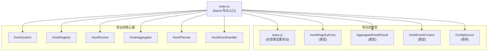

# index.ts

## 概述

`index.ts` 是 `packages/core/src/hooks/` 模块的**公共 API 入口文件（Barrel File）**。它负责将 hooks 子系统中的所有类型定义、核心类和关键接口统一导出，使外部消费者只需通过一条 `import { ... } from './hooks'` 语句即可访问完整的钩子功能。

该文件本身不包含任何业务逻辑，纯粹是模块组织和导出管理。

## 架构图（Mermaid）



## 核心组件

### 1. 类型全量重导出

```typescript
export * from './types.js';
```

将 `types.js` 中定义的**所有导出**（包括接口、类型别名、枚举等）透传导出。这意味着 `types.js` 中的任何公共类型都可以直接从 `index.ts` 访问。

### 2. 核心类导出

| 导出名 | 来源模块 | 类型 | 说明 |
|--------|----------|------|------|
| `HookSystem` | `./hookSystem.js` | 类 | 钩子系统门面类，主入口 |
| `HookRegistry` | `./hookRegistry.js` | 类 | 钩子注册与管理 |
| `HookRunner` | `./hookRunner.js` | 类 | 钩子脚本执行器 |
| `HookAggregator` | `./hookAggregator.js` | 类 | 多钩子结果聚合器 |
| `HookPlanner` | `./hookPlanner.js` | 类 | 钩子执行计划编排器 |
| `HookEventHandler` | `./hookEventHandler.js` | 类 | 事件分发与处理器 |

### 3. 接口与枚举导出

| 导出名 | 来源模块 | 类型 | 说明 |
|--------|----------|------|------|
| `HookRegistryEntry` | `./hookRegistry.js` | `type`（接口） | 注册表中单个钩子条目的结构 |
| `ConfigSource` | `./types.js` | 枚举 | 钩子配置来源（显式使用具名导出，而非依赖 `export *` 的重复导出） |
| `AggregatedHookResult` | `./hookAggregator.js` | `type`（接口） | 聚合后的钩子执行结果 |
| `HookEventContext` | `./hookPlanner.js` | `type`（接口） | 钩子事件上下文 |

## 依赖关系

### 内部依赖

| 模块 | 导出方式 | 说明 |
|------|----------|------|
| `./types.js` | `export *` + 显式 `export { ConfigSource }` | 全量类型重导出 |
| `./hookSystem.js` | 具名导出 | 门面类 |
| `./hookRegistry.js` | 具名导出（类 + 类型） | 注册表 |
| `./hookRunner.js` | 具名导出 | 执行器 |
| `./hookAggregator.js` | 具名导出（类 + 类型） | 聚合器 |
| `./hookPlanner.js` | 具名导出（类 + 类型） | 计划器 |
| `./hookEventHandler.js` | 具名导出 | 事件处理器 |

### 外部依赖

无。此文件不直接依赖任何外部包。

## 关键实现细节

1. **Barrel 模式（桶文件模式）**：这是 TypeScript/JavaScript 项目中常见的模块组织模式。通过 `index.ts` 作为单一入口，外部模块可以从一个路径导入所有需要的符号，无需了解内部文件结构。

2. **`export *` 与显式导出的组合**：`types.js` 使用 `export *` 进行全量重导出，其余模块使用显式具名导出。`ConfigSource` 枚举同时出现在 `export *` 和显式 `export { ConfigSource }` 中——显式导出可能是为了确保 IDE 自动导入的可发现性，或者为了强调其重要性。

3. **类型导出使用 `export type`**：`HookRegistryEntry`、`AggregatedHookResult`、`HookEventContext` 使用 `export type` 语法导出，确保它们在编译后不产生运行时代码，仅用于 TypeScript 类型检查。这是 TypeScript 的最佳实践，有助于 tree-shaking 和减小打包体积。

4. **模块边界定义**：该文件隐含地定义了 hooks 子系统的公共 API 边界——只有通过此文件导出的符号才被视为公共接口，未导出的内部实现细节（如 `hookTranslator.ts` 中的 `HookTranslatorGenAIv1`、`defaultHookTranslator` 等）对外部消费者不可见。值得注意的是，`hookTranslator.ts` 并没有在此处导出，说明翻译器被视为内部实现细节。
