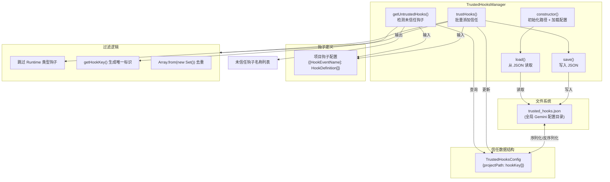

# trustedHooks.ts

## 概述

`trustedHooks.ts` 实现了 Gemini CLI 的**钩子信任管理机制**。其核心类 `TrustedHooksManager` 负责维护一个**基于项目路径的钩子白名单**，持久化存储在用户全局配置目录下的 `trusted_hooks.json` 文件中。

当项目中配置了外部钩子脚本时，系统需要在首次运行前确认用户是否信任这些脚本。该模块提供了两个关键能力：
1. **检测未受信任的钩子**（`getUntrustedHooks`）：对比已注册的钩子与信任白名单，找出尚未被信任的钩子。
2. **批量信任钩子**（`trustHooks`）：将用户确认信任的钩子添加到白名单并持久化。

这是一个**安全防线**，防止恶意或不受信任的钩子脚本在用户不知情的情况下被执行。

## 架构图（Mermaid）



## 核心组件

### 1. `TrustedHooksConfig` 接口

```typescript
interface TrustedHooksConfig {
  [projectPath: string]: string[]; // 受信任钩子键数组 (name:command)
}
```

内部数据结构，以**项目绝对路径**为键，值为该项目下受信任的钩子键（由 `getHookKey()` 生成的 `name:command` 字符串）数组。

### 2. `TrustedHooksManager` 类

#### 属性

| 属性 | 类型 | 说明 |
|------|------|------|
| `configPath` | `string` | `trusted_hooks.json` 文件的绝对路径 |
| `trustedHooks` | `TrustedHooksConfig` | 内存中的信任配置缓存 |

#### 构造函数

- 通过 `Storage.getGlobalGeminiDir()` 获取全局 Gemini 配置目录
- 拼接得到 `trusted_hooks.json` 的完整路径
- 立即调用 `load()` 加载已有配置

#### 方法

| 方法 | 可见性 | 返回值 | 说明 |
|------|--------|--------|------|
| `load()` | `private` | `void` | 从磁盘读取 `trusted_hooks.json`，解析为 `TrustedHooksConfig`。文件不存在或解析失败时静默回退为空对象。 |
| `save()` | `private` | `void` | 将当前 `trustedHooks` 序列化为 JSON 写入磁盘。目录不存在时自动递归创建。 |
| `getUntrustedHooks(projectPath, hooks)` | `public` | `string[]` | 检测给定项目路径下的未信任钩子。返回去重后的未信任钩子名称/命令列表。 |
| `trustHooks(projectPath, hooks)` | `public` | `void` | 将给定钩子配置中的所有钩子标记为受信任，并持久化保存。 |

### 3. `getUntrustedHooks` 详细流程

1. 从 `trustedHooks[projectPath]` 获取已信任的钩子键集合
2. 遍历所有事件名下的钩子定义（`HookDefinition[]`）
3. 对每个定义中的 `hooks` 数组进行遍历
4. **跳过 `HookType.Runtime` 类型的钩子**（Runtime 钩子不需要信任检查）
5. 使用 `getHookKey(hook)` 生成唯一标识
6. 若标识不在信任集合中，将钩子的 `name` 或 `command` 或 `'unknown-hook'` 添加到未信任列表
7. 最终通过 `new Set()` 去重后返回

### 4. `trustHooks` 详细流程

1. 获取当前项目已信任的钩子键集合（`Set`）
2. 遍历所有事件名下的钩子定义
3. **跳过 `HookType.Runtime` 类型**
4. 使用 `getHookKey(hook)` 生成标识并添加到集合
5. 将集合转为数组存入 `trustedHooks[projectPath]`
6. 调用 `save()` 持久化

## 依赖关系

### 内部依赖

| 模块 | 导入内容 | 用途 |
|------|----------|------|
| `../config/storage.js` | `Storage` | 获取全局 Gemini 配置目录路径 |
| `./types.js` | `getHookKey`, `HookType`, `HookDefinition`, `HookEventName` | 钩子键生成函数、钩子类型枚举、钩子定义接口、事件名类型 |
| `../utils/debugLogger.js` | `debugLogger` | 调试/警告日志 |

### 外部依赖

| 模块 | 导入内容 | 用途 |
|------|----------|------|
| `node:fs` | `fs`（整体导入） | 文件系统操作（existsSync、readFileSync、writeFileSync、mkdirSync） |
| `node:path` | `path`（整体导入） | 路径操作（join、dirname） |

## 关键实现细节

1. **基于项目路径的隔离**：信任配置以项目路径为键，不同项目的钩子信任状态互相独立。同一个钩子脚本在项目 A 被信任，不意味着在项目 B 也受信任。

2. **Runtime 钩子豁免**：`HookType.Runtime` 类型的钩子被显式跳过，不参与信任检查。这意味着运行时内联钩子（非外部脚本）被认为是安全的，无需用户确认。

3. **钩子唯一标识**：通过 `getHookKey(hook)` 函数生成 `name:command` 格式的唯一键。这意味着如果钩子的名称或命令发生变化，它会被视为一个新的未信任钩子，需要重新获得用户信任——这是一个重要的安全特性。

4. **同步文件操作**：`load()` 和 `save()` 使用同步的 `fs.readFileSync` / `fs.writeFileSync`，这在构造函数中是合理的（构造函数不能 async），但也意味着在高并发场景下可能存在竞态条件。

5. **静默容错**：无论是加载还是保存失败，都只通过 `debugLogger.warn()` 记录警告，不抛出异常。这确保信任系统的故障不会阻止 CLI 正常运行。最坏情况下，用户会被再次要求确认信任。

6. **增量信任**：`trustHooks` 方法不会覆盖已有的信任列表，而是将新钩子**追加**到已有集合中。通过 `Set` 数据结构自动去重。

7. **存储位置**：`trusted_hooks.json` 存储在全局 Gemini 配置目录（由 `Storage.getGlobalGeminiDir()` 返回），这是一个用户级别的持久存储位置，通常位于 `~/.gemini/` 下。
