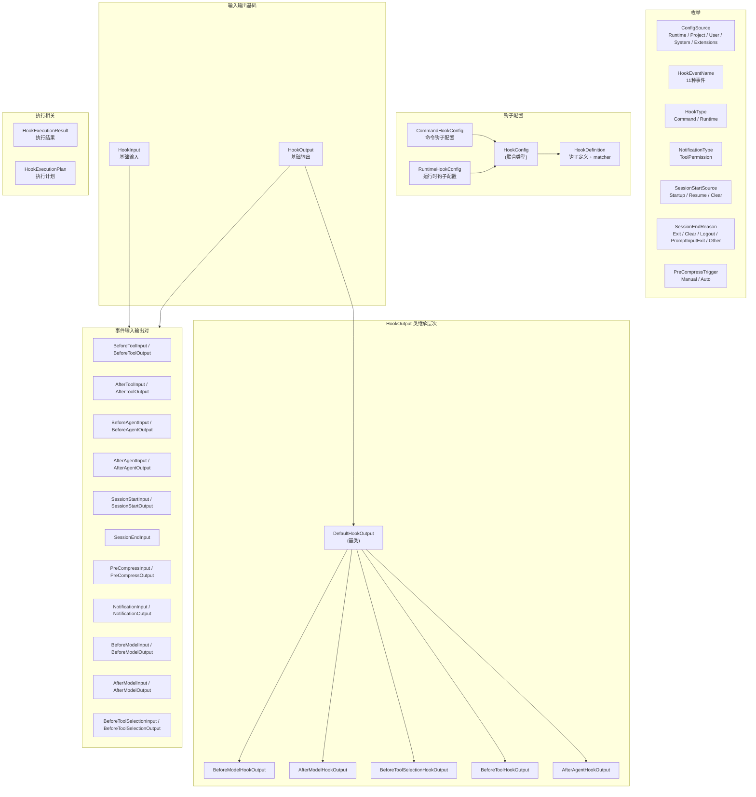

# types.ts

## 概述

`types.ts` 是 Gemini CLI 钩子子系统的**类型定义中心**。它集中定义了钩子系统中所有的枚举、接口、类型别名和输出类，是整个 hooks 模块的类型基础。

该文件的内容可分为以下几大类：
1. **枚举定义**：配置来源（`ConfigSource`）、事件名称（`HookEventName`）、钩子类型（`HookType`）、通知类型（`NotificationType`）、会话开始/结束原因、预压缩触发器等。
2. **钩子配置接口**：命令钩子（`CommandHookConfig`）、运行时钩子（`RuntimeHookConfig`）、钩子定义（`HookDefinition`）。
3. **输入/输出接口**：每种事件都有对应的 `*Input` 和 `*Output` 接口。
4. **HookOutput 类层次**：以 `DefaultHookOutput` 为基类，派生出 `BeforeModelHookOutput`、`AfterModelHookOutput`、`BeforeToolSelectionHookOutput`、`BeforeToolHookOutput`、`AfterAgentHookOutput` 五个子类，各自封装特定事件的输出处理逻辑。
5. **执行相关接口**：`HookExecutionResult`、`HookExecutionPlan`。

## 架构图（Mermaid）



## 核心组件

### 1. 枚举定义

#### `ConfigSource` — 配置来源（优先级从高到低）

| 值 | 说明 |
|----|------|
| `Runtime` | 运行时动态注册 |
| `Project` | 项目级配置 |
| `User` | 用户级配置 |
| `System` | 系统级配置（对用户隐藏） |
| `Extensions` | 扩展来源 |

#### `HookEventName` — 钩子事件名称（共 11 种）

| 值 | 说明 |
|----|------|
| `BeforeTool` | 工具执行前 |
| `AfterTool` | 工具执行后 |
| `BeforeAgent` | Agent 执行前 |
| `Notification` | 通知 |
| `AfterAgent` | Agent 执行后 |
| `SessionStart` | 会话开始 |
| `SessionEnd` | 会话结束 |
| `PreCompress` | 预压缩 |
| `BeforeModel` | 模型调用前 |
| `AfterModel` | 模型响应后 |
| `BeforeToolSelection` | 工具选择前 |

#### `HookType` — 钩子实现类型

| 值 | 说明 |
|----|------|
| `Command` | 外部命令脚本 |
| `Runtime` | 运行时内联函数 |

#### `NotificationType` — 通知类型

| 值 | 说明 |
|----|------|
| `ToolPermission` | 工具权限确认通知 |

#### `SessionStartSource` — 会话开始来源

| 值 | 说明 |
|----|------|
| `Startup` | 首次启动 |
| `Resume` | 恢复会话 |
| `Clear` | 清除后重新开始 |

#### `SessionEndReason` — 会话结束原因

| 值 | 说明 |
|----|------|
| `Exit` | 正常退出 |
| `Clear` | 清除 |
| `Logout` | 登出 |
| `PromptInputExit` | 输入提示退出 |
| `Other` | 其他原因 |

#### `PreCompressTrigger` — 预压缩触发器

| 值 | 说明 |
|----|------|
| `Manual` | 手动触发 |
| `Auto` | 自动触发 |

### 2. 钩子配置接口

#### `CommandHookConfig` — 命令钩子配置

| 字段 | 类型 | 必填 | 说明 |
|------|------|------|------|
| `type` | `HookType.Command` | 是 | 固定为 Command |
| `command` | `string` | 是 | 要执行的命令 |
| `action?` | `never` | 否 | 排他字段（命令钩子无 action） |
| `name?` | `string` | 否 | 钩子名称 |
| `description?` | `string` | 否 | 钩子描述 |
| `timeout?` | `number` | 否 | 超时时间（毫秒） |
| `source?` | `ConfigSource` | 否 | 配置来源 |
| `env?` | `Record<string, string>` | 否 | 环境变量 |

#### `RuntimeHookConfig` — 运行时钩子配置

| 字段 | 类型 | 必填 | 说明 |
|------|------|------|------|
| `type` | `HookType.Runtime` | 是 | 固定为 Runtime |
| `name` | `string` | 是 | 唯一名称 |
| `action` | `HookAction` | 是 | 执行函数 |
| `command?` | `never` | 否 | 排他字段（运行时钩子无 command） |
| `source?` | `ConfigSource` | 否 | 配置来源 |
| `timeout?` | `number` | 否 | 超时时间（毫秒） |

#### `HookConfig` — 钩子配置联合类型

```typescript
export type HookConfig = CommandHookConfig | RuntimeHookConfig;
```

#### `HookDefinition` — 钩子定义

| 字段 | 类型 | 说明 |
|------|------|------|
| `matcher?` | `string` | 匹配器表达式（用于工具名匹配等） |
| `sequential?` | `boolean` | 是否顺序执行（默认并行） |
| `hooks` | `HookConfig[]` | 该定义下的钩子配置数组 |

### 3. 基础输入/输出接口

#### `HookInput` — 基础钩子输入

| 字段 | 类型 | 说明 |
|------|------|------|
| `session_id` | `string` | 会话 ID |
| `transcript_path` | `string` | 对话记录路径 |
| `cwd` | `string` | 当前工作目录 |
| `hook_event_name` | `string` | 事件名称 |
| `timestamp` | `string` | 时间戳 |

#### `HookOutput` — 基础钩子输出

| 字段 | 类型 | 说明 |
|------|------|------|
| `continue?` | `boolean` | 是否继续执行（false 则停止） |
| `stopReason?` | `string` | 停止原因 |
| `suppressOutput?` | `boolean` | 是否抑制输出 |
| `systemMessage?` | `string` | 系统消息 |
| `decision?` | `HookDecision` | 决策类型 |
| `reason?` | `string` | 决策原因 |
| `hookSpecificOutput?` | `Record<string, unknown>` | 特定事件的附加输出 |

#### `HookDecision` — 决策类型

```typescript
export type HookDecision = 'ask' | 'block' | 'deny' | 'approve' | 'allow' | undefined;
```

### 4. `DefaultHookOutput` 类及其子类层次

#### `DefaultHookOutput`（基类）

实现 `HookOutput` 接口，提供以下工具方法：

| 方法 | 返回值 | 说明 |
|------|--------|------|
| `isBlockingDecision()` | `boolean` | 判断是否为阻止决策（`block` 或 `deny`） |
| `isAskDecision()` | `boolean` | 判断是否为询问决策（`ask`） |
| `shouldStopExecution()` | `boolean` | 判断是否需要停止执行（`continue === false`） |
| `getEffectiveReason()` | `string` | 获取有效原因（优先 stopReason，其次 reason） |
| `applyLLMRequestModifications(target)` | `GenerateContentParameters` | 基类空实现，子类覆盖 |
| `applyToolConfigModifications(target)` | `{toolConfig?, tools?}` | 基类空实现，子类覆盖 |
| `getAdditionalContext()` | `string \| undefined` | 从 hookSpecificOutput 中获取并转义 additionalContext |
| `getBlockingError()` | `{blocked, reason}` | 获取阻止错误信息 |
| `shouldClearContext()` | `boolean` | 基类返回 false，AfterAgentHookOutput 覆盖 |
| `getTailToolCallRequest()` | `{name, args} \| undefined` | 从 hookSpecificOutput 获取尾调用工具请求 |

#### `BeforeToolHookOutput`（继承自 DefaultHookOutput）

新增方法：
- `getModifiedToolInput()` — 从 `hookSpecificOutput.tool_input` 获取修改后的工具输入

#### `BeforeModelHookOutput`（继承自 DefaultHookOutput）

新增/覆盖方法：
- `getSyntheticResponse()` — 从 `hookSpecificOutput.llm_response` 获取合成响应，通过 `defaultHookTranslator` 转换为 SDK 格式
- `applyLLMRequestModifications(target)` (**override**) — 从 `hookSpecificOutput.llm_request` 获取修改后的请求，通过 `defaultHookTranslator` 转换后与原始请求合并

#### `BeforeToolSelectionHookOutput`（继承自 DefaultHookOutput）

覆盖方法：
- `applyToolConfigModifications(target)` (**override**) — 从 `hookSpecificOutput.toolConfig` 获取钩子工具配置，通过 `defaultHookTranslator` 转换为 SDK 格式

#### `AfterModelHookOutput`（继承自 DefaultHookOutput）

新增方法：
- `getModifiedResponse()` — 从 `hookSpecificOutput.llm_response` 获取修改后的响应，校验 candidates 非空后通过 `defaultHookTranslator` 转换

#### `AfterAgentHookOutput`（继承自 DefaultHookOutput）

覆盖方法：
- `shouldClearContext()` (**override**) — 从 `hookSpecificOutput.clearContext` 判断是否需要清除上下文

### 5. 事件特定的输入/输出接口

| 事件 | 输入接口 | 输出接口 | 特有输入字段 | 特有输出字段 |
|------|----------|----------|--------------|--------------|
| BeforeTool | `BeforeToolInput` | `BeforeToolOutput` | `tool_name`, `tool_input`, `mcp_context?`, `original_request_name?` | `tool_input?` |
| AfterTool | `AfterToolInput` | `AfterToolOutput` | `tool_name`, `tool_input`, `tool_response`, `mcp_context?`, `original_request_name?` | `additionalContext?`, `tailToolCallRequest?` |
| BeforeAgent | `BeforeAgentInput` | `BeforeAgentOutput` | `prompt` | `additionalContext?` |
| AfterAgent | `AfterAgentInput` | `AfterAgentOutput` | `prompt`, `prompt_response`, `stop_hook_active` | `clearContext?` |
| SessionStart | `SessionStartInput` | `SessionStartOutput` | `source` | `additionalContext?` |
| SessionEnd | `SessionEndInput` | (无专用输出) | `reason` | — |
| PreCompress | `PreCompressInput` | `PreCompressOutput` | `trigger` | `suppressOutput?`, `systemMessage?` |
| Notification | `NotificationInput` | `NotificationOutput` | `notification_type`, `message`, `details` | `suppressOutput?`, `systemMessage?` |
| BeforeModel | `BeforeModelInput` | `BeforeModelOutput` | `llm_request` | `llm_request?`, `llm_response?` |
| AfterModel | `AfterModelInput` | `AfterModelOutput` | `llm_request`, `llm_response` | `llm_response?` |
| BeforeToolSelection | `BeforeToolSelectionInput` | `BeforeToolSelectionOutput` | `llm_request` | `toolConfig?` |

### 6. 执行相关接口

#### `HookExecutionResult` — 钩子执行结果

| 字段 | 类型 | 说明 |
|------|------|------|
| `hookConfig` | `HookConfig` | 钩子配置 |
| `eventName` | `HookEventName` | 事件名称 |
| `success` | `boolean` | 是否成功 |
| `output?` | `HookOutput` | 输出 |
| `stdout?` | `string` | 标准输出 |
| `stderr?` | `string` | 标准错误 |
| `exitCode?` | `number` | 退出码 |
| `duration` | `number` | 执行耗时 |
| `error?` | `Error` | 错误信息 |

#### `HookExecutionPlan` — 钩子执行计划

| 字段 | 类型 | 说明 |
|------|------|------|
| `eventName` | `HookEventName` | 事件名称 |
| `hookConfigs` | `HookConfig[]` | 要执行的钩子配置列表 |
| `sequential` | `boolean` | 是否顺序执行 |

### 7. 工具函数

#### `isUserVisibleHook(source?)` — 判断钩子是否对用户可见

只有 `ConfigSource.System` 来源的钩子默认隐藏，其余均可见。未知来源也视为可见。

#### `getHookKey(hook)` — 生成钩子唯一键

格式为 `${name}:${command}`，用于信任管理中的唯一标识。

#### `createHookOutput(eventName, data)` — 工厂函数

根据事件名称创建对应的 HookOutput 子类实例：

| 事件名 | 创建类 |
|--------|--------|
| `'BeforeModel'` | `BeforeModelHookOutput` |
| `'AfterModel'` | `AfterModelHookOutput` |
| `'BeforeToolSelection'` | `BeforeToolSelectionHookOutput` |
| `'BeforeTool'` | `BeforeToolHookOutput` |
| `'AfterAgent'` | `AfterAgentHookOutput` |
| 其他 | `DefaultHookOutput` |

### 8. `McpToolContext` 接口 — MCP 工具上下文

| 字段 | 类型 | 说明 |
|------|------|------|
| `server_name` | `string` | MCP 服务器名称 |
| `tool_name` | `string` | MCP 工具原始名称 |
| `command?` | `string` | stdio 传输的命令 |
| `args?` | `string[]` | stdio 传输的参数 |
| `cwd?` | `string` | stdio 传输的工作目录 |
| `url?` | `string` | SSE/HTTP 传输的 URL |
| `tcp?` | `string` | WebSocket 传输的地址 |

### 9. 常量

```typescript
export const HOOKS_CONFIG_FIELDS = ['enabled', 'disabled', 'notifications'];
```

钩子配置中**不是**事件名的字段列表，用于在解析配置时区分元数据字段和事件定义。

## 依赖关系

### 内部依赖

| 模块 | 导入内容 | 用途 |
|------|----------|------|
| `./hookTranslator.js` | `defaultHookTranslator`, `LLMRequest`, `LLMResponse`, `HookToolConfig` | Hook 格式与 SDK 格式之间的翻译 |

### 外部依赖

| 模块 | 导入内容 | 用途 |
|------|----------|------|
| `@google/genai` | `GenerateContentResponse`, `GenerateContentParameters`, `ToolConfig` (as `GenAIToolConfig`), `ToolListUnion` | Google GenAI SDK 类型 |

## 关键实现细节

1. **类型安全的联合类型**：`HookConfig = CommandHookConfig | RuntimeHookConfig` 使用 `never` 类型的排他字段（`CommandHookConfig.action?: never` 和 `RuntimeHookConfig.command?: never`）确保两种配置互斥，防止同时设置 command 和 action。

2. **工厂模式的输出创建**：`createHookOutput()` 工厂函数根据事件名称动态创建正确的 HookOutput 子类实例，使调用方无需关心具体类型，但每个子类都有针对其事件的专门方法。

3. **多态覆盖**：`DefaultHookOutput` 基类提供了 `applyLLMRequestModifications` 和 `applyToolConfigModifications` 等空实现，子类（如 `BeforeModelHookOutput`、`BeforeToolSelectionHookOutput`）通过 `override` 关键字覆盖这些方法，实现具体的修改逻辑。这是经典的模板方法模式。

4. **XSS 防护**：`getAdditionalContext()` 方法对返回的 context 字符串进行 HTML 转义（`<` -> `&lt;`，`>` -> `&gt;`），防止标签注入攻击。这表明 additionalContext 可能被用于渲染 UI 内容。

5. **翻译器集成**：`BeforeModelHookOutput`、`AfterModelHookOutput`、`BeforeToolSelectionHookOutput` 都通过 `defaultHookTranslator` 将钩子脚本返回的稳定格式数据转换回 SDK 格式。这保持了钩子脚本与 SDK 的解耦。

6. **尾调用机制（Tail Tool Call）**：`getTailToolCallRequest()` 支持钩子请求在当前工具执行后立即执行另一个工具调用，其结果将替换原始工具的响应。这是一种强大的链式执行机制。

7. **`HookDecision` 的语义**：
   - `'block'` / `'deny'`：阻止执行
   - `'ask'`：要求用户确认
   - `'approve'` / `'allow'`：明确允许
   - `undefined`：无特殊决策

8. **MCP 上下文的传输类型感知**：`McpToolContext` 通过可选字段区分三种 MCP 传输方式（stdio: command/args/cwd、SSE/HTTP: url、WebSocket: tcp），这些字段互斥但未通过类型系统强制（注释说明了这一点）。

9. **会话生命周期完整性**：`SessionStartSource` 和 `SessionEndReason` 枚举定义了完整的会话边界事件原因，确保钩子能准确知道会话状态变更的上下文。
