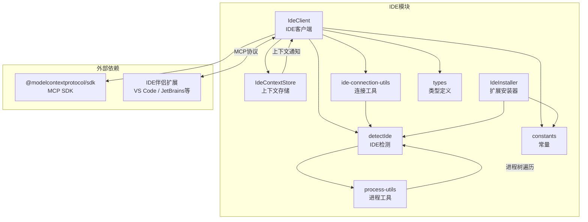

# ide

## 概述

`ide` 目录负责 Gemini CLI 与各种集成开发环境 (IDE) 之间的连接和交互。它提供了 IDE 检测、MCP 协议连接管理、差异对比 (Diff) 视图控制、IDE 上下文状态管理以及伴侣扩展自动安装等功能。该模块使 Gemini CLI 能够感知用户所在的 IDE 环境，并通过 MCP (Model Context Protocol) 与 IDE 扩展进行双向通信。

## 目录结构

```
ide/
├── constants.ts              # 常量定义（扩展名称、文件数量限制、超时等）
├── detect-ide.ts             # IDE 检测逻辑（通过环境变量和进程信息识别 IDE 类型）
├── detect-ide.test.ts        # detect-ide 的单元测试
├── ide-client.ts             # IDE 客户端核心类（MCP 连接管理、Diff 操作）
├── ide-client.test.ts        # ide-client 的单元测试
├── ide-connection-utils.ts   # 连接工具函数（端口获取、配置文件读取、代理处理等）
├── ide-connection-utils.test.ts # ide-connection-utils 的单元测试
├── ide-installer.ts          # IDE 伴侣扩展安装器（VS Code、Positron、Antigravity）
├── ide-installer.test.ts     # ide-installer 的单元测试
├── ideContext.ts              # IDE 上下文存储（管理打开的文件、光标位置等）
├── ideContext.test.ts         # ideContext 的单元测试
├── process-utils.ts          # 进程工具（通过进程树遍历查找 IDE 父进程）
├── process-utils.test.ts     # process-utils 的单元测试
└── types.ts                  # 类型定义和 Zod Schema（文件、上下文、通知等）
```

## 架构图



## 核心组件

### `IdeClient` (ide-client.ts)
- **职责**: IDE 连接的核心管理类，采用单例模式
- **主要功能**:
  - 通过 HTTP (StreamableHTTP) 或 Stdio 传输方式连接 IDE 的 MCP 服务器
  - 管理 Diff 视图的打开/关闭/接受/拒绝流程
  - 维护连接状态 (`Connected` / `Disconnected` / `Connecting`)
  - 使用 Promise 互斥锁确保 Diff 操作的串行执行
  - 注册通知处理器接收 IDE 上下文更新和 Diff 结果
- **关键类型**: `IDEConnectionState`, `IDEConnectionStatus`, `DiffUpdateResult`

### `detectIde` / `detectIdeFromEnv` (detect-ide.ts)
- **职责**: 检测当前运行环境中的 IDE 类型
- **支持的 IDE**: VS Code、Cursor、JetBrains 系列 (IntelliJ、WebStorm、PyCharm 等)、Zed、Sublime Text、Xcode、Replit、Devin、Cloud Shell、Firebase Studio、Trae、Positron、Antigravity 等
- **检测策略**: 优先通过环境变量检测，然后通过进程命令行信息进一步精确识别 (如区分具体的 JetBrains 产品)

### `IdeContextStore` (ideContext.ts)
- **职责**: 管理和分发 IDE 上下文状态
- **功能**: 存储打开的文件列表、活动文件、光标位置和选中文本；支持订阅/通知模式；限制最大文件数 (10) 和选中文本长度 (16KB)

### `ide-connection-utils` (ide-connection-utils.ts)
- **职责**: 提供连接相关的工具函数
- **关键函数**:
  - `getConnectionConfigFromFile`: 从临时目录读取 IDE 连接配置文件
  - `validateWorkspacePath`: 验证 CLI 工作目录是否在 IDE 工作区内
  - `createProxyAwareFetch`: 创建绕过代理的 fetch 函数用于本地连接
  - `getIdeServerHost`: 根据容器/SSH 环境决定服务器地址

### `getIdeInstaller` (ide-installer.ts)
- **职责**: 为不同 IDE 提供伴侣扩展的自动安装功能
- **支持的安装器**: `VsCodeInstaller`、`PositronInstaller`、`AntigravityInstaller`
- **安装方式**: 通过各 IDE 的 CLI 命令 (`code --install-extension` 等) 安装

### `getIdeProcessInfo` (process-utils.ts)
- **职责**: 通过进程树遍历查找 IDE 主进程的 PID 和命令
- **平台支持**: Unix (通过 `ps` 命令) 和 Windows (通过 PowerShell `Get-CimInstance`)

## 依赖关系

### 内部依赖
- `../utils/debugLogger.js` - 调试日志
- `../utils/paths.js` - 路径工具 (`isSubpath`, `resolveToRealPath`, `homedir`)
- `../utils/errors.js` - 错误工具 (`isNodeError`)

### 外部依赖
- `@modelcontextprotocol/sdk` - MCP 协议 SDK (Client, StreamableHTTPClientTransport, StdioClientTransport)
- `undici` - HTTP 客户端 (用于代理感知的 fetch)
- `zod` - 运行时类型校验 (定义通知和请求的 Schema)
- `open` - 跨平台打开浏览器/应用

## 数据流

### IDE 连接流程
1. `IdeClient.getInstance()` 初始化单例，获取 IDE 进程信息
2. `detectIde()` 通过环境变量和进程信息识别 IDE 类型
3. `connect()` 尝试连接：优先读取连接配置文件，回退到环境变量获取端口/stdio 配置
4. 通过 MCP 协议建立 HTTP 或 Stdio 连接
5. 注册通知处理器，开始接收 IDE 上下文更新

### Diff 操作流程
1. `openDiff()` 获取互斥锁，向 IDE 发送 `tools/call openDiff` 请求
2. IDE 显示差异对比视图，用户审查更改
3. IDE 通过 MCP 通知发送结果：`ide/diffAccepted` 或 `ide/diffRejected`
4. `IdeClient` 的通知处理器解析结果，通过 Promise resolve 返回给调用方
5. 释放互斥锁，允许下一个 Diff 操作
