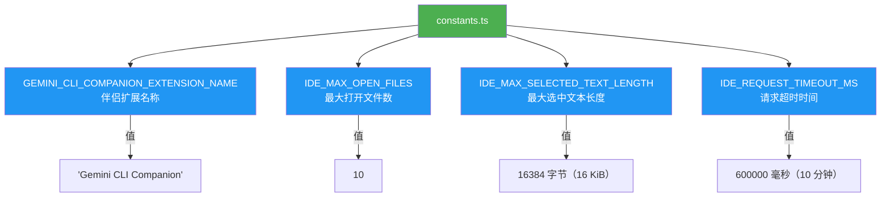

# constants.ts

## 概述

`constants.ts` 是 Gemini CLI IDE 集成模块的常量定义文件。该文件定义了 IDE 连接、通信以及数据处理过程中所使用的核心常量，包括扩展名称、文件数量限制、文本长度限制和请求超时时间等。这些常量被 IDE 模块中的其他文件广泛引用，起到统一配置管理的作用。

## 架构图（Mermaid）

## 核心组件

### 1. `GEMINI_CLI_COMPANION_EXTENSION_NAME`

- **类型**: `string`
- **值**: `'Gemini CLI Companion'`
- **用途**: 定义 Gemini CLI 伴侣扩展的显示名称。该名称用于在 IDE 中识别和定位 Gemini CLI 对应的扩展插件，通常在检测 IDE 扩展安装状态时使用。

### 2. `IDE_MAX_OPEN_FILES`

- **类型**: `number`
- **值**: `10`
- **用途**: 限制从 IDE 获取的最大打开文件数量。当 IDE 客户端请求当前打开的文件列表时，最多只返回 10 个文件的信息，防止数据量过大影响性能。

### 3. `IDE_MAX_SELECTED_TEXT_LENGTH`

- **类型**: `number`
- **值**: `16384`（16 KiB）
- **用途**: 限制从 IDE 获取的选中文本的最大长度。当用户在 IDE 中选中了一段文本并传递给 Gemini CLI 时，超过 16 KiB 的内容将被截断，避免过大的文本传输影响通信性能和模型上下文窗口。

### 4. `IDE_REQUEST_TIMEOUT_MS`

- **类型**: `number`
- **值**: `600000`（10 * 60 * 1000 毫秒，即 10 分钟）
- **用途**: 定义 IDE 请求的超时时间。当 Gemini CLI 向 IDE 发送请求（如获取文件内容、执行操作等）时，如果在 10 分钟内未收到响应，则视为超时。这个较长的超时时间考虑到了某些 IDE 操作可能需要较长的处理时间。

## 依赖关系

### 内部依赖

无。`constants.ts` 是一个纯常量定义文件，不依赖项目中的任何其他模块。

### 外部依赖

无。该文件不引入任何第三方库。

## 关键实现细节

1. **纯导出设计**: 文件中所有常量均使用 `export const` 声明，采用命名导出的方式，便于其他模块按需引用。
2. **命名规范**: 常量使用全大写蛇形命名（UPPER_SNAKE_CASE），符合 TypeScript/JavaScript 中常量的命名惯例。
3. **内联注释**: 对于数值型常量，文件通过注释标注了人类可读的单位说明（如 `// 16 KiB limit`、`// 10 minutes`），提高了代码可读性。
4. **许可证声明**: 文件顶部包含 Google LLC 的 Apache-2.0 许可证声明，表明该项目为 Google 的开源项目。
5. **被引用情况**: 这些常量被 `ide-client.ts`、`ide-connection-utils.ts` 等文件广泛引用，是 IDE 集成模块的配置中心。
