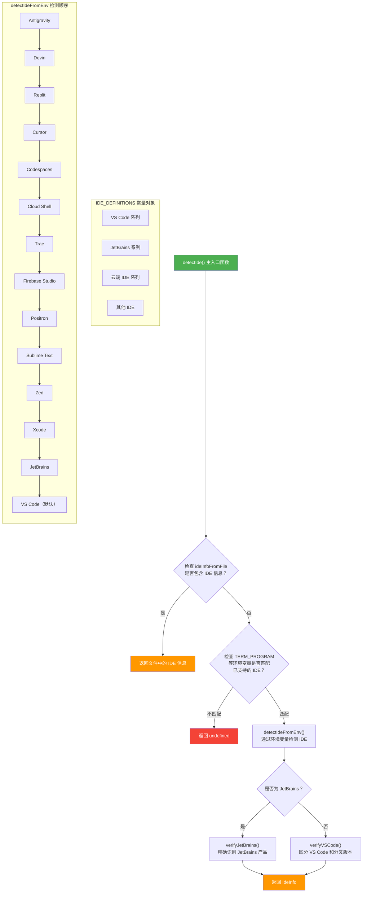

# detect-ide.ts

## 概述

`detect-ide.ts` 是 Gemini CLI IDE 集成模块的核心检测文件，负责自动识别用户当前所使用的 IDE（集成开发环境）。该文件通过读取环境变量和进程信息来判断终端运行在哪个 IDE 中，支持多达 25 种 IDE 的识别，包括 VS Code、JetBrains 全家桶、Cursor、Zed、Sublime Text、Xcode 等主流开发工具。

检测机制分为两个层次：
1. **环境变量检测**（`detectIdeFromEnv`）：通过特定环境变量快速判断 IDE 类型。
2. **进程信息精确验证**（`detectIde`）：结合进程命令行信息进一步细化识别结果，例如区分 VS Code 原版和 VS Code 的分叉版本，或区分不同的 JetBrains 产品。

## 架构图（Mermaid）



## 核心组件

### 1. `IDE_DEFINITIONS` 常量对象

一个使用 `as const` 声明的只读对象，包含所有支持的 IDE 定义。每个 IDE 定义包含：
- `name`: IDE 的内部标识名（小写无空格），用于程序内部比较
- `displayName`: IDE 的人类可读显示名称

支持的 IDE 列表（共 25 种）：

| 内部名称 | 显示名称 | 类别 |
|---------|---------|------|
| `devin` | Devin | AI 编码助手 |
| `replit` | Replit | 云端 IDE |
| `cursor` | Cursor | AI IDE |
| `cloudshell` | Cloud Shell | Google Cloud Shell |
| `codespaces` | GitHub Codespaces | 云端 IDE |
| `firebasestudio` | Firebase Studio | Google Firebase |
| `trae` | Trae | AI IDE |
| `vscode` | VS Code | 桌面 IDE |
| `vscodefork` | IDE | VS Code 分叉版本 |
| `positron` | Positron | 数据科学 IDE |
| `antigravity` | Antigravity | 特殊环境 |
| `sublimetext` | Sublime Text | 文本编辑器 |
| `jetbrains` | JetBrains IDE | JetBrains 通用 |
| `intellijidea` | IntelliJ IDEA | JetBrains Java |
| `webstorm` | WebStorm | JetBrains Web |
| `pycharm` | PyCharm | JetBrains Python |
| `goland` | GoLand | JetBrains Go |
| `androidstudio` | Android Studio | JetBrains Android |
| `clion` | CLion | JetBrains C/C++ |
| `rustrover` | RustRover | JetBrains Rust |
| `datagrip` | DataGrip | JetBrains 数据库 |
| `phpstorm` | PhpStorm | JetBrains PHP |
| `zed` | Zed | 现代编辑器 |
| `xcode` | XCode | Apple IDE |

### 2. `IdeInfo` 接口

```typescript
export interface IdeInfo {
  name: string;
  displayName: string;
}
```

IDE 信息的通用接口，是整个 IDE 检测系统的核心数据结构，被其他模块广泛引用。

### 3. `isCloudShell()` 函数

- **导出**: 是（`export`）
- **返回值**: `boolean`
- **逻辑**: 检查环境变量 `EDITOR_IN_CLOUD_SHELL` 或 `CLOUD_SHELL` 是否存在。如果任一存在，则判定当前运行在 Google Cloud Shell 环境中。

### 4. `isJetBrains()` 函数

- **导出**: 否（内部函数）
- **返回值**: `boolean`
- **逻辑**: 检查环境变量 `TERMINAL_EMULATOR` 是否包含 `'jetbrains'` 字符串（不区分大小写）。JetBrains 系列 IDE 的内置终端会设置此环境变量。

### 5. `detectIdeFromEnv()` 函数

- **导出**: 是（`export`）
- **返回值**: `IdeInfo`
- **逻辑**: 按照固定优先级顺序逐一检查环境变量，返回第一个匹配的 IDE 信息。如果没有任何环境变量匹配，**默认返回 VS Code**。

检测优先级（从高到低）：

1. `ANTIGRAVITY_CLI_ALIAS` -> Antigravity
2. `__COG_BASHRC_SOURCED` -> Devin
3. `REPLIT_USER` -> Replit
4. `CURSOR_TRACE_ID` -> Cursor
5. `CODESPACES` -> GitHub Codespaces
6. `EDITOR_IN_CLOUD_SHELL` / `CLOUD_SHELL` -> Cloud Shell
7. `TERM_PRODUCT === 'Trae'` -> Trae
8. `MONOSPACE_ENV` -> Firebase Studio
9. `POSITRON === '1'` -> Positron
10. `TERM_PROGRAM === 'sublime'` -> Sublime Text
11. `ZED_SESSION_ID` / `TERM_PROGRAM === 'Zed'` -> Zed
12. `XCODE_VERSION_ACTUAL` -> Xcode
13. `TERMINAL_EMULATOR` 包含 `'jetbrains'` -> JetBrains
14. 默认 -> VS Code

### 6. `verifyVSCode()` 函数

- **导出**: 否（内部函数）
- **参数**: `ide: IdeInfo`, `ideProcessInfo: { pid: number; command: string }`
- **返回值**: `IdeInfo`
- **逻辑**: 如果环境检测判断为 VS Code，则进一步检查进程命令行是否包含 `'code'` 字符串。如果不包含，则判定为 VS Code 的分叉版本（`vscodefork`），返回通用的 "IDE" 名称。

### 7. `detectIde()` 函数（主入口）

- **导出**: 是（`export`）
- **参数**:
  - `ideProcessInfo`: 包含 `pid`（进程 ID）和 `command`（命令行信息）的对象
  - `ideInfoFromFile?`: 可选参数，从文件中读取的 IDE 信息
- **返回值**: `IdeInfo | undefined`
- **逻辑**:
  1. 优先使用文件中的 IDE 信息（如果提供了有效的 name 和 displayName）
  2. 检查当前终端程序是否属于已支持的 IDE（VS Code、Sublime Text、JetBrains、Zed、Xcode）
  3. 如果不匹配任何支持的 IDE，返回 `undefined`
  4. 调用 `detectIdeFromEnv()` 获取初步结果
  5. 对 JetBrains 调用 `verifyJetBrains()` 精确化，对其他调用 `verifyVSCode()` 验证

### 8. `verifyJetBrains()` 函数

- **导出**: 否（内部函数）
- **参数**: `ide: IdeInfo`, `ideProcessInfo: { pid: number; command: string }`
- **返回值**: `IdeInfo`
- **逻辑**: 当检测到 JetBrains 系列 IDE 时，通过进程命令行中的关键字精确匹配具体产品：

| 命令行关键字 | 对应产品 |
|-------------|---------|
| `idea` | IntelliJ IDEA |
| `webstorm` | WebStorm |
| `pycharm` | PyCharm |
| `goland` | GoLand |
| `studio` | Android Studio |
| `clion` | CLion |
| `rustrover` | RustRover |
| `datagrip` | DataGrip |
| `phpstorm` | PhpStorm |

## 依赖关系

### 内部依赖

无。`detect-ide.ts` 不导入项目中的任何其他模块，是一个独立的检测工具文件。

### 外部依赖

- **`process.env`**（Node.js 内置）: 用于读取环境变量，是整个检测逻辑的核心数据来源。

## 关键实现细节

1. **默认回退策略**: `detectIdeFromEnv()` 的默认返回值是 VS Code。这意味着当无法通过环境变量确定 IDE 时，系统默认假设用户在 VS Code 的终端中运行。这是一个合理的假设，因为 VS Code 是最常见的使用场景。

2. **两级检测架构**:
   - 第一级通过环境变量快速判断大类（如 "这是 JetBrains" 或 "这是 VS Code"）
   - 第二级通过进程命令行精确化（如 "这是 PyCharm" 而非泛泛的 "JetBrains IDE"）

3. **`detectIde` vs `detectIdeFromEnv` 的区别**:
   - `detectIde` 是对外的主要接口，包含完整的检测流程（文件信息 -> 环境变量支持检查 -> 环境检测 -> 进程验证）
   - `detectIdeFromEnv` 仅做环境变量层面的检测，且永远返回非 undefined 的结果
   - `detectIde` 会在环境不支持时返回 `undefined`，而 `detectIdeFromEnv` 总是返回一个 IDE 信息

4. **优先级设计考量**: Antigravity 和 Devin 被排在最高优先级，可能因为它们的环境变量比较独特且不太可能与其他 IDE 共存。VS Code 作为默认值放在最低优先级。

5. **`as const` 断言**: `IDE_DEFINITIONS` 使用 `as const` 确保对象及其所有嵌套属性都是只读的，且 TypeScript 可以将其值推断为字面量类型而非宽泛的 string 类型。

6. **VS Code 分叉识别**: 通过检查进程命令行是否包含 `'code'` 来区分 VS Code 原版和分叉版（如 Windsurf 等）。分叉版本使用通用的 "IDE" 显示名称。

7. **仅支持部分 IDE 的直接集成**: `detectIde` 主函数中明确声明目前仅支持 VS Code、Sublime Text、JetBrains、Zed 和 Xcode 的直接集成。其他 IDE（如 Cursor、Replit 等）虽然在 `detectIdeFromEnv` 中可以被识别，但不会通过 `detectIde` 返回有效值（除非通过文件提供）。
