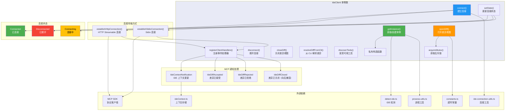

# ide-client.ts

## 概述

`ide-client.ts` 是 Gemini CLI IDE 集成模块的核心客户端文件，负责管理与 IDE 服务器之间的连接和交互。该文件实现了 `IdeClient` 类，采用单例模式（Singleton），通过 MCP（Model Context Protocol）协议与 IDE 伴侣扩展进行通信。

`IdeClient` 的主要职责包括：
- **连接管理**: 支持 HTTP（Streamable HTTP）和 Stdio 两种传输方式连接到 IDE 扩展服务器
- **Diff 视图管理**: 在 IDE 中打开差异对比视图，让用户审查和接受/拒绝代码变更
- **状态管理**: 跟踪连接状态（已连接/断开/连接中），并通知监听器状态变化
- **工具发现**: 自动发现 IDE 扩展支持的工具列表
- **上下文同步**: 接收 IDE 发送的上下文通知，同步工作区状态

## 架构图（Mermaid）



## 核心组件

### 1. 类型定义

#### `DiffUpdateResult`

```typescript
export type DiffUpdateResult =
  | { status: 'accepted'; content?: string; }
  | { status: 'rejected'; content: undefined; };
```

差异操作的结果类型，为联合类型（Discriminated Union）：
- **accepted**: 用户接受了差异，`content` 可能包含用户手动编辑后的最终内容
- **rejected**: 用户拒绝了差异，`content` 始终为 `undefined`

#### `IDEConnectionState`

```typescript
export type IDEConnectionState = {
  status: IDEConnectionStatus;
  details?: string;
};
```

连接状态对象，包含状态枚举值和面向用户的详情描述。

#### `IDEConnectionStatus` 枚举

```typescript
export enum IDEConnectionStatus {
  Connected = 'connected',
  Disconnected = 'disconnected',
  Connecting = 'connecting',
}
```

连接状态的三种取值。

### 2. `IdeClient` 类

#### 私有成员变量

| 成员 | 类型 | 说明 |
|------|------|------|
| `instancePromise` | `Promise<IdeClient> \| null` | 静态单例 Promise |
| `client` | `Client \| undefined` | MCP 协议客户端实例 |
| `state` | `IDEConnectionState` | 当前连接状态 |
| `currentIde` | `IdeInfo \| undefined` | 当前检测到的 IDE 信息 |
| `ideProcessInfo` | `{ pid: number; command: string } \| undefined` | IDE 进程信息 |
| `diffResponses` | `Map<string, (result: DiffUpdateResult) => void>` | 以文件路径为键的差异回调映射表 |
| `statusListeners` | `Set<(state: IDEConnectionState) => void>` | 状态变化监听器集合 |
| `trustChangeListeners` | `Set<(isTrusted: boolean) => void>` | 工作区信任状态变化监听器 |
| `availableTools` | `string[]` | IDE 扩展提供的可用工具名称列表 |
| `diffMutex` | `Promise<void>` | 差异视图互斥锁，确保同一时刻只有一个差异视图 |

#### `getInstance()` - 静态单例获取方法

```typescript
static getInstance(): Promise<IdeClient>
```

异步单例模式。首次调用时：
1. 创建 `IdeClient` 实例
2. 通过 `getIdeProcessInfo()` 获取 IDE 进程信息
3. 通过 `getConnectionConfigFromFile()` 获取连接配置文件
4. 调用 `detectIde()` 检测当前 IDE

后续调用直接返回同一个 Promise。

#### `connect()` - 连接方法

```typescript
async connect(options: { logToConsole?: boolean } = {}): Promise<void>
```

建立与 IDE 的连接，按以下优先级依次尝试：

1. **检查 IDE 支持**: 如果 `currentIde` 为 undefined，设置断开状态并返回
2. **校验工作区路径**: 通过 `validateWorkspacePath` 确保路径有效
3. **从配置文件连接**:
   - 先尝试 HTTP 连接（如果配置了端口）
   - 再尝试 Stdio 连接（如果配置了 stdio）
4. **从环境变量连接**:
   - 先尝试 HTTP 连接（`getPortFromEnv()`）
   - 再尝试 Stdio 连接（`getStdioConfigFromEnv()`）
5. **全部失败**: 设置断开状态，提示用户安装扩展

#### `openDiff()` - 打开差异视图

```typescript
async openDiff(filePath: string, newContent: string): Promise<DiffUpdateResult>
```

在 IDE 中打开差异对比视图的核心方法：
1. 通过 `acquireMutex()` 获取互斥锁，确保同时只有一个差异视图
2. 将文件路径对应的 resolve 回调存入 `diffResponses` Map
3. 通过 MCP 协议调用 IDE 的 `openDiff` 工具
4. 等待 IDE 通过通知回复用户的操作结果
5. 在 Promise 完成（无论成功或失败）后释放互斥锁

#### `acquireMutex()` - 互斥锁

```typescript
private acquireMutex(): Promise<() => void>
```

基于 Promise 链实现的互斥锁机制：
- 每次调用创建一个新的 Promise 作为新的 mutex
- 返回的 Promise 在上一个 mutex 释放后才 resolve
- resolve 的值是释放函数（`release`），调用后下一个等待者可以继续
- 实现效果：diff 操作排队串行执行

#### `closeDiff()` - 关闭差异视图

```typescript
async closeDiff(filePath: string, options?: { suppressNotification?: boolean }): Promise<string | undefined>
```

关闭指定文件的差异视图：
- 通过 MCP 协议调用 IDE 的 `closeDiff` 工具
- `suppressNotification` 选项用于防止关闭时触发的通知与 resolve 操作产生竞态条件
- 返回关闭时文件的内容（如果有），或 `undefined`

#### `resolveDiffFromCli()` - 从 CLI 解析差异

```typescript
async resolveDiffFromCli(filePath: string, outcome: 'accepted' | 'rejected')
```

从 CLI 端主动解析差异操作（而非等待 IDE 通知）：
1. 先调用 `closeDiff` 关闭视图（抑制通知）
2. 手动调用存储的 resolver 回调
3. 从 `diffResponses` Map 中删除该条目

#### `disconnect()` - 断开连接

```typescript
async disconnect()
```

优雅断开与 IDE 的连接：
1. 关闭所有打开的差异视图
2. 清空 `diffResponses` Map
3. 设置断开状态
4. 关闭 MCP 客户端连接

#### `isDiffingEnabled()` - 检查差异功能是否可用

```typescript
isDiffingEnabled(): boolean
```

返回 `true` 需要同时满足三个条件：
- MCP 客户端已创建
- 连接状态为已连接
- IDE 扩展支持 `openDiff` 和 `closeDiff` 两个工具

#### `discoverTools()` - 工具发现

```typescript
private async discoverTools(): Promise<void>
```

通过 MCP 协议的 `tools/list` 方法发现 IDE 扩展支持的工具列表。如果 IDE 不支持工具发现（返回 "Method not found" 错误），则静默处理。

#### `setState()` - 状态更新

```typescript
private setState(status: IDEConnectionStatus, details?: string, logToConsole = false)
```

更新连接状态并通知所有监听器：
- 如果状态已经是断开且新状态仍然是断开，则不更新（保留首次的详情信息）
- 当状态变为断开时，清空 IDE 上下文存储

#### `registerClientHandlers()` - 注册事件处理器

注册四种 MCP 通知处理器：

1. **IdeContextNotification**: 接收 IDE 上下文更新（打开的文件、选中的文本等），并同步到 `ideContextStore`。如果通知中包含工作区信任状态变化，通知所有信任变化监听器。
2. **IdeDiffAccepted**: 用户在 IDE 中接受了差异，调用对应的 resolver
3. **IdeDiffRejected**: 用户在 IDE 中拒绝了差异，调用对应的 resolver
4. **IdeDiffClosed**（向后兼容）: 旧版扩展发送的差异关闭通知，视为拒绝处理

同时注册错误和关闭事件处理器，在连接异常断开时更新状态。

#### `establishHttpConnection()` - HTTP 连接

```typescript
private async establishHttpConnection(port: string, authToken: string | undefined): Promise<boolean>
```

通过 HTTP Streamable 方式建立连接：
1. 校验端口号有效性（防止 SSRF 攻击）
2. 构建 MCP 服务器 URL（`http://{host}:{port}/mcp`）
3. 创建 `StreamableHTTPClientTransport` 传输层（支持代理感知的 fetch）
4. 如果提供了 authToken，在请求头中添加 Bearer 认证
5. 连接成功后注册事件处理器并发现工具

#### `establishStdioConnection()` - Stdio 连接

```typescript
private async establishStdioConnection({ command, args }: StdioConfig): Promise<boolean>
```

通过 Stdio（标准输入/输出）方式建立连接：
1. 创建 `StdioClientTransport` 传输层
2. 使用指定的命令和参数启动子进程
3. 连接成功后注册事件处理器并发现工具

### 3. 日志记录器

```typescript
const logger = {
  debug: (...args: any[]) => debugLogger.debug('[DEBUG] [IDEClient]', ...args),
  error: (...args: any[]) => debugLogger.error('[ERROR] [IDEClient]', ...args),
};
```

封装了 `debugLogger`，自动添加 `[IDEClient]` 前缀，便于在日志中区分来源。

## 依赖关系

### 内部依赖

| 模块 | 导入内容 | 用途 |
|------|---------|------|
| `./detect-ide.js` | `detectIde`, `IdeInfo` | IDE 检测功能 |
| `./ideContext.js` | `ideContextStore` | IDE 上下文状态存储 |
| `./types.js` | `IdeContextNotificationSchema`, `IdeDiffAcceptedNotificationSchema`, `IdeDiffRejectedNotificationSchema`, `IdeDiffClosedNotificationSchema` | MCP 通知 Schema 定义 |
| `./process-utils.js` | `getIdeProcessInfo` | 获取 IDE 进程信息 |
| `./constants.js` | `IDE_REQUEST_TIMEOUT_MS` | 请求超时常量（10 分钟） |
| `../utils/debugLogger.js` | `debugLogger` | 调试日志工具 |
| `./ide-connection-utils.js` | `getConnectionConfigFromFile`, `getIdeServerHost`, `getPortFromEnv`, `getStdioConfigFromEnv`, `validateWorkspacePath`, `createProxyAwareFetch`, `StdioConfig` | 连接配置工具函数 |

### 外部依赖

| 包名 | 导入内容 | 用途 |
|------|---------|------|
| `@modelcontextprotocol/sdk/client/index.js` | `Client` | MCP 协议客户端核心类 |
| `@modelcontextprotocol/sdk/client/streamableHttp.js` | `StreamableHTTPClientTransport` | HTTP Streamable 传输层 |
| `@modelcontextprotocol/sdk/client/stdio.js` | `StdioClientTransport` | Stdio 传输层 |
| `@modelcontextprotocol/sdk/types.js` | `CallToolResultSchema`, `ListToolsResultSchema` | MCP 协议类型定义 |

## 关键实现细节

1. **异步单例模式**: `getInstance()` 返回的是 `Promise<IdeClient>` 而非 `IdeClient`。这是因为实例化过程涉及异步操作（获取进程信息、读取配置文件）。使用 Promise 作为缓存确保并发调用不会创建多个实例。

2. **互斥锁（Mutex）机制**: Diff 操作使用 Promise 链实现互斥锁，确保同一时刻只有一个差异视图打开。这是因为 VS Code 等 IDE 无法同时处理多个差异视图。互斥锁的实现巧妙地利用了 Promise 的链式特性，不需要额外的锁库。

3. **连接回退策略**: `connect()` 方法实现了多级回退：配置文件 HTTP -> 配置文件 Stdio -> 环境变量 HTTP -> 环境变量 Stdio。任一方式连接成功就立即返回。

4. **SSRF 防护**: HTTP 连接中对端口号进行严格校验（必须是 1-65535 的正整数），防止服务端请求伪造攻击。

5. **向后兼容**: 同时处理 `IdeDiffRejected` 和 `IdeDiffClosed` 两种通知，其中 `IdeDiffClosed` 是为了兼容旧版扩展。两者都被视为拒绝操作。

6. **状态去重**: `setState()` 避免在已经断开的状态下重复更新为断开状态，保留首次断开时的详情信息，避免覆盖有用的错误描述。

7. **认证机制**: HTTP 连接支持 Bearer Token 认证，令牌来源优先级为：配置文件 > 环境变量 `GEMINI_CLI_IDE_AUTH_TOKEN`。

8. **工作区信任**: 通过 `trustChangeListeners` 机制将 IDE 工作区的信任状态变化传播给 CLI 的其他部分，影响安全策略决策。

9. **代理感知**: HTTP 连接使用 `createProxyAwareFetch` 创建代理感知的 fetch 函数，确保在企业代理环境下也能正常工作。
