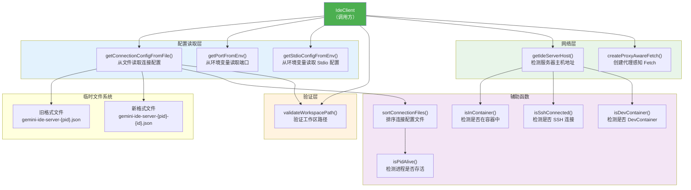

# ide-connection-utils.ts

## 概述

`ide-connection-utils.ts` 是 Gemini CLI IDE 集成模块的连接工具文件，提供了一系列用于建立和管理 IDE 连接的实用函数。该文件负责以下关键任务：

- **连接配置读取**: 从临时文件或环境变量中读取 IDE 服务器的连接配置（端口、认证令牌、Stdio 配置等）
- **工作区路径验证**: 验证 CLI 的当前工作目录是否在 IDE 打开的工作区内
- **服务器主机检测**: 根据运行环境（本地、容器、SSH、DevContainer）自动确定 IDE 服务器的主机地址
- **代理感知 Fetch**: 创建能正确处理企业代理配置的 HTTP 请求函数
- **进程存活检测**: 检查 IDE 进程是否仍然在运行
- **连接文件排序**: 当存在多个 IDE 窗口时，智能选择最合适的连接配置

## 架构图（Mermaid）



## 核心组件

### 1. 类型定义

#### `StdioConfig`

```typescript
export type StdioConfig = {
  command: string;
  args: string[];
};
```

Stdio 传输方式的配置，包含要执行的命令和参数列表。

#### `ConnectionConfig`

```typescript
export type ConnectionConfig = {
  port?: string;
  authToken?: string;
  stdio?: StdioConfig;
};
```

连接配置的基本结构，支持 HTTP（通过 port）和 Stdio 两种方式，以及可选的认证令牌。

### 2. `validateWorkspacePath()` - 工作区路径验证

```typescript
export function validateWorkspacePath(
  ideWorkspacePath: string | undefined,
  cwd: string,
): { isValid: boolean; error?: string }
```

验证 CLI 当前目录是否位于 IDE 工作区路径内：

- **`undefined` 路径**: 返回无效，提示扩展未运行
- **空字符串路径**: 返回无效，提示用户在 IDE 中打开工作区文件夹
- **有效路径**: 支持多个工作区路径（以系统路径分隔符分隔），将每个路径解析为真实路径（处理符号链接），然后检查当前目录是否为任一工作区的子路径

该函数是连接安全性的重要保障，防止 CLI 在不相关的目录中连接到 IDE。

### 3. `getPortFromEnv()` - 从环境变量获取端口

```typescript
export function getPortFromEnv(): string | undefined
```

读取环境变量 `GEMINI_CLI_IDE_SERVER_PORT`，返回端口字符串或 `undefined`。

### 4. `getStdioConfigFromEnv()` - 从环境变量获取 Stdio 配置

```typescript
export function getStdioConfigFromEnv(): StdioConfig | undefined
```

读取环境变量：
- `GEMINI_CLI_IDE_SERVER_STDIO_COMMAND`: 要执行的命令
- `GEMINI_CLI_IDE_SERVER_STDIO_ARGS`: JSON 数组格式的参数字符串

如果命令不存在则返回 `undefined`。参数字符串会被 JSON 解析，如果解析失败或不是数组，会记录错误日志。

### 5. `getConnectionConfigFromFile()` - 从文件读取连接配置

```typescript
export async function getConnectionConfigFromFile(
  pid: number,
): Promise<(ConnectionConfig & { workspacePath?: string; ideInfo?: IdeInfo }) | undefined>
```

这是最复杂的配置读取函数，实现了多级回退和智能选择逻辑：

**第一步 - 旧格式兼容**:
尝试读取 `{tmpdir}/gemini/ide/gemini-ide-server-{pid}.json`（精确匹配 PID 的旧格式文件）。

**第二步 - 新格式匹配**:
如果旧格式不存在，扫描 `{tmpdir}/gemini/ide/` 目录，使用正则 `/^gemini-ide-server-(\d+)-\d+\.json$/` 匹配新格式文件。

**第三步 - 排序**:
调用 `sortConnectionFiles()` 对匹配文件排序（优先级：目标 PID > 进程存活 > 最新 PID）。

**第四步 - 筛选有效工作区**:
解析所有配置文件，筛选出工作区路径包含当前目录的有效配置。

**第五步 - 选择**:
- 只有一个有效配置：直接使用
- 有多个有效配置：优先选择端口与环境变量 `GEMINI_CLI_IDE_SERVER_PORT` 匹配的
- 仍有多个：选择排序后的第一个（即最高优先级的）

返回值除了基本 `ConnectionConfig` 外，还可能包含 `workspacePath` 和 `ideInfo`，用于后续的 IDE 检测。

### 6. `sortConnectionFiles()` - 连接文件排序

```typescript
function sortConnectionFiles(files: string[], targetPid: number)
```

排序规则（优先级从高到低）：
1. **PID 匹配**: 与目标 PID 匹配的文件排在最前
2. **进程存活**: 进程仍然存活的文件优先
3. **PID 大小**: PID 越大越靠前（启发式规则：更大的 PID 通常是更新的进程）

### 7. `isPidAlive()` - 进程存活检测

```typescript
function isPidAlive(pid: number): boolean
```

检测指定 PID 的进程是否存活：
- **PID <= 0**: 返回 false
- **Windows**: 直接返回 true（避免引入开销）
- **Unix/macOS**: 使用 `process.kill(pid, 0)` 发送信号 0（不实际杀死进程，仅检查权限）
  - 成功：进程存活
  - `EPERM` 错误：进程存在但无权限发送信号（仍视为存活）
  - 其他错误：进程不存在

### 8. `getIdeServerHost()` - 服务器主机检测

```typescript
export function getIdeServerHost()
```

根据运行环境确定 IDE 服务器地址：

| 环境 | 返回主机 | 原因 |
|------|---------|------|
| 本地 | `127.0.0.1` | 直接本地连接 |
| 容器内 + SSH 连接 | `127.0.0.1` | SSH 隧道已映射端口 |
| 容器内 + DevContainer | `127.0.0.1` | VS Code DevContainer 自动端口映射 |
| 容器内（普通 Docker） | `host.docker.internal` | 需要通过 Docker 特殊 DNS 访问宿主机 |

### 9. `createProxyAwareFetch()` - 代理感知 Fetch

```typescript
export async function createProxyAwareFetch(ideServerHost: string)
```

创建一个自定义 fetch 函数，处理企业代理环境：
1. 将 IDE 服务器主机添加到 `NO_PROXY` 列表，避免本地连接被代理截获
2. 使用 `undici` 的 `EnvHttpProxyAgent` 自动读取系统代理配置
3. 返回的 fetch 函数将 `undici` 的 Response 转换为标准的 Web Response 对象
4. 在请求失败时记录详细的错误日志

### 10. 容器和连接检测辅助函数

#### `isInContainer()`
检查 `/.dockerenv` 或 `/run/.containerenv` 文件是否存在来判断是否在容器中运行。

#### `isSshConnected()`
检查 `SSH_CONNECTION` 环境变量来判断是否通过 SSH 连接。

#### `isDevContainer()`
检查 `VSCODE_REMOTE_CONTAINERS_SESSION` 或 `REMOTE_CONTAINERS` 环境变量来判断是否在 VS Code DevContainer 中。

### 11. 正则表达式常量

```typescript
const IDE_SERVER_FILE_REGEX = /^gemini-ide-server-(\d+)-\d+\.json$/;
```

匹配新格式的连接配置文件名。文件名格式为 `gemini-ide-server-{pid}-{uniqueId}.json`，其中第一个数字组为 PID，第二个数字组为唯一标识符（用于区分同一 IDE 的多个窗口）。

## 依赖关系

### 内部依赖

| 模块 | 导入内容 | 用途 |
|------|---------|------|
| `../utils/debugLogger.js` | `debugLogger` | 调试日志记录 |
| `../utils/paths.js` | `isSubpath`, `resolveToRealPath` | 路径解析和子路径判断 |
| `../utils/errors.js` | `isNodeError` | Node.js 错误类型判断（用于 `isPidAlive`） |
| `./detect-ide.js` | `IdeInfo`（类型） | IDE 信息类型定义 |

### 外部依赖

| 包名 | 导入内容 | 用途 |
|------|---------|------|
| `node:fs` | `fs` | 文件系统操作（读取配置文件、检测容器环境） |
| `node:path` | `path` | 路径处理（路径拼接、路径分隔符） |
| `node:os` | `os` | 系统信息（临时目录、平台检测） |
| `undici` | `EnvHttpProxyAgent`, `fetch` | HTTP 代理代理和 fetch 实现 |

## 关键实现细节

1. **向后兼容性**: `getConnectionConfigFromFile` 同时支持旧格式（`gemini-ide-server-{pid}.json`）和新格式（`gemini-ide-server-{pid}-{id}.json`）的配置文件。旧格式精确匹配 PID，新格式支持多窗口场景。

2. **多窗口处理**: 当用户打开了多个 IDE 窗口时，每个窗口会生成自己的配置文件。系统通过以下策略选择正确的窗口：
   - 优先匹配终端所在的 IDE 进程 PID
   - 优先选择进程仍然存活的配置
   - 优先匹配环境变量中指定的端口
   - 最后按 PID 大小降序选择（较新的进程优先）

3. **安全性考虑**:
   - `validateWorkspacePath` 防止 CLI 在不相关的目录中连接到 IDE，避免跨项目信息泄露
   - 路径验证使用 `resolveToRealPath` 解析符号链接，防止路径遍历攻击
   - `isPidAlive` 中处理 `EPERM` 错误，确保即使无权限发送信号也能正确判断进程存活

4. **容器环境适配**: `getIdeServerHost` 巧妙地处理了各种远程开发场景：
   - SSH Remote：使用 `127.0.0.1`（SSH 隧道自动映射）
   - DevContainer：使用 `127.0.0.1`（VS Code 自动端口转发）
   - 普通 Docker：使用 `host.docker.internal`（Docker 内置 DNS）

5. **代理处理**: `createProxyAwareFetch` 将 IDE 服务器主机添加到 `NO_PROXY` 列表中，确保本地 MCP 通信不会被企业代理截获。同时通过 `EnvHttpProxyAgent` 自动读取 `HTTP_PROXY`/`HTTPS_PROXY` 等环境变量。

6. **Windows 兼容**: `isPidAlive` 在 Windows 上直接返回 `true`，因为 Windows 上的 `process.kill(pid, 0)` 行为不同于 Unix，检查成本较高。这是一个有意的折衷：牺牲少量准确性换取性能。

7. **信号 0 技巧**: 在 Unix 系统中，`process.kill(pid, 0)` 不会实际发送信号给进程，但操作系统会检查权限并返回错误码，从而可以判断进程是否存在。如果进程存在但属于其他用户，会返回 `EPERM` 错误。

8. **undici 与 Web API 适配**: `createProxyAwareFetch` 将 `undici` 的 Response 对象转换为标准 Web Response 对象，因为 MCP SDK 的 `StreamableHTTPClientTransport` 期望标准的 fetch API 签名。
