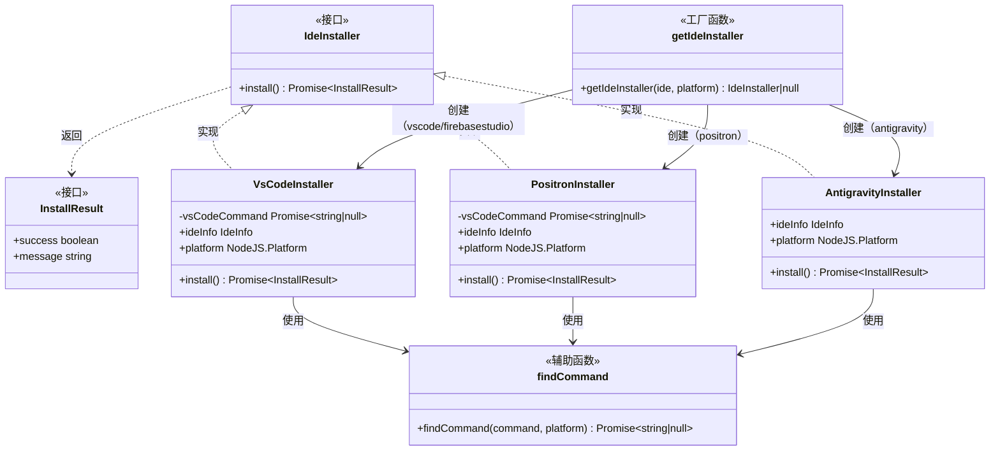
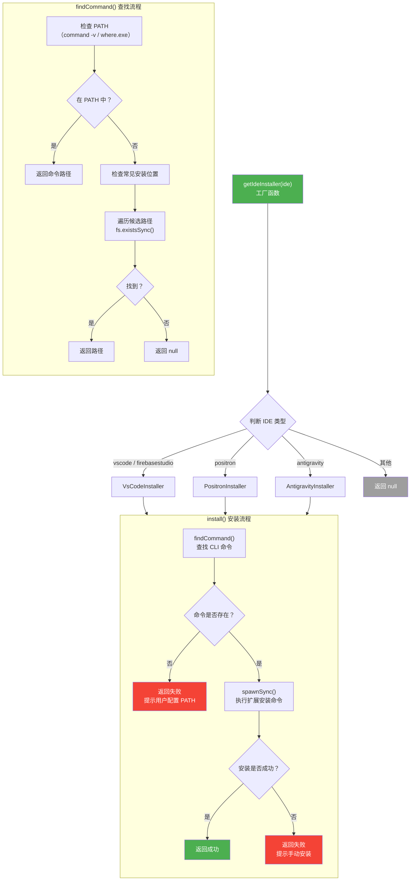

# ide-installer.ts

## 概述

`ide-installer.ts` 是 Gemini CLI IDE 集成模块的扩展安装器文件，负责自动安装 Gemini CLI 的 IDE 伴侣扩展（`google.gemini-cli-vscode-ide-companion`）。该文件为不同的 IDE 提供了专用的安装器实现，通过调用各 IDE 的命令行工具来完成扩展的自动安装。

目前支持自动安装的 IDE 包括：
- **VS Code**（及其衍生环境如 Firebase Studio）
- **Positron**
- **Antigravity**

安装器采用策略模式（Strategy Pattern），通过 `IdeInstaller` 接口统一不同 IDE 的安装行为，并由工厂函数 `getIdeInstaller` 根据 IDE 类型返回对应的安装器实例。

## 架构图（Mermaid）





## 核心组件

### 1. 接口定义

#### `IdeInstaller` 接口

```typescript
export interface IdeInstaller {
  install(): Promise<InstallResult>;
}
```

IDE 扩展安装器的统一接口，所有具体安装器必须实现 `install()` 方法。

#### `InstallResult` 接口

```typescript
export interface InstallResult {
  success: boolean;
  message: string;
}
```

安装结果对象，包含成功/失败状态和面向用户的消息文本。

### 2. `findCommand()` - 命令查找函数

```typescript
async function findCommand(
  command: string,
  platform: NodeJS.Platform = process.platform,
): Promise<string | null>
```

在系统中查找指定命令的完整路径，采用两级查找策略：

**第一级 - PATH 查找**:

| 平台 | 方法 | 说明 |
|------|------|------|
| Windows | `where.exe {command}` | 可能返回多个路径，取第一个 |
| Unix/macOS | `command -v {command}` | Shell 内建命令，高效 |

**第二级 - 常见安装位置查找**:

支持 `code`（VS Code）和 `positron` 两种命令的常见安装路径：

**macOS (`darwin`)**:
| 应用 | 路径 |
|------|------|
| VS Code | `/Applications/Visual Studio Code.app/Contents/Resources/app/bin/code` |
| VS Code | `~/Library/Application Support/Code/bin/code` |
| Positron | `/Applications/Positron.app/Contents/Resources/app/bin/positron` |
| Positron | `~/Library/Application Support/Positron/bin/positron` |

**Linux**:
| 应用 | 路径 |
|------|------|
| VS Code | `/usr/share/code/bin/code` |
| VS Code | `/snap/bin/code` |
| VS Code | `~/.local/share/code/bin/code` |
| Positron | `/usr/share/positron/bin/positron` |
| Positron | `/snap/bin/positron` |
| Positron | `~/.local/share/positron/bin/positron` |

**Windows (`win32`)**:
| 应用 | 路径 |
|------|------|
| VS Code | `C:\Program Files\Microsoft VS Code\bin\code.cmd` |
| VS Code | `~\AppData\Local\Programs\Microsoft VS Code\bin\code.cmd` |
| Positron | `C:\Program Files\Positron\bin\positron.cmd` |
| Positron | `~\AppData\Local\Programs\Positron\bin\positron.cmd` |

### 3. `VsCodeInstaller` 类

```typescript
class VsCodeInstaller implements IdeInstaller
```

VS Code 扩展安装器，也用于 Firebase Studio（因为 Firebase Studio 基于 VS Code）。

**构造函数**:
- 根据平台选择命令名（Windows: `code.cmd`，其他: `code`）
- 在构造时即异步查找命令路径（存入 `vsCodeCommand` Promise）

**`install()` 方法**:
1. 等待命令查找完成
2. 如果命令未找到，返回失败并附上 VS Code CLI 配置指南链接
3. 使用 `child_process.spawnSync` 执行安装命令：
   ```
   code --install-extension google.gemini-cli-vscode-ide-companion --force
   ```
4. Windows 上启用 `shell: true` 以支持 `.cmd` 文件执行
5. 检查退出码，返回对应的成功/失败结果

### 4. `PositronInstaller` 类

```typescript
class PositronInstaller implements IdeInstaller
```

Positron IDE 扩展安装器，结构与 `VsCodeInstaller` 几乎一致。

**差异点**:
- 命令名为 `positron` / `positron.cmd`
- 错误消息指向 Positron 的 PATH 配置文档：`https://positron.posit.co/add-to-path.html`
- 提示用户可从 VS Code Marketplace 或 Open VSX 注册表手动安装

### 5. `AntigravityInstaller` 类

```typescript
class AntigravityInstaller implements IdeInstaller
```

Antigravity IDE 扩展安装器，具有独特的命令查找逻辑。

**命令查找策略**:
1. 优先使用环境变量 `ANTIGRAVITY_CLI_ALIAS` 指定的命令
2. 对环境变量值进行安全校验（仅允许 `[a-zA-Z0-9.\-_/\\]` 字符）
3. 使用平台相关的回退命令：
   - Windows: `agy.cmd`, `antigravity.cmd`
   - Unix/macOS: `agy`, `antigravity`
4. 去重后依次尝试查找
5. 安装命令与 VS Code 相同：`--install-extension google.gemini-cli-vscode-ide-companion --force`

**安全措施**: 对 `ANTIGRAVITY_CLI_ALIAS` 环境变量进行严格的正则校验（`/^[a-zA-Z0-9.\-_/\\]+$/`），防止命令注入攻击。

### 6. `getIdeInstaller()` - 工厂函数

```typescript
export function getIdeInstaller(
  ide: IdeInfo,
  platform = process.platform,
): IdeInstaller | null
```

根据 IDE 类型创建对应的安装器实例：

| IDE 名称 | 安装器 |
|---------|--------|
| `vscode` | `VsCodeInstaller` |
| `firebasestudio` | `VsCodeInstaller` |
| `positron` | `PositronInstaller` |
| `antigravity` | `AntigravityInstaller` |
| 其他 | 返回 `null` |

## 依赖关系

### 内部依赖

| 模块 | 导入内容 | 用途 |
|------|---------|------|
| `./detect-ide.js` | `IDE_DEFINITIONS`, `IdeInfo` | IDE 定义常量和类型 |
| `./constants.js` | `GEMINI_CLI_COMPANION_EXTENSION_NAME` | 扩展显示名称（用于错误消息） |
| `../utils/paths.js` | `homedir` | 获取用户主目录路径 |

### 外部依赖

| 包名 | 导入内容 | 用途 |
|------|---------|------|
| `node:child_process` | `child_process` | 执行系统命令（`execSync`, `spawnSync`） |
| `node:process` | `process` | 获取平台信息和环境变量 |
| `node:path` | `path` | 路径拼接 |
| `node:fs` | `fs` | 文件存在性检查 |

## 关键实现细节

1. **策略模式**: 每种 IDE 都有独立的安装器类，通过 `IdeInstaller` 接口统一行为。工厂函数 `getIdeInstaller` 封装了实例化逻辑，调用方无需关心具体实现。

2. **延迟命令查找**: `VsCodeInstaller` 和 `PositronInstaller` 在构造函数中就启动了命令查找（存为 Promise），而不是等到 `install()` 被调用时才查找。这样可以提前发现命令路径，减少安装时的等待。

3. **跨平台支持**: 所有安装器都通过 `platform` 参数支持 Windows、macOS 和 Linux：
   - Windows 使用 `.cmd` 后缀的命令
   - Windows 上 `spawnSync` 需要 `shell: true` 才能执行 `.cmd` 文件
   - 不同平台有不同的常见安装路径

4. **`--force` 标志**: 安装命令使用 `--force` 标志，确保即使扩展已安装也会重新安装（更新到最新版本）。

5. **扩展标识符**: 所有安装器安装的都是同一个扩展 `google.gemini-cli-vscode-ide-companion`，说明该伴侣扩展通用于所有基于 VS Code 的 IDE。

6. **安全性 - 命令注入防护**: `AntigravityInstaller` 对环境变量 `ANTIGRAVITY_CLI_ALIAS` 进行了严格的正则校验，仅允许安全字符，防止恶意环境变量导致命令注入。

7. **`findCommand` 的两级回退**: 先检查 PATH 是最高效的方式；当 PATH 中找不到时，检查常见安装位置作为降级方案。这对于用户未正确配置 PATH 但已安装 IDE 的场景非常有用。

8. **Firebase Studio 复用 VsCodeInstaller**: Firebase Studio 基于 VS Code 架构，因此共享同一个安装器。这体现了 VS Code 生态的可复用性。

9. **错误消息设计**: 每种失败场景都有针对性的用户指引：
   - 命令未找到：提示配置 PATH 并附上文档链接
   - 安装失败：提示手动从市场安装
   - 不支持的 IDE：工厂函数返回 `null`，由调用方处理

10. **`where.exe` 多路径处理**: Windows 的 `where.exe` 可能返回多个匹配路径（如用户同时安装了多个版本），代码取第一个结果，即 PATH 优先级最高的那个。

11. **`command -v` vs `which`**: Unix 系统上使用 `command -v` 而非 `which`，因为 `command -v` 是 POSIX 标准 Shell 内建命令，不依赖外部程序，兼容性更好。
