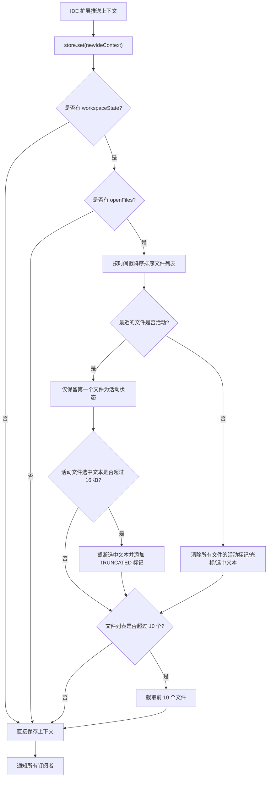

# ideContext.ts

## 概述

`ideContext.ts` 是 Gemini CLI 核心模块中 IDE 上下文管理的核心文件。它实现了一个 **发布-订阅模式（Pub/Sub）** 的状态管理存储 `IdeContextStore`，用于集中管理和分发 IDE（如 VS Code）的工作区上下文信息。该文件还导出了一个全局单例 `ideContextStore`，作为整个应用程序共享的 IDE 上下文存储实例。

其核心职责包括：
- 存储当前 IDE 上下文状态（打开的文件、活动文件、光标位置、选中文本等）
- 对传入的上下文数据进行标准化处理（排序、截断、去重活动文件标记）
- 通过订阅机制通知所有监听者上下文变化

## 架构图（Mermaid）

```mermaid
classDiagram
    class IdeContextStore {
        -ideContextState: IdeContext | undefined
        -subscribers: Set~IdeContextSubscriber~
        -notifySubscribers(): void
        +set(newIdeContext: IdeContext): void
        +clear(): void
        +get(): IdeContext | undefined
        +subscribe(subscriber: IdeContextSubscriber): () => void
    }

    class IdeContext {
        <<interface>>
        +workspaceState?: WorkspaceState
    }

    class IdeContextSubscriber {
        <<type>>
        (ideContext?: IdeContext) => void
    }

    IdeContextStore --> IdeContext : 存储
    IdeContextStore --> IdeContextSubscriber : 管理订阅者集合
    IdeContextStore ..> "constants.js" : 使用常量限制
```



## 核心组件

### 1. `IdeContextSubscriber` 类型

```typescript
type IdeContextSubscriber = (ideContext?: IdeContext) => void;
```

订阅者回调函数类型定义。当 IDE 上下文发生变化时，该回调会被调用，接收最新的 `IdeContext` 对象（或 `undefined`，如果上下文被清除）。

### 2. `IdeContextStore` 类

这是 IDE 上下文管理的核心类，采用发布-订阅模式管理状态。

#### 私有属性

| 属性 | 类型 | 说明 |
|------|------|------|
| `ideContextState` | `IdeContext \| undefined` | 当前存储的 IDE 上下文状态 |
| `subscribers` | `Set<IdeContextSubscriber>` | 已注册的订阅者集合，使用 `Set` 确保唯一性 |

#### 方法详解

##### `private notifySubscribers(): void`
遍历所有已注册的订阅者，并以当前上下文状态调用它们。这是一个同步方法，所有订阅者会被同步通知。

##### `set(newIdeContext: IdeContext): void`
设置新的 IDE 上下文并通知订阅者。这是最核心的方法，包含以下处理逻辑：

1. **无 workspaceState 情况**：直接存储并通知
2. **有 openFiles 情况**：
   - 按 `timestamp` 降序排序（最新的在最前面）
   - **活动文件唯一性保证**：如果最近的文件不是活动状态，则清除所有文件的 `isActive`、`cursor`、`selectedText`；如果是活动状态，则只保留该文件的活动标记
   - **选中文本截断**：活动文件的 `selectedText` 超过 `IDE_MAX_SELECTED_TEXT_LENGTH`（16384 字符 = 16 KiB）时，截断并附加 `'... [TRUNCATED]'` 标记
   - **文件列表截断**：超过 `IDE_MAX_OPEN_FILES`（10 个）时只保留前 10 个

##### `clear(): void`
将上下文状态设为 `undefined` 并通知所有订阅者。用于 IDE 断开连接或需要重置状态时。

##### `get(): IdeContext | undefined`
返回当前存储的 IDE 上下文状态。简单的 getter 方法，无副作用。

##### `subscribe(subscriber: IdeContextSubscriber): () => void`
注册一个订阅者，返回一个取消订阅函数。注意：订阅时**不会**立即用当前值调用订阅者（即不是 BehaviorSubject 模式）。

### 3. `ideContextStore` 全局实例

```typescript
export const ideContextStore = new IdeContextStore();
```

全局共享的 `IdeContextStore` 单例实例。整个应用程序通过此实例访问和管理 IDE 上下文。

## 依赖关系

### 内部依赖

| 模块 | 导入内容 | 用途 |
|------|----------|------|
| `./constants.js` | `IDE_MAX_OPEN_FILES`（值为 10）| 限制打开文件列表的最大长度 |
| `./constants.js` | `IDE_MAX_SELECTED_TEXT_LENGTH`（值为 16384）| 限制选中文本的最大字符数（16 KiB） |
| `./types.js` | `IdeContext`（type-only 导入）| IDE 上下文数据结构的类型定义 |

### 外部依赖

无外部第三方依赖。该文件完全使用 TypeScript 原生功能实现。

## 关键实现细节

1. **发布-订阅模式**：使用 `Set<IdeContextSubscriber>` 管理订阅者，`Set` 结构天然保证同一个回调不会被注册两次，避免重复通知。

2. **单一活动文件策略**：`set()` 方法确保在任何时刻最多只有一个文件处于活动状态。通过先按时间戳排序，再只保留索引 0 位置的文件活动标记，实现了「最近操作的文件为活动文件」的语义。

3. **防御性数据处理**：
   - 选中文本截断防止过大的文本选区导致内存或性能问题
   - 文件列表截断防止 IDE 打开大量文件时上下文数据膨胀
   - 截断后附加 `'... [TRUNCATED]'` 标记，让下游消费者知道数据被截断

4. **取消订阅机制**：`subscribe()` 返回闭包函数，调用后自动从 `Set` 中移除订阅者，这是 TypeScript/JavaScript 中常见的资源清理模式，类似于 React 的 `useEffect` 清理函数。

5. **模块级单例**：`ideContextStore` 在模块顶层创建，利用 ES Module 的单例特性（模块只会被加载一次），确保整个应用共享同一个状态实例。

6. **就地修改（Mutation）**：`set()` 方法直接修改传入的 `newIdeContext` 对象（如排序 `openFiles`、修改 `isActive` 等），而非创建副本。这意味着调用方传入的对象也会被修改，是一种性能优先的设计选择。
