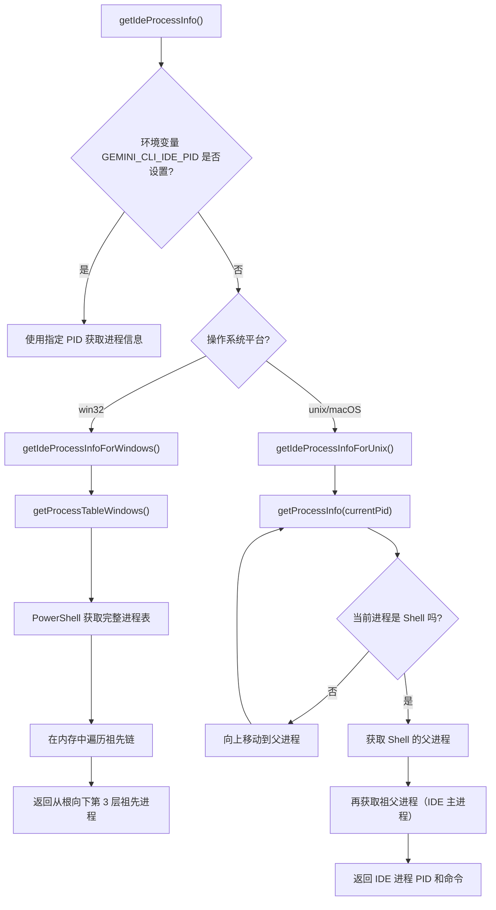
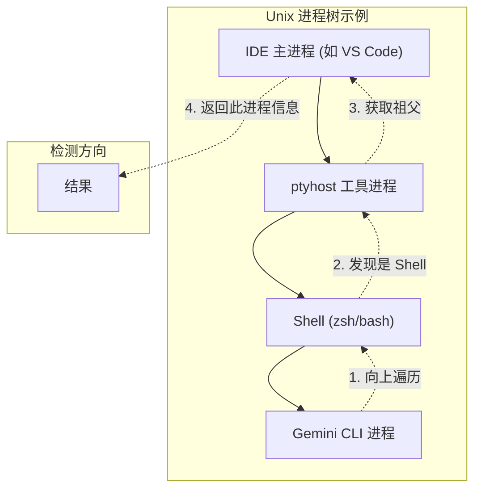

# process-utils.ts

## 概述

`process-utils.ts` 是 Gemini CLI 核心模块中的进程工具文件，专门用于 **自动检测宿主 IDE 进程**。当 Gemini CLI 在 IDE（如 VS Code、JetBrains 等）的集成终端中运行时，该模块通过遍历进程树（process tree traversal）来定位启动该终端的 IDE 主进程，获取其 PID 和命令行信息。

该文件针对不同操作系统（Unix/macOS 和 Windows）实现了不同的进程检测策略：
- **Unix/macOS**：逐级向上查询父进程，直到找到 shell 进程，再向上两级找到 IDE 主进程
- **Windows**：通过 PowerShell 一次性获取完整进程表，在内存中进行遍历

## 架构图（Mermaid）





## 核心组件

### 1. 接口定义

#### `ProcessInfo`
标准化的进程信息结构，用于内部处理。

```typescript
interface ProcessInfo {
  pid: number;        // 进程 ID
  parentPid: number;  // 父进程 ID
  name: string;       // 进程名称
  command: string;    // 完整命令行
}
```

#### `RawProcessInfo`
Windows PowerShell 返回的原始进程信息结构，字段名使用 PascalCase 命名，且所有字段为可选。

```typescript
interface RawProcessInfo {
  ProcessId?: number;
  ParentProcessId?: number;
  Name?: string;
  CommandLine?: string;
}
```

### 2. 常量

| 常量 | 值 | 说明 |
|------|-----|------|
| `MAX_TRAVERSAL_DEPTH` | 32 | 进程树遍历的最大深度，防止无限循环 |

### 3. 核心函数

#### `getProcessTableWindows(): Promise<Map<number, ProcessInfo>>`（私有）

获取 Windows 系统上的完整进程表。

- 使用 PowerShell 命令 `Get-CimInstance Win32_Process` 获取所有进程
- 通过 `ConvertTo-Json -Compress` 转为 JSON
- `maxBuffer` 设置为 10MB（`10 * 1024 * 1024`），以应对大量进程
- 返回 `Map<number, ProcessInfo>`，以 PID 为键，方便 O(1) 查找
- 处理了 JSON 解析失败和 PowerShell 执行失败的异常情况

#### `getProcessInfo(pid: number): Promise<{parentPid, name, command}>`（私有）

获取 Unix 系统上单个进程的信息。

- 使用命令 `ps -o ppid=,command= -p <pid>` 查询指定进程
- `ppid=` 获取父进程 ID，`command=` 获取完整命令行
- 通过 `path.basename()` 从完整命令路径中提取进程名
- 如果解析 `ppid` 失败，默认返回 1（init/launchd 进程）
- 异常时返回安全的空值 `{ parentPid: 0, name: '', command: '' }`

#### `getIdeProcessInfoForUnix(): Promise<{pid, command}>`（私有）

在 Unix/macOS 系统上查找 IDE 进程。

**检测策略**：
1. 从当前进程（`process.pid`）开始，逐级向上遍历父进程
2. 在已知 Shell 列表中匹配当前进程名：`zsh`、`bash`、`sh`、`tcsh`、`csh`、`ksh`、`fish`、`dash`
3. 找到 Shell 后，获取其父进程（通常是 IDE 的 `ptyhost` 等工具进程）
4. 再向上一级获取祖父进程（真正的 IDE 主进程）
5. 如果祖父进程 PID <= 1（已到根），则回退到父进程
6. 最多遍历 `MAX_TRAVERSAL_DEPTH`（32）层

#### `getIdeProcessInfoForWindows(): Promise<{pid, command}>`（私有）

在 Windows 系统上查找 IDE 进程。

**检测策略**：
1. 通过 `getProcessTableWindows()` 一次性获取全量进程表
2. 从当前进程开始，在内存中向上遍历构建祖先链
3. 选择从根进程向下第 3 层的祖先进程（`ancestors[ancestors.length - 3]`）
4. 如果祖先链不足 3 层，则使用最顶层的祖先
5. 如果当前进程在进程表中找不到，回退到直接查询

#### `getIdeProcessInfo(): Promise<{pid, command}>`（导出）

**对外暴露的主入口函数**。

- **环境变量覆盖**：如果设置了 `GEMINI_CLI_IDE_PID`，直接使用该 PID，跳过自动检测。这对于在独立终端中启动 Gemini CLI 同时连接到 IDE 实例非常有用
- **平台自动选择**：根据 `os.platform()` 自动选择 Windows 或 Unix 策略

## 依赖关系

### 内部依赖

无内部模块依赖。该文件是一个独立的工具模块。

### 外部依赖

| 模块 | 导入内容 | 用途 |
|------|----------|------|
| `node:child_process` | `exec` | 执行系统命令（`ps`、`powershell`） |
| `node:util` | `promisify` | 将 callback 风格的 `exec` 转为 Promise |
| `node:os` | `os`（default） | 获取操作系统平台类型 |
| `node:path` | `path`（default） | 从命令路径中提取进程名（`path.basename`） |

## 关键实现细节

1. **跨平台策略差异**：
   - **Unix/macOS** 使用逐级 `ps` 查询，每次只获取一个进程的信息，适合进程树不深的场景
   - **Windows** 使用一次性快照（snapshot）策略，通过 PowerShell 获取全部进程后在内存中遍历，避免多次进程调用的开销

2. **Shell 检测列表**：支持 8 种常见 Shell：`zsh`、`bash`、`sh`、`tcsh`、`csh`、`ksh`、`fish`、`dash`。这些覆盖了绝大多数终端环境。

3. **祖父进程策略**：在 Unix 上，IDE 通常不直接生成 Shell 进程，中间还有一个 `ptyhost`（伪终端宿主）等工具进程。因此需要向上两级才能找到真正的 IDE 主进程。

4. **Windows 的「从根向下第 3 层」策略**：Windows 进程树通常是：`System → wininit/csrss → IDE → ... → CLI`。选择 `ancestors[length - 3]` 跳过了最顶层的系统进程，直接定位到用户级应用进程。

5. **环境变量覆盖机制**：`GEMINI_CLI_IDE_PID` 环境变量允许用户在外部终端中手动指定 IDE 进程 PID，适用于调试或非标准 IDE 集成场景。

6. **健壮的错误处理**：所有进程查询都被 try-catch 包裹，任何单个查询失败都不会导致整体功能崩溃，会优雅降级为返回当前可用的最近祖先进程信息。

7. **防无限循环**：`MAX_TRAVERSAL_DEPTH = 32` 作为硬性上限，即使进程树存在异常（如循环引用），也能保证遍历一定会终止。

8. **`execAsync` 封装**：使用 `promisify(exec)` 将 Node.js 的 callback 风格的 `exec` 转换为 Promise，使得整个文件能够使用 async/await 风格编写。
