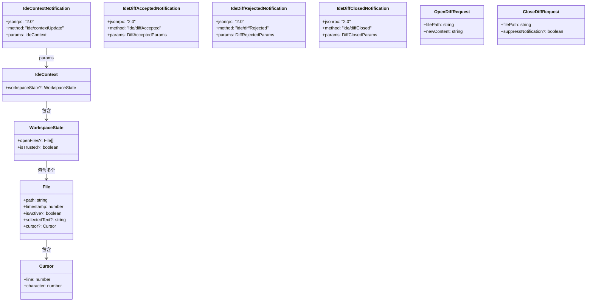
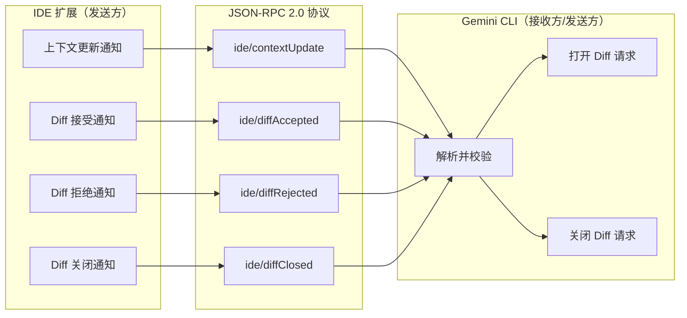

# types.ts

## 概述

`types.ts` 是 Gemini CLI 核心模块中 IDE 集成的 **类型定义文件**。它使用 Zod 运行时校验库定义了 IDE 与 CLI 之间通信所需的所有数据结构和消息协议。这些 Schema 不仅提供了 TypeScript 静态类型推导，还在运行时对传入的数据进行严格校验，确保 IDE 扩展发送的消息符合预期格式。

该文件涵盖以下几类类型定义：
- **IDE 上下文数据**：打开的文件、工作区状态
- **JSON-RPC 通知消息**：上下文更新、Diff 接受/拒绝/关闭通知
- **请求消息**：打开/关闭 Diff 视图

所有通信消息均基于 **JSON-RPC 2.0** 协议格式。

## 架构图（Mermaid）





## 核心组件

### 1. `FileSchema` / `File` 类型

表示在 IDE 中打开的单个文件的状态信息。

```typescript
export const FileSchema = z.object({
  path: z.string(),              // 文件的绝对路径
  timestamp: z.number(),         // 文件最后获得焦点的 Unix 时间戳
  isActive: z.boolean().optional(),      // 是否为当前活动文件（同一时间只能有一个）
  selectedText: z.string().optional(),   // 活动文件中当前选中的文本
  cursor: z.object({                     // 活动文件中的光标位置
    line: z.number(),                    //   行号（1-based）
    character: z.number(),               //   字符偏移（1-based）
  }).optional(),
});
export type File = z.infer<typeof FileSchema>;
```

| 字段 | 类型 | 必填 | 说明 |
|------|------|------|------|
| `path` | `string` | 是 | 文件的绝对路径 |
| `timestamp` | `number` | 是 | 最后聚焦的 Unix 时间戳，用于排序 |
| `isActive` | `boolean` | 否 | 是否为活动文件，同一时刻最多一个 |
| `selectedText` | `string` | 否 | 当前选中文本（仅活动文件有效） |
| `cursor` | `{line, character}` | 否 | 光标位置，行号和字符偏移均从 1 开始 |

### 2. `IdeContextSchema` / `IdeContext` 类型

IDE 的完整上下文信息，是最顶层的上下文数据结构。

```typescript
export const IdeContextSchema = z.object({
  workspaceState: z.object({
    openFiles: z.array(FileSchema).optional(),  // 当前打开的文件列表
    isTrusted: z.boolean().optional(),           // 工作区是否受信任
  }).optional(),
});
export type IdeContext = z.infer<typeof IdeContextSchema>;
```

| 字段 | 类型 | 必填 | 说明 |
|------|------|------|------|
| `workspaceState` | `object` | 否 | 工作区状态 |
| `workspaceState.openFiles` | `File[]` | 否 | 打开的文件列表 |
| `workspaceState.isTrusted` | `boolean` | 否 | VS Code 工作区信任机制的状态 |

### 3. JSON-RPC 通知 Schema（IDE → CLI）

这些 Schema 定义了 IDE 扩展向 Gemini CLI 发送的通知消息格式。

#### `IdeContextNotificationSchema`
IDE 上下文更新通知。当用户在 IDE 中切换文件、移动光标或选择文本时发送。

```typescript
{
  jsonrpc: "2.0",
  method: "ide/contextUpdate",
  params: IdeContext
}
```

#### `IdeDiffAcceptedNotificationSchema`
Diff 被用户接受的通知。

```typescript
{
  jsonrpc: "2.0",
  method: "ide/diffAccepted",
  params: {
    filePath: string,   // 被 diff 的文件的绝对路径
    content: string     // 接受 diff 后的完整文件内容（包含用户可能做的手动编辑）
  }
}
```

#### `IdeDiffRejectedNotificationSchema`
Diff 被用户拒绝的通知。

```typescript
{
  jsonrpc: "2.0",
  method: "ide/diffRejected",
  params: {
    filePath: string    // 被 diff 的文件的绝对路径
  }
}
```

#### `IdeDiffClosedNotificationSchema`（向后兼容）
Diff 视图被关闭的通知。**此 Schema 仅为向后兼容保留**，新版本的 IDE 扩展只会发送 `IdeDiffRejectedNotificationSchema`。

```typescript
{
  jsonrpc: "2.0",
  method: "ide/diffClosed",
  params: {
    filePath: string,
    content?: string    // 可选的文件内容
  }
}
```

### 4. 请求 Schema（CLI → IDE）

这些 Schema 定义了 Gemini CLI 向 IDE 扩展发送的请求消息。

#### `OpenDiffRequestSchema`
请求 IDE 打开 Diff 视图，展示文件的修改建议。

```typescript
{
  filePath: string,     // 要进行 diff 的文件的绝对路径
  newContent: string    // 提议的新文件内容
}
```

#### `CloseDiffRequestSchema`
请求 IDE 关闭 Diff 视图。

```typescript
{
  filePath: string,                    // 要关闭 diff 的文件的绝对路径
  suppressNotification?: boolean       // [已废弃] 是否抑制关闭通知
}
```

## 依赖关系

### 内部依赖

无内部模块依赖。该文件是纯类型定义文件，不引用项目中的其他模块。

### 外部依赖

| 模块 | 导入内容 | 用途 |
|------|----------|------|
| `zod` | `z` | 运行时数据校验库，用于定义 Schema 并推导 TypeScript 类型 |

## 关键实现细节

1. **Zod Schema + TypeScript 类型推导**：该文件采用 "Schema-first" 的方式，先用 Zod 定义运行时校验 Schema，再通过 `z.infer<typeof Schema>` 自动推导出 TypeScript 类型。这确保了运行时校验逻辑和编译时类型始终保持一致，避免了类型和校验逻辑不同步的问题。

2. **JSON-RPC 2.0 协议**：所有通知消息都严格遵循 JSON-RPC 2.0 规范，包含 `jsonrpc: "2.0"` 字面量和 `method` 字面量字段。使用 `z.literal()` 确保这些字段值在运行时被精确校验。

3. **光标位置的 1-based 索引**：`cursor` 中的 `line` 和 `character` 都使用 1-based 索引（从 1 开始计数），与 VS Code 等 IDE 的显示习惯一致，但使用时需注意与 0-based 数组索引的转换。

4. **向后兼容设计**：`IdeDiffClosedNotificationSchema` 明确标注为仅用于向后兼容。新版本的 IDE 扩展使用更语义化的 `IdeDiffRejectedNotificationSchema`。这表明该通信协议在演进过程中注重兼容性。

5. **可选字段的广泛使用**：几乎所有结构中都大量使用 `.optional()`，这使得 IDE 扩展可以渐进式地提供上下文信息——不需要一次性提供所有字段，降低了集成门槛。

6. **`suppressNotification` 已废弃**：`CloseDiffRequestSchema` 中的 `suppressNotification` 字段已被标记为 `@deprecated`，说明关闭 Diff 视图的通知机制已经发生了变化。

7. **双向通信模型**：从这些类型定义可以清晰看出 IDE 与 CLI 之间的双向通信模式：
   - **IDE → CLI**：`IdeContextNotification`、`IdeDiffAccepted/Rejected/Closed` 通知
   - **CLI → IDE**：`OpenDiffRequest`、`CloseDiffRequest` 请求

8. **`File.timestamp` 的用途**：时间戳不仅记录了文件的最后聚焦时间，还在 `ideContext.ts` 的 `IdeContextStore.set()` 方法中用于排序，确定哪个文件是「最近活动」的。
