# index.ts

## 概述

`index.ts` 是 `@gemini-cli/core` 包的顶层入口文件（barrel file）。它不包含任何业务逻辑实现，而是将核心包内部的所有公共 API 统一通过 `export *` 和具名导出的方式重新导出，使外部消费者能够通过单一入口点 `@gemini-cli/core` 访问所有需要的类型、函数、类和常量。该文件涵盖了约 20 个功能模块，总计超过 130 条导出语句，构成了 Gemini CLI 核心包的完整公共接口。

## 架构图（Mermaid）

```mermaid
graph TD
    A["index.ts<br/>(@gemini-cli/core 入口)"] --> B[配置模块<br/>config/]
    A --> C[核心逻辑<br/>core/]
    A --> D[调度器<br/>scheduler/]
    A --> E[工具模块<br/>tools/]
    A --> F[遥测模块<br/>telemetry/]
    A --> G[服务模块<br/>services/]
    A --> H[工具函数<br/>utils/]
    A --> I[命令模块<br/>commands/]
    A --> J[策略引擎<br/>policy/]
    A --> K[IDE 集成<br/>ide/]
    A --> L[Agent 模块<br/>agents/ + agent/]
    A --> M[代码辅助<br/>code_assist/]
    A --> N[MCP OAuth<br/>mcp/]
    A --> O[Hook 系统<br/>hooks/]
    A --> P[降级处理<br/>fallback/]
    A --> Q[输出格式<br/>output/]
    A --> R[计费模块<br/>billing/]
    A --> S[沙箱模块<br/>sandbox/]
    A --> T[技能模块<br/>skills/]
    A --> U[语音模块<br/>voice/]
    A --> V[资源注册<br/>resources/]
    A --> W[确认总线<br/>confirmation-bus/]

    style A fill:#f9f,stroke:#333,stroke-width:2px
```



## 核心组件

### 1. 配置模块 (config/)

导出项来源于以下文件：

| 源文件 | 导出方式 | 主要内容 |
|--------|---------|---------|
| `config/config.js` | `export *` | Config 主配置类 |
| `config/agent-loop-context.js` | `export *` | Agent 循环上下文 |
| `config/memory.js` | `export *` | 记忆/上下文配置 |
| `config/defaultModelConfigs.js` | `export *` | 默认模型配置 |
| `config/models.js` | `export *` | 模型定义 |
| `config/constants.js` | `export *` | 配置常量 |
| `config/injectionService.js` | `export *` | 依赖注入服务 |
| `config/storage.js` | 具名导出 `Storage` | 存储抽象 |
| `config/extensions/integrity.js` | `export *` | 扩展完整性校验 |
| `config/extensions/integrityTypes.js` | `export *` | 扩展完整性类型 |

### 2. 核心逻辑 (core/)

| 源文件 | 主要内容 |
|--------|---------|
| `core/baseLlmClient.js` | LLM 客户端基类 |
| `core/client.js` | 客户端实现 |
| `core/contentGenerator.js` | 内容生成器 |
| `core/loggingContentGenerator.js` | 带日志的内容生成器 |
| `core/recordingContentGenerator.js` | 带录制的内容生成器 |
| `core/geminiChat.js` | Gemini 聊天核心 |
| `core/logger.js` | 日志器 |
| `core/prompts.js` | 提示词管理 |
| `core/tokenLimits.js` | Token 限制 |
| `core/turn.js` | 对话轮次管理 |
| `core/geminiRequest.js` | Gemini API 请求 |
| `core/apiKeyCredentialStorage.js` | API Key 凭证存储 |

### 3. 调度器 (scheduler/)

| 源文件 | 主要内容 |
|--------|---------|
| `scheduler/scheduler.js` | 任务调度器 |
| `scheduler/types.js` | 调度器类型定义 |
| `scheduler/tool-executor.js` | 工具执行器 |
| `scheduler/policy.js` | 调度策略 |

### 4. 工具模块 (tools/)

| 源文件 | 对应工具 |
|--------|---------|
| `tools/tools.js` | 工具基础定义 |
| `tools/tool-error.js` | 工具错误类 |
| `tools/tool-registry.js` | 工具注册表 |
| `tools/tool-names.js` | 工具名称常量 |
| `tools/read-file.js` | 文件读取工具 |
| `tools/ls.js` | 目录列表工具 |
| `tools/grep.js` | 文本搜索工具 |
| `tools/ripGrep.js` | ripgrep 搜索工具 |
| `tools/glob.js` | 文件匹配工具 |
| `tools/edit.js` | 文件编辑工具 |
| `tools/write-file.js` | 文件写入工具 |
| `tools/web-fetch.js` | 网页抓取工具 |
| `tools/memoryTool.js` | 记忆工具 |
| `tools/shell.js` | Shell 执行工具 |
| `tools/web-search.js` | 网页搜索工具 |
| `tools/read-many-files.js` | 多文件读取工具 |
| `tools/mcp-client.js` | MCP 客户端 |
| `tools/mcp-tool.js` | MCP 工具 |
| `tools/write-todos.js` | TODO 写入工具 |
| `tools/trackerTools.js` | 追踪器工具 |
| `tools/activate-skill.js` | 技能激活工具 |
| `tools/ask-user.js` | 用户交互工具 |

### 5. 遥测模块 (telemetry/)

| 源文件 | 导出方式 | 主要内容 |
|--------|---------|---------|
| `telemetry/index.js` | `export *` | 遥测主入口 |
| `telemetry/billingEvents.js` | `export *` | 计费事件 |
| `telemetry/loggers.js` | 具名导出 `logBillingEvent` | 计费日志记录 |
| `telemetry/constants.js` | `export *` | 遥测常量 |

### 6. 服务模块 (services/)

| 源文件 | 主要内容 |
|--------|---------|
| `services/fileDiscoveryService.js` | 文件发现服务 |
| `services/gitService.js` | Git 服务 |
| `services/FolderTrustDiscoveryService.js` | 文件夹信任发现 |
| `services/chatRecordingService.js` | 聊天录制服务 |
| `services/fileSystemService.js` | 文件系统服务 |
| `services/sandboxedFileSystemService.js` | 沙箱化文件系统服务 |
| `services/shellExecutionService.js` | Shell 执行服务 |
| `services/sandboxManager.js` | 沙箱管理器 |
| `services/executionLifecycleService.js` | 执行生命周期服务 |
| `services/sessionSummaryUtils.js` | 会话摘要工具 |
| `services/contextManager.js` | 上下文管理器 |
| `services/trackerService.js` | 追踪器服务 |
| `services/trackerTypes.js` | 追踪器类型 |
| `services/keychainService.js` | 钥匙串服务 |
| `services/keychainTypes.js` | 钥匙串类型 |
| `services/worktreeService.js` | Git Worktree 服务 |

### 7. 工具函数 (utils/)

这是最庞大的导出分类，包含约 50 个工具模块：

| 源文件 | 主要内容 |
|--------|---------|
| `utils/fetch.js` | HTTP 请求工具 |
| `utils/paths.js` | 路径工具（含具名导出 `homedir`, `tmpdir`） |
| `utils/checks.js` | 各类检查函数 |
| `utils/headless.js` | 无头模式工具 |
| `utils/schemaValidator.js` | Schema 验证器 |
| `utils/errors.js` | 错误处理工具 |
| `utils/fsErrorMessages.js` | 文件系统错误消息 |
| `utils/exitCodes.js` | 退出码定义 |
| `utils/getFolderStructure.js` | 文件夹结构获取 |
| `utils/memoryDiscovery.js` | 记忆发现 |
| `utils/getPty.js` | PTY 获取 |
| `utils/gitIgnoreParser.js` | .gitignore 解析 |
| `utils/gitUtils.js` | Git 工具函数 |
| `utils/editor.js` | 编辑器工具 |
| `utils/quotaErrorDetection.js` | 配额错误检测 |
| `utils/userAccountManager.js` | 用户账户管理 |
| `utils/authConsent.js` | 认证同意 |
| `utils/googleQuotaErrors.js` | Google 配额错误 |
| `utils/googleErrors.js` | Google 通用错误 |
| `utils/fileUtils.js` | 文件工具 |
| `utils/sessionOperations.js` | 会话操作 |
| `utils/planUtils.js` | 计划工具 |
| `utils/approvalModeUtils.js` | 审批模式工具 |
| `utils/fileDiffUtils.js` | 文件 Diff 工具 |
| `utils/retry.js` | 重试工具 |
| `utils/shell-utils.js` | Shell 工具 |
| `utils/tool-utils.js` | 工具相关工具函数 |
| `utils/terminalSerializer.js` | 终端序列化 |
| `utils/systemEncoding.js` | 系统编码 |
| `utils/textUtils.js` | 文本处理工具 |
| `utils/formatters.js` | 格式化工具 |
| `utils/generateContentResponseUtilities.js` | 内容生成响应工具 |
| `utils/filesearch/fileSearch.js` | 文件搜索 |
| `utils/errorParsing.js` | 错误解析 |
| `utils/fastAckHelper.js` | 快速确认助手 |
| `utils/workspaceContext.js` | 工作区上下文 |
| `utils/environmentContext.js` | 环境上下文 |
| `utils/ignorePatterns.js` | 忽略模式 |
| `utils/partUtils.js` | Part 工具 |
| `utils/promptIdContext.js` | 提示 ID 上下文 |
| `utils/thoughtUtils.js` | 思考工具 |
| `utils/secure-browser-launcher.js` | 安全浏览器启动器 |
| `utils/debugLogger.js` | 调试日志器 |
| `utils/events.js` | 事件工具 |
| `utils/extensionLoader.js` | 扩展加载器 |
| `utils/package.js` | 包信息 |
| `utils/version.js` | 版本信息 |
| `utils/checkpointUtils.js` | 检查点工具 |
| `utils/apiConversionUtils.js` | API 转换工具 |
| `utils/channel.js` | 通道工具 |
| `utils/constants.js` | 工具常量 |
| `utils/sessionUtils.js` | 会话工具 |
| `utils/cache.js` | 缓存工具 |
| `utils/markdownUtils.js` | Markdown 工具 |
| `utils/session.js` | 具名导出 `sessionId`, `createSessionId` |
| `utils/compatibility.js` | 兼容性工具 |
| `utils/browser.js` | 浏览器工具 |
| `utils/stdio.js` | 标准 IO 工具 |
| `utils/terminal.js` | 终端工具 |

### 8. Agent 模块 (agents/ + agent/)

分为两个子目录：

**agents/ (Agent 定义)**:
| 源文件 | 主要内容 |
|--------|---------|
| `agents/types.js` | Agent 类型定义 |
| `agents/agentLoader.js` | Agent 加载器 |
| `agents/local-executor.js` | 本地执行器 |
| `agents/agent-scheduler.js` | Agent 调度器 |
| `agents/browser/browserAgentFactory.js` | 具名导出 `resetBrowserSession` |

**agent/ (Agent 会话)**:
| 源文件 | 导出方式 | 主要内容 |
|--------|---------|---------|
| `agent/agent-session.js` | `export *` | Agent 会话 |
| `agent/legacy-agent-session.js` | `export *` | 遗留 Agent 会话 |
| `agent/event-translator.js` | `export *` | 事件翻译器 |
| `agent/content-utils.js` | `export *` | 内容工具 |
| `agent/types.js` | 具名类型导出 | Agent 事件类型（命名空间化以避免冲突） |

**Agent 事件类型的命名空间处理**:
```typescript
export type {
  AgentEvent,
  AgentEventCommon,
  AgentEventData,
  AgentEnd,
  AgentEvents as AgentEventMap,  // 重命名避免冲突
  AgentEventType,
  AgentProtocol,
  AgentSend,
  AgentStart,
  ContentPart,
  ErrorData,
  StreamEndReason,
  Trajectory,
  Unsubscribe,
  Usage as AgentUsage,  // 重命名避免冲突
  WithMeta,
} from './agent/types.js';
```

### 9. 其他模块

| 模块 | 源文件 | 主要内容 |
|------|--------|---------|
| 命令 | `commands/extensions.js`, `commands/restore.js`, `commands/init.js`, `commands/memory.js`, `commands/types.js` | CLI 命令实现 |
| 策略引擎 | `policy/types.js`, `policy/policy-engine.js`, `policy/toml-loader.js`, `policy/config.js`, `policy/integrity.js` | 安全策略系统 |
| IDE 集成 | `ide/ide-client.js`, `ide/ideContext.js`, `ide/ide-installer.js`, `ide/detect-ide.js`, `ide/constants.js`, `ide/types.js` | IDE 检测与集成 |
| 代码辅助 | `code_assist/*.js`, `code_assist/admin/*.js` | 代码辅助功能和 OAuth |
| MCP OAuth | `mcp/oauth-provider.js`, `mcp/token-storage/types.js`, `mcp/oauth-token-storage.js`, `mcp/oauth-utils.js` | MCP 协议 OAuth 认证 |
| Hook 系统 | `hooks/index.js`, `hooks/types.js` | Hook 注册与执行 |
| 降级处理 | `fallback/types.js`, `fallback/handler.js` | 降级策略 |
| 输出格式 | `output/types.js`, `output/json-formatter.js`, `output/stream-json-formatter.js` | 输出格式化 |
| 计费 | `billing/index.js` | 计费逻辑 |
| 确认总线 | `confirmation-bus/types.js`, `confirmation-bus/message-bus.js` | 确认消息总线 |
| 沙箱 | `sandbox/windows/WindowsSandboxManager.js` | Windows 沙箱管理 |
| 技能 | `skills/skillManager.js`, `skills/skillLoader.js` | 技能管理与加载 |
| 资源 | `resources/resource-registry.js` | 资源注册表 |
| 提示词 | `prompts/mcp-prompts.js` | MCP 提示词 |
| 语音 | `voice/responseFormatter.js` | 语音响应格式化 |
| 外部类型 | `@google/genai` | 重导出 `Content`, `Part`, `FunctionCall` 类型 |

## 依赖关系

### 内部依赖

该文件重导出了 `packages/core/src/` 下几乎所有子模块，涵盖约 20 个功能目录下的 130+ 个源文件。这些子模块之间有复杂的内部依赖关系，但 `index.ts` 本身仅作为重导出聚合点。

### 外部依赖

| 依赖包 | 导入项 | 用途 |
|--------|-------|------|
| `@google/genai` | `Content` (类型), `Part` (类型), `FunctionCall` (类型) | Google GenAI SDK 核心类型的重导出 |

## 关键实现细节

1. **Barrel 文件模式**: 这是一个典型的 TypeScript barrel 文件，不包含任何逻辑，纯粹用于组织和聚合导出。消费者只需 `import { ... } from '@gemini-cli/core'` 即可访问所有公共 API。

2. **重复导出**: 文件中存在少量重复导出：
   - `services/executionLifecycleService.js` 被导出了两次（第 162 行和第 168 行）
   - `config/injectionService.js` 被导出了两次（第 165 行和第 171 行）
   - `utils/secure-browser-launcher.js` 被导出了两次（第 113 行和第 120 行）
   - `policy/types.js` 通过 `export *` 和具名导出（`PolicyDecision`, `ApprovalMode`, `PRIORITY_YOLO_ALLOW_ALL`）两种方式导出
   - `agents/types.js` 被导出了两次（第 184 行和第 267 行）

   这些重复在 TypeScript 中不会造成编译错误，但属于代码冗余。

3. **具名导出控制**: 部分模块使用具名导出而非 `export *`，用于：
   - **避免命名冲突**: `agent/types.js` 中 `AgentEvents` 重命名为 `AgentEventMap`，`Usage` 重命名为 `AgentUsage`
   - **限制公共 API 范围**: `telemetry/loggers.js` 仅导出 `logBillingEvent`，而非暴露所有内部 logger
   - **精确控制**: `utils/paths.js` 额外具名导出 `homedir` 和 `tmpdir`
   - **仅导出类型**: `agent/types.js` 使用 `export type` 确保只导出类型信息，不产生运行时代码

4. **模块组织分类**: 文件通过注释将导出分为多个逻辑分组：
   - 配置 (config)
   - 命令 (commands)
   - 核心逻辑 (core)
   - 工具函数 (utilities)
   - 服务 (services)
   - IDE 集成
   - Shell 执行
   - 执行生命周期
   - 依赖注入
   - 工具定义 (tools)
   - 提示词 (prompts)
   - Agent 定义
   - 遥测 (telemetry)
   - Hook 系统
   - 语音 (voice)
   - 外部类型重导出

5. **外部类型重导出**: 文件末尾重导出了 `@google/genai` 的三个核心类型（`Content`, `Part`, `FunctionCall`），使消费者无需直接依赖 `@google/genai` 包就能使用这些类型。

6. **模块规模**: 从导出数量来看，`@gemini-cli/core` 是一个非常庞大的包，包含了 CLI 应用几乎所有的核心功能。该入口文件暴露了配置管理、AI 对话、工具执行、安全策略、遥测监控、IDE 集成、MCP 协议等完整的功能栈。
