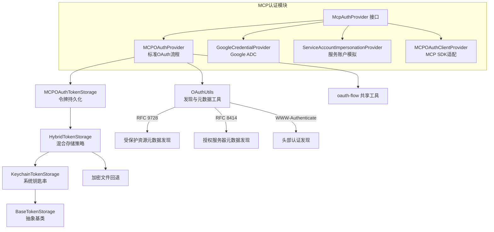

# mcp (MCP OAuth 认证模块)

## 概述

`mcp/` 目录负责为 MCP (Model Context Protocol) 服务器提供 OAuth 认证能力。该模块实现了完整的 OAuth 2.0 授权码流程（含 PKCE 扩展）、动态客户端注册（RFC 7591）、Google ADC 认证、服务账户模拟，以及多层令牌存储策略（Keychain / 加密文件 / 混合方案）。

## 目录结构

```
mcp/
├── auth-provider.ts              # McpAuthProvider 接口定义
├── google-auth-provider.ts       # Google ADC 凭据认证提供者
├── mcp-oauth-provider.ts         # MCP SDK 标准 OAuthClientProvider 实现
├── oauth-provider.ts             # 核心 OAuth 认证流程（PKCE / 令牌刷新 / 发现）
├── oauth-token-storage.ts        # OAuth 令牌持久化存储管理
├── oauth-utils.ts                # OAuth 工具类（RFC 9728 发现、元数据解析等）
├── sa-impersonation-provider.ts  # 服务账户模拟认证提供者
├── token-storage/                # 令牌存储子模块（Keychain / 加密文件 / 混合）
│   ├── index.ts
│   ├── types.ts
│   ├── base-token-storage.ts
│   ├── hybrid-token-storage.ts
│   └── keychain-token-storage.ts
└── *.test.ts                     # 对应的单元测试文件
```

## 架构图



## 核心组件

### McpAuthProvider (auth-provider.ts)
- **职责**: 扩展 MCP SDK 的 `OAuthClientProvider` 接口，增加自定义请求头注入能力
- **关键方法**: `getRequestHeaders()` - 返回需要附加到传输请求的自定义头

### MCPOAuthProvider (oauth-provider.ts)
- **职责**: 实现完整的 OAuth 2.0 授权码流程，包含 PKCE 扩展
- **关键方法**:
  - `authenticate()` - 执行完整的 OAuth 流程（发现 -> 注册 -> 授权 -> 令牌交换）
  - `getValidToken()` - 获取有效令牌，自动刷新过期令牌
  - `refreshAccessToken()` - 使用刷新令牌获取新的访问令牌
- **特性**: 支持动态客户端注册（RFC 7591）、OAuth 配置自动发现

### GoogleCredentialProvider (google-auth-provider.ts)
- **职责**: 通过 Google Application Default Credentials (ADC) 进行认证
- **限制**: 仅允许 `*.googleapis.com` 和 `*.luci.app` 域名
- **特性**: 自动处理 `X-Goog-User-Project` 配额头

### ServiceAccountImpersonationProvider (sa-impersonation-provider.ts)
- **职责**: 通过 IAM Credentials API 模拟服务账户，生成 ID Token
- **场景**: 适用于需要以特定服务账户身份访问 MCP 服务器的场景

### OAuthUtils (oauth-utils.ts)
- **职责**: 提供 OAuth 协议相关的通用工具方法
- **关键功能**:
  - RFC 9728 受保护资源元数据发现
  - RFC 8414 授权服务器元数据发现
  - WWW-Authenticate 头解析
  - JWT 令牌过期时间解析
  - 资源标识符验证

### MCPOAuthTokenStorage (oauth-token-storage.ts)
- **职责**: 管理 OAuth 令牌的持久化存储与检索
- **特性**: 支持混合存储策略（Keychain 优先，加密文件回退）
- **安全**: 文件权限限制为 0o600，支持 5 分钟时钟偏移缓冲

## 依赖关系

### 内部依赖
- `config/storage.ts` - 配置文件路径管理
- `config/config.ts` - MCP 服务器配置类型
- `utils/events.ts` - 核心事件总线
- `utils/errors.ts` - 错误处理工具
- `utils/debugLogger.ts` - 调试日志
- `utils/secure-browser-launcher.ts` - 安全浏览器启动
- `utils/authConsent.ts` - 认证同意流程
- `utils/oauth-flow.ts` - OAuth 流程共享工具（PKCE、回调服务器等）
- `services/keychainService.ts` - 系统钥匙串服务

### 外部依赖
- `@modelcontextprotocol/sdk` - MCP SDK（OAuthClientProvider 类型）
- `google-auth-library` - Google 认证库（GoogleAuth）

## 数据流

### OAuth 认证流程
1. 客户端调用 `authenticate()` 方法
2. 如果没有授权 URL，通过 RFC 9728/8414 标准自动发现 OAuth 配置
3. 如果没有客户端 ID，执行动态客户端注册
4. 生成 PKCE 参数，启动本地回调服务器
5. 构建授权 URL，打开浏览器进行用户授权
6. 接收授权码，交换获取访问令牌
7. 将令牌保存到持久化存储

### 令牌刷新流程
1. 调用 `getValidToken()` 检查令牌有效性
2. 如果令牌未过期（含 5 分钟缓冲），直接返回
3. 如果过期且有刷新令牌，调用 `refreshAccessToken()` 获取新令牌
4. 更新存储中的令牌
5. 如果刷新失败，删除无效凭据并返回 null
