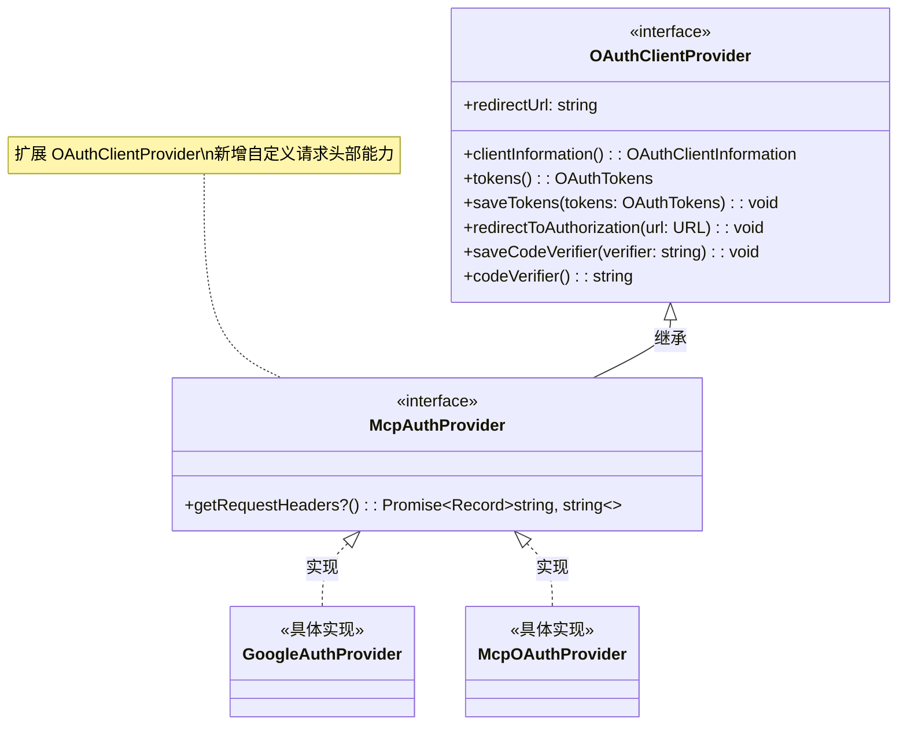

# auth-provider.ts

## 概述

`auth-provider.ts` 是 MCP (Model Context Protocol) 认证体系的基础接口定义文件。它定义了 `McpAuthProvider` 接口，该接口扩展了 MCP SDK 官方提供的 `OAuthClientProvider` 接口，为 MCP 传输层请求注入自定义 HTTP 头部提供了统一的扩展机制。

该文件是整个 MCP 认证模块的核心抽象层，所有具体的认证提供者（如 Google 认证、OAuth 认证等）都需要实现此接口。

**文件路径**: `packages/core/src/mcp/auth-provider.ts`
**许可证**: Apache-2.0
**版权**: 2025 Google LLC

## 架构图（Mermaid）

## 核心组件

### `McpAuthProvider` 接口

| 属性/方法 | 类型 | 是否可选 | 说明 |
|-----------|------|----------|------|
| `getRequestHeaders()` | `() => Promise<Record<string, string>>` | 可选 (`?`) | 返回需要注入到 MCP 传输层 HTTP 请求中的自定义头部键值对 |

#### 设计要点

1. **继承关系**: `McpAuthProvider` 继承自 `@modelcontextprotocol/sdk` 包中的 `OAuthClientProvider`，这意味着它保留了标准 OAuth 客户端提供者的所有能力（如 token 管理、授权重定向等）。

2. **可选方法**: `getRequestHeaders()` 被标记为可选方法（使用 `?` 修饰符），这意味着并非所有认证提供者都必须提供自定义头部。只有需要注入额外认证信息（如 Bearer Token、API Key 等）的提供者才需实现此方法。

3. **异步返回**: 该方法返回 `Promise<Record<string, string>>`，支持异步获取头部信息。这允许实现者在返回头部前执行异步操作，例如刷新过期的访问令牌。

## 依赖关系

### 内部依赖

无。`auth-provider.ts` 是认证模块的最底层接口定义，不依赖项目内其他模块。

### 外部依赖

| 依赖包 | 导入内容 | 说明 |
|--------|---------|------|
| `@modelcontextprotocol/sdk/client/auth.js` | `OAuthClientProvider` (类型导入) | MCP 官方 SDK 提供的 OAuth 客户端提供者接口，作为 `McpAuthProvider` 的父接口 |

> 注意：此处使用的是 `import type`（纯类型导入），不会在运行时引入任何代码，仅用于 TypeScript 类型检查。

## 关键实现细节

1. **纯接口文件**: 该文件仅包含一个 TypeScript 接口定义，不包含任何运行时逻辑代码。编译后的 JavaScript 文件将是空的（因为 TypeScript 接口在编译时会被完全擦除）。

2. **扩展点设计模式**: 通过在标准 `OAuthClientProvider` 之上添加 `getRequestHeaders()` 方法，该接口采用了"扩展点"设计模式。这使得 MCP 传输层可以统一调用此方法来获取额外的认证头部，而无需知道具体的认证实现细节。

3. **头部注入场景**: `getRequestHeaders()` 的典型使用场景包括：
   - 注入 `Authorization: Bearer <token>` 头部（用于 Google OAuth 认证）
   - 注入自定义 API 密钥头部
   - 注入会话标识或追踪头部

4. **类型安全**: 返回值类型 `Record<string, string>` 确保所有头部的键和值都是字符串类型，与 HTTP 头部规范一致。
