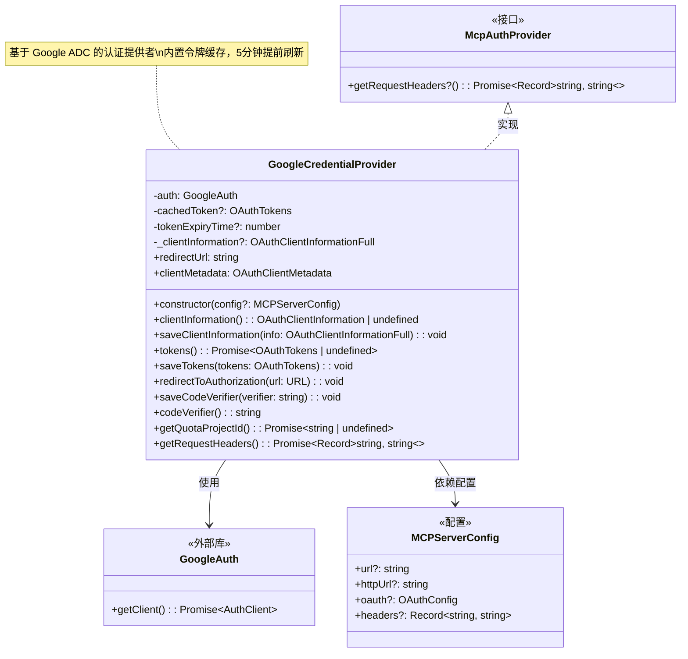
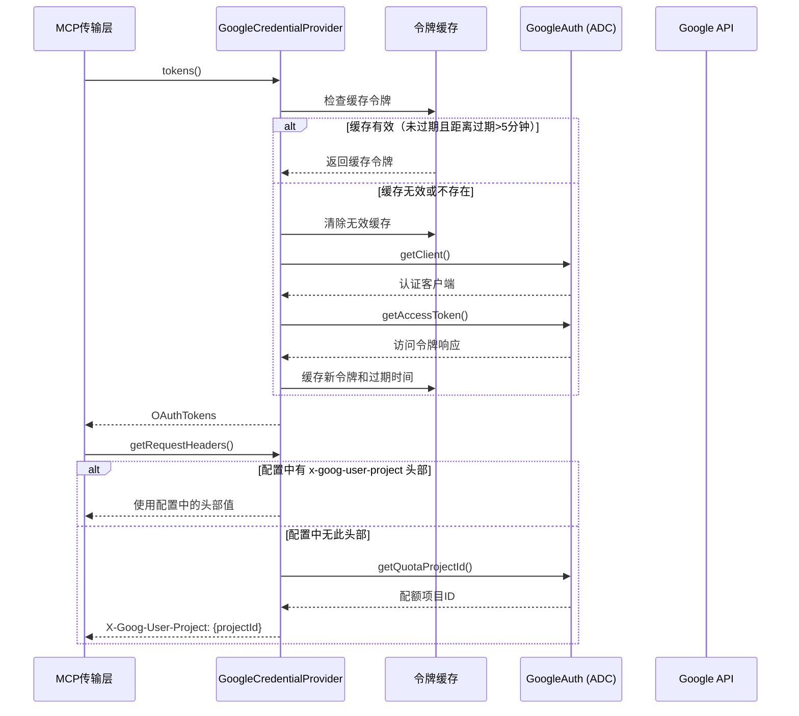

# google-auth-provider.ts

## 概述

`google-auth-provider.ts` 实现了基于 Google Application Default Credentials (ADC) 的 MCP 认证提供者。`GoogleCredentialProvider` 类实现了 `McpAuthProvider` 接口，使得 MCP 客户端能够通过 Google ADC 机制自动获取和管理访问令牌，从而访问受保护的 Google API 服务端点。

该提供者专门用于与 Google 相关的 MCP 服务器通信，它利用 `google-auth-library` 库来处理凭证的获取和刷新，并内置了令牌缓存机制以避免频繁的令牌请求。由于 ADC 自身管理令牌生命周期，该类中大部分 OAuth 标准流程方法（如重定向授权、保存令牌等）均为空操作（no-op）。

**文件路径**: `packages/core/src/mcp/google-auth-provider.ts`
**许可证**: Apache-2.0
**版权**: 2025 Google LLC

## 架构图（Mermaid）





## 核心组件

### `ALLOWED_HOSTS` 常量

```typescript
const ALLOWED_HOSTS = [/^.+\.googleapis\.com$/, /^(.*\.)?luci\.app$/];
```

安全白名单，限定 Google ADC 凭证只能发送到以下主机：
- `*.googleapis.com` -- 所有 Google API 服务端点
- `*.luci.app` 及 `luci.app` -- LUCI 持续集成系统

### `GoogleCredentialProvider` 类

#### 私有属性

| 属性 | 类型 | 说明 |
|------|------|------|
| `auth` | `GoogleAuth` | Google 认证库实例，用于获取 ADC 凭证 |
| `cachedToken` | `OAuthTokens \| undefined` | 缓存的 OAuth 令牌 |
| `tokenExpiryTime` | `number \| undefined` | 令牌过期时间戳（毫秒） |
| `_clientInformation` | `OAuthClientInformationFull \| undefined` | OAuth 客户端信息（内存存储） |

#### 只读属性（OAuthClientProvider 接口要求）

| 属性 | 值 | 说明 |
|------|-----|------|
| `redirectUrl` | `''` (空字符串) | 无需重定向，ADC 不使用浏览器授权流程 |
| `clientMetadata` | 见下方 | 客户端元数据，标识为 "Gemini CLI (Google ADC)" |

`clientMetadata` 详细内容：
```typescript
{
  client_name: 'Gemini CLI (Google ADC)',
  redirect_uris: [],
  grant_types: [],
  response_types: [],
  token_endpoint_auth_method: 'none',
}
```

#### 构造函数 `constructor(config?: MCPServerConfig)`

**验证逻辑**（按顺序执行）：

1. **URL 验证**: 从 `config.url` 或 `config.httpUrl` 中获取服务器 URL。若均未提供，抛出错误。
2. **主机白名单验证**: 解析 URL 获取 hostname，与 `ALLOWED_HOSTS` 正则数组匹配。若不在白名单内，抛出错误。这是一项重要的安全措施，防止 Google 凭证泄露到非 Google 服务。
3. **Scopes 验证**: 从 `config.oauth.scopes` 获取 OAuth 作用域。若未提供或为空数组，抛出错误。
4. **初始化 GoogleAuth**: 使用配置的 scopes 创建 `GoogleAuth` 实例。

#### 方法详解

##### `tokens(): Promise<OAuthTokens | undefined>`

令牌获取方法，核心逻辑：

1. **缓存检查**: 若存在缓存令牌且距离过期时间超过 5 分钟（`FIVE_MIN_BUFFER_MS`），直接返回缓存令牌。
2. **缓存失效**: 清除过期的 `cachedToken` 和 `tokenExpiryTime`。
3. **重新获取**: 通过 `GoogleAuth.getClient()` 获取认证客户端，再调用 `getAccessToken()` 获取新令牌。
4. **错误处理**: 若获取令牌失败（`token` 为空），通过 `coreEvents.emitFeedback` 发送错误反馈，返回 `undefined`。
5. **缓存更新**: 若令牌携带过期时间，缓存新令牌和过期时间。

##### `getRequestHeaders(): Promise<Record<string, string>>`

构建自定义请求头部：

1. **优先使用配置**: 检查 `config.headers` 中是否已存在 `x-goog-user-project` 头部（不区分大小写），若存在则直接使用配置中的键和值。
2. **自动填充配额项目**: 若配置中无此头部，调用 `getQuotaProjectId()` 从 ADC 客户端获取配额项目 ID，自动设置 `X-Goog-User-Project` 头部。
3. **防重复设计**: 使用不区分大小写的键查找，避免产生重复头部（如同时存在 `x-goog-user-project` 和 `X-Goog-User-Project`），因为重复头部可能导致 API 错误。

##### `getQuotaProjectId(): Promise<string | undefined>`

获取用于 API 配额计费的 Google Cloud 项目 ID。

##### 空操作方法（No-op）

以下方法均为空操作，因为 ADC 机制自身管理令牌生命周期，不需要标准 OAuth 的授权码流程：

| 方法 | 说明 |
|------|------|
| `saveTokens()` | ADC 自动管理令牌，无需手动保存 |
| `redirectToAuthorization()` | ADC 不需要浏览器授权重定向 |
| `saveCodeVerifier()` | ADC 不使用 PKCE 流程 |
| `codeVerifier()` | 返回空字符串 |

## 依赖关系

### 内部依赖

| 模块 | 导入内容 | 说明 |
|------|---------|------|
| `./auth-provider.js` | `McpAuthProvider` (类型) | MCP 认证提供者接口，本类实现该接口 |
| `../config/config.js` | `MCPServerConfig` (类型) | MCP 服务器配置类型，用于获取 URL、OAuth、headers 等配置 |
| `./oauth-utils.js` | `FIVE_MIN_BUFFER_MS` | 5 分钟缓冲时间常量（毫秒），用于令牌提前刷新判断 |
| `../utils/events.js` | `coreEvents` | 核心事件总线，用于发送错误反馈事件 |

### 外部依赖

| 依赖包 | 导入内容 | 说明 |
|--------|---------|------|
| `@modelcontextprotocol/sdk/shared/auth.js` | `OAuthClientInformation`, `OAuthClientInformationFull`, `OAuthClientMetadata`, `OAuthTokens` (均为类型) | MCP SDK 中的 OAuth 相关类型定义 |
| `google-auth-library` | `GoogleAuth` | Google 官方认证库，提供 Application Default Credentials (ADC) 支持 |

## 关键实现细节

1. **安全主机白名单**: 构造函数中的 `ALLOWED_HOSTS` 检查是一项关键安全措施。它确保 Google ADC 凭证（可能包含高权限的访问令牌）只会被发送到 Google 自有的服务端点。如果 MCP 服务器配置指向了非 Google 主机，构造时就会立即抛出异常，防止凭证泄露。

2. **令牌缓存与提前刷新**: 令牌缓存使用了 5 分钟的提前刷新缓冲（`FIVE_MIN_BUFFER_MS`）。这意味着当令牌距离过期还有不到 5 分钟时，系统会主动获取新令牌，而不是等到令牌实际过期后再刷新。这种策略可以有效避免因令牌过期导致的请求失败。

3. **ADC 机制**: Google Application Default Credentials 是一种自动发现凭证的机制，它按以下优先级查找凭证：
   - 环境变量 `GOOGLE_APPLICATION_CREDENTIALS` 指定的服务账号密钥文件
   - gcloud CLI 配置的用户凭证（`gcloud auth application-default login`）
   - 在 Google Cloud 环境中自动可用的元数据服务凭证

4. **配额项目头部**: `X-Goog-User-Project` 头部用于指定 API 调用的配额和计费项目。该实现支持两种方式设置：
   - **显式配置**: 在 MCP 服务器配置的 `headers` 中直接指定
   - **自动发现**: 从 ADC 客户端的 `quotaProjectId` 属性中获取

5. **不区分大小写的头部查找**: `getRequestHeaders()` 方法在查找配置中的 `x-goog-user-project` 头部时使用了不区分大小写的比较（`key.toLowerCase()`），这是因为 HTTP 头部名称规范上是大小写不敏感的，但重复的头部（大小写不同的同名键）可能导致服务端解析错误。

6. **错误反馈机制**: 当令牌获取失败时，通过 `coreEvents.emitFeedback('error', ...)` 发送错误事件，而非直接抛出异常。这使得调用方可以优雅地处理认证失败的情况。
