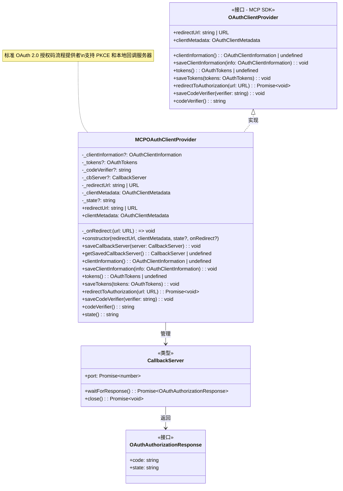
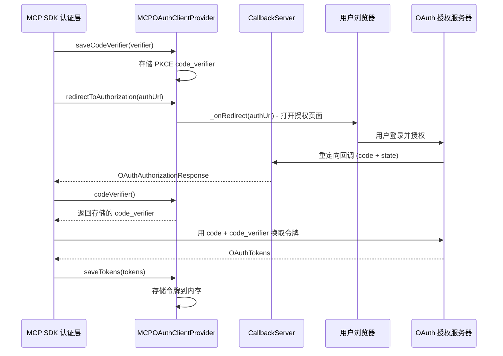

# mcp-oauth-provider.ts

## 概述

`mcp-oauth-provider.ts` 实现了标准 OAuth 2.0 授权码流程的 MCP 客户端提供者。`MCPOAuthClientProvider` 类直接实现了 MCP SDK 的 `OAuthClientProvider` 接口（注意：并非扩展的 `McpAuthProvider`），提供了完整的 OAuth 客户端状态管理能力，包括客户端信息、令牌、PKCE 验证码以及授权回调服务器的管理。

与 `GoogleCredentialProvider` 不同，该类适用于需要通过标准 OAuth 2.0 授权码流程（含 PKCE）进行认证的通用 MCP 服务器，而非仅限于 Google 服务。

**文件路径**: `packages/core/src/mcp/mcp-oauth-provider.ts`
**许可证**: Apache-2.0
**版权**: 2026 Google LLC

## 架构图（Mermaid）





## 核心组件

### `OAuthAuthorizationResponse` 接口

```typescript
export interface OAuthAuthorizationResponse {
  code: string;   // OAuth 授权码
  state: string;  // 防 CSRF 的 state 参数
}
```

表示 OAuth 授权服务器的回调响应，包含授权码 (`code`) 和状态参数 (`state`)。`state` 参数用于防止跨站请求伪造（CSRF）攻击。

### `CallbackServer` 类型

```typescript
type CallbackServer = {
  port: Promise<number>;
  waitForResponse: () => Promise<OAuthAuthorizationResponse>;
  close: () => Promise<void>;
};
```

本地回调服务器类型定义，用于接收 OAuth 授权码回调：

| 属性 | 类型 | 说明 |
|------|------|------|
| `port` | `Promise<number>` | 服务器监听端口（异步获取，因为端口可能动态分配） |
| `waitForResponse()` | `() => Promise<OAuthAuthorizationResponse>` | 等待并返回授权服务器的回调响应 |
| `close()` | `() => Promise<void>` | 关闭回调服务器，释放端口资源 |

> 注意：`CallbackServer` 类型未被导出（使用 `type` 而非 `export type`），属于模块内部类型。具体的回调服务器实现在该模块外部。

### `MCPOAuthClientProvider` 类

#### 构造函数

```typescript
constructor(
  private readonly _redirectUrl: string | URL,
  private readonly _clientMetadata: OAuthClientMetadata,
  private readonly _state?: string | undefined,
  private readonly _onRedirect: (url: URL) => void = (url) => {
    debugLogger.log(`Redirect to: ${url.toString()}`);
  },
)
```

| 参数 | 类型 | 是否必需 | 默认值 | 说明 |
|------|------|----------|--------|------|
| `_redirectUrl` | `string \| URL` | 是 | - | OAuth 回调 URL，授权完成后用户被重定向到此地址 |
| `_clientMetadata` | `OAuthClientMetadata` | 是 | - | OAuth 客户端元数据（客户端名称、重定向 URI 等） |
| `_state` | `string \| undefined` | 否 | `undefined` | OAuth state 参数，用于 CSRF 保护 |
| `_onRedirect` | `(url: URL) => void` | 否 | 调试日志记录 | 授权重定向时的回调函数，默认仅记录调试日志 |

#### 私有状态

| 属性 | 类型 | 说明 |
|------|------|------|
| `_clientInformation` | `OAuthClientInformation \| undefined` | OAuth 客户端注册信息（如 client_id、client_secret） |
| `_tokens` | `OAuthTokens \| undefined` | OAuth 访问令牌和刷新令牌 |
| `_codeVerifier` | `string \| undefined` | PKCE code_verifier，用于授权码交换时的验证 |
| `_cbServer` | `CallbackServer \| undefined` | 本地回调服务器实例 |

#### 方法详解

##### getter 属性

- **`redirectUrl`**: 返回构造时传入的重定向 URL
- **`clientMetadata`**: 返回构造时传入的客户端元数据

##### 回调服务器管理

- **`saveCallbackServer(server: CallbackServer)`**: 保存本地回调服务器实例到内存
- **`getSavedCallbackServer(): CallbackServer | undefined`**: 获取已保存的回调服务器实例

> 这两个方法是 `MCPOAuthClientProvider` 相对于标准 `OAuthClientProvider` 接口的额外能力，用于在 OAuth 流程中管理本地 HTTP 回调服务器的生命周期。

##### OAuth 状态管理

- **`clientInformation()`**: 返回当前存储的 OAuth 客户端信息
- **`saveClientInformation(info)`**: 保存 OAuth 客户端信息到内存
- **`tokens()`**: 返回当前存储的 OAuth 令牌
- **`saveTokens(tokens)`**: 保存 OAuth 令牌到内存

##### 授权流程

- **`redirectToAuthorization(authorizationUrl: URL)`**: 触发授权重定向。通过调用构造时注入的 `_onRedirect` 回调函数，将授权 URL 传递给调用方（通常用于打开浏览器）。

##### PKCE 支持

- **`saveCodeVerifier(codeVerifier: string)`**: 保存 PKCE code_verifier
- **`codeVerifier(): string`**: 获取已保存的 code_verifier。若未保存，抛出 `Error('No code verifier saved')`

##### State 管理

- **`state(): string`**: 获取构造时传入的 state 参数。若未提供，抛出 `Error('No code state saved')`

## 依赖关系

### 内部依赖

| 模块 | 导入内容 | 说明 |
|------|---------|------|
| `../utils/debugLogger.js` | `debugLogger` | 调试日志工具，用于在默认的重定向回调中记录日志 |

### 外部依赖

| 依赖包 | 导入内容 | 说明 |
|--------|---------|------|
| `@modelcontextprotocol/sdk/client/auth.js` | `OAuthClientProvider` (类型) | MCP SDK 的 OAuth 客户端提供者接口 |
| `@modelcontextprotocol/sdk/shared/auth.js` | `OAuthClientInformation`, `OAuthClientMetadata`, `OAuthTokens` (均为类型) | MCP SDK 中的 OAuth 相关类型定义 |

## 关键实现细节

1. **纯内存状态存储**: 所有 OAuth 状态（客户端信息、令牌、code_verifier）都存储在内存中，没有持久化机制。这意味着进程重启后所有认证状态将丢失，需要重新进行授权流程。如果需要持久化，应在外部配合 `OAuthTokenStorage` 等机制使用。

2. **与 `McpAuthProvider` 的区别**: 该类直接实现 `OAuthClientProvider` 而非 `McpAuthProvider`。这意味着它没有 `getRequestHeaders()` 方法，不支持自定义请求头部注入。这表明该类主要用于标准的 OAuth 令牌传递（通常通过 MCP SDK 内部的 `Authorization` 头部自动处理）。

3. **回调服务器模式**: `CallbackServer` 的设计采用了典型的本地 OAuth 回调模式——在本地启动一个临时 HTTP 服务器来接收授权码回调。`port` 属性设计为 `Promise<number>` 表明端口可能是动态分配的（如使用端口 0 让操作系统自动选择可用端口）。

4. **PKCE 安全机制**: 该类完整支持 PKCE (Proof Key for Code Exchange) 流程：
   - 在发起授权请求前，MCP SDK 生成 `code_verifier` 并通过 `saveCodeVerifier()` 保存
   - 授权请求中包含 `code_verifier` 的哈希值（`code_challenge`）
   - 在用授权码换取令牌时，通过 `codeVerifier()` 获取原始 `code_verifier` 发送给令牌端点
   - 这防止了授权码被拦截后的重放攻击

5. **State 参数不可变**: `_state` 是通过构造函数注入的只读属性，一旦创建就不能修改。这确保了 CSRF 保护的 state 值在整个 OAuth 流程中保持一致。

6. **可插拔的重定向处理**: `_onRedirect` 回调支持自定义授权页面打开方式。默认实现仅记录调试日志，但在实际使用中通常会被替换为打开系统浏览器的逻辑。

7. **防御性编程**: `codeVerifier()` 和 `state()` 方法在值缺失时主动抛出异常，而非返回 `undefined`，这是一种防御性编程策略，确保在 OAuth 流程的关键步骤中不会因为缺少必要参数而静默失败。
