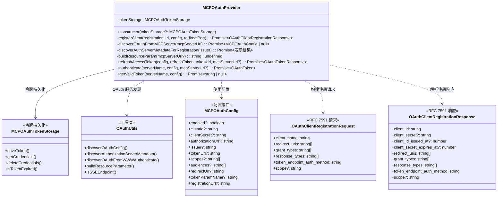
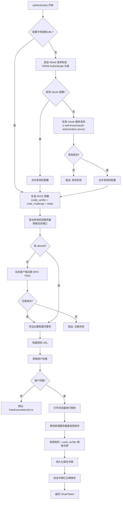
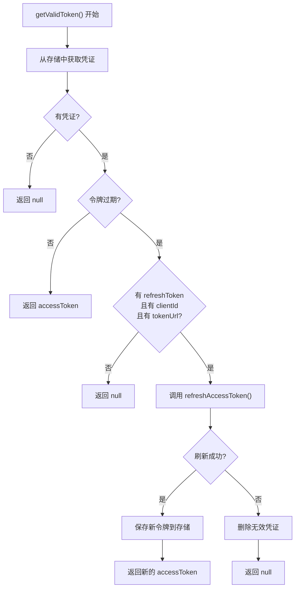

# oauth-provider.ts

## 概述

`oauth-provider.ts` 是 MCP OAuth 认证的核心业务逻辑实现文件。`MCPOAuthProvider` 类封装了完整的 OAuth 2.0 授权码流程（含 PKCE），包括 OAuth 服务发现、动态客户端注册（RFC 7591）、授权码获取、令牌交换、令牌刷新以及令牌持久化存储等全生命周期管理。

与 `MCPOAuthClientProvider`（纯状态容器）不同，`MCPOAuthProvider` 是一个完整的认证服务编排器，它协调多个子模块完成端到端的 OAuth 认证流程。该类是 MCP 客户端与第三方 OAuth 服务器交互的主要入口点。

**文件路径**: `packages/core/src/mcp/oauth-provider.ts`
**许可证**: Apache-2.0
**版权**: 2025 Google LLC

## 架构图（Mermaid）







## 核心组件

### `MCPOAuthConfig` 接口

MCP 服务器的 OAuth 配置接口，所有字段均为可选，支持通过自动发现机制填充。

| 字段 | 类型 | 说明 |
|------|------|------|
| `enabled` | `boolean` | 是否启用该服务器的 OAuth 认证 |
| `clientId` | `string` | OAuth 客户端 ID。若未提供，将尝试动态客户端注册 |
| `clientSecret` | `string` | OAuth 客户端密钥。公开客户端可不提供 |
| `authorizationUrl` | `string` | 授权端点 URL。若未提供，将通过服务发现获取 |
| `issuer` | `string` | OAuth 发行者 URL，用于服务发现和动态注册 |
| `tokenUrl` | `string` | 令牌端点 URL。若未提供，将通过服务发现获取 |
| `scopes` | `string[]` | 请求的 OAuth 作用域列表 |
| `audiences` | `string[]` | 目标受众列表 |
| `redirectUri` | `string` | 自定义重定向 URI。默认使用本地回调服务器 |
| `tokenParamName` | `string` | 用于 SSE 连接的令牌查询参数名 |
| `registrationUrl` | `string` | 动态客户端注册端点 URL |

### `OAuthClientRegistrationRequest` 接口

符合 RFC 7591 的动态客户端注册请求。

| 字段 | 类型 | 说明 |
|------|------|------|
| `client_name` | `string` | 客户端名称，固定为 "Gemini CLI MCP Client" |
| `redirect_uris` | `string[]` | 重定向 URI 列表 |
| `grant_types` | `string[]` | 授权类型，固定为 `['authorization_code', 'refresh_token']` |
| `response_types` | `string[]` | 响应类型，固定为 `['code']` |
| `token_endpoint_auth_method` | `string` | 令牌端点认证方式，固定为 `'none'`（公开客户端） |
| `scope` | `string` | 请求的作用域（空格分隔） |

### `OAuthClientRegistrationResponse` 接口

符合 RFC 7591 的动态客户端注册响应。

| 字段 | 类型 | 是否必需 | 说明 |
|------|------|----------|------|
| `client_id` | `string` | 是 | 分配的客户端 ID |
| `client_secret` | `string` | 否 | 分配的客户端密钥 |
| `client_id_issued_at` | `number` | 否 | 客户端 ID 签发时间 |
| `client_secret_expires_at` | `number` | 否 | 客户端密钥过期时间 |
| `redirect_uris` | `string[]` | 是 | 注册的重定向 URI |
| `grant_types` | `string[]` | 是 | 允许的授权类型 |
| `response_types` | `string[]` | 是 | 允许的响应类型 |
| `token_endpoint_auth_method` | `string` | 是 | 令牌端点认证方式 |
| `scope` | `string` | 否 | 授权的作用域 |

### `MCPOAuthProvider` 类

#### 构造函数

```typescript
constructor(tokenStorage: MCPOAuthTokenStorage = new MCPOAuthTokenStorage())
```

接受一个可选的 `MCPOAuthTokenStorage` 实例，默认创建新实例。

#### 私有方法

##### `registerClient(registrationUrl, config, redirectPort)`

动态客户端注册方法（RFC 7591）：
1. 构建重定向 URI：优先使用配置中的 `redirectUri`，否则使用 `http://localhost:{port}/callback`
2. 构建注册请求体，客户端名称固定为 "Gemini CLI MCP Client"
3. 向注册端点发送 POST 请求
4. 解析并返回注册响应

##### `discoverOAuthFromMCPServer(mcpServerUrl)`

从 MCP 服务器 URL 发现 OAuth 配置，委托给 `OAuthUtils.discoverOAuthConfig()`。

##### `discoverAuthServerMetadataForRegistration(issuer)`

从 issuer URL 发现授权服务器元数据，用于动态客户端注册。处理了多种 URL 格式：

1. **OIDC 路径清理**: 移除 URL 路径中的 OIDC 协议特定后缀，支持以下模式：
   - `/protocol/openid-connect/auth` (Keycloak 风格)
   - `/protocol/openid-connect/authorize`
   - `/oauth2/authorize`
   - `/oauth/authorize`
   - `/authorize`

2. **多候选 issuer 尝试**: 生成多个候选 issuer URL 并逐一尝试：
   - 仅包含 origin 的基础 URL
   - 清理后保留路径的 URL
   - 移除版本号段（如 `/v1`、`/v2.0`）后的 URL

##### `buildResourceParam(mcpServerUrl?)`

构建 OAuth resource 参数（RFC 8707）。如果 URL 无效或无法处理，返回 `undefined` 并记录警告日志。

#### 公开方法

##### `refreshAccessToken(config, refreshToken, tokenUrl, mcpServerUrl?)`

刷新访问令牌：
- 验证 `config.clientId` 存在
- 委托给共享的 `refreshAccessTokenShared()` 函数
- 自动附加 resource 参数

##### `authenticate(serverName, config, mcpServerUrl?)`

**完整的 OAuth 授权码流程**（最核心的方法），执行步骤：

1. **OAuth 服务发现**（若无授权 URL）：
   - 先尝试 WWW-Authenticate 头部发现（发送 HEAD 请求检查 401/307 响应）
   - 再尝试标准 `.well-known` 端点发现

2. **PKCE 参数生成**: 生成 `code_verifier`、`code_challenge` 和 `state`

3. **启动本地回调服务器**: 在首选端口（或动态端口）上启动 HTTP 服务器等待回调

4. **动态客户端注册**（若无 clientId）：
   - 从 issuer 发现注册端点
   - 发送 RFC 7591 注册请求
   - 获取 clientId 和可选的 clientSecret

5. **配置验证**: 确保 clientId、authorizationUrl、tokenUrl 均存在

6. **构建授权 URL**: 包含 PKCE code_challenge、scopes、resource 等参数

7. **用户同意**: 通过 `getConsentForOauth()` 获取用户确认。若用户拒绝，抛出 `FatalCancellationError`

8. **打开浏览器**: 通过 `openBrowserSecurely()` 安全打开浏览器访问授权 URL

9. **等待授权码**: 等待回调服务器接收到带有授权码的回调请求

10. **令牌交换**: 用授权码 + code_verifier 换取访问令牌

11. **令牌保存与验证**:
    - 持久化保存令牌到存储
    - 重新读取并验证令牌已正确保存
    - 使用 SHA-256 指纹（前 8 位十六进制）记录日志，避免泄露令牌

12. **返回令牌**: 返回 `OAuthToken` 对象

##### `getValidToken(serverName, config)`

获取有效的访问令牌，带自动刷新逻辑：

1. 从存储中获取凭证
2. 若令牌未过期，直接返回
3. 若令牌已过期且有刷新令牌，尝试刷新
4. 刷新成功：保存新令牌并返回
5. 刷新失败：删除无效凭证，返回 `null`

## 依赖关系

### 内部依赖

| 模块 | 导入内容 | 说明 |
|------|---------|------|
| `../utils/secure-browser-launcher.js` | `openBrowserSecurely` | 安全地打开系统浏览器 |
| `./token-storage/types.js` | `OAuthToken` (类型) | OAuth 令牌数据类型 |
| `./oauth-token-storage.js` | `MCPOAuthTokenStorage` | 令牌持久化存储类 |
| `../utils/errors.js` | `getErrorMessage`, `FatalCancellationError` | 错误处理工具和取消异常类 |
| `./oauth-utils.js` | `OAuthUtils`, `ResourceMismatchError` | OAuth 工具类（服务发现、资源参数构建等） |
| `../utils/events.js` | `coreEvents` | 核心事件总线，用于反馈消息 |
| `../utils/debugLogger.js` | `debugLogger` | 调试日志工具 |
| `../utils/authConsent.js` | `getConsentForOauth` | OAuth 用户同意确认 |
| `../utils/oauth-flow.js` | `generatePKCEParams`, `startCallbackServer`, `getPortFromUrl`, `buildAuthorizationUrl`, `exchangeCodeForToken`, `refreshAccessToken`, `REDIRECT_PATH`, `OAuthFlowConfig`, `OAuthTokenResponse` | OAuth 流程共享工具函数 |

### 外部依赖

| 依赖包 | 导入内容 | 说明 |
|--------|---------|------|
| `node:crypto` | `crypto` (全模块) | Node.js 内置加密模块，用于令牌指纹计算（SHA-256） |
| `node:url` | `URL` | Node.js 内置 URL 解析模块 |

## 关键实现细节

1. **多层 OAuth 服务发现**: `authenticate()` 方法实现了两层服务发现策略：
   - **第一层：WWW-Authenticate 头部发现** -- 向 MCP 服务器 URL 发送 HEAD 请求，检查 401 或 307 响应中的 `WWW-Authenticate` 头部。对 SSE 端点使用 `Accept: text/event-stream` 头部，对其他端点使用 `Accept: application/json`。
   - **第二层：标准 `.well-known` 发现** -- 如果第一层未成功，尝试从 MCP 服务器 URL 发现标准的 OAuth 配置元数据。
   这种多层策略确保了与各种 OAuth 服务器实现的兼容性。

2. **Keycloak 兼容的 Issuer 发现**: `discoverAuthServerMetadataForRegistration()` 方法特别处理了 Keycloak 等使用路径式 issuer 的授权服务器。它通过移除已知的 OIDC 路径后缀来构建正确的 issuer URL，并尝试多个候选 URL，还处理了版本号段（如 `/v1`、`/v2.0`）。

3. **令牌安全日志**: 在令牌验证阶段，使用 SHA-256 哈希的前 8 位十六进制字符作为令牌指纹记录日志，而非记录令牌本身。这是一种安全最佳实践，既能验证令牌的一致性，又避免了令牌泄露到日志中。

4. **配置合并策略**: 在服务发现后合并配置时，始终**保留用户显式提供的 clientId 和 clientSecret**，只从发现结果中获取服务端点 URL 和默认 scopes。这确保了用户提供的凭证优先级最高。

5. **公开客户端模式**: 动态客户端注册时使用 `token_endpoint_auth_method: 'none'`，表明这是一个公开客户端（无法安全存储客户端密钥的客户端，如 CLI 工具）。这符合 OAuth 2.0 安全最佳实践（RFC 8252）。

6. **ResourceMismatchError 特殊处理**: 在 WWW-Authenticate 发现过程中，如果遇到 `ResourceMismatchError`（资源参数不匹配），会直接重新抛出，而不是吞掉异常。这是一项安全措施，防止令牌被发送到错误的资源服务器。

7. **令牌刷新时的 Refresh Token 保持**: 在 `getValidToken()` 刷新令牌时，如果新的响应中没有包含 `refresh_token`，会保留原来的 `refresh_token`（`newTokenResponse.refresh_token || token.refreshToken`）。这确保了后续仍然能够刷新令牌。

8. **刷新失败时的清理**: 如果令牌刷新失败，方法会删除存储中的无效凭证（`deleteCredentials`），而非保留过期令牌。这防止了下次请求时再次尝试使用同一个无效令牌。

9. **重导出兼容性**: 文件末尾重新导出了 `OAuthAuthorizationResponse` 和 `OAuthTokenResponse` 类型，这些类型已被移到 `oauth-flow.ts`，重导出是为了保持向后兼容性。
