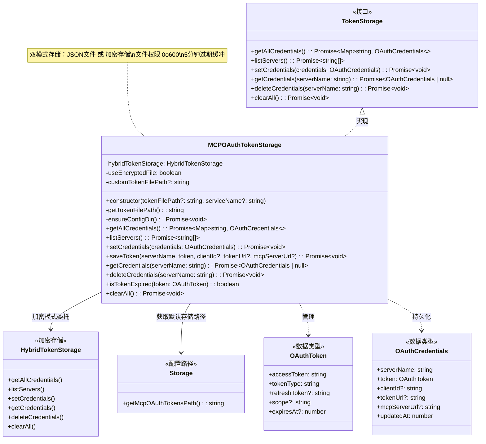
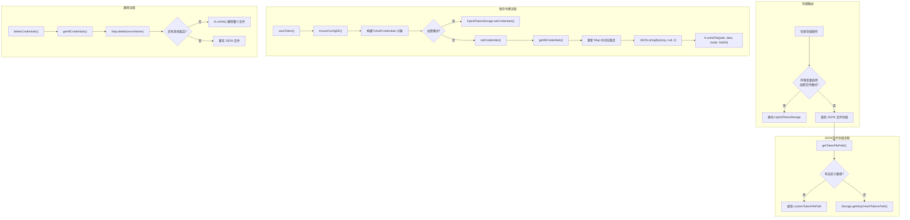

# oauth-token-storage.ts

## 概述

`oauth-token-storage.ts` 实现了 MCP OAuth 令牌的持久化存储管理。`MCPOAuthTokenStorage` 类实现了 `TokenStorage` 接口，提供了令牌的保存、读取、删除、过期检查以及全量清除等完整的令牌生命周期管理能力。

该类支持两种存储后端：
- **JSON 文件存储**（默认）: 将令牌以 JSON 数组格式保存到本地文件，文件权限设为 `0o600`（仅所有者可读写）。
- **加密文件存储**: 当环境变量启用时，委托给 `HybridTokenStorage` 进行加密存储。

该类不仅被 MCP OAuth 提供者使用，也被 A2A（Agent-to-Agent）OAuth 提供者使用。通过构造函数的 `tokenFilePath` 参数可以指定不同协议使用不同的存储文件。

**文件路径**: `packages/core/src/mcp/oauth-token-storage.ts`
**许可证**: Apache-2.0
**版权**: 2025 Google LLC

## 架构图（Mermaid）





## 核心组件

### `MCPOAuthTokenStorage` 类

#### 构造函数

```typescript
constructor(
  tokenFilePath?: string,
  serviceName: string = DEFAULT_SERVICE_NAME,
)
```

| 参数 | 类型 | 默认值 | 说明 |
|------|------|--------|------|
| `tokenFilePath` | `string \| undefined` | `undefined` | 自定义令牌文件路径。若未提供，使用 `Storage.getMcpOAuthTokensPath()` 默认路径 |
| `serviceName` | `string` | `DEFAULT_SERVICE_NAME` | 用于 `HybridTokenStorage` 的服务名称标识 |

#### 私有属性

| 属性 | 类型 | 说明 |
|------|------|------|
| `hybridTokenStorage` | `HybridTokenStorage` | 加密存储后端实例 |
| `useEncryptedFile` | `boolean` | 是否使用加密文件模式，由环境变量 `FORCE_ENCRYPTED_FILE_ENV_VAR` 控制 |
| `customTokenFilePath` | `string \| undefined` | 自定义的令牌文件路径 |

#### 私有方法

##### `getTokenFilePath(): string`

获取令牌存储文件路径。优先使用构造时传入的自定义路径，否则使用 `Storage.getMcpOAuthTokensPath()` 返回的默认路径。

##### `ensureConfigDir(): Promise<void>`

确保令牌文件所在的目录存在。使用 `fs.mkdir({ recursive: true })` 递归创建目录，如果目录已存在则静默通过。

#### 公开方法

##### `getAllCredentials(): Promise<Map<string, OAuthCredentials>>`

加载所有已存储的凭证：

- **加密模式**: 直接委托给 `hybridTokenStorage.getAllCredentials()`
- **文件模式**:
  1. 读取令牌文件内容
  2. 解析 JSON 为 `OAuthCredentials[]` 数组
  3. 转换为以 `serverName` 为键的 `Map`
  4. 若文件不存在（ENOENT），静默返回空 Map
  5. 若文件存在但解析失败，通过 `coreEvents` 发送错误反馈

##### `listServers(): Promise<string[]>`

列出所有已存储凭证的 MCP 服务器名称列表。

##### `setCredentials(credentials: OAuthCredentials): Promise<void>`

设置（新增或更新）一个服务器的凭证：

- **加密模式**: 委托给 `hybridTokenStorage.setCredentials()`
- **文件模式**:
  1. 加载所有现有凭证
  2. 更新或新增目标服务器的凭证
  3. 将 Map 转换为数组
  4. 以格式化 JSON 写入文件（`JSON.stringify(array, null, 2)`）
  5. 文件权限设为 `0o600`（仅所有者可读写）

##### `saveToken(serverName, token, clientId?, tokenUrl?, mcpServerUrl?): Promise<void>`

保存令牌的便捷方法（高层 API）：

1. 确保配置目录存在
2. 构建 `OAuthCredentials` 对象（包含时间戳 `updatedAt: Date.now()`）
3. 根据存储模式选择保存路径

| 参数 | 类型 | 说明 |
|------|------|------|
| `serverName` | `string` | MCP 服务器名称（作为存储键） |
| `token` | `OAuthToken` | OAuth 令牌对象 |
| `clientId` | `string \| undefined` | 客户端 ID |
| `tokenUrl` | `string \| undefined` | 令牌端点 URL（刷新令牌时需要） |
| `mcpServerUrl` | `string \| undefined` | MCP 服务器 URL（构建 resource 参数时需要） |

##### `getCredentials(serverName: string): Promise<OAuthCredentials | null>`

获取指定服务器的凭证。返回 `OAuthCredentials` 对象或 `null`（未找到）。

##### `deleteCredentials(serverName: string): Promise<void>`

删除指定服务器的凭证：

- **加密模式**: 委托给 `hybridTokenStorage.deleteCredentials()`
- **文件模式**:
  1. 加载所有凭证
  2. 从 Map 中删除目标条目
  3. 若删除成功：
     - 若 Map 为空：**删除整个令牌文件**（`fs.unlink`）
     - 若还有其他条目：重写文件
  4. 若删除失败（条目不存在）：静默通过

##### `isTokenExpired(token: OAuthToken): boolean`

检查令牌是否过期：

- 若令牌没有 `expiresAt` 字段，假定令牌有效（返回 `false`）
- 使用 5 分钟（300,000 毫秒）的缓冲时间来补偿时钟偏差
- 判断逻辑：`Date.now() + 5分钟 >= token.expiresAt`

```
|---------有效期---------|--5分钟缓冲--|
签发时间              实际过期        判定过期
                     (expiresAt)   (提前5分钟)
```

##### `clearAll(): Promise<void>`

清除所有已存储的令牌：

- **加密模式**: 委托给 `hybridTokenStorage.clearAll()`
- **文件模式**: 删除令牌文件。若文件不存在（ENOENT），静默通过

## 依赖关系

### 内部依赖

| 模块 | 导入内容 | 说明 |
|------|---------|------|
| `../utils/events.js` | `coreEvents` | 核心事件总线，用于错误反馈 |
| `../config/storage.js` | `Storage` | 存储路径配置，提供默认令牌文件路径 |
| `../utils/errors.js` | `getErrorMessage` | 错误消息提取工具 |
| `./token-storage/types.js` | `OAuthToken`, `OAuthCredentials`, `TokenStorage` (均为类型) | 令牌相关数据类型和存储接口定义 |
| `./token-storage/hybrid-token-storage.js` | `HybridTokenStorage` | 混合令牌存储（支持加密） |
| `./token-storage/index.js` | `DEFAULT_SERVICE_NAME`, `FORCE_ENCRYPTED_FILE_ENV_VAR` | 默认服务名称和环境变量名常量 |

### 外部依赖

| 依赖包 | 导入内容 | 说明 |
|--------|---------|------|
| `node:fs` | `promises as fs` | Node.js 文件系统模块（Promise API），用于文件读写、删除、目录创建 |
| `node:path` | `path` | Node.js 路径处理模块，用于获取目录名 |

## 关键实现细节

1. **双模式存储架构**: 该类通过环境变量 `FORCE_ENCRYPTED_FILE_ENV_VAR` 控制存储模式。每个公开方法的开头都会检查 `this.useEncryptedFile`：
   - 若为 `true`：所有操作委托给 `HybridTokenStorage`（加密存储）
   - 若为 `false`：使用本地 JSON 文件存储

   这种设计允许在安全性要求更高的环境中启用加密存储，同时保持默认的简单文件存储以方便开发调试。

2. **文件权限安全**: JSON 文件以 `0o600` 权限写入，即仅文件所有者可读写（Unix/macOS）。这防止同一系统上的其他用户读取令牌文件。

3. **空文件清理**: `deleteCredentials()` 方法在删除最后一个条目后会删除整个令牌文件（而非留下一个空数组的 JSON 文件）。这是一个良好的清理策略，避免留下无用的空文件。

4. **5 分钟过期缓冲**: `isTokenExpired()` 使用 5 分钟的提前过期判定，与 `google-auth-provider.ts` 中使用的 `FIVE_MIN_BUFFER_MS` 常量保持一致。但注意这里是硬编码的 `5 * 60 * 1000`，而非引用共享常量。这种缓冲机制用于：
   - 补偿客户端与服务器之间的时钟偏差
   - 确保令牌在实际使用时不会恰好过期

5. **ENOENT 静默处理**: 在 `getAllCredentials()` 和 `clearAll()` 方法中，文件不存在（ENOENT 错误码）被视为正常情况而非错误。这使得首次运行时无需预先创建令牌文件。

6. **全量读写模式**: JSON 文件存储采用"全量读取 -> 修改内存 Map -> 全量写入"的模式。每次写操作都会重写整个文件。这对于小规模的令牌存储（通常只有几个 MCP 服务器）是完全足够的，但不适合大量并发写入的场景。

7. **时间戳追踪**: `saveToken()` 方法在构建 `OAuthCredentials` 时自动添加 `updatedAt: Date.now()` 时间戳，用于追踪令牌的最后更新时间。

8. **错误处理策略**:
   - 读取错误（除 ENOENT 外）：发送错误反馈但不抛出异常，返回空 Map
   - 写入错误：发送错误反馈**并**抛出异常（写入失败是严重问题）
   - 删除错误：发送错误反馈但不抛出异常

9. **协议级隔离**: 类注释中明确指出，可以通过传入自定义 `tokenFilePath` 来为不同协议（MCP、A2A）使用不同的存储文件，实现协议级的令牌隔离。
