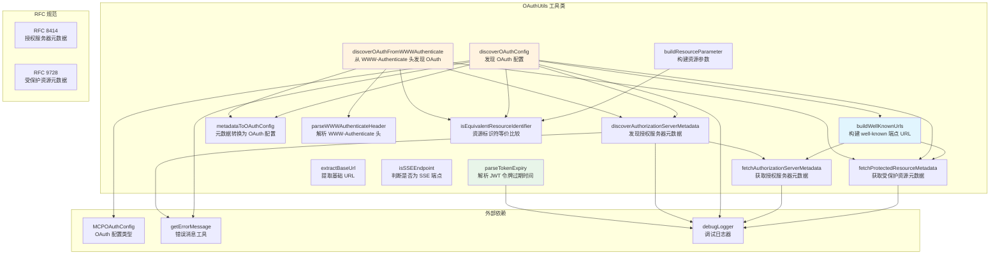

# oauth-utils.ts

## 概述

`oauth-utils.ts` 是 MCP (Model Context Protocol) 模块中的 OAuth 工具类文件，提供了一整套用于 OAuth 2.0 协议发现、元数据获取、配置解析的静态工具方法。该文件严格遵循 **RFC 8414**（OAuth 2.0 授权服务器元数据）和 **RFC 9728**（OAuth 2.0 受保护资源元数据）规范，实现了从 well-known 端点自动发现 OAuth 配置的完整流程。

文件主要包含：
- `ResourceMismatchError` 自定义错误类
- `OAuthAuthorizationServerMetadata` 接口（RFC 8414）
- `OAuthProtectedResourceMetadata` 接口（RFC 9728）
- `OAuthUtils` 工具类（核心）

## 架构图（Mermaid）



## 核心组件

### 1. ResourceMismatchError 错误类

自定义错误类，当发现的资源元数据中的 `resource` 字段与预期资源 URL 不匹配时抛出。这是 RFC 9728 第 7.3 节要求的安全校验。

```typescript
export class ResourceMismatchError extends Error {
  constructor(message: string) {
    super(message);
    this.name = 'ResourceMismatchError';
  }
}
```

### 2. OAuthAuthorizationServerMetadata 接口

符合 RFC 8414 规范的授权服务器元数据接口，定义了以下字段：

| 字段 | 类型 | 必填 | 说明 |
|------|------|------|------|
| `issuer` | `string` | 是 | 授权服务器的发行者标识 |
| `authorization_endpoint` | `string` | 是 | 授权端点 URL |
| `token_endpoint` | `string` | 是 | 令牌端点 URL |
| `token_endpoint_auth_methods_supported` | `string[]` | 否 | 令牌端点支持的认证方法 |
| `revocation_endpoint` | `string` | 否 | 令牌撤销端点 |
| `revocation_endpoint_auth_methods_supported` | `string[]` | 否 | 撤销端点支持的认证方法 |
| `registration_endpoint` | `string` | 否 | 动态客户端注册端点 |
| `response_types_supported` | `string[]` | 否 | 支持的响应类型 |
| `grant_types_supported` | `string[]` | 否 | 支持的授权类型 |
| `code_challenge_methods_supported` | `string[]` | 否 | 支持的 PKCE 代码挑战方法 |
| `scopes_supported` | `string[]` | 否 | 支持的作用域 |

### 3. OAuthProtectedResourceMetadata 接口

符合 RFC 9728 规范的受保护资源元数据接口：

| 字段 | 类型 | 必填 | 说明 |
|------|------|------|------|
| `resource` | `string` | 是 | 资源标识符 URL |
| `authorization_servers` | `string[]` | 否 | 关联的授权服务器列表 |
| `bearer_methods_supported` | `string[]` | 否 | 支持的 Bearer 令牌传递方法 |
| `resource_documentation` | `string` | 否 | 资源文档 URL |
| `resource_signing_alg_values_supported` | `string[]` | 否 | 支持的签名算法 |
| `resource_encryption_alg_values_supported` | `string[]` | 否 | 支持的加密算法 |
| `resource_encryption_enc_values_supported` | `string[]` | 否 | 支持的加密编码算法 |

### 4. OAuthUtils 工具类

#### `buildWellKnownUrls(baseUrl, useRootDiscovery?)`
根据 RFC 9728 第 3.1 节构建 well-known 端点 URL。将 `/.well-known/oauth-protected-resource` 插入到主机和路径之间。

- `useRootDiscovery = false`：保留路径结构（RFC 合规）
- `useRootDiscovery = true`：忽略路径，用于回退兼容

#### `fetchProtectedResourceMetadata(resourceMetadataUrl)`
异步获取受保护资源的 OAuth 元数据，返回 `OAuthProtectedResourceMetadata | null`。请求失败时记录调试日志并返回 `null`。

#### `fetchAuthorizationServerMetadata(authServerMetadataUrl)`
异步获取授权服务器元数据，返回 `OAuthAuthorizationServerMetadata | null`。

#### `metadataToOAuthConfig(metadata)`
将授权服务器元数据对象转换为内部使用的 `MCPOAuthConfig` 格式，映射关系：
- `authorization_endpoint` -> `authorizationUrl`
- `issuer` -> `issuer`
- `token_endpoint` -> `tokenUrl`
- `scopes_supported` -> `scopes`（默认空数组）
- `registration_endpoint` -> `registrationUrl`

#### `discoverAuthorizationServerMetadata(authServerUrl)`
发现授权服务器元数据，按优先级尝试多个 well-known 端点：

对于**有路径**的 URL：
1. `/.well-known/oauth-authorization-server{path}`（路径插入）
2. `/.well-known/openid-configuration{path}`（OpenID 路径插入）
3. `{path}/.well-known/openid-configuration`（OpenID 路径追加）

最终回退：
4. `/.well-known/oauth-authorization-server`（根路径）
5. `/.well-known/openid-configuration`（根路径 OpenID）

#### `discoverOAuthConfig(serverUrl)` -- 核心方法
完整的 OAuth 配置发现流程：
1. 构建 well-known URL 并获取受保护资源元数据
2. 如果路径发现失败，回退到根路径发现
3. 校验资源标识符匹配（RFC 9728 第 7.3 节）
4. 从资源元数据中获取授权服务器 URL，发现授权服务器元数据
5. 回退：直接在 base URL 上尝试授权服务器发现

#### `parseWWWAuthenticateHeader(header)`
使用正则表达式从 `WWW-Authenticate` 头中提取 `resource_metadata` URI。

#### `discoverOAuthFromWWWAuthenticate(wwwAuthenticate, mcpServerUrl?)`
从 HTTP 401 响应的 `WWW-Authenticate` 头发现 OAuth 配置，包含资源标识符校验。

#### `extractBaseUrl(mcpServerUrl)`
提取 URL 的协议和主机部分（去除路径、查询参数等）。

#### `isSSEEndpoint(url)`
判断 URL 是否为 SSE (Server-Sent Events) 端点。判断逻辑：包含 `/sse` 或不包含 `/mcp`。

#### `buildResourceParameter(endpointUrl)`
构建 OAuth 请求中的资源参数，格式为 `protocol://host/pathname`（不含查询参数和片段）。

#### `isEquivalentResourceIdentifier(discoveredResource, expectedResource)` (私有)
比较两个资源标识符是否等价，通过 `buildResourceParameter` 标准化后进行精确比较。

#### `parseTokenExpiry(idToken)`
解析 JWT 令牌（ID Token）的 `exp` 字段，提取过期时间。将 JWT payload 中的秒级时间戳转换为毫秒级。

### 5. 常量

| 常量 | 值 | 说明 |
|------|-----|------|
| `FIVE_MIN_BUFFER_MS` | `300000` (5分钟) | 令牌过期的缓冲时间，5分钟（毫秒） |

## 依赖关系

### 内部依赖

| 模块 | 导入内容 | 用途 |
|------|----------|------|
| `./oauth-provider.js` | `MCPOAuthConfig` 类型 | OAuth 配置的类型定义 |
| `../utils/errors.js` | `getErrorMessage` | 从错误对象中安全提取错误消息字符串 |
| `../utils/debugLogger.js` | `debugLogger` | 调试日志记录，用于记录发现流程中的错误和调试信息 |

### 外部依赖

| 依赖 | 说明 |
|------|------|
| Web Fetch API | 使用全局 `fetch` 进行 HTTP 请求 |
| URL API | 使用全局 `URL` 进行 URL 解析和构建 |
| Buffer | 使用 Node.js `Buffer` 进行 Base64 解码（JWT 解析） |

## 关键实现细节

### 1. RFC 9728 合规的 well-known URL 构建

```
输入: https://example.com/api/resource
输出:
  - protectedResource: https://example.com/.well-known/oauth-protected-resource/api/resource
  - authorizationServer: https://example.com/.well-known/oauth-authorization-server/api/resource
```
关键是将 well-known 前缀**插入**主机和路径之间，而非简单追加。

### 2. 多级回退发现策略

`discoverOAuthConfig` 实现了三级回退：
1. **路径级发现**：按 RFC 9728 使用完整路径
2. **根路径发现**：忽略路径，使用根 URL（兼容旧服务器）
3. **直接发现**：在 base URL 上直接尝试授权服务器元数据端点

`discoverAuthorizationServerMetadata` 同样有多种端点尝试策略，支持 OAuth 2.0 和 OpenID Connect 两种发现机制。

### 3. 资源标识符安全校验

严格遵循 RFC 9728 第 7.3 节，在获取到资源元数据后，必须验证 `resource` 字段与预期资源 URL 匹配。匹配使用标准化比较（通过 `buildResourceParameter` 去除查询参数和片段后比较）。不匹配时抛出 `ResourceMismatchError`。

### 4. JWT 解析

`parseTokenExpiry` 采用简单的 Base64 解码方式解析 JWT payload：
- 分割 JWT 的三部分，取第二部分（payload）
- Base64 解码后 JSON 解析
- 提取 `exp` 字段并转换为毫秒
- 错误处理完善，解析失败返回 `undefined`

### 5. 错误处理策略

- 网络请求失败：记录调试日志，返回 `null`（优雅降级）
- 资源标识符不匹配：抛出 `ResourceMismatchError`（安全关键，不容忍）
- JWT 解析失败：记录错误日志，返回 `undefined`
